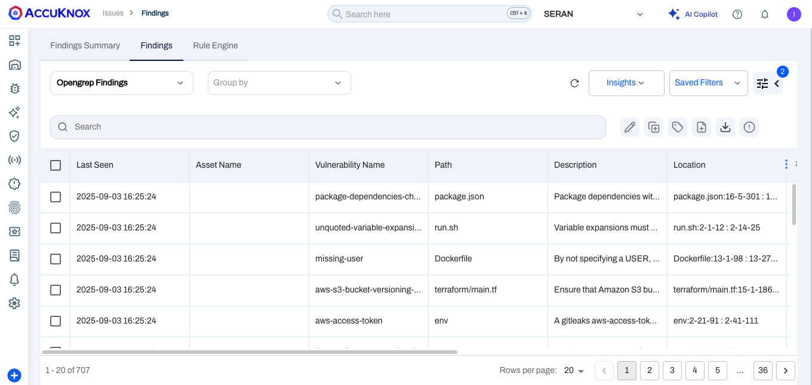
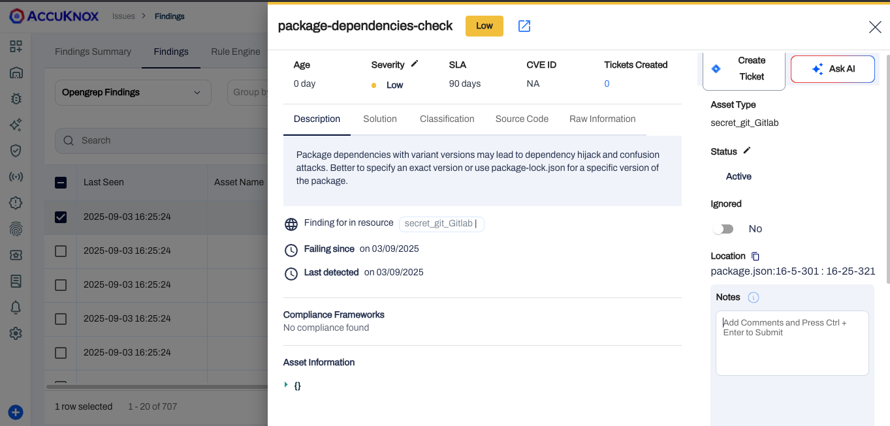
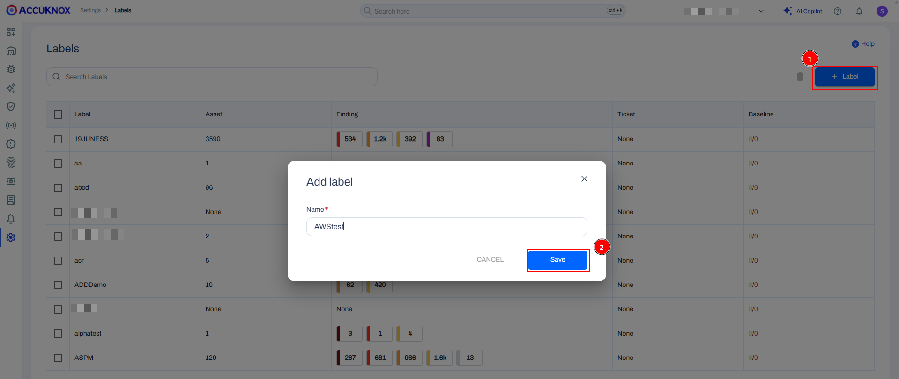

# AWS CodePipeline - SAST

This document contains the process of integrating AccuKnox SAST with AWS codepipeline. By integrating AccuKnox SAST into the pipeline, you can identify and resolve security vulnerabilities proactively before they are even deployed.

## Prerequisites

- AWS Codepipeline access

- AccuKnox UI access

- SonarQube access

### **Step 1: Create the AccuKnox Token**

The first step is to generate an AccuKnox token. For generating the AccuKnox token, open up the AccuKnox, Go to Settings > Tokens then click on the create button.


Give your token a name and click on the Generate button.



Once you have generated the the token, click on the copy button and take a note of it. It will be required to configured as a secret in the pipeline. Also copy the Tenant Id and take a note of it.



Copy this token, go to AWS secrets manager and create a secret with key `AK_TOKEN` and paste the value. Create another secret with the key `TENANT_ID`, and paste it's value.


### **Step 2: Create a label**

In AccuKnox, labels are used for grouping similar types of assets together. For creating a label navigate to Settings > Labels and click on the create label button. Give your label a name and a filename prefix. Take a note of the label and click on the save button.



### **Step 3: Create SonarQube token**

Create a SonarQube user with permissions to administer quality gates, quality profiles then generate an access token for that user. Go to AWS secretes manager and create a token with name `SONAR_TOKEN`.

### **Step 4: Create the pipeline**

Add this content to your buildspec file. Configure the variables `SQ_URL`, `PROJECT_KEY`, `AccuKnox_URL`, `TENANT_ID` and `LABEL`.

```yaml
version: 0.2
env:
  variables:
    SQ_URL: https://sq.accuknox.com
    PROJECT_KEY: "aws-code-pipeline"
    AccuKnox_URL: cspm.demo.accuknox.com
    TENANT_ID: "167"
    LABEL: "SAST"
    GIT_DEPTH: "0"
  secrets-manager:
    AK_TOKEN: "AK_TOKEN:AK_TOKEN"
    SONAR_TOKEN: "SONAR_TOKEN:SONAR_TOKEN"


phases:
  post_build:
    commands:
    - |
      docker run --rm \
      -e SONAR_HOST_URL=$SQ_URL  \
      -e SONAR_TOKEN=$SONAR_TOKEN \
      -v "$(pwd):/usr/src" \
      sonarsource/sonar-scanner-cli
    - |
      docker run --rm \
      -e SQ_URL=$SQ_URL \
      -e SQ_AUTH_TOKEN=$SONAR_TOKEN \
      -e REPORT_PATH=/app/data/ \
      -e SQ_PROJECTS="$PROJECT_KEY" \
      -v $PWD:/app/data/ \
      accuknox/sastjob:latest
      ls -la
    - |
      ls -la
      for file in `ls -1 SQ-*.json`; do
        curl --location --request POST "https://cspm.demo.accuknox.com/api/v1/artifact/?tenant_id=$TENANT_ID&label=$LABEL&data_type=SQ&save_to_s3=true" \
          --header "Tenant-Id: $TENANT_ID" \
          --header "Authorization: Bearer $AK_TOKEN" \
          --form "file=@\"$file\""
      done
    - |
      sleep 10
      response=$(curl -s -u "$SONAR_TOKEN:" "$SQ_URL/api/qualitygates/project_status?projectKey=$PROJECT_KEY")
      echo "Quality Gate API Response: $response"
      qualityGateStatus=$(echo "$response" | jq -r '.projectStatus.status')

      if [ "$qualityGateStatus" != "OK" ]; then
        echo "Quality Gate failed: $qualityGateStatus"
        exit 1
      else
        echo "Quality Gate passed"
      fi
```

Once you have added the above buildspec file and pushed it to repository, it will trigger the CI/CD pipeline. And you will see a screen like this.


You can see that the pipeline have failed, because it have found the vulnerabilities in the code.

### **Step 5: View the findings**

To see all of your SAST findings, navigate to AccuKnox > Issues > Findings and select the Static Code Analysis Findings.


Click on any finding to get more details. You can also click on the Create Ticket button to create a ticket.


