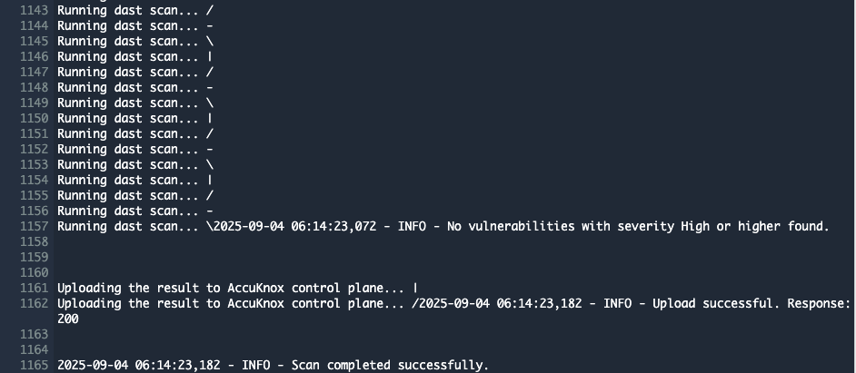

# AccuKnox SAST Integration with AWS CodePipeline

This document contains the process of integrating AccuKnox SAST (Static Application Security Testing) with AWS CodePipeline. By integrating AccuKnox SAST into your CI/CD pipeline, you can identify and resolve security vulnerabilities proactively before they are deployed.


## Prerequisites

Before beginning the integration, ensure you have the following:

* **AWS CodePipeline access** - Administrative access to create and modify pipelines.
    * 📖 *Reference:* [Getting Started with AWS CodePipeline](https://docs.aws.amazon.com/codepipeline/latest/userguide/getting-started-codepipeline.html)
    * 📖 *Reference:* [Create a Pipeline in AWS CodePipeline](https://docs.aws.amazon.com/codepipeline/latest/userguide/pipelines-create.html)

* **AWS CodeBuild access** - Make sure that you have added the `codestar-connections:UseConnection` IAM permission to your service role policy.
    * 📖 *Reference:* [Getting Started with AWS CodeBuild](https://docs.aws.amazon.com/codebuild/latest/userguide/getting-started.html)

* **AccuKnox UI access** - Access to the AccuKnox platform.

* **AWS IAM Configuration** - Proper service role permissions configured.
    * 📖 *Reference:* [Add permissions to your CodeBuild service role policy](https://docs.aws.amazon.com/codepipeline/latest/userguide/troubleshooting.html#codebuild-role-connections)

* **AccuKnox SAST API credentials**, including:
    * Tenant ID
    * Authentication Token
    * Endpoint URL
    * Labels

* **Repository Configuration**:
    * **Full clone enabled** - Ensure AWS CodePipeline is configured to pass metadata that allows CodeBuild actions to perform a full Git clone.
        * 📖 *Reference:* [Enable Full Clone in AWS CodeBuild](https://docs.aws.amazon.com/codepipeline/latest/userguide/tutorials-github-gitclone.html)

## Configuration Steps

### Step 1: Configure AWS CodePipeline Environment Variables

Add the following environment variables to your CodeBuild project or pipeline configuration.

* 📖 *Reference:* [Set Environment Variables in CodeBuild Project](https://docs.aws.amazon.com/codepipeline/latest/userguide/tutorials-pipeline-variables.html)

| Name                | Description                                                                                                                           | Required | Example Value            |
| ------------------- | ------------------------------------------------------------------------------------------------------------------------------------- | -------- | ------------------------ |
| `ACCUKNOX_ENDPOINT` | The URL of the CSPM panel to push the scan results to.                                                                                | Yes      | `cspm.demo.accuknox.com` |
| `ACCUKNOX_TOKEN`    | Token for authenticating with the AccuKnox CSPM panel. Refer to [How to Create Tokens](https://help.accuknox.com/how-to/how-to-create-tokens/). | Yes      | `your_api_token_here`    |
| `ACCUKNOX_LABEL`    | The label used to categorize and identify scan results in AccuKnox. Refer to [How to Create Labels](https://help.accuknox.com/how-to/how-to-create-labels/). | Yes      | `test123`                |
| `ACCUKNOX_TENANT`   | AccuKnox tenant id.                                                                                                                   | Yes      | `167`                    |

### Step 2: Configure AWS CodeBuild Specification (buildspec.yml)

Create or update your `buildspec.yml` file in your repository root with the following configuration:

```yml
version: 0.2

env:
  variables:
    SOFT_FAIL: "true"

phases:
  pre_build:
    commands:
      - echo "Installing AccuKnox ASPM scanner..."
      - pip install [https://github.com/accuknox/aspm-scanner-cli/releases/download/v0.12.1/accuknox_aspm_scanner-0.12.1-py3-none-any.whl](https://github.com/accuknox/aspm-scanner-cli/releases/download/v0.12.1/accuknox_aspm_scanner-0.12.1-py3-none-any.whl) --break-system-packages

  build:
    commands:
      - echo "Running AccuKnox sast scan"
      - |
        if [ "$SOFT_FAIL" = "true" ]; then
          SOFT_FAIL_ARG="--softfail"
        fi
        echo "Installing AccuKnox scanner..."
        echo "Running SAST scan..."
        accuknox-aspm-scanner tool install --type sast
        accuknox-aspm-scanner scan $SOFT_FAIL_ARG sast --command "scan ."

```

## Workflow Execution Without AccuKnox

Initially, the pipeline scans the code for vulnerabilities but does not forward results to AccuKnox, requiring manual review.



## Workflow Execution With AccuKnox

With AccuKnox integrated, scan results are automatically sent to the AccuKnox platform for further risk assessment and remediation.

## Viewing Results in AccuKnox

1.  After the pipeline run, log in to **AccuKnox**.
2.  Navigate to **Issues > Findings** and select **Opengrep Findings**.


3.  Inspect vulnerabilities, apply fixes, and create tracking tickets if necessary.
