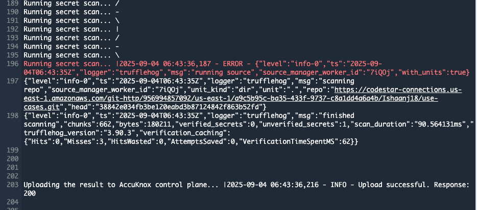
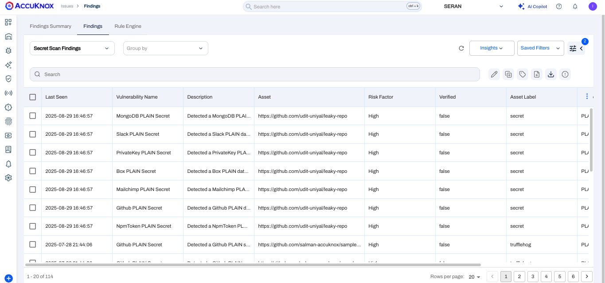
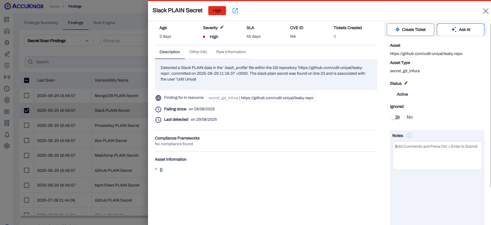

# AWS Code Pipeline - Secret Scan

This document contains the process of integrating **AccuKnox Secret Scan** with **AWS CodePipeline**.
By integrating AccuKnox Secret Scan into the pipeline, you can identify and resolve security vulnerabilities for your applications.

## Prerequisites

Before beginning the integration, ensure you have the following:

- **AWS CodePipeline access** – Administrative access to create and modify pipelines
  📖 *Reference:* [Getting Started with AWS CodePipeline](https://docs.aws.amazon.com/codepipeline/latest/userguide/getting-started-codepipeline.html)
  📖 *Reference:* [Create a Pipeline in AWS CodePipeline](https://docs.aws.amazon.com/codepipeline/latest/userguide/pipelines-create.html)

- **AWS CodeBuild access** – Make sure that you have added the `codestar-connections:UseConnection` IAM permission to your service role policy.
  📖 *Reference:* [Getting Started with AWS CodeBuild](https://docs.aws.amazon.com/codebuild/latest/userguide/getting-started.html)

- **AccuKnox UI access** – Access to the AccuKnox platform

- **AWS IAM Configuration** – Proper service role permissions configured
  📖 *Reference:* [Add permissions to your CodeBuild service role policy](https://docs.aws.amazon.com/codepipeline/latest/userguide/troubleshooting.html#codebuild-role-connections)

- **AccuKnox API credentials**, including:
    - Tenant ID
    - Authentication Token
    - Endpoint URL
    - Labels

- **Repository Configuration**:
  - **Full clone enabled** – Ensure AWS CodePipeline is configured to pass metadata that allows CodeBuild actions to perform a full Git clone
    📖 *Reference:* [Enable Full Clone in AWS CodeBuild](https://docs.aws.amazon.com/codepipeline/latest/userguide/tutorials-github-gitclone.html)


## Configuration Steps

### Step 1: Configure AWS CodePipeline Environment Variables

Add the following environment variables to your CodeBuild project or pipeline configuration.
📖 *Reference:* [Set Environment Variables in CodeBuild Project](https://docs.aws.amazon.com/codepipeline/latest/userguide/tutorials-pipeline-variables.html)

| **Name**         | **Description**                                                                                           | **Required** | **Example Value**          |
|------------------|-----------------------------------------------------------------------------------------------------------|--------------|-----------------------------|
| `ACCUKNOX_ENDPOINT` | The URL of the CSPM panel to push the scan results to                                                      | Yes          | `cspm.demo.accuknox.com`    |
| `ACCUKNOX_TOKEN`    | Token for authenticating with the AccuKnox CSPM panel. [How to Create Tokens](https://help.accuknox.com/how-to/how-to-create-tokens/) | Yes          | `your_api_token_here`       |
| `ACCUKNOX_LABEL`    | Label identifier for organizing scan results                                                               | Yes          | `test123`                   |
| `ACCUKNOX_TENANT`   | AccuKnox tenant ID                                                                                        | Yes          | `167`                       |


### Step 2: Configure AWS CodeBuild Specification (`buildspec.yml`)

Create or update your `buildspec.yml` file in your repository root with the following configuration:

```yaml
version: 0.2

env:
  variables:
    RESULTS: ""
    BRANCH: "all"
    EXCLUDE_PATHS: ""

phases:
  pre_build:
    commands:
      - echo "Installing AccuKnox ASPM scanner..."
      - pip install https://github.com/accuknox/aspm-scanner-cli/releases/download/v0.12.1/accuknox_aspm_scanner-0.12.1-py3-none-any.whl --break-system-packages

  build:
    commands:
      - |
        echo "Running AccuKnox secret scan"

        if [ "$SOFT_FAIL" = "true" ]; then
          SOFT_FAIL_ARG="--softfail"
        fi

        COMMAND="git file://."
        ARGS=""
        [ -n "$RESULTS" ] && ARGS="$ARGS --results $RESULTS"
        [ -n "$BRANCH" ] && ARGS="$ARGS --branch $BRANCH"
        [ -n "$EXCLUDE_PATHS" ] && ARGS="$ARGS --exclude-paths $EXCLUDE_PATHS"

        echo accuknox-aspm-scanner scan $SOFT_FAIL_ARG secret --command "$COMMAND $ARGS" --container-mode
        accuknox-aspm-scanner scan $SOFT_FAIL_ARG secret --command "$COMMAND $ARGS" --container-mode
```

## Workflow Execution

### Without AccuKnox

📖 [Reference](https://help.accuknox.com/integrations/azure-sast/#workflow-execution-without-accuknox)

* Scans secrets for vulnerabilities but does not forward results to AccuKnox, requiring manual review.

### With AccuKnox

📖 [Reference](https://help.accuknox.com/integrations/azure-sast/#workflow-execution-with-accuknox)

* Scan results are automatically sent to AccuKnox for further risk assessment and remediation.



## Viewing Results in AccuKnox

📖 [Reference](https://help.accuknox.com/integrations/azure-sast/#viewing-results-in-accuknox)

1. After the pipeline run, log in to **AccuKnox**.
2. To see all of your Secret Scan findings, navigate to:
   **AccuKnox → Issues → Findings → Secret Scan Findings**


3. Click on any finding to get more details.
   You can also click on **Create Ticket** to generate a ticket.


[Let us know](https://www.accuknox.com/contact-us/) if you are seeking additional guidance in planning your cloud security program.
