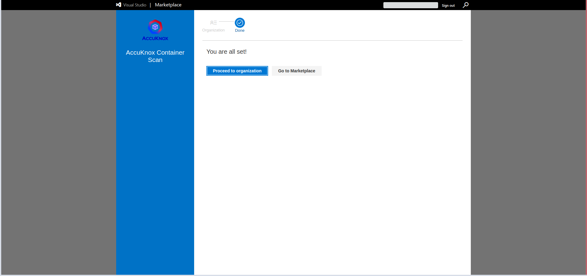
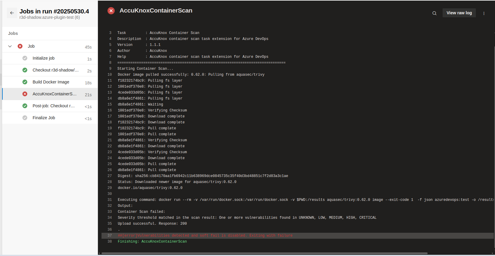
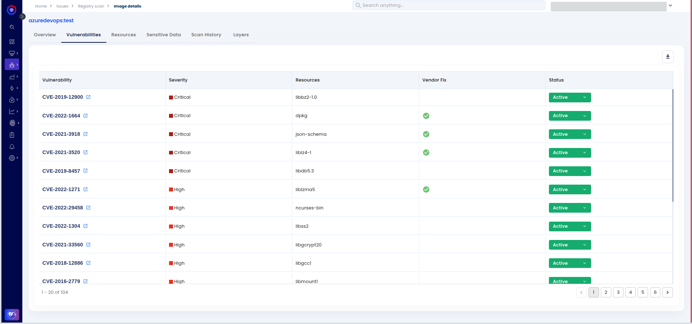

# Container Image Scan with Azure DevOps

This guide walks you through integrating **AccuKnox** into **Azure DevOps pipelines** to perform vulnerability scans on Docker images as part of your CI workflow. By embedding security earlier in the development lifecycle, this setup helps prevent the deployment of flawed containers.

### Prerequisites

Before beginning, ensure the following:

- **Azure DevOps** project with a configured pipeline.

- Access to **AccuKnox**

### Integration Steps

#### Step 1: Install AccuKnox Opengrep SAST Extension

1. Visit the **Azure DevOps Marketplace**

2. Search for [**AccuKnox Container Scan**](https://marketplace.visualstudio.com/items?itemName=AccuKnox.accuknox-container-scan "https://marketplace.visualstudio.com/items?itemName=AccuKnox.accuknox-container-scan") and select **Get it free** to add to your Azure DevOps organization.
   

3. Choose your Azure organization and click **Install**.
   

4. Once installed, the **AccuKnox Container Scan** extension will be available in your pipeline.
   

#### Step 2: Generate AccuKnox API Token

Log in to AccuKnox. Navigate to Settings and select Tokens to create an AccuKnox token to forward scan results to AccuKnox. For details on generating tokens, refer to [How to Create Tokens](https://help.accuknox.com/how-to/how-to-create-tokens/?h=token "https://help.accuknox.com/how-to/how-to-create-tokens/?h=token").

#### Step 3: Configure Azure DevOps Secrets

1.  Go to **Azure DevOps** > **Pipelines** > **Library**.

2.  Create a **Variable Group** or add **Pipeline Secrets**.

3.  Store the following values:

| **Name**           | **Description**                                                                        |
| ------------------ | -------------------------------------------------------------------------------------- |
| `accuknoxEndpoint` | The URL of the CSPM panel to push the scan results to (e.g., `cspm.demo.accuknox.com`) |
| `accuknoxTenantId` | The ID of the tenant associated with the CSPM panel                                    |
| `accuknoxToken`    | Token for authenticating with the AccuKnox CSPM panel                                  |
| `accuknoxLabel`    | Label to categorize or tag the scan results                                            |

The label used to categorize and identify scan results in AccuKnox. [Create a new label](https://help.accuknox.com/how-to/how-to-create-labels/ "https://help.accuknox.com/how-to/how-to-create-labels/") if it is not available

#### Step 4: Define Azure DevOps Pipeline

In your Azure repo, create/update your pipeline YAML (`azure-pipelines.yml`) and add the following task to your pipeline's steps section:

```yaml
trigger:
  - main

pr:
  - main

pool:
  vmImage: ubuntu-latest

variables:
  - group: accuknox
  - name: imageRepository
    value: azuredevopstest
  - name: imageTag
    value: v1

steps:
  - task: Docker@2
    displayName: "Build Docker Image"
    inputs:
      command: build
      Dockerfile: "**/Dockerfile"
      repository: "$(imageRepository)"
      tags: |
        $(imageTag)
  - task: accuknox-container-scan@1.1.1
    inputs:
      tag: $(imageTag)
      imageName: $(imageRepository)
      accuknoxEndpoint: "$(accuknoxEndpoint)"
      accuknoxTenantId: "$(accuknoxTenantId)"
      accuknoxToken: "$(accuknoxToken)"
      accuknoxLabel: "$(accuknoxLabel)"
```

### Inputs for AccuKnox Container Scanning

| **Name**           | **Description**                                                                                        | **Required** | **Default**                        |
| ------------------ | ------------------------------------------------------------------------------------------------------ | ------------ | ---------------------------------- |
| `accuknoxEndpoint` | AccuKnox CSPM panel URL                                                                                | Yes          | `cspm.demo.accuknox.com`           |
| `accuknoxTenantId` | AccuKnox Tenant ID                                                                                     | Yes          |                                    |
| `accuknoxToken`    | AccuKnox API Token                                                                                     | Yes          |                                    |
| `accuknoxLabel`    | Label for scan results                                                                                 | Yes          |                                    |
| `inputSoftFail`    | Continue even if the scan fails                                                                        | No           | `true`                             |
| `imageName`        | The name of the Docker image                                                                           | Yes          |                                    |
| `tag`              | The tag for the Docker image                                                                           | No           | `$BUILD_BUILDNUMBER`               |
| `severity`         | Comma-separated list of vulnerability severities that trigger failure when `inputSoftFail` is disabled | No           | `UNKNOWN,LOW,MEDIUM,HIGH,CRITICAL` |

### After AccuKnox Integration

**Workflow Enhancements:**

- Docker images are automatically scanned for vulnerabilities during the build stage.

- The pipeline fails if critical issues are found, preventing insecure images from being deployed.

**Outcome:**

- Security issues are detected and resolved early, before images reach production.

- Only verified, secure images are pushed to the container registry.



## Viewing Scan Results in AccuKnox

---

**Step 1:** After the pipeline is complete, log in to the **AccuKnox platform** and navigate to **Issues → RegistryScan**. Locate your image by the repository or tag used in the Azure DevOps pipeline, and click to view associated scan findings.


**Step 2:** Selecting the image will display detailed **metadata**, including image name, tag, build time, and source repository information, all linked to the pipeline execution in Azure DevOps.


**Step 3:** In the **Vulnerabilities** section, you'll find a list of identified issues specific to the scanned image. Each item includes severity, package name, version, and remediation details. These are also accessible under **Issues → Vulnerabilities** for cross-image management.



**Step 4:** The **Resources** section outlines the underlying **packages and modules** that were used to build the Docker image---helpful for dependency tracking and vulnerability source analysis.


**Step 5:** You can explore the **Scan History** tab to track scans over time, observe vulnerability trends, and verify improvements from one pipeline execution to the next.


## Conclusion

---

By integrating AccuKnox into your **Azure DevOps pipeline**, you gain continuous visibility into container vulnerabilities. This integration ensures that only thoroughly scanned and secure Docker images are deployed, reinforcing your production security posture and reducing attack surface.
