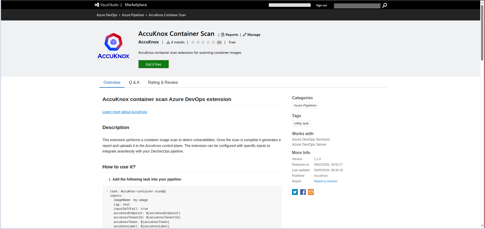
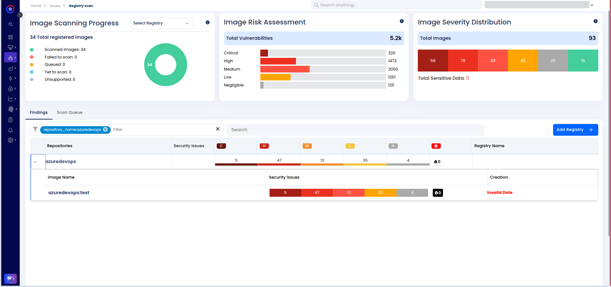
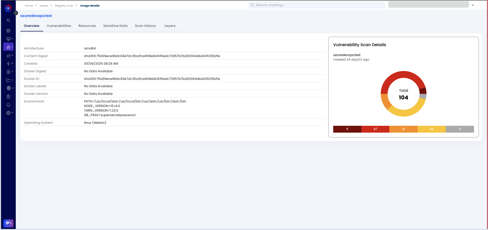

# Container Image Scan with Azure DevOps

## Scenario Before Integration

**Context**: The Docker image was built using an outdated base image (node:15-slim), which had known vulnerabilities. This could introduce security risks into the deployment pipeline. Previously, vulnerabilities in the base image were not detected, and the image was pushed to the registry without any security validation.

## **Steps for Integrating AccuKnox Container Scan into Azure DevOps Pipeline**

### **Step 1: Install AccuKnox Container Scan Azure DevOps Extension**

To use the AccuKnox container scan task in your Azure DevOps pipeline, you need to install the extension from the Azure Marketplace:

1.  Go to the [**AccuKnox Container Scan Extension**](https://marketplace.visualstudio.com/items?itemName=AccuKnox.accuknox-container-scan "https://marketplace.visualstudio.com/items?itemName=AccuKnox.accuknox-container-scan") page on the Azure Marketplace.



1.  Click on **Get it free** to add the extension to your Azure DevOps organization.

2.  Select the **Azure DevOps Organization** where you want to install the extension and follow the installation instructions.


Once installed, you can use the `AccuKnox-container-scan` task in your pipeline YAML.


### **Step 2: Generate AccuKnox Token**

Log in to AccuKnox Navigate to Settings and select Tokens to create an AccuKnox token for forwarding scan results to SaaS. For details on generating tokens, refer to [How to Create Tokens](https://help.accuknox.com/how-to/how-to-create-tokens/?h=token "https://help.accuknox.com/how-to/how-to-create-tokens/?h=token").

### **Step 3: Configure Azure DevOps Secrets**

1.  Go to **Azure DevOps** > **Pipelines** > **Library**.

2.  Create a **Variable Group** or add **Pipeline Secrets**.

3.  Store the following values:

    - **AccuKnox API Token** (`accuknoxToken`)

    - **AccuKnox Tenant ID** (`accuknoxTenantId`)

    - **AccuKnox Label** (`accuknoxLabel`) -- Custom label for grouping scan results.

    - **AccuKnox Endpoint** (`accuknoxEndpoint`) -- Optional (default: `cspm.demo.accuknox.com`).

### **Step 4: Set Up Azure DevOps Pipeline**

1.  Open your Azure DevOps project and navigate to **Pipelines** > **Create Pipeline**.

2.  Select your repository and choose to configure the pipeline using YAML.

3.  Add the following task to your pipeline YAML configuration file (`azure-pipelines.yml`):

```yaml
trigger:
- main

pool:
  vmImage: 'ubuntu-latest'

steps:
- task: AccuKnox-container-scan@0
  inputs:
    dockerfile: $(Build.SourcesDirectory)/Dockerfile
    imageName: $(imageName)
    accuknoxEndpoint: $(accuknoxEndpoint)
    accuknoxTenantId: $(accuknoxTenantId)
    accuknoxToken: $(accuknoxToken)
    accuknoxLabel: $(accuknoxLabel)
    qualityGate: CRITICAL
```

In this YAML:

- **dockerfile**: Path to the Dockerfile. Adjust if your Dockerfile is located elsewhere.

- **accuknoxEndpoint**: AccuKnox API endpoint (default is `cspm.demo.accuknox.com`).

- **accuknoxTenantId**: The AccuKnox Tenant ID.

- **accuknoxToken**: The AccuKnox API token stored as a secret.

- **accuknoxLabel**: A custom label for grouping scan results.

- **qualityGate**: Specify the severity level (`CRITICAL`, `HIGH`, etc.) to fail the pipeline when vulnerabilities exceed the severity.

### **Step 5: Run the Pipeline**

Trigger the pipeline by pushing changes to the `main` branch or manually running the pipeline. The AccuKnox container scan will run as part of the build process.


## **Scenario After Integration**

### **Pipeline Enhancements**:

- The pipeline scans Docker images during the build process.

- If any critical vulnerabilities are found, the pipeline will fail, ensuring that insecure images are not pushed to the registry.

- Only secure images are deployed to production.

### **Viewing Results in AccuKnox SaaS**

**Step 1**: After the workflow completes, navigate to the AccuKnox SaaS dashboard.

**Step 2**: Go to **Issues** > **Findings** and select **Container Image Findings** to see identified vulnerabilities.



**Step 3**: Click on a vulnerability to view more details.



**Step 4**: Fix the Vulnerability

Follow the instructions in the Solutions tab to fix the vulnerability


**Step 5**: Create a Ticket for Fixing the Vulnerability

Create a ticket in your issue-tracking system to address the identified vulnerability.


**Step 6**: Review Updated Results

- After fixing the vulnerability, rerun the Azure pipeline.

- Navigate to the AccuKnox SaaS dashboard and verify that the vulnerability has been resolved.

## **Conclusion**

By integrating AccuKnox into your Azure DevOps CI/CD pipeline, you can automatically scan Docker images for vulnerabilities before they are pushed to the registry. This ensures that only secure images are deployed, significantly improving the security posture of your pipeline.
