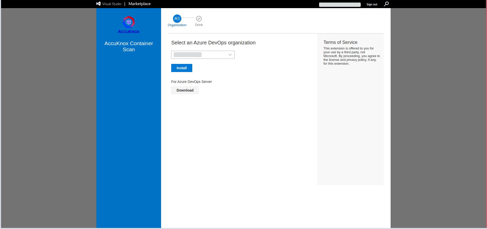
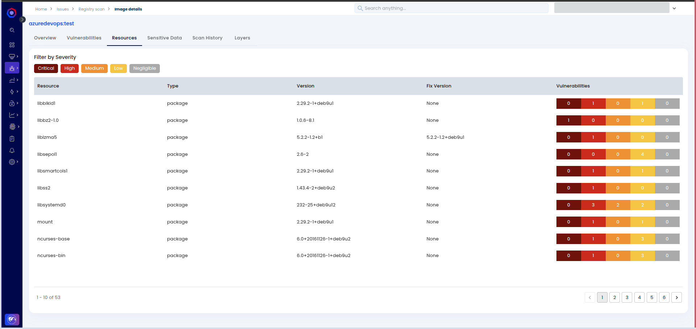
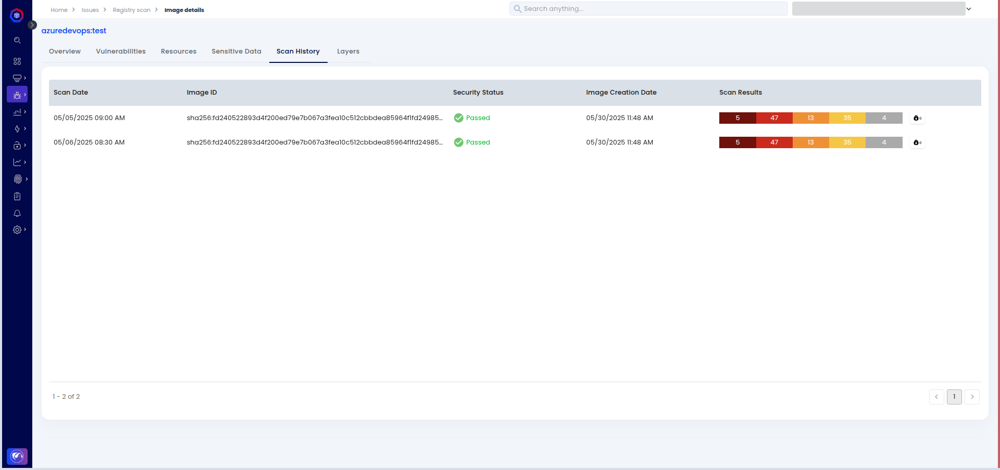

# Container Image Scan with Azure DevOps

This is a step by step guide for integrating AccuKnox container image scan with Azure DevOps. Container image scanning helps you to find vulnerabilities in your container images. By integrating with AccuKnox container image scan you can secure your containers and container images.

## Prerequisites

- Access to AccuKnox UI
- Access to Azure DevOps

### Step 1: Generate the AccuKnox token

The first step is to generate an AccuKnox token. For generating the AccuKnox token, open up the AccuKnox, Go to Settings > Tokens then click on the create button.


Give your token a name and click on the Generate button.



Once you have generated the the token, click on the copy button and take a note of it. It will be required to configured as a variable in the pipeline. Also copy the Tenant Id and take a note of it.


### Step 2: Create a label

In AccuKnox, labels are used for grouping the similar types of assets together. For creating a label navigate to the Settings > Labels and click on the create label button.


Give your label a name and a filename prefix. Take a note of the label and click on the save button.


### Step 3: Configure secrets and variables in Azure DevOps

Navigate to the Azure DevOps > Pipelines > Library and click on the add variable group button.


Name your variable group as `AccuKnox`. And configure the following variables.
- `TENANT_ID`
- `ACCUKNOX_TOKEN`
- `LABEL`

Click on the lock icon and make those variables a secret. Then save it.


Go to pipeline permissions, click on add button and select your pipeline.



### Step 4: Configure CI/CD pipeline

Add this `azure-pipelines.yml` file to the root of your repository. And push it to main branch, it will trigger a pipeline run.

```yaml
trigger:
- main

pool:
  vmImage: ubuntu-latest

variables:
  - group: AccuKnox
  - name: IMAGE_NAME
    value: test-image:latest

steps:
- script: docker build . -t $(IMAGE_NAME)
  displayName: Build

- script: |
    docker run --rm -v /var/run/docker.sock:/var/run/docker.sock \
    accuknox/accuknox-container-scan:latest image $(IMAGE_NAME) \
    --format json  >> /tmp/report.json
  displayName: AccuKnox Container Scan

- script: |
    ls -l /tmp
    cat /tmp/report.json
  displayName: Display Report

- script: |
    curl --location --request POST "https://cspm.demo.accuknox.com/api/v1/artifact/?tenant_id=$(TENANT_ID)&data_type=TR&save_to_s3=true&label_id=$(LABEL)" \
    --header "Tenant-Id: $(TENANT_ID)" \
    --header "Authorization: Bearer $(ACCUKNOX_TOKEN)" \
    --form "file=@/tmp/report.json"
  displayName: Upload Report to AccuKnox
```

Navigate to the pipelines and you will see a successful container image scan like this.



### Step 5: View findings in AccuKnox

To see your findings navigate to AccuKnox > Issues > Findings and select the container image findings.


Click on any finding to get more details. You can also click on the Create Ticket button to create a ticket.


