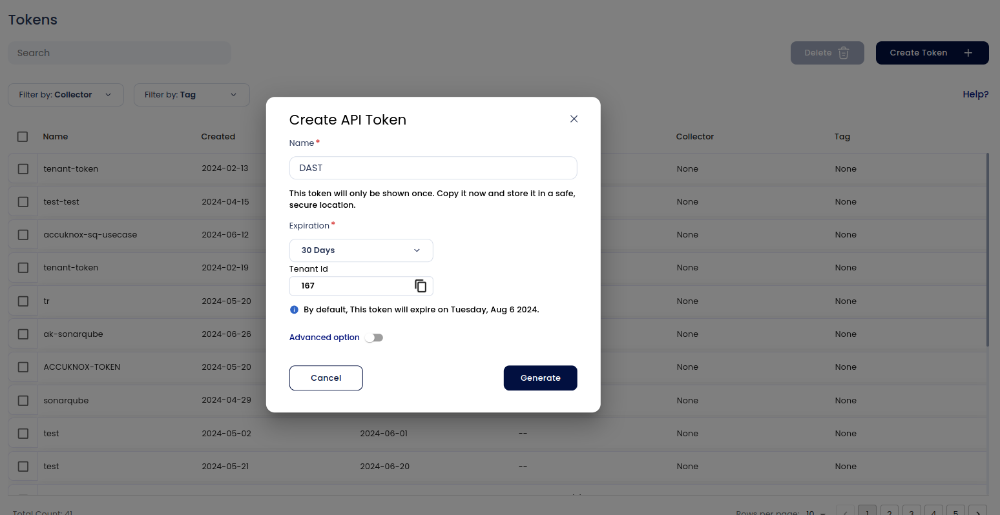
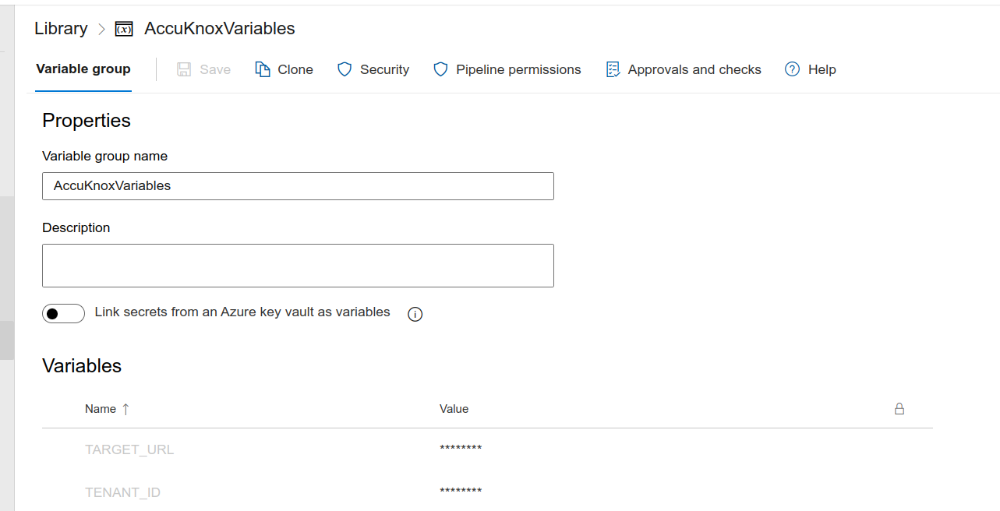
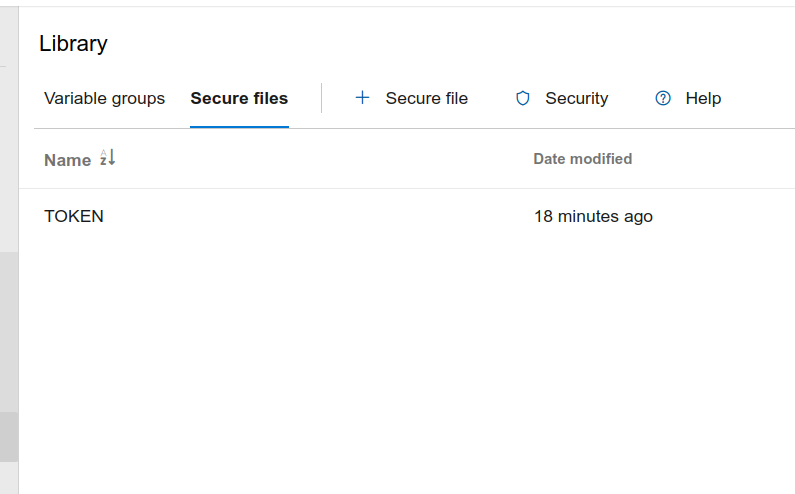
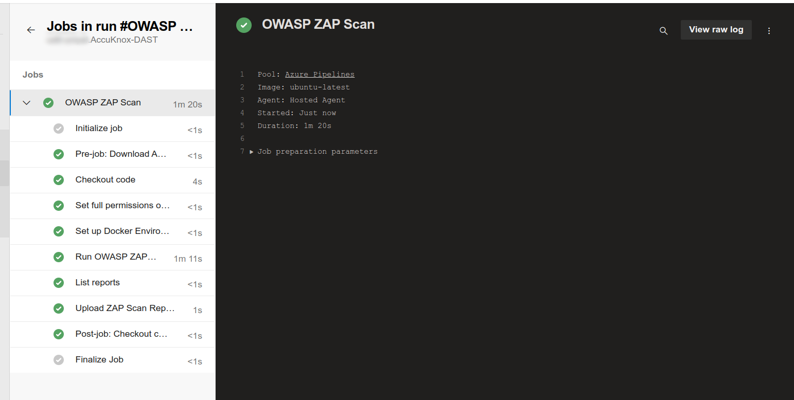
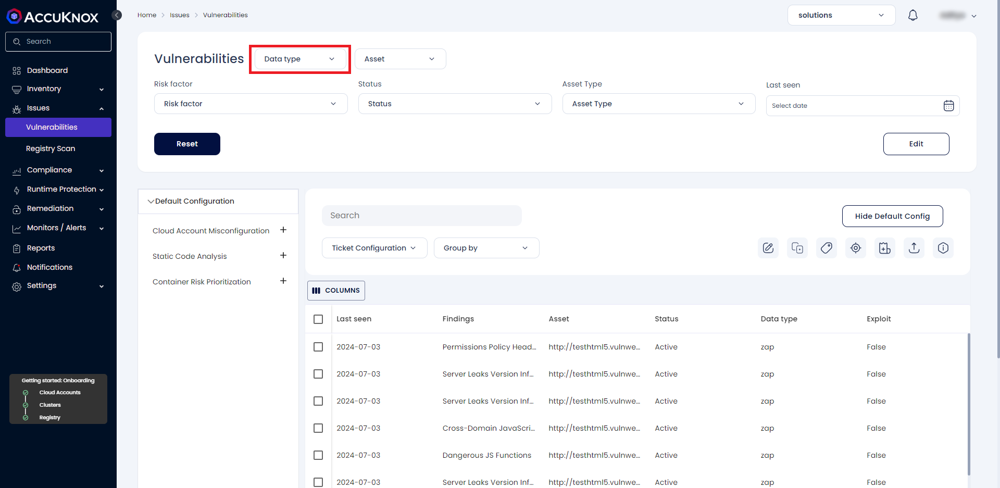
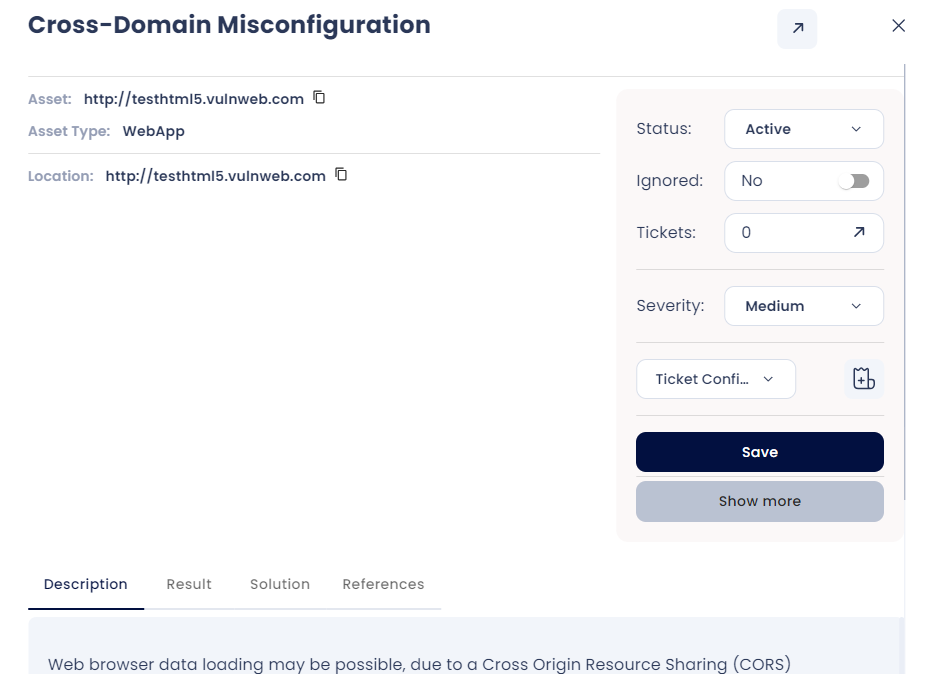
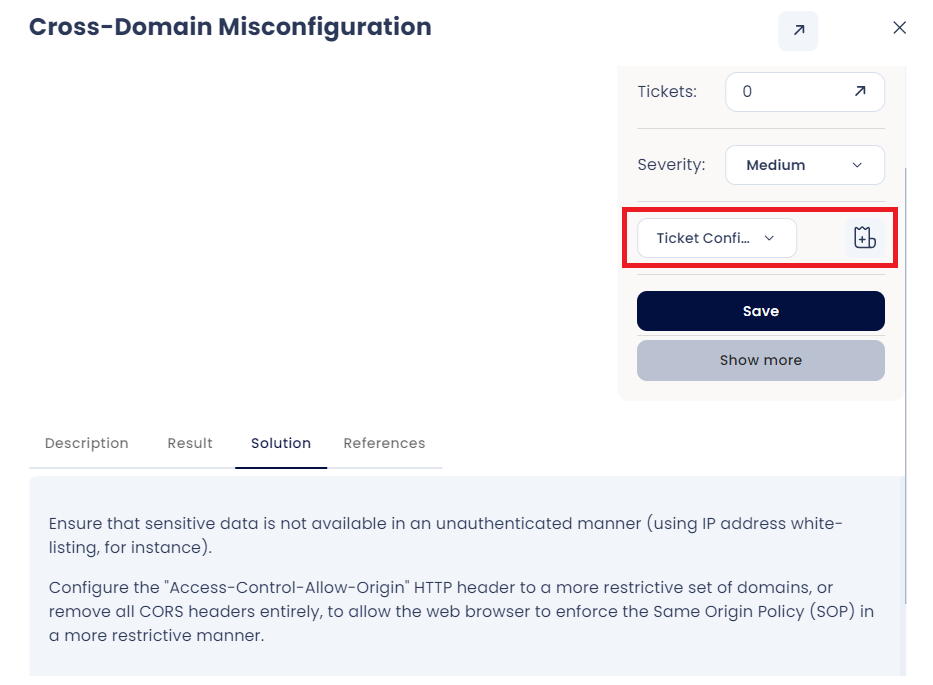
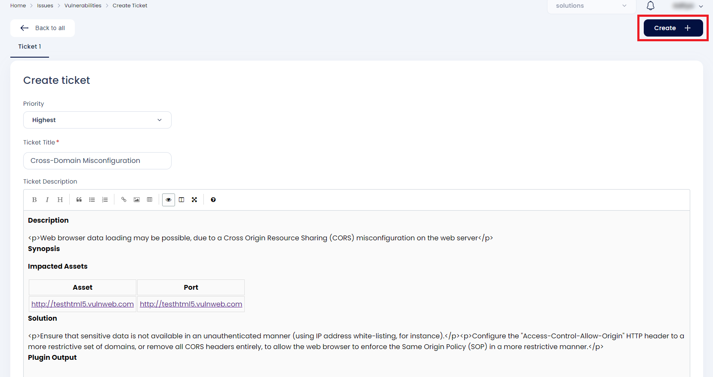

To demonstrate the benefits of incorporating AccuKnox into a CI/CD pipeline using Azure DevOps to enhance security, consider a specific scenario involving a domain with known vulnerabilities. By integrating AccuKnox scanning into the pipeline, we can identify and resolve these security issues.

## **Pre-requisites**

- Azure DevOps access

- AccuKnox UI access

- Azure DevOps pipeline

- GitHub/Azure Repos

## **Steps for Integratiion**

**Step 1**: Log in to AccuKnox SaaS
Navigate to Settings and select Tokens to create an AccuKnox token for forwarding scan results to SaaS.



**Note**: Copy the token and create an Azure DevOps secret for the token to be used in the pipeline. Also, copy the tenant ID value to be used in the pipeline YAML file.

**Step 2**: Add Variables and Secrets to Azure DevOps Secret Manager

Navigate to your Azure DevOps project and go to **Pipelines** > **Library** > **Variables or Secure files** to add the following secrets and Variables:

    + ```TOKEN```: The artifact token received from the AccuKnox management plane

    + ```TENANT_ID```: The Tenant ID received from the AccuKnox management plane

    + ```TARGET_URL```: Domain URL to test for vulnerabilities.



Add the ```TOKEN``` as a secure file



**Step 3**: Set Up Azure DevOps Pipeline

Create a new pipeline in your Azure DevOps project with the following YAML configuration:

```yaml
name: OWASP ZAP Scanning Workflow
trigger:
  branches:
    include:
      - main
pr:
  branches:
    include:
      - main
jobs:
  - job: zap_scan
    displayName: 'OWASP ZAP Scan'
    pool:
      vmImage: 'ubuntu-latest'
    variables:
      - group: AccuKnoxSecrets
    steps:
      - checkout: self
        displayName: 'Checkout code'
      - script: |
          sudo chmod -R 777 $(System.DefaultWorkingDirectory)
        displayName: 'Set full permissions on working directory'
      - script: |
          sudo chmod -R 777 $(Build.SourcesDirectory)
          echo "TARGET_URL=$(TARGET_URL)" >> $(Build.SourcesDirectory)/env.sh
        displayName: 'Set up Docker Environment and Environment Variables'
      - script: |
          source $(Build.SourcesDirectory)/env.sh
          docker run --rm -v $(Build.SourcesDirectory):/zap/wrk/:rw -t zaproxy/zap-stable zap-baseline.py \
            -t $TARGET_URL \
            -r scanreport.html \
            -x scanreport.xml \
            -J scanreport.json \
            -I
        displayName: 'Run OWASP ZAP Scan'
      - script: |
          echo "Listing generated reports..."
          ls -l $(Build.SourcesDirectory)
        displayName: 'List reports'
      - task: DownloadSecureFile@1
        name: token
        inputs:
          secureFile: 'TOKEN'
        displayName: 'Download AccuKnox Token'
      - script: |
          curl --location --request POST "https://cspm.demo.accuknox.com/api/v1/artifact/?tenant_id=$(TENANT_ID)&data_type=ZAP&save_to_s3=false" \
            --header "Tenant-Id: $(TENANT_ID)" \
            --header "Authorization: Bearer $(cat $(token.secureFilePath))" \
            --form "file=@$(Build.SourcesDirectory)/scanreport.json"
        displayName: 'Upload ZAP Scan Report'
```

## **Initial CI/CD Pipeline Without AccuKnox Scan**

Initially, the CI/CD pipeline does not include the AccuKnox scan. When you push changes to the repository, no security checks are performed, potentially allowing security issues in the application.

## **CI/CD Pipeline After AccuKnox Scan Integration**

After integrating AccuKnox into your CI/CD pipeline, the next push triggers the Azure DevOps pipeline. The AccuKnox scan identifies potential vulnerabilities in the domain URL.



### **View Results in AccuKnox SaaS**

**Step 1**: After the workflow completes, navigate to the AccuKnox SaaS dashboard.

**Step 2**: Go to **Issues** > **Vulnerabilities** and select **Data Type** as **ZAP** to view identified vulnerabilities.



**Step 3**: Click on a vulnerability to view more details.



**Step 4**: Fix the Vulnerability

Follow the instructions in the Solutions tab to fix the vulnerability (e.g., Cross-Domain Misconfiguration).



**Step 5**: Create a Ticket for Fixing the Vulnerability

Create a ticket in your issue tracking system to address the identified vulnerability.



**Step 6**: Review Updated Results

- After fixing the vulnerability, rerun the Azure DevOps pipeline.

- Navigate to the AccuKnox SaaS dashboard and verify that the vulnerability has been resolved.

## **Conclusion**

Azure DevOps, combined with AccuKnox scanning, provides enhanced security by identifying and mitigating vulnerabilities during the CI/CD process. This integration offers visibility into potential security issues and helps ensure a secure deployment environment. AccuKnox DAST integrates seamlessly with various CI/CD tools, including Jenkins, GitHub, GitLab, Azure Pipelines, and AWS CodePipelines.

- - -
[SCHEDULE DEMO](https://www.accuknox.com/contact-us){ .md-button .md-button--primary }