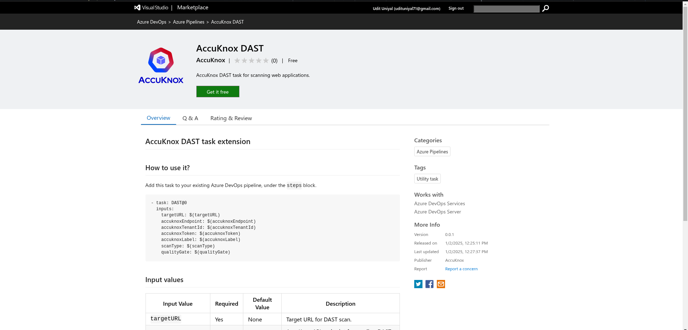
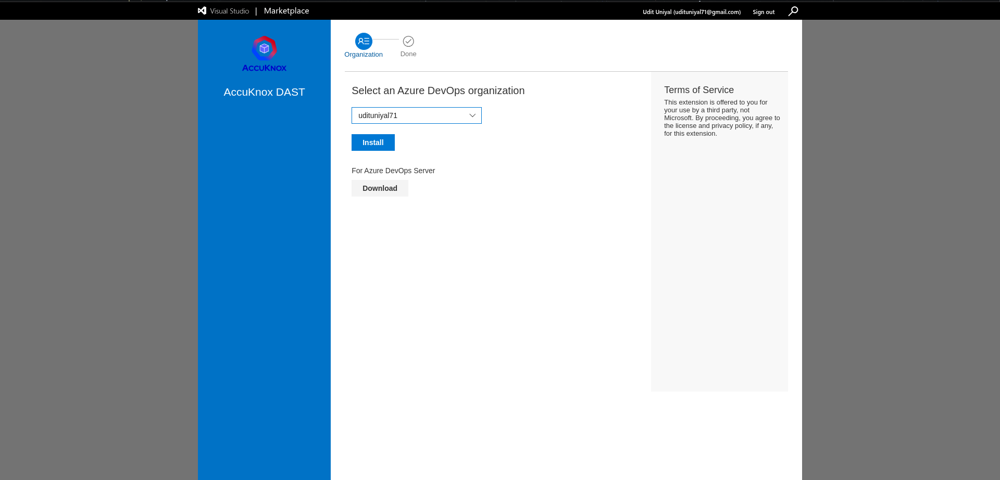
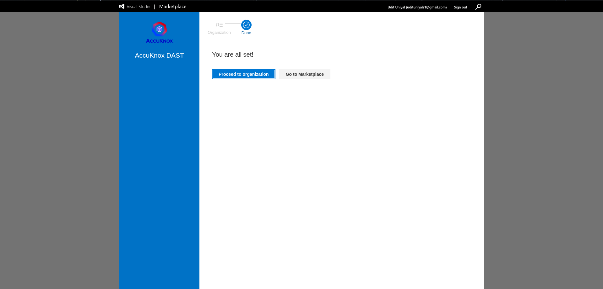
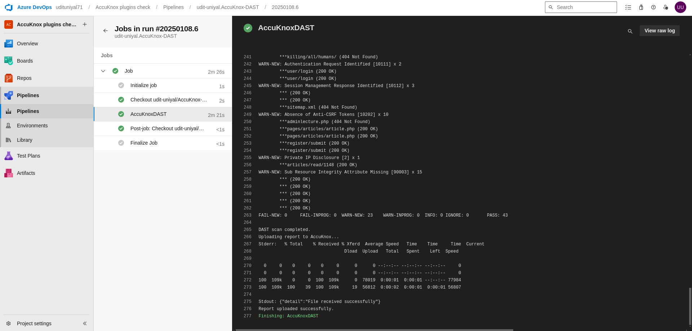
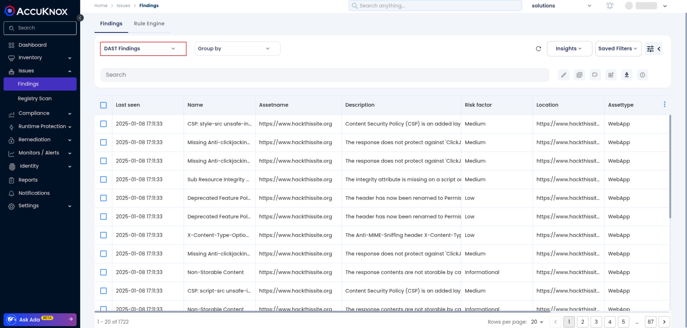
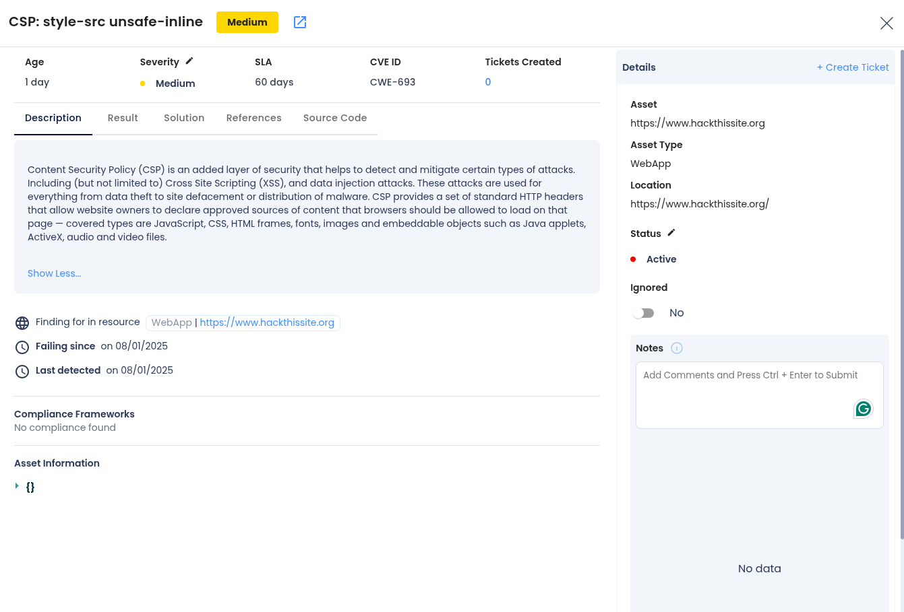
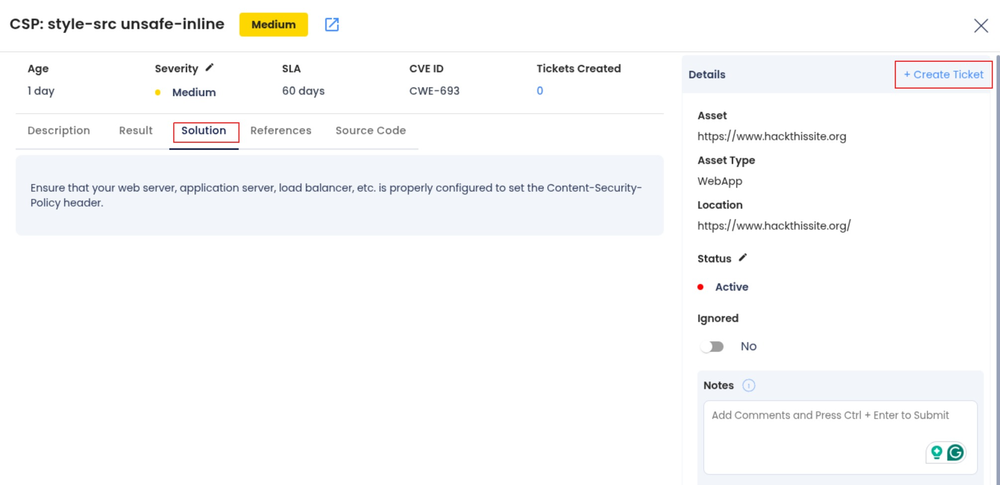
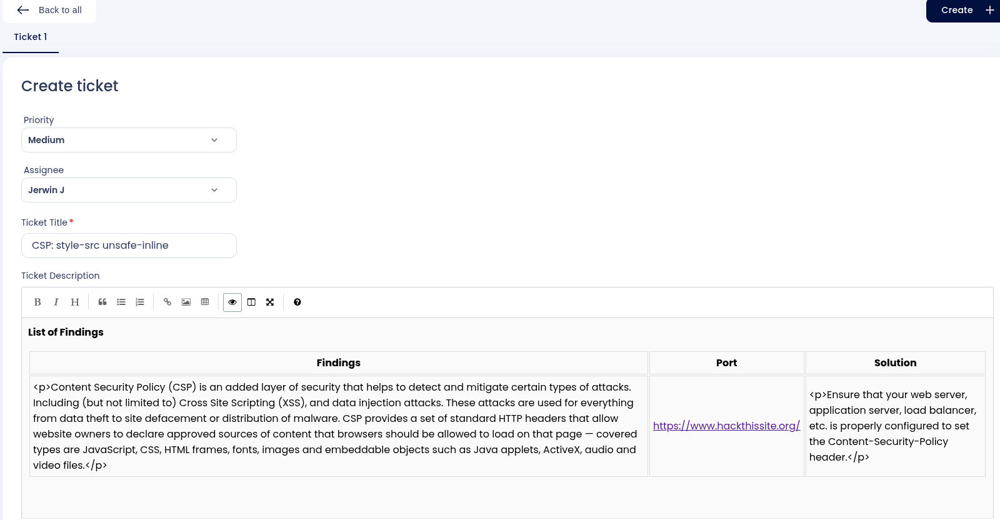

# AccuKnox DAST with Azure DevOps

To demonstrate the benefits of incorporating AccuKnox DAST into an Azure DevOps CI/CD pipeline for enhanced security, this document outlines the steps to configure the integration, run DAST scans, and view results in the AccuKnox SaaS platform.

## **Prerequisites**

- Access to an Azure DevOps project.

- Access to the AccuKnox platform.

- A configured Azure DevOps agent for pipeline execution.

## **Steps for Integration**

### **Step 1: Install the AccuKnox DAST Extension**

1.  Navigate to the Azure DevOps Marketplace.

2.  Search for **AccuKnox DAST** and click **Get it free** to install the extension in your Azure DevOps organization.


3.  Select an Azure organization and click on **Install**.


4.  Once installed, the AccuKnox DAST extension will be ready to use in your pipelines.



### **Step 2: Generate AccuKnox Token**

1.  Log in to AccuKnox.

2.  Navigate to **Settings** > **Tokens** and create an AccuKnox token.

3.  Copy the generated token and store it securely for later use. For detailed steps, refer to [How to Create Tokens](https://help.accuknox.com/how-to/how-to-create-tokens/ "https://help.accuknox.com/how-to/how-to-create-tokens/").

### **Step 3: Configure Variables in Azure DevOps**

1.  Navigate to your Azure DevOps project.

2.  Go to **Project Settings** > **Pipelines** > **Library** > **+ Variable Group**.

3.  Add the following variables:

| **Secret Name**    | **Description**                      |
| ------------------ | ------------------------------------ |
| `targetUrl`        | URL of the web application to scan.  |
| `accuknoxEndpoint` | URL of the AccuKnox CSPM API.        |
| `accuknoxToken`    | AccuKnox API token.                  |
| `accuknoxLabel`    | Label to group findings in AccuKnox. |

### **Step 4: Add AccuKnox DAST Task to the Pipeline**

1.  Open your Azure DevOps pipeline YAML file or create a new one.

2.  Add the following task under the `steps` block:

```
steps:
  - task: accuknox-dast@0
    inputs:
      targetURL: $(TARGET_URL)
      accuknoxEndpoint: $(ACCUKNOX_ENDPOINT)
      accuknoxToken: $(ACCUKNOX_TOKEN)
      accuknoxLabel: $(ACCUKNOX_LABEL)
      scanType: $(SCAN_TYPE)
      qualityGate: $(QUALITY_GATE)

```

### **Step 5: Run the Pipeline**

1.  Trigger the pipeline manually or through a code change.

2.  Monitor the pipeline logs to verify that the AccuKnox DAST task is running successfully.


## View Results in AccuKnox SaaS

**Step 1**: After the workflow completes, navigate to the AccuKnox SaaS dashboard.

**Step 2**: Go to Issues > Findings and select DAST Findings to see identified vulnerabilities.


**Step 3**: Click on a vulnerability to view more details.


**Step 4**: Fix the Vulnerability

Follow the instructions in the Solutions tab to fix the vulnerability.


**Step 5**: Create a Ticket for Fixing the Vulnerability

Create a ticket in your issue tracking system to address the identified vulnerability.


**Step 6:** Review Updated Results

- After fixing the vulnerability, rerun the Azure pipeline.

- Navigate to the AccuKnox SaaS dashboard and verify that the vulnerability has been resolved.

### **Conclusion**

Integrating AccuKnox DAST with Azure DevOps pipelines ensures continuous security by identifying vulnerabilities during the build process. It provides visibility into security issues and enhances deployment safety. AccuKnox DAST supports a wide range of CI/CD tools, making it a versatile choice for secure DevOps practices.

---

[SCHEDULE DEMO](https://www.accuknox.com/contact-us){ .md-button .md-button--primary }
