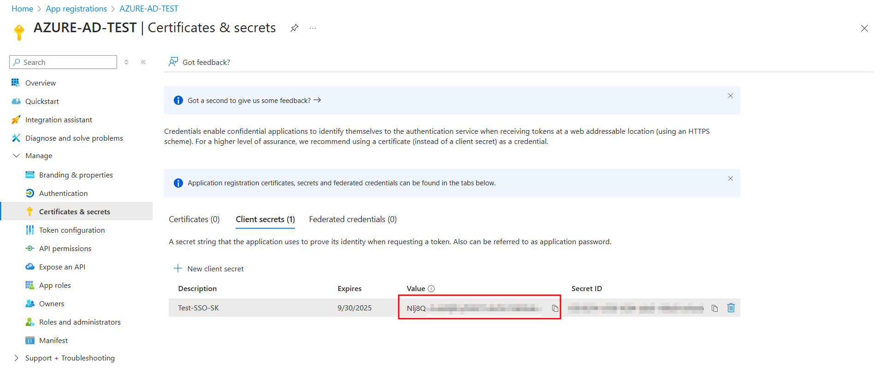

# Azure Entra SSO with AccuKnox

This guide helps you integrate Azure Entra (formerly Azure Active Directory) with **AccuKnox** using **OpenID Connect (OIDC)** for Single Sign-On (SSO).

## Prerequisites

- Azure Entra Admin privileges

- Access to AccuKnox Tenant for user invitation

## Step-by-Step Integration Guide

### 1. Create Azure Application (App Registration)

1. Sign in to [Azure Portal](https://portal.azure.com/ "https://portal.azure.com/")

2. Navigate to **Azure Active Directory > App registrations**

3. Click **New registration**

4. **Name**: Any meaningful name (e.g., `AccuKnox SSO`)

5. **Supported account types**: Choose **Single tenant

6. **Redirect URI**:
Type: `Web`
URI: `https://cspm.accuknox.com/oidc/callback`

7. Click **Register**

### 2. Gather Required Information

Once you've registered the Azure app, collect the following details to complete your SSO setup with AccuKnox:

| **Field**                          | **Description**                                                                                                                                            |
| ---------------------------------- | ---------------------------------------------------------------------------------------------------------------------------------------------------------- |
| **Name**                           | Name of your organization (used during login)                                                                                                              |
| **OIDC RP Client ID**              | Application (client) ID                                                                                                                                    |
| **OIDC RP Client Secret**          | Secret value                                                                                                                                               |
| **OIDC OP Authorization Endpoint** | OAuth 2.0 authorization endpoint (v2)                                                                                                                      |
| **OIDC OP Token Endpoint**         | OAuth 2.0 token endpoint (v2)                                                                                                                              |
| **OIDC OP User Endpoint**          | Default: `https://graph.microsoft.com/oidc/userinfo`                                                                                                       |
| **OIDC OP JWKS Endpoint**          | Format: `https://login.microsoftonline.com/<Tenant-ID>/discovery/v2.0/keys` Replace `<Tenant-ID>` with your Directory (tenant) ID from the app overview |
| **OIDC RP Sign Algo**              | Default: `RS256`                                                                                                                                           |

#### Name

- This is the **name of your organization**.

- It will be used on the AccuKnox login screen during OpenID sign-in.

#### OIDC RP Client ID

- Go to the **App Overview** page.

- Copy the value of **Application (client) ID**.

#### OIDC RP Client Secret

- Navigate to **Certificates & secrets**.

- Click **New client secret**.

- Enter a description and expiry period.

- Click **Add** and **copy the secret value** shown.

#### OIDC OP Authorization Endpoint

- Go to the **App Overview** page.

- Click on **Endpoints** (top-right).

- Copy the URL under **OAuth 2.0 authorization endpoint (v2)**.

#### OIDC OP Token Endpoint

- From the same **Endpoints** panel.

- Copy the URL for **OAuth 2.0 token endpoint (v2)**.

#### OIDC OP JWKS Endpoint

- Format:
  `https://login.microsoftonline.com/<Tenant-ID>/discovery/v2.0/keys`

- Replace `<Tenant-ID>` with your **Directory (tenant) ID**, found on the app's **Overview** page.

### 3. Provide the Details to AccuKnox

Once you've collected all the required information (Client ID, Secret, Endpoints, etc.), the next step is to provide it to AccuKnox to complete the SSO integration.

#### For AccuKnox SaaS Users

- Share the details **securely** with the AccuKnox support team.

- The team will configure the backend for your organization based on the provided information.

#### For AccuKnox On-Premise Users

- You can directly input the configuration into your admin portal: [IDP Providers Configuration Page](https://cspm.accuknox.com/admin/accuknox_oidc_client/idpprovider/ "https://cspm.accuknox.com/admin/accuknox_oidc_client/idpprovider/")

## User Invitation Process

### Invite Azure Users to AccuKnox

1. Log in to the **AccuKnox SaaS console**

2. Go to **User Management > Invite User**

3. Enter the **email address** of the user with other details and send invite.

!!! info "Note"
    Ensure the invited Azure Entra user has their **email field filled in** under **Contact Information** in their Azure profile.\ The email must **exactly match** the one used during the AccuKnox invitation.
    

## Logging in to AccuKnox via Azure Entra SSO

1. Navigate to the [AccuKnox Login Page](https://cspm.demo.accuknox.com/ "https://cspm.demo.accuknox.com")

2. Click **OpenID**

3. Enter your **organization name** (as provided above)

4. Finally Sign in using your **Azure credentials**
