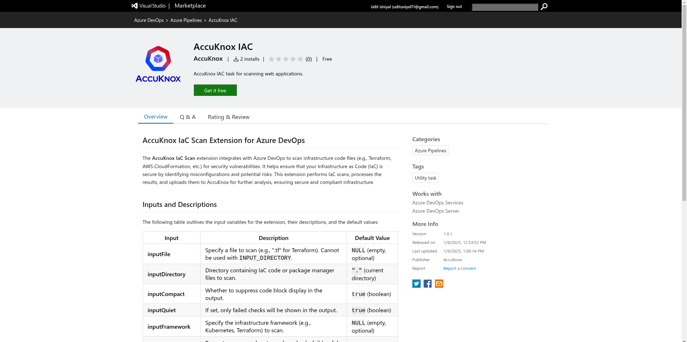
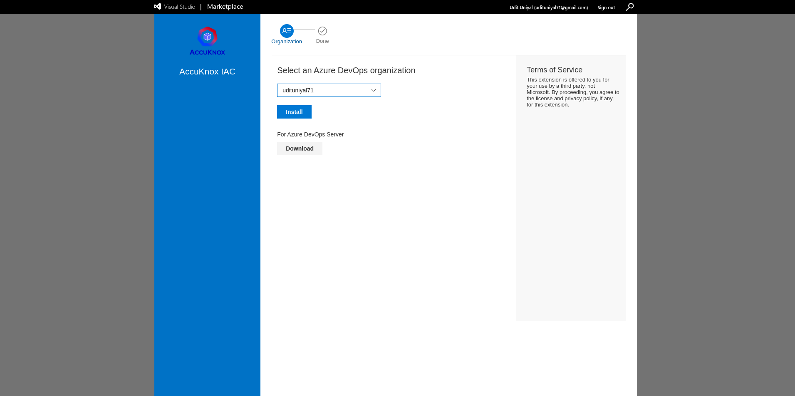
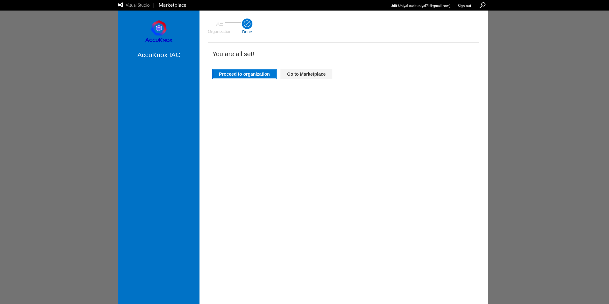
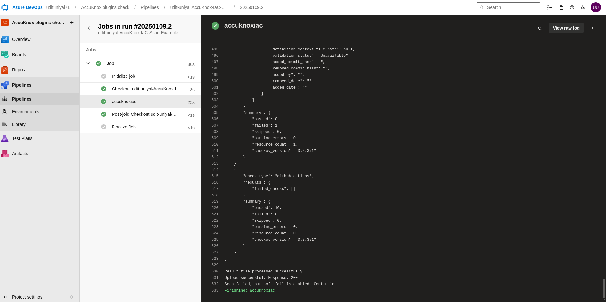
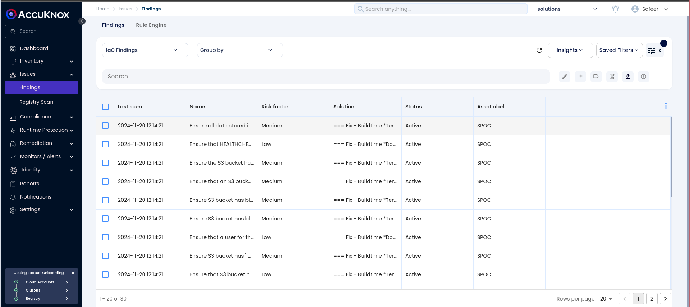
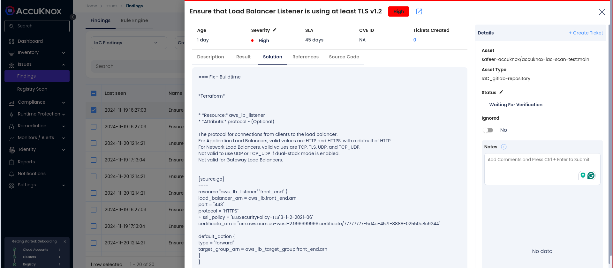
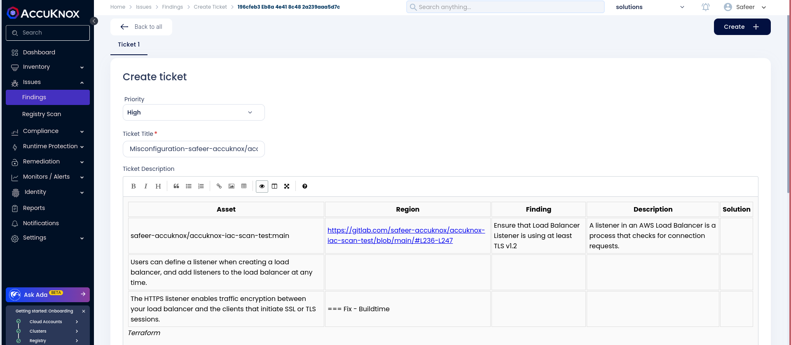

# Azure DevOps IaC Scan Integration

This guide demonstrates how to integrate Infrastructure as Code (IaC) security into an Azure DevOps pipeline using the AccuKnox IaC Scan extension. By implementing automated checks, you can identify configuration vulnerabilities in your IaC templates and send the results to AccuKnox for thorough analysis and remediation. This ensures your infrastructure aligns with security best practices and minimizes deployment risks.

## Pre-requisites

- Azure DevOps access.
- AccuKnox Platform access.

## Steps for Integration

### Step 1: Install the AccuKnox IaC Scan Extension

1.  Navigate to the [AccuKnox IaC Scan Extension](https://marketplace.visualstudio.com/items?itemName=AccuKnox.accuknox-iac "https://marketplace.visualstudio.com/items?itemName=AccuKnox.accuknox-iac") in the Azure DevOps Marketplace.

2.  Click **Get it free** to install the extension in your Azure DevOps organization.


3.  Select the **Azure DevOps Organization** where you want to install the extension and follow the installation instructions.


Once installed, you can use the `AccuKnox-iac-scan` task in your pipeline YAML.


### Step 2: Generate AccuKnox Token

Log in to AccuKnox Navigate to Settings and select Tokens to create an AccuKnox token for forwarding scan results to SaaS. For details on generating tokens, refer to [How to Create Tokens](https://help.accuknox.com/how-to/how-to-create-tokens/?h=token "https://help.accuknox.com/how-to/how-to-create-tokens/?h=token").

### Step 3: Configure Azure DevOps Pipeline Variables

1.  Go to **Azure DevOps** > **Pipelines** > **Library**.

2.  Create a **Variable Group** or add **Pipeline Secrets**.

3.  Store the following values:

- `ACCUKNOX_ENDPOINT`: The AccuKnox API URL (e.g., `cspm.demo.accuknox.com`).

- `ACCUKNOX_TENANT_ID`: Your AccuKnox tenant ID.

- `ACCUKNOX_TOKEN`: The AccuKnox API token for authorization.

- `ACCUKNOX_LABEL`: The label to associate with the scan results.

### Step 4: Add the AccuKnox IaC Scan Task to Your Pipeline

Edit your Azure DevOps pipeline YAML file to include the AccuKnox IaC Scan task. Below is an example configuration:

```yaml
- task: accuknox-iac@1.0.1
  inputs:
    accuknoxEndpoint: "<ACCUKNOX_ENDPOINT>"
    accuknoxTenantId: "<ACCUKNOX_TENANT_ID>"
    accuknoxToken: "<ACCUKNOX_TOKEN>"
    accuknoxLabel: "<ACCUKNOX_LABEL>"
    inputQuiet: true
    inputCompact: true
```

### Step 5: Execute the Pipeline

Run your pipeline. The AccuKnox IaC Scan extension will analyze your IaC code for vulnerabilities or misconfigurations, and the findings will be uploaded to the AccuKnox platform.



## View Results in AccuKnox SaaS

**Step 1**: After the pipeline completes, navigate to the AccuKnox SaaS Dashboard.

**Step 2**: Go to Issues > Findings and select IaC Findings to see identified vulnerabilities.



**Step 3**: Click on a vulnerability to view more details and follow the instructions in the Solutions tab.



**Step 4**: For unresolved vulnerabilities, create a ticket in your issue tracking system.



**Step 5**: After fixing the vulnerabilities, rerun the Azure pipeline and verify that the issues have been resolved in the AccuKnox dashboard.

## Conclusion

By integrating the AccuKnox IaC Scan extension into your Azure DevOps pipeline, you enhance the security of your infrastructure code. This integration enables early detection and remediation of vulnerabilities and misconfigurations, ensuring a secure and compliant deployment environment.
