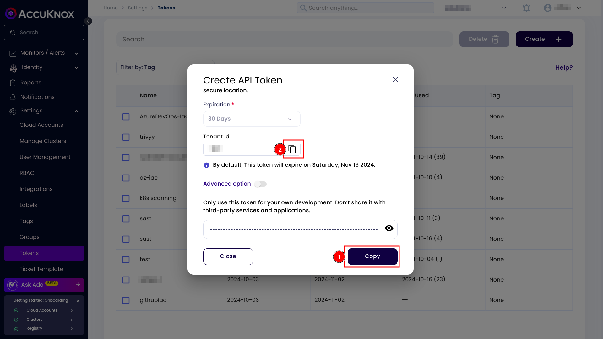

## Azure DevOps IaC Scan Integration

This is a step by step guide for integrating AccuKnox IaC scan with Azure DevOps. IaC scan helps you to find the vulnerabilities in you IaC code like Terraform, AWS Cloud Formation, Azure ARM templates etc. By using AccuKnox IaC, you can find the vulnerabilities in your infrastructure proactively.

## Prerequisites:
--------------

-   Access to AccuKnox UI

-   Access to Azure DevOps

### Step 1: Generate the AccuKnox token
-----------------------------------

The first step is to generate an AccuKnox token. For generating the AccuKnox token, open up the AccuKnox, Go to Settings > Tokens then click on the create button.


Give your token a name and click on the Generate button.


Once you have generated the the token, click on the copy button and take a note of it. It will be required to configured as a variable in the pipeline. Also copy the Tenant Id and take a note of it.



### Step 2: Create a label
----------------------

In AccuKnox, labels are used for grouping the similar types of assets together. For creating a label navigate to the Settings > Labels and click on the create label button.


Give your label a name and a filename prefix. Take a note of the label and click on the save button.


### Step 3: Configure secrets and variables in Azure DevOps
-------------------------------------------------------

Navigate to the Azure DevOps > Pipelines > Library and click on the add variable group button.


Name your variable group as `AccuKnox`. And configure the following variables.

-   `TENANT_ID`- Your AccuKnox tenant id.

-   `ACCUKNOX_TOKEN`- AccuKnox API token, used to upload the reports to AccuKnox.

-   `LABEL`- Used to group findings together.

-   `REPO_LINK`- Your git repository URL.


Click on the lock icon and make those variables a secret. Then save it.


Go to pipeline permissions, click on add button and select your pipeline.


### Step 4: Configure CI/CD pipeline
--------------------------------

Add this `azure-pipelines.yml` file to the root of your repository. And push it to main branch, it will trigger a pipeline run.

```yaml
trigger:
- main

pool:
  vmImage: "ubuntu-latest"

variables:
- group: AccuKnox # Name of the variable group created in the Azure DevOps

- script: |
    pip install checkov
    checkov -d . --output json > checkov_report.json || true
    jq --arg repoLink "$(REPO_LINK)" --arg branch "$(Build.SourceBranchName)" \
      '. += [{"details": {"repo": $repoLink, "branch": $branch}}]' checkov_report.json > result.json
    cat result.json
    curl --location --request POST "https://cspm.demo.accuknox.com/api/v1/artifact/?tenant_id=$(TENANT_ID)&data_type=IAC&save_to_s3=true&label_id=$(LABEL)" \
      --header "Tenant-Id: $(TENANT_ID)" \
      --header "Authorization: Bearer $(ACCUKNOX_TOKEN)" \
      --form "file=@./result.json"
  displayName: 'IaC Scan'
```
Navigate to the pipelines and you will see a successful IaC scan like this.


### Step 5: View findings in AccuKnox
---------------------------------

To see your findings navigate to AccuKnox > Issues > Findings and select the IaC Findings.


Click on any finding to get more details. You can also click on the Create Ticket button to create a ticket.

