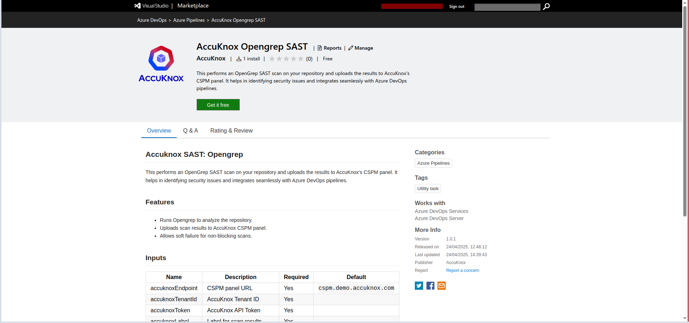
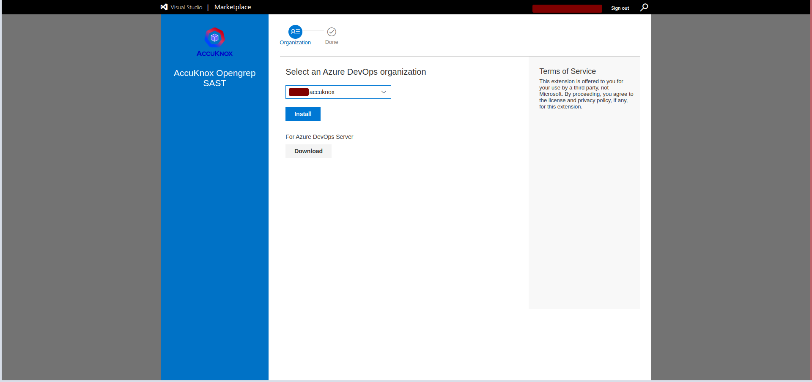
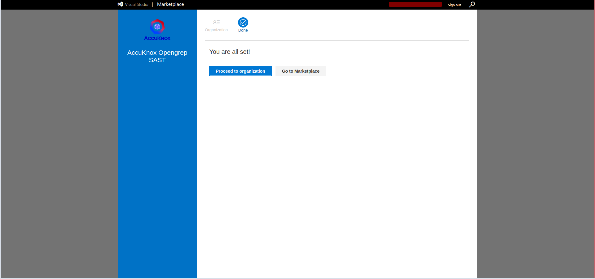
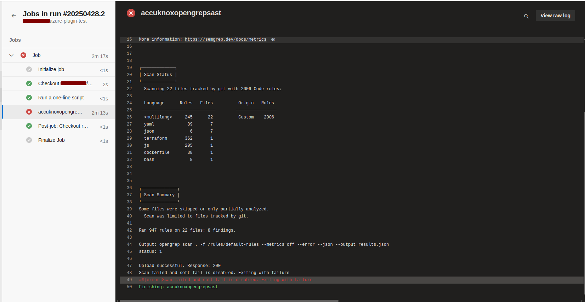
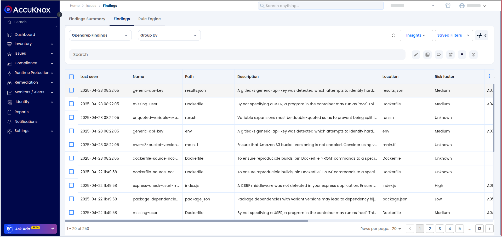
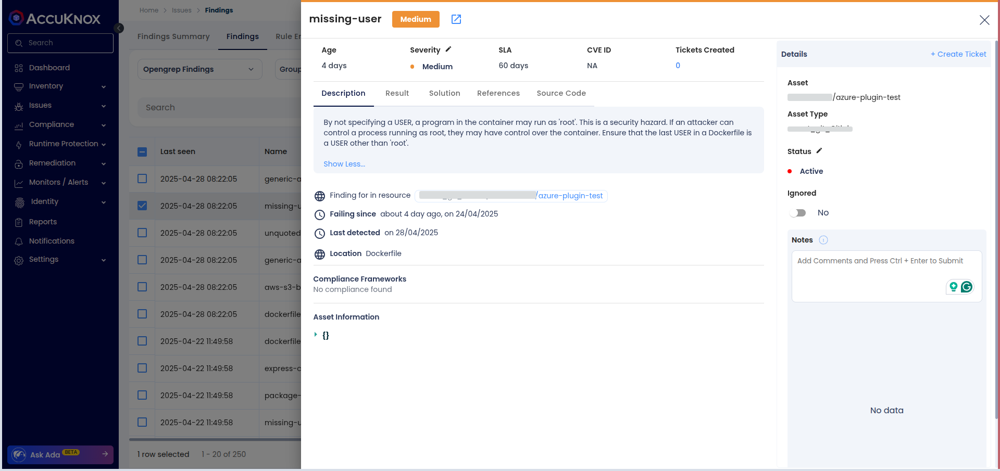

# Integrating Opengrep SAST with AccuKnox in Azure DevOps

This guide shows how to integrate **Opengrep SAST scanning** into an **Azure DevOps Pipeline** and automatically forward results to **AccuKnox** for analysis and mitigation.

## Prerequisites

- Azure DevOps Access: Access to your Azure DevOps project where the pipeline will be implemented.

- An active AccuKnox account.

## Integration Steps

### Step 1: Install AccuKnox Opengrep SAST Extension

1.  Visit the **Azure DevOps Marketplace**

2.  Search for [**AccuKnox Opengrep SAST**](https://marketplace.visualstudio.com/items?itemName=AccuKnox.accuknox-opengrep-sast "https://marketplace.visualstudio.com/items?itemName=AccuKnox.accuknox-opengrep-sast") and select **Get it free** to add to your Azure DevOps organization.
    

3.  Choose your Azure organization and click **Install**.
    

4.  Once installed, the AccuKnox Opengrep SAST extension will be available in your pipeline.
    

### Step 2: Generate AccuKnox API Token

- Log in to the **AccuKnox platform**.

- Go to Settings > Tokens and create a new token.

- Copy the token and save it for later use. For guidance on creating tokens, refer to [Creating Tokens in AccuKnox](https://help.accuknox.com/how-to/how-to-create-tokens/ "https://help.accuknox.com/how-to/how-to-create-tokens/").

### Step 3: Configure Azure DevOps Pipeline Variables

1.  Navigate to your Azure DevOps project.

2.  Go to **Project Settings** > **Pipelines** > **Library** and click **+ Variable Group**.

3.  Add the following variables:

| Name                 | Description                                                                             |
| -------------------- | --------------------------------------------------------------------------------------- |
| **accuknoxEndpoint** | The URL of the CSPM panel to push the scan results to (e.g., `cspm.demo.accuknox.com`). |
| **accuknoxToken**    | Token for authenticating with the AccuKnox CSPM panel.                                  |
| **accuknoxLabel**    | The label used to categorize and identify scan results in AccuKnox.                     |

### Step 4: Define Azure DevOps Pipeline

In your Azure repo, create/update your pipeline YAML (`azure-pipelines.yml`) and add the following task to your pipeline's steps section:

```yaml
steps:
  - task: accuknox-opengrep-sast@1.0
    inputs:
      accuknoxEndpoint: $(accuknoxEndpoint)
      accuknoxToken: $(accuknoxToken)
      accuknoxLabel: $(accuknoxLabel)
      inputSoftFail: false
```

## Inputs for AccuKnox Opengrep SAST Task

| Name             | Description                     | Required | Default                                                                                  |
| ---------------- | ------------------------------- | -------- | ---------------------------------------------------------------------------------------- |
| accuknoxEndpoint | AccuKnox CSPM panel URL         | Yes      | [cspm.demo.accuknox.com](http://cspm.demo.accuknox.com/ "http://cspm.demo.accuknox.com") |
| accuknoxToken    | AccuKnox API Token              | Yes      |                                                                                          |
| accuknoxLabel    | Label for scan results          | Yes      |                                                                                          |
| inputSoftFail    | Continue even if the scan fails | No       | false                                                                                    |

## Workflow Execution Without AccuKnox

Initially, Opengrep scans the code for vulnerabilities but does not forward results to AccuKnox, requiring manual review.

## Workflow Execution With AccuKnox

With AccuKnox integrated, Opengrep scan results are automatically sent to AccuKnox for further risk assessment and remediation.



## Viewing Results in AccuKnox

1.  After the pipeline run, log in to **AccuKnox**.

2.  Go to **Issues > Findings** and select **Opengrep Findings**.
    

3.  Inspect vulnerabilities, apply fixes, and create tracking tickets if necessary.
    

## Conclusion

Integrating **OpenGrep SAST** with **Azure DevOps** pipelines enables **automated vulnerability detection** and **centralized security management**. It ensures early detection of issues, risk assessment, and provides actionable insights to maintain code security and quality
