# Azure Marketplace Installation Guide

This document outlines the process of subscribing to AccuKnox via Azure Marketplace, including necessary actions, subscription workflow, access acquisition, and subsequent steps post-access attainment.

[Visit Marketplace](https://azuremarketplace.microsoft.com/en-us/marketplace/apps/accuknoxinc1674553411688.accuknox_saas_ver1?tab=overview)

---
The following steps cater to users who:

1. Want to get a free trial from the marketplace.
2. Want to subscribe to existing public offers available via the marketplace.
3. Need a private offer tailored to specific dimensions.
4. Seek a recurring plan for public offers.

## Case 1: AccuKnox CNAPP Free Trial on Azure (SaaS)

**Step 1:** Start off by searching for [AccuKnox CNAPP](https://azuremarketplace.microsoft.com/en-us/marketplace/apps/accuknoxinc1674553411688.accuknox_saas_ver1?tab%3Doverview&sa=D&source=editors&ust=1720443146919089&usg=AOvVaw20D87ItHGvjirJxiV3-TO6) on the Azure marketplace.

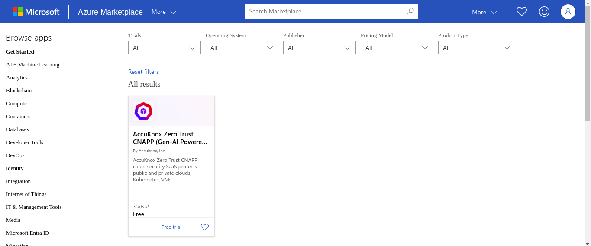

**Step 2:** After reviewing our offerings, proceed to locate the Get it Now option.

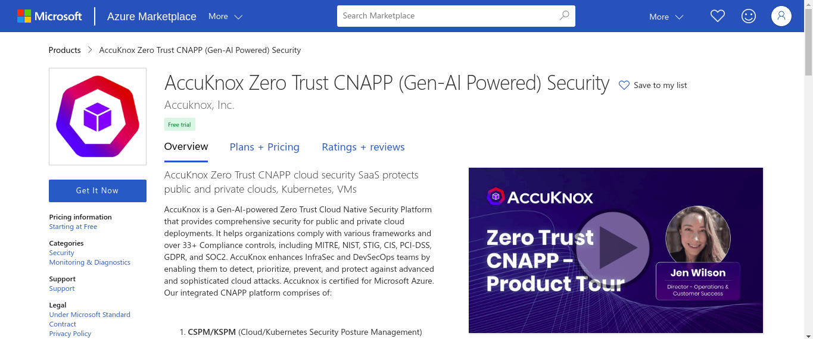

**Step 3:** After Clicking on the Get it Now the register page opens up for users, where they provide their information, including their name, phone number, organization name, and email address.

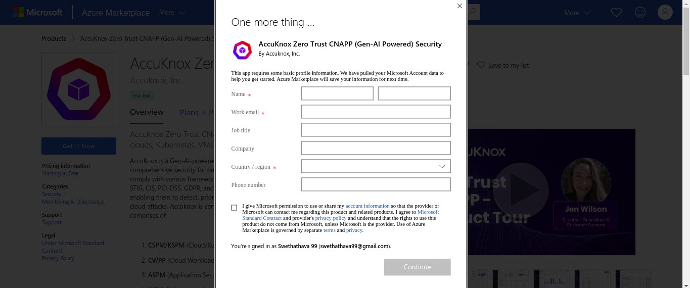

**Step 4:** After submitting the form by clicking on continue, users will be redirected to the user's Azure dashboard where they can Select the "Starter plan" for a free trial and then click on "Subscribe". The free trial lasts for 30 days and cannot be renewed.

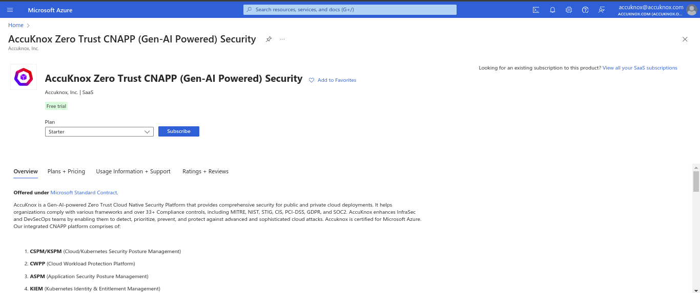

!!! info "NOTE"
    If users desire a custom solution beyond the provided offers, they have the option to contact AccuKnox support to discuss alternative possibilities. Contact: <support@accuknox.com>

**Step 5:** After clicking on subscribe users will be taken to the project details page where they have to Name the SaaS and choose the resource group. Optionally, users can set up tags too. Then click on "Review + subscribe" and then subscribe to finalize the setup.

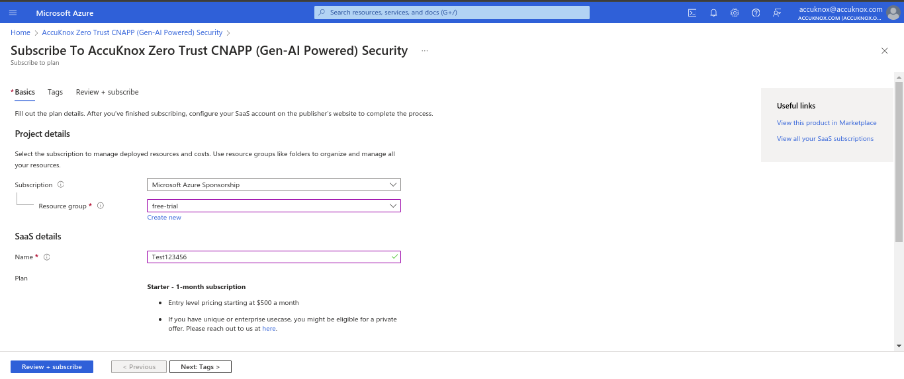

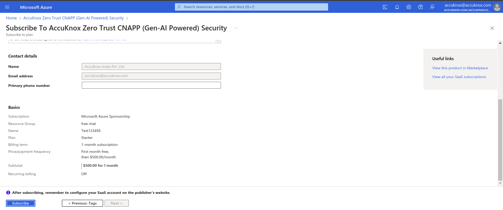

**Step 6:** Now to configure the SaaS account, users have to click on the "Next step" button, and then select "Configure account now."

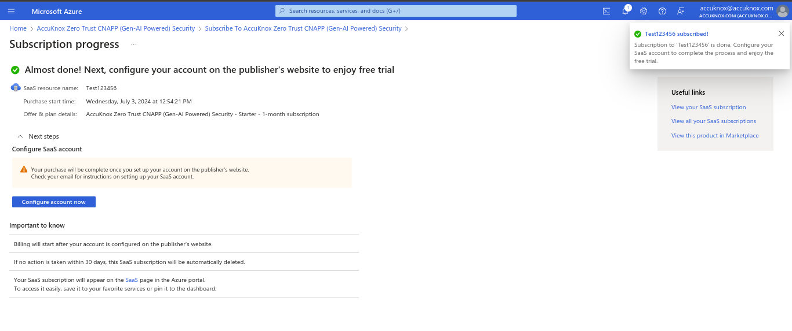

**Step 7:** You will be taken to the subscription details page. Review it for the final time and Click on "Subscribe."

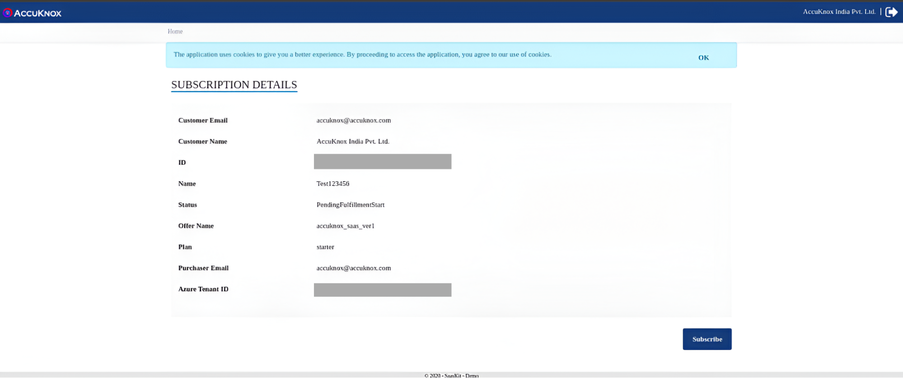

**Step 8:** The subscription process may take some time. Users can click on "Go to subscription list" to check their subscription status.

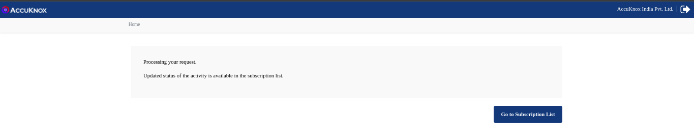

**Step 9:** You will receive an email regarding the subscription status. Once the subscription status changes from "Pending Activation" to "Subscribed," you have completed the subscription.

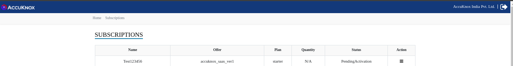

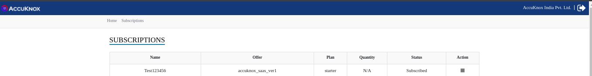

**Step 10:** You will receive an email confirming the successful subscription. They then have to click on the signup button, fill in the details, and create an account to get access to the AccuKnox platform.

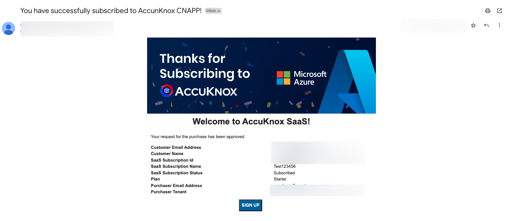

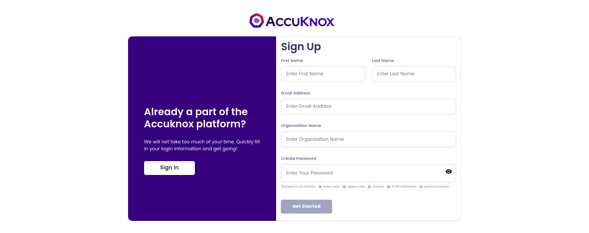

**Step 11:** At this juncture, we strongly recommend scheduling a [DEMO](https://www.accuknox.com/demo) with AccuKnox to assist the customer with the onboarding steps and gain a deeper understanding of our features.

**Step 12:** Shortly after we configure a tenant, you will recieve an invitation to access the SaaS platform and leverage its security features.

!!! info "NOTE"
    The marketplace offers a free trial subscription for a month, which will be revoked after a month. Users can choose to continue using the platform with a paid subscription or schedule a demo before the end of the month.
