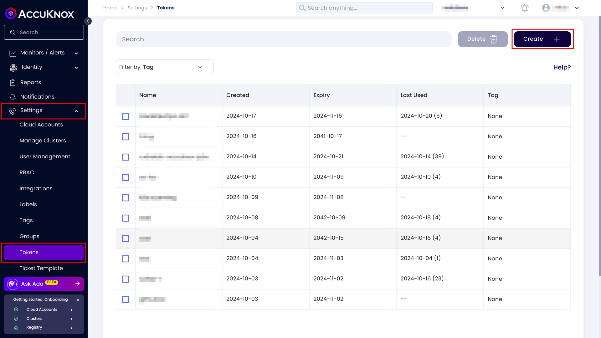
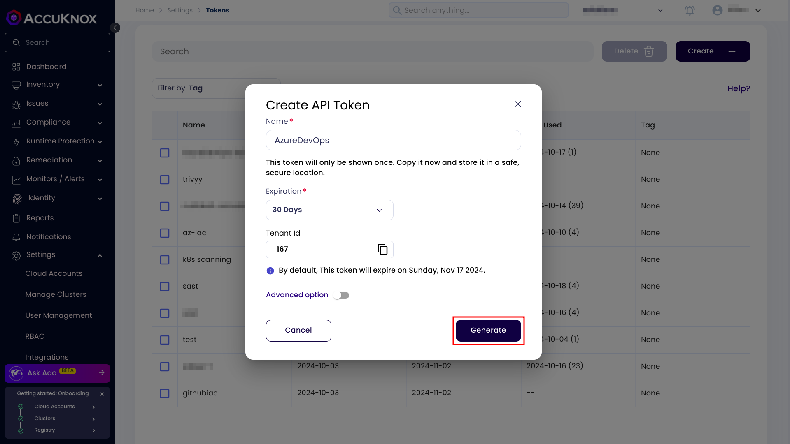
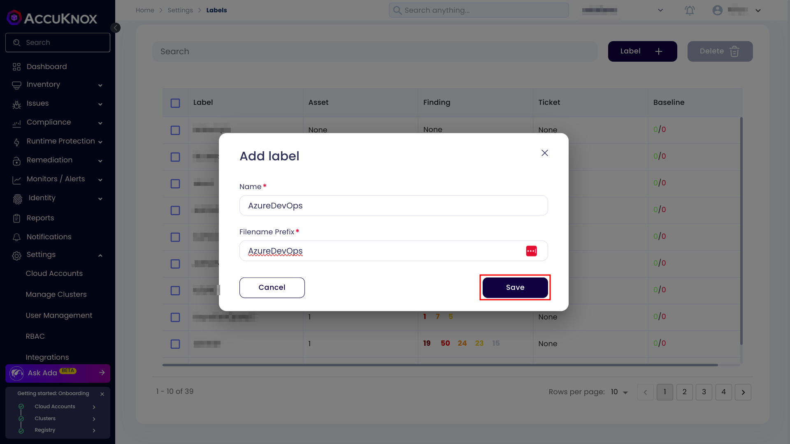
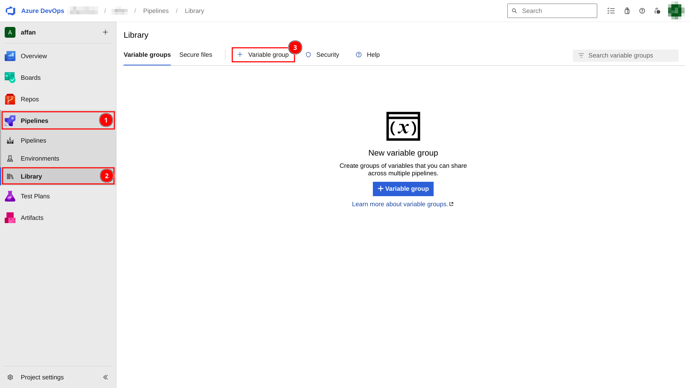
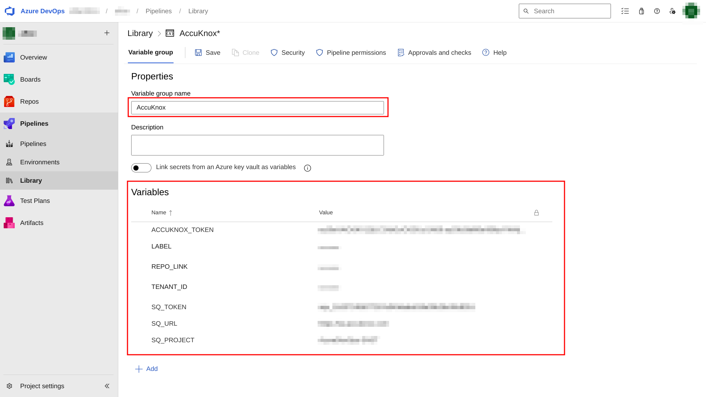
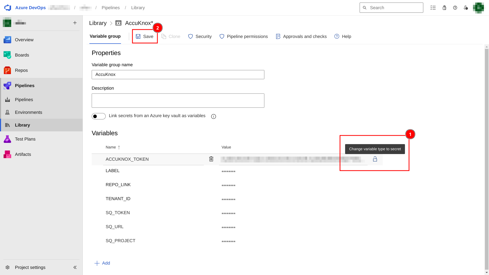
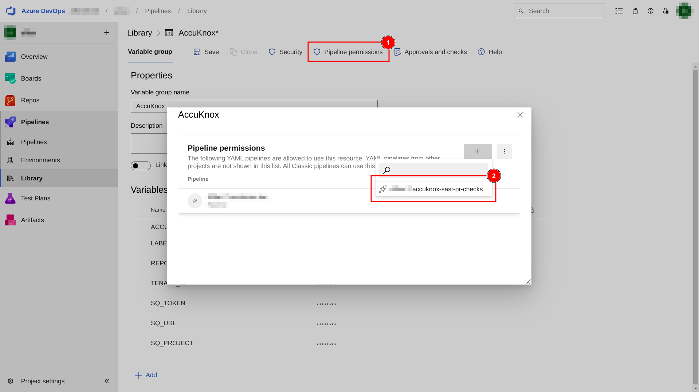
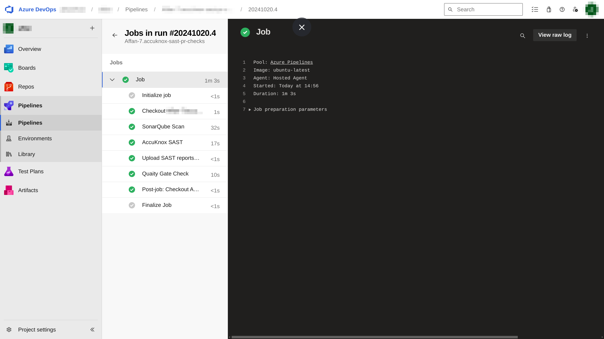
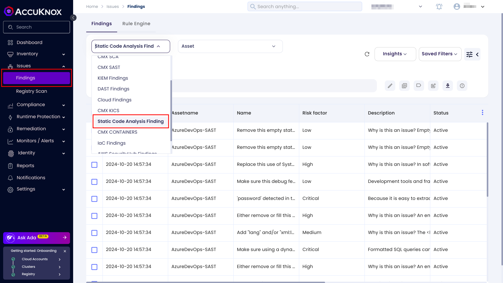
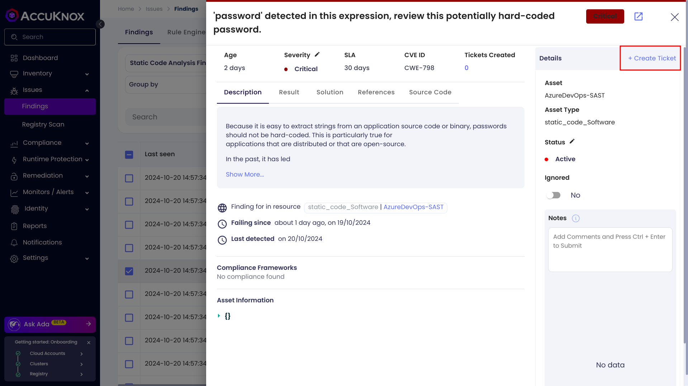

## AccuKnox SAST Integration with Azure DevOps

This document contains the process of integrating AccuKnox SAST with Azure DevOps. By integrating AccuKnox SAST into CI/CD pipeline, you can identify and resolve security vulnerabilities proactively before they are even deployed.

## **Prerequisites**
-------------
-   AccuKnox UI access

-   Azure DevOps Access

-   SonarQube access

### **Step 1: Create the AccuKnox Token**
---------------------------------

The first step is to generate an AccuKnox token. For generating the AccuKnox token, navigate to the AccuKnox > Settings > Tokens then click on the create button.



Give your token a name, and click on the **Generate** button.



Once you have generated the the token, click on the **copy** button and take a note of it. It will be required to configured as a secret in the pipeline. Also copy the Tenant Id and take a note of it.


### **Step 2: Create a label**
----------------------

In AccuKnox, labels are used for grouping the similar types of assets together. For creating a label navigate to the Settings > Labels and click on the **Create Label** button.


Give your label a name and a filename prefix. Take a note of the label and click on the save button.



### **Step 3: Create SonarQube token**
------------------------------

Create a SonarQube user with permissions to administer quality gates, quality profiles then generate an access token for that user. Take a note of that token.

### **Step 4: Configure secrets and variables in Azure DevOps**
-------------------------------------------------------

Navigate to the Azure DevOps > Pipelines > Library and click on the add variable group button.



Name your variable group as `AccuKnox`. And configure the following variables.

-   `TENANT_ID`- Your AccuKnox tenant id.

-   `ACCUKNOX_TOKEN`- AccuKnox API token.

-   `LABEL`- Used to group findings together.

-   `SQ_TOKEN`- SonarQube API token.

-   `SQ_URL`- URL of the SonarQube app

-   `SQ_PROJECT`- Name of your SonarQube project



Click on the lock icon and make those variables a secret. Then save it.



Go to pipeline permissions, click on **Add** button and select your pipeline.



### **Step 5: Configure CI/CD pipeline**
--------------------------------

Add this content to your `azure-pipelines.yml` file.

```yaml
trigger:
- main

pool:
  vmImage: ubuntu-latest

variables:
  - group: AccuKnox # Name of the variable group created in the Azure DevOps

steps:
- checkout: self
  fetchDepth: 0

- script: |
    docker run --rm \
    -e SONAR_HOST_URL=$(SQ_URL)  \
    -e SONAR_TOKEN=$(SQ_TOKEN) \
    -v "$(pwd):/usr/src" \
    sonarsource/sonar-scanner-cli
  displayName: SonarQube Scan

- script: |
    docker run --rm \
    -e SQ_URL=$(SQ_URL) \
    -e SQ_AUTH_TOKEN=$(SQ_TOKEN) \
    -e SQ_PROJECTS="$(SQ_PROJECT)" \
    -e REPORT_PATH=/app/data \
    -v $(pwd):/app/data \
    accuknox/sastjob:latest
  displayName: AccuKnox SAST

- script: |
    for file in `ls -1 SQ-*.json`; do
      curl --location --request POST "https://cspm.demo.accuknox.com/api/v1/artifact/?tenant_id=$(TENANT_ID)&data_type=SQ&save_to_s3=true&label_id=$(LABEL)" \
        --header "Tenant-Id: $(TENANT_ID)" \
        --header "Authorization: Bearer $(ACCUKNOX_TOKEN)" \
        --form "file=@\"$file\""
    done
  displayName: Upload SAST reports to AccuKnox

- script: |
    sleep 10
    response=$(curl -s -u "$(SQ_TOKEN):" "$(SQ_URL)/api/qualitygates/project_status?projectKey=$(SQ_PROJECT)")
    echo "Quality Gate API Response: $response"
    qualityGateStatus=$(echo "$response" | jq -r '.projectStatus.status')
    if [ "$qualityGateStatus" != "OK" ]; then
      echo "Quality Gate failed: $qualityGateStatus"
      exit 1
    else
      echo "Quality Gate passed"
    fi
  displayName: Quality Gate Check
```

Once you have added the above file and pushed it to repository, it will trigger the CI/CD pipeline. And you will see a screen like this.



### **Step 6: View the findings**
-------------------------

To see all of your SAST findings, navigate to AccuKnox > Issues > Findings and select the **Static Code Analysis Findings.**



Click on any finding to get more details. You can also click on the **Create Ticket** button to create a ticket.




