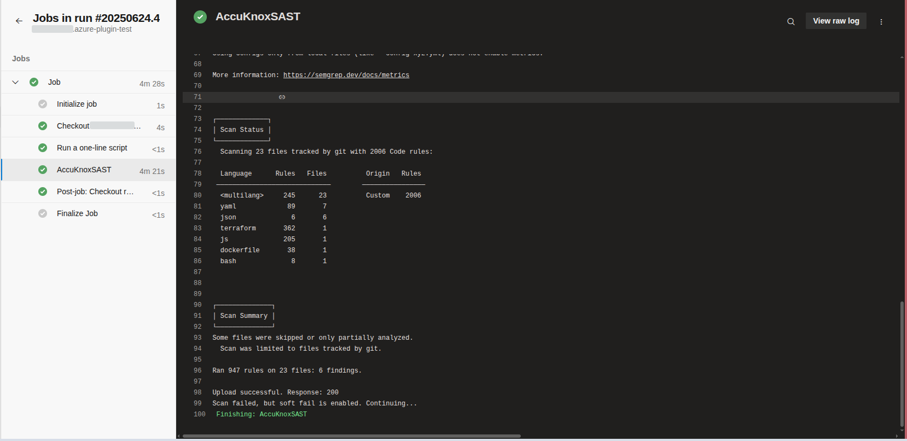

# AccuKnox SAST in Azure DevOps

This guide shows how to integrate **SAST scanning** into an **Azure DevOps Pipeline** and automatically forward results to **AccuKnox** for analysis and mitigation.

### Prerequisites

- Azure DevOps Access: Access to your Azure DevOps project where the pipeline will be implemented.

- An active AccuKnox account.

### Integration Steps

#### Step 1: Install AccuKnox SAST Extension

1. Visit the **Azure DevOps Marketplace**

2. Search for [**AccuKnox SAST**](https://marketplace.visualstudio.com/items?itemName=AccuKnox.accuknox-SAST "https://marketplace.visualstudio.com/items?itemName=AccuKnox.accuknox-SAST") and select **Get it free** to add to your Azure DevOps organization.


3. Choose your Azure organization and click **Install**.


4. Once installed, the AccuKnox SAST extension will be available in your pipeline.


#### Step 2: Configure Azure DevOps Pipeline Variables

1. Navigate to your Azure DevOps project.

2. Go to **Project Settings** > **Pipelines** > **Library** and click **+ Variable Group**.

3. Add the following variables:

| **Name**            | **Description**                                                     |
|---------------------|---------------------------------------------------------------------|
| **accuknoxEndpoint** | The URL of the CSPM panel to push the scan results to (e.g., `cspm.demo.accuknox.com`). |
| **accuknoxToken**    | Token for authenticating with the AccuKnox CSPM panel. Refer to [How to Create Tokens](https://help.accuknox.com/how-to/how-to-create-tokens/). |
| **accuknoxLabel**    | The label used to categorize and identify scan results in AccuKnox. Refer to [How to Create Labels](https://help.accuknox.com/how-to/how-to-create-labels). |

#### Step 3: Define Azure DevOps Pipeline

In your Azure repo, create/update your pipeline YAML (`azure-pipelines.yml`) and add the following task to your pipeline's steps section:

```yaml
steps:-
- task: AccuKnox-SAST@2
  inputs:
    accuknoxEndpoint: $(accuknoxEndpoint)
    accuknoxToken: $(accuknoxToken)
    accuknoxLabel: $(accuknoxLabel)
    softFail: true
```

### Inputs for AccuKnox SAST Task

| **Name**             | **Description**                     | **Required** | **Default**                                                                 |
|----------------------|-------------------------------------|--------------|------------------------------------------------------------------------------|
| accuknoxEndpoint      | AccuKnox CSPM panel URL             | Yes          | [cspm.demo.accuknox.com](http://cspm.demo.accuknox.com/)                     |
| accuknoxToken         | AccuKnox API Token                  | Yes          |                                                                              |
| accuknoxLabel         | Label for scan results              | Yes          |                                                                              |
| softFail              | Continue even if the scan fails     | No           | false                                                                        |

### Workflow Execution Without AccuKnox

Initially, scans the code for vulnerabilities but does not forward results to AccuKnox, requiring manual review.

### Workflow Execution With AccuKnox

With AccuKnox integrated, scan results are automatically sent to AccuKnox for further risk assessment and remediation.



### Viewing Results in AccuKnox

1. After the pipeline run, log in to **AccuKnox**.

2. Go to **Issues > Findings** and select **Opengrep Findings**.


3. Inspect vulnerabilities, apply fixes, and create tracking tickets if necessary.


### Conclusion

Integrating **SAST** with **Azure DevOps** pipelines enables **automated vulnerability detection** and **centralized security management**. It ensures early detection of issues, risk assessment, and provides actionable insights to maintain code security and quality
