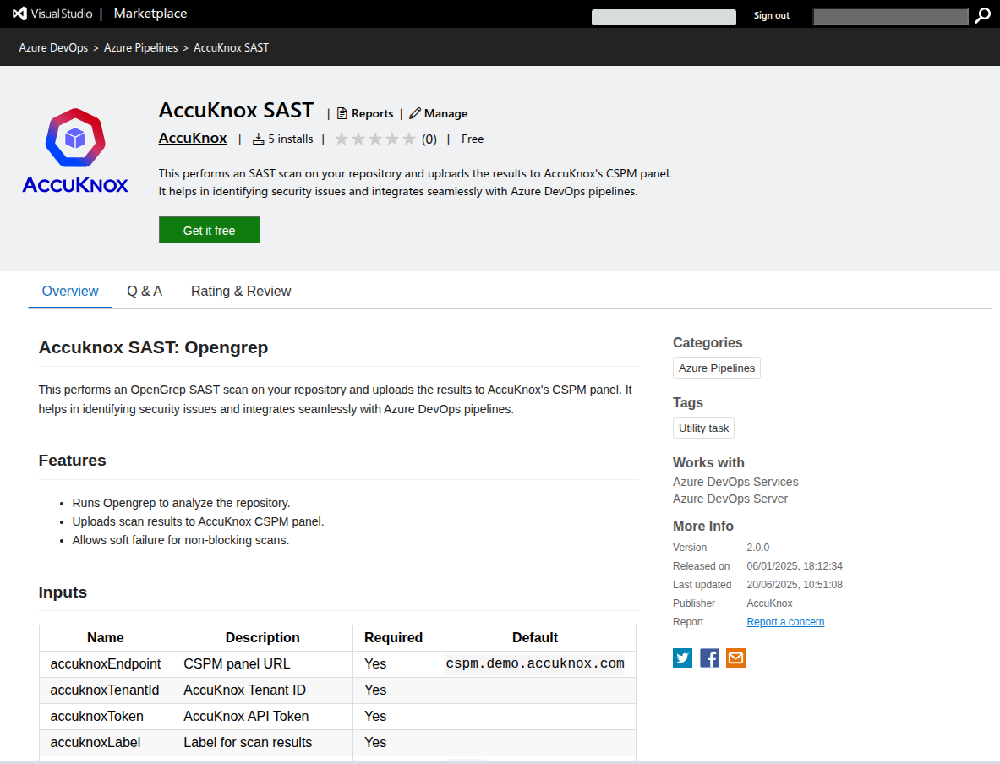
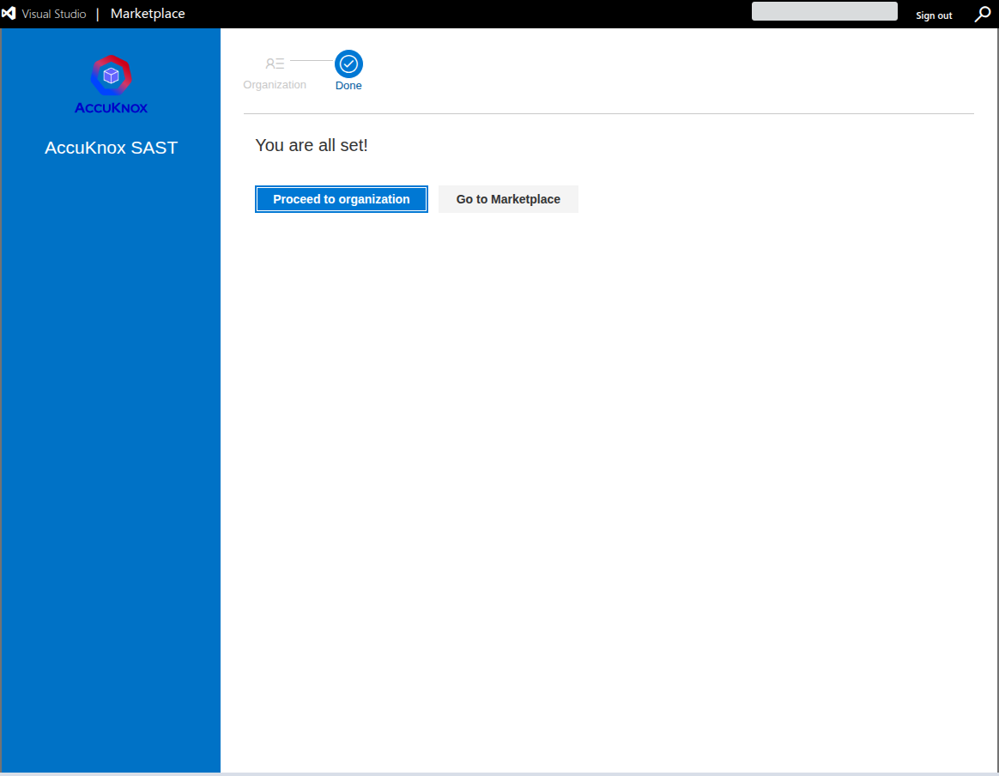
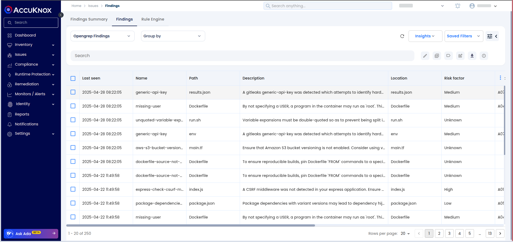

# AccuKnox SAST Integration with Azure DevOps

## Overview

This guide explains how to use the **AccuKnox SAST Azure DevOps Extension** to integrate Static Application Security Testing (SAST) into an Azure DevOps pipeline. The process uses SonarQube for scanning source code and uploads the results to AccuKnox CSPM for centralized analysis and vulnerability remediation.

## Prerequisites

1.  **Azure DevOps Access**: Access to your Azure DevOps project where the pipeline will be implemented.

2.  **SonarQube Access**: API tokens and project details for performing SAST scans.

3.  **AccuKnox Platform Access**: Generate an API token and Tenant ID for integrations.

## Steps for Integration

### Step 1: Install the AccuKnox SAST Extension

- Navigate to the [Azure DevOps Marketplace](https://marketplace.visualstudio.com/items?itemName=AccuKnox.accuknox-SAST "https://marketplace.visualstudio.com/items?itemName=AccuKnox.accuknox-SAST").

- Search for **AccuKnox SAST** and click **Get it free** to install the extension in your Azure DevOps organization.



- Select an Azure organization & click on install.


- AccuKnox SAST extension is now successfully installed & ready to use.



## **Step 2: Generate AccuKnox Token & Configure SonarQube Variables**

### **Generate an AccuKnox Token**

1.  **Log in to AccuKnox SaaS**:
    Access your AccuKnox instance using your credentials.

2.  **Navigate to Token Settings**:

    - Go to **Settings** in the dashboard.

    - Select **Tokens** from the menu.

3.  **Create a Token**:

    - Click **+ Create Token**.

    - Provide a name for the token (e.g., `Azure-Pipeline-Token`).

    - Set an expiration period or select a default lifetime (if applicable).

4.  **Copy and Store Securely**:

    - Copy the token immediately after generation.

    - **Store the token as a secret** in your Azure DevOps project:

      - Navigate to **Pipelines > Library**.

      - Click **+ Variable group** and create a group to hold secrets.

      - Add the AccuKnox token under a variable name (e.g., `accuknoxToken`).

      - Mark the token as **Secret** to ensure its security.

For more details, refer to [How to Create Tokens](https://help.accuknox.com/how-to/how-to-create-tokens/ "https://help.accuknox.com/how-to/how-to-create-tokens/").

### **Generate a User Token in SonarQube**

1.  **Log in to SonarQube**:
    Access your SonarQube instance using your credentials.

2.  **Navigate to the Security Section**:

    - Click your **user profile icon** in the top-right corner.

    - Go to **My Account > Security**.

3.  **Generate a New Token**:

    - Under the **Generate Tokens** section, enter a name for the token (e.g., `AzureDevOpsIntegration`).

    - 

    - Click **Generate**.

4.  **Copy and Store Securely**:

    - Copy the token immediately.

    - **Store it as a secret** in Azure DevOps under a variable name (e.g., `sonarQubeToken`).

### **Find the SonarQube Project Key**

1.  **Log in to SonarQube**:
    Use your credentials to access the SonarQube dashboard.

2.  **Locate the Project Key**:

    - Navigate to the **Projects** tab.

    - Select the relevant project from the list.

    - The **project key** is displayed on the **Project Information** page.


3.  **Store in Azure DevOps**:
    Add the project key to your Azure DevOps variable group as `sonarQubeProjectKey`.

### **Find the SonarQube URL**

1.  **Access SonarQube**:
    Open your SonarQube instance in a web browser.

2.  **Copy the URL**:

    - The URL will look similar to:
      `https://sonarqube.example.com`.

3.  **Store in Azure DevOps**:
    Add the URL to your Azure DevOps variable group as `sonarQubeUrl`.

## Step 3: Configure Azure DevOps Secrets

In Azure DevOps, add the following secrets in your project settings under **Pipelines > Library > Variable Groups**:

| **Secret Name**       | **Description**                              |
| --------------------- | -------------------------------------------- |
| `sonarQubeUrl`        | URL of the SonarQube server.                 |
| `sonarQubeToken`      | API token for SonarQube authentication.      |
| `sonarQubeProjectKey` | SonarQube project key.                       |
| `accuknoxEndpoint`    | URL of the AccuKnox CSPM API.                |
| `accuknoxTenantId`    | AccuKnox Tenant ID.                          |
| `accuknoxToken`       | AccuKnox API token.                          |
| `accuknoxLabel`       | Label to group similar findings in AccuKnox. |

## Step 4: Add AccuKnox SAST Task to Pipeline

In your Azure DevOps pipeline YAML file, add the following task:

```yaml
- task: AccuKnox-SAST@0
  inputs:
    sonarQubeUrl: $(sonarQubeUrl)
    sonarQubeToken: $(sonarQubeToken)
    sonarQubeProjectKey: $(sonarQubeProjectKey)
    accuknoxEndpoint: $(accuknoxEndpoint)
    accuknoxTenantId: $(accuknoxTenantId)
    accuknoxToken: $(accuknoxToken)
    accuknoxLabel: $(accuknoxLabel)
    qualityGate: false # Set to true to enforce SonarQube quality gate
    skipSonarQubeScan: false # Set to true to skip SonarQube scan
```


## How It Works

1.  **SonarQube SAST Scan**: The extension runs a SAST scan on the specified project using SonarQube.

2.  **Generate Report**: A report is generated based on the scan results.

3.  **Upload to AccuKnox**: The generated report is uploaded to AccuKnox SaaS for centralized monitoring and detailed analysis.

4.  **Quality Gate Check**: The pipeline checks if the project meets the quality standards defined in SonarQube.

## **Viewing Results in AccuKnox SaaS**

**Step 1**: After the workflow completes, navigate to the AccuKnox SaaS dashboard.

**Step 2**: Go to **Issues** > **Findings** and select **SAST Findings** to see identified vulnerabilities.


**Step 3**: Click on a vulnerability to view more details.


**Step 4**: Fix the Vulnerability

Follow the instructions in the Solutions tab to fix the vulnerability


**Step 5**: Create a Ticket for Fixing the Vulnerability

Create a ticket in your issue-tracking system to address the identified vulnerability.


**Step 6**: Review Updated Results

- After fixing the vulnerability, rerun the Azure pipeline.

- Navigate to the AccuKnox SaaS dashboard and verify that the vulnerability has been resolved.

## Benefits of Integration

- **Centralized Monitoring**: All vulnerabilities across projects are visible in the AccuKnox dashboard.

- **Early Detection**: Identify security issues early in the development lifecycle.

- **Remediation Guidance**: Leverage actionable remediation insights provided by AccuKnox.

- **Seamless Integration**: Easily integrates into Azure DevOps pipelines.

By using the **AccuKnox SAST Azure DevOps Extension**, you can ensure secure code practices in your CI/CD pipelines while leveraging the power of centralized vulnerability management with AccuKnox CSPM.
