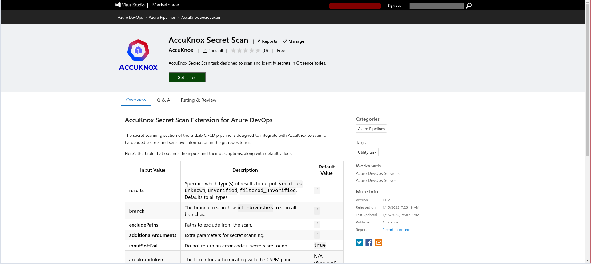
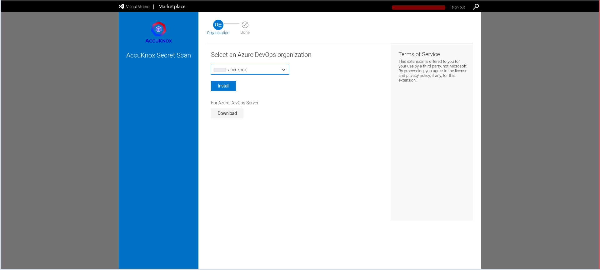
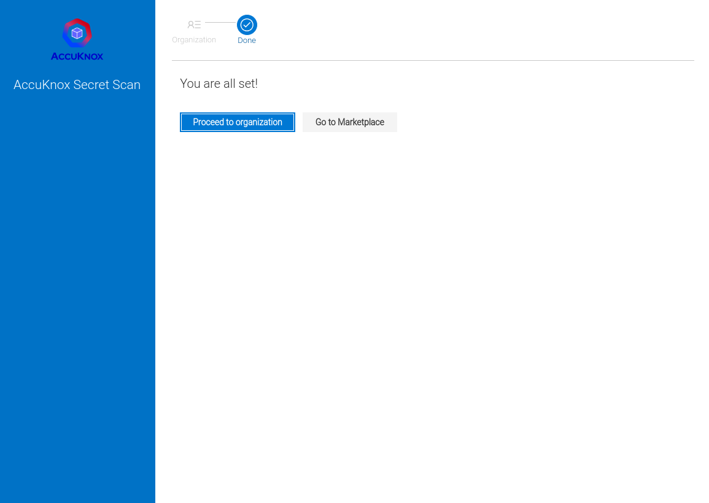
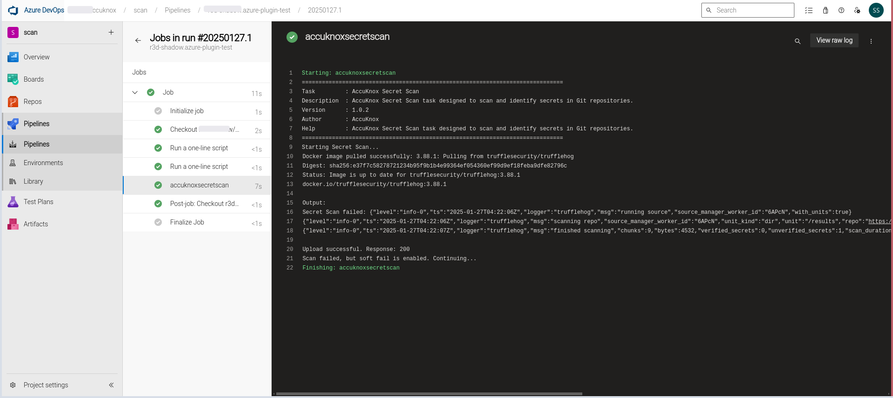
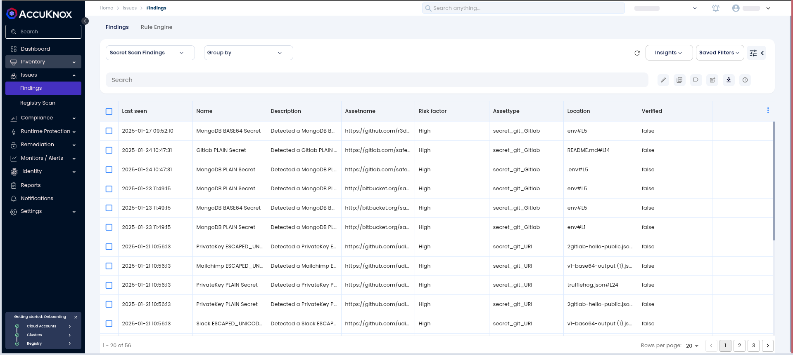
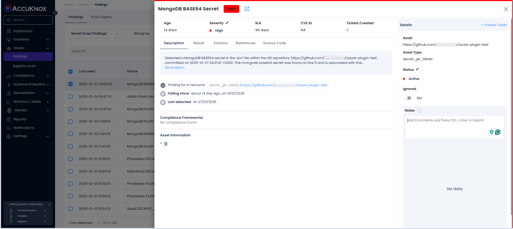
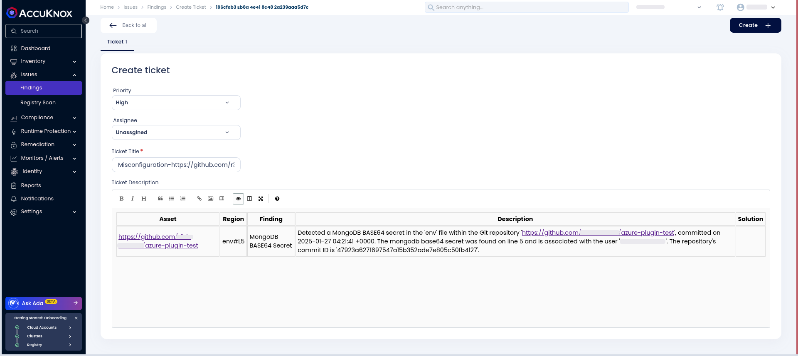

# Azure DevOps Secret Scan

This guide walks you through the process of integrating AccuKnox Secret Scanning into your Azure DevOps pipeline. By doing so, you can efficiently detect and handle hard-coded secrets within your codebase to improve the overall security posture of your applications.

### Prerequisites

- Access to an Azure DevOps project.

- An active AccuKnox account.

- A configured Azure DevOps agent for pipeline execution.

### Integration Steps

#### Step 1: Install AccuKnox Secret Scanning Extension

1.  Visit the **Azure DevOps Marketplace**.

2.  Search for **AccuKnox Secret Scanning** and select **Get it free** to add to your Azure DevOps organization.
    

3.  Choose your Azure organization and click **Install**.
    

4.  Once installed, the AccuKnox Secret Scanning extension will be available in your pipeline.
    

#### Step 2: Generate an AccuKnox API Token

1.  Log in to the AccuKnox platform.

2.  Go to **Settings** > **Tokens** and create a new token.

3.  Copy the token and save it for later use. For guidance on creating tokens, refer to [Creating Tokens in AccuKnox](https://help.accuknox.com/how-to/how-to-create-tokens/ "https://help.accuknox.com/how-to/how-to-create-tokens/").

#### Step 3: Set Up Variables in Azure DevOps

1.  Navigate to your Azure DevOps project.

2.  Go to **Project Settings** > **Pipelines** > **Library** and click **+ Variable Group**.

3.  Add the following variables:

| **Variable**          | **Description**                                                                                                                  | **Default Value**  |
| --------------------- | -------------------------------------------------------------------------------------------------------------------------------- | ------------------ |
| `results`             | Specifies which type(s) of results to output: `verified`, `unknown`, `unverified`, `filtered_unverified`. Defaults to all types. | `""`               |
| `branch`              | The branch to scan. Use `all-branches` to scan all branches.                                                                     | `""`               |
| `excludePaths`        | Paths to exclude from the scan.                                                                                                  | `""`               |
| `additionalArguments` | Extra parameters for secret scanning.                                                                                            | `""`               |
| `inputSoftFail`       | Do not return an error code if secrets are found.                                                                                | `true`             |
| `accuknoxToken`       | The token for authenticating with the CSPM panel.                                                                                | **N/A (Required)** |
| `accuknoxEndpoint`    | The URL of the CSPM panel to push the scan results to.                                                                           | **N/A (Required)** |
| `accuknoxLabel`       | The label created in AccuKnox SaaS for associating scan results.                                                                 | **N/A (Required)** |


#### Step 4: Configure Pipeline to Run Secret Scanning

1.  Open or create your pipeline's YAML file in Azure DevOps.

2.  Add the following task to your pipeline's `steps` section:

```yaml
steps:-
  task: accuknox-secret-scan@1.0.2
  inputs:
    accuknoxEndpoint: $(accuknoxEndpoint)
    accuknoxToken: $(accuknoxToken)
    accuknoxLabel: $(accuknoxLabel)
    inputSoftFail: true
```

#### Step 5: Trigger the Pipeline

- Manually trigger the pipeline or push a code change to initiate the scanning process.

- Monitor the pipeline logs to ensure the AccuKnox Secret Scanning task executes successfully.



### View Results in AccuKnox SaaS

1.  Once the pipeline finishes, log in to the **AccuKnox SaaS dashboard**.

2.  Navigate to **Issues > Findings**, then select **Secret Scan Findings**.
    

3.  Review the list of identified hardcoded secrets or sensitive data.
    

4.  **Address Findings,** for each finding, create a task in your issue-tracking system, advising secret rotation and the use of a secure secret management solution. Once resolved, mark the issue as fixed in the AccuKnox platform.
    

### Conclusion

By integrating AccuKnox Secret Scanning into your Azure DevOps pipeline, you gain an essential layer of security to proactively detect and manage hardcoded secrets within your code. This integration helps safeguard your applications and ensures that your security practices stay strong throughout the development lifecycle.
