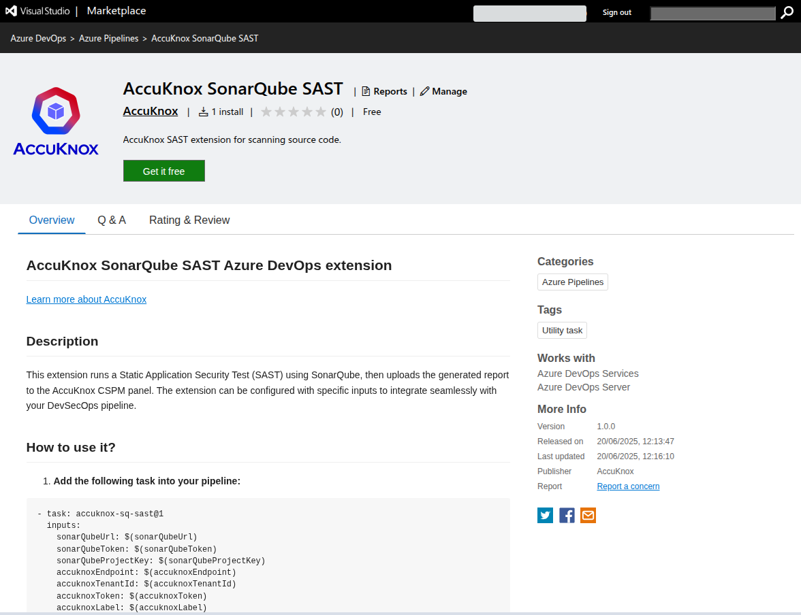
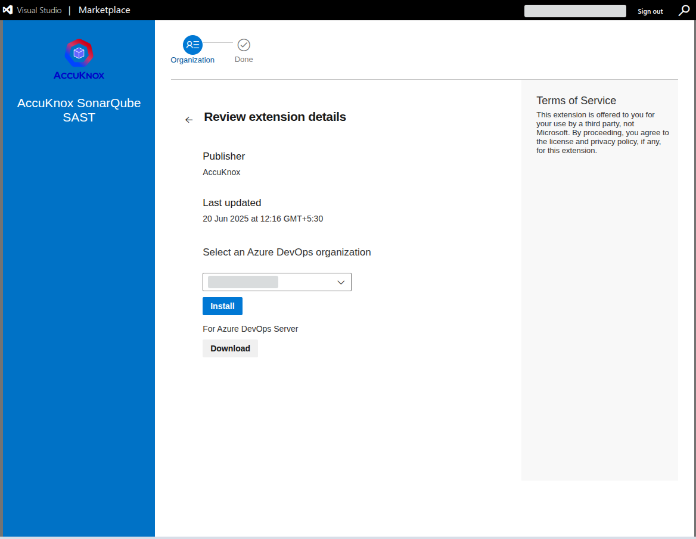
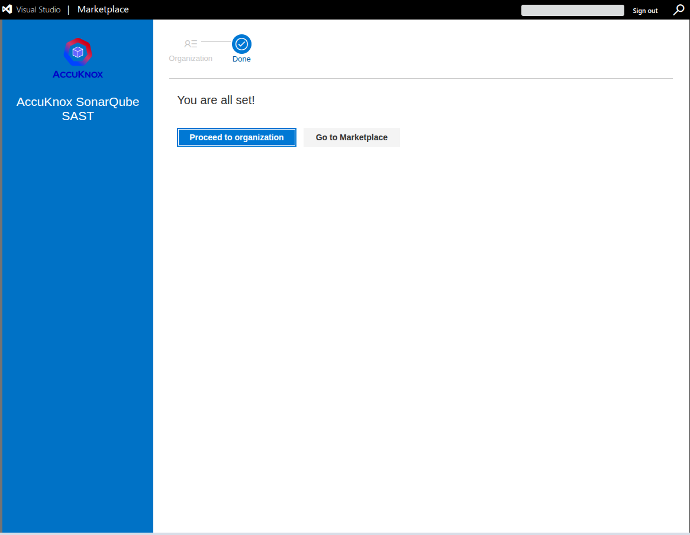
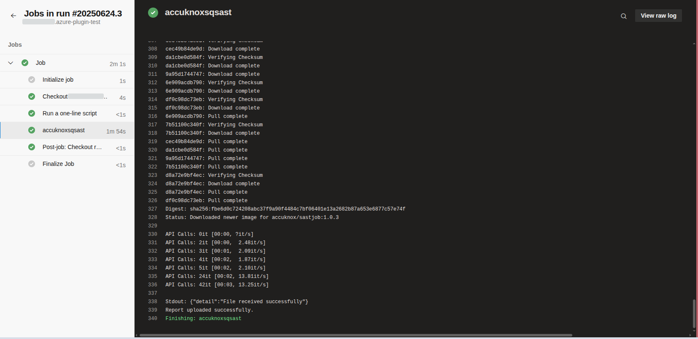
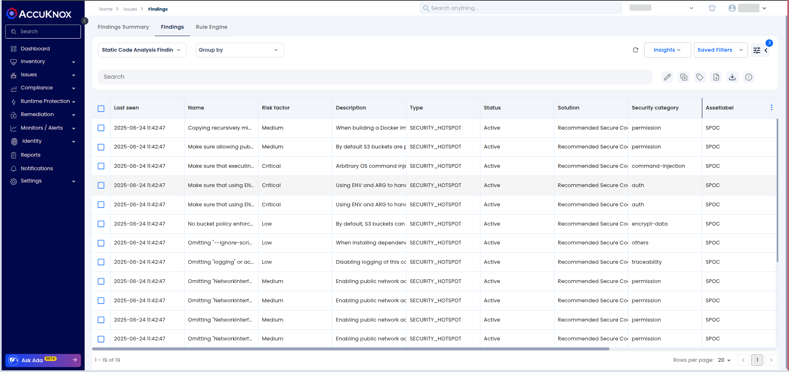
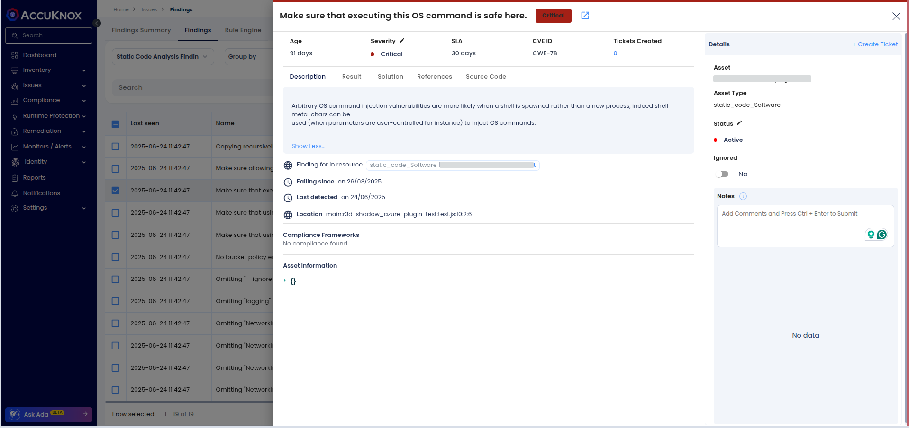

# Integrating SonarQube SAST with AccuKnox in Azure DevOps

This guide shows how to integrate **SonarQube SAST scanning** into an **Azure DevOps Pipeline** and automatically forward results to **AccuKnox** for analysis and mitigation.

### Prerequisites

- Azure DevOps Access: Access to your Azure DevOps project where the pipeline will be implemented.

- An active AccuKnox account.

- SonarQube Access: API tokens and project details for performing SAST scans.

### Integration Steps

#### Step 1: Install AccuKnox SonarQube SAST Extension

1. Visit the **Azure DevOps Marketplace**

2. Search for [**AccuKnox SonarQube SAST**](https://marketplace.visualstudio.com/items?itemName=AccuKnox.accuknox-sq-sast "https://marketplace.visualstudio.com/items?itemName=AccuKnox.accuknox-sq-sast") and select **Get it free** to add to your Azure DevOps organization.


3. Choose your Azure organization and click **Install**.


4. Once installed, the AccuKnox SAST extension will be available in your pipeline.


#### Step 2: Configure Azure DevOps Pipeline Variables

1. Navigate to your Azure DevOps project.

2. Go to **Project Settings** > **Pipelines** > **Library** and click **+ Variable Group**.

3. Add the following variables:

| **Name**               | **Description**                                                                                                                                                           |
|------------------------|---------------------------------------------------------------------------------------------------------------------------------------------------------------------------|
| **accuknoxEndpoint**   | The URL of the CSPM panel to push the scan results to (e.g., `cspm.demo.accuknox.com`).                                                                                   |
| **accuknoxToken**      | Token for authenticating with the AccuKnox CSPM panel. Refer to [How to Create Tokens](https://help.accuknox.com/how-to/how-to-create-tokens/).                          |
| **accuknoxLabel**      | The label used to categorize and identify scan results in AccuKnox. Refer to [How to Create Labels](https://help.accuknox.com/how-to/how-to-create-labels).              |
| **sonarQubeUrl**       | URL of the SonarQube server.                                                                                                                                              |
| **sonarQubeToken**     | User API token for SonarQube authentication.                                                                                                                              |
| **sonarQubeProjectKey**| SonarQube project key.                                                                                                                                                    |


#### Step 3: Define Azure DevOps Pipeline

In your Azure repo, create/update your pipeline YAML (`azure-pipelines.yml`) and add the following task to your pipeline's steps section:

```yaml
steps:-
- task: accuknox-sq-sast@1
  inputs:
    sonarQubeUrl: 'https://sonarcloud.io'
    sonarQubeToken: '$(sonarQubeToken)'
    sonarQubeProjectKey: '<sonarQubeProjectKey>'
    sonarQubeOrganizationId: '<sonarQubeOrganizationId>'
    accuknoxEndpoint: '<accuknoxEndpoint>'
    accuknoxToken: '$(accuknoxToken)'
    accuknoxLabel: '<accuknoxLabel>'
```

### Inputs for AccuKnox SonarQube SAST Task

| **Input Value**             | **Required** | **Default Value** | **Description**                                                                                          |
|----------------------------|--------------|-------------------|----------------------------------------------------------------------------------------------------------|
| `sonarQubeUrl`             | Yes          | None              | URL of the SonarQube server. eg. `https://sonarqube.example.com`                                        |
| `sonarQubeToken`           | Yes          | None              | SonarQube user token.                                                                                    |
| `sonarQubeProjectKey`      | Yes          | None              | Project key of your SonarQube project.                                                                   |
| `sonarQubeOrganizationId`  | No           | None              | Required only for SonarQube Cloud users                                                                  |
| `accuknoxEndpoint`         | Yes          | None              | AccuKnox domain for sending DAST report. eg. `cspm.demo.accuknox.com`, `cspm.accuknox.com`               |
| `accuknoxToken`            | Yes          | None              | AccuKnox API token.                                                                                      |
| `accuknoxLabel`            | Yes          | None              | AccuKnox label to group similar findings together.                                                       |
| `qualityGate`              | No           | `false`           | Quality gate check to fail the build if the quality gate fails. Value should be boolean.                |
| `skipSonarQubeScan`        | No           | `false`           | Skip SonarQube scan, for advanced users. Value should be boolean.                                       |


### How It Works

1. **SonarQube SAST Scan**: The extension runs a SAST scan on the specified project using SonarQube.

2. **Generate Report**: A report is generated based on the scan results.

3. **Upload to AccuKnox**: The generated report is uploaded to AccuKnox SaaS for centralized monitoring and detailed analysis.

4. **Quality Gate Check**: The pipeline checks if the project meets the quality standards defined in SonarQube.



### Viewing Results in AccuKnox

1. After the pipeline run, log in to **AccuKnox**.

2. Go to **Issues > Findings** and select **SAST Findings**.


3. Inspect vulnerabilities, apply fixes, and create tracking tickets if necessary.


### Benefits of Integration

- **Centralized Monitoring**: All vulnerabilities across projects are visible in the AccuKnox dashboard.

- **Early Detection**: Identify security issues early in the development lifecycle.

- **Remediation Guidance**: Leverage actionable remediation insights provided by AccuKnox.

- **Seamless Integration**: Easily integrates into Azure DevOps pipelines.

By using the **AccuKnox SonarQube SAST Azure DevOps Extension**, you can ensure secure code practices in your CI/CD pipelines while leveraging the power of centralized vulnerability management with AccuKnox.
