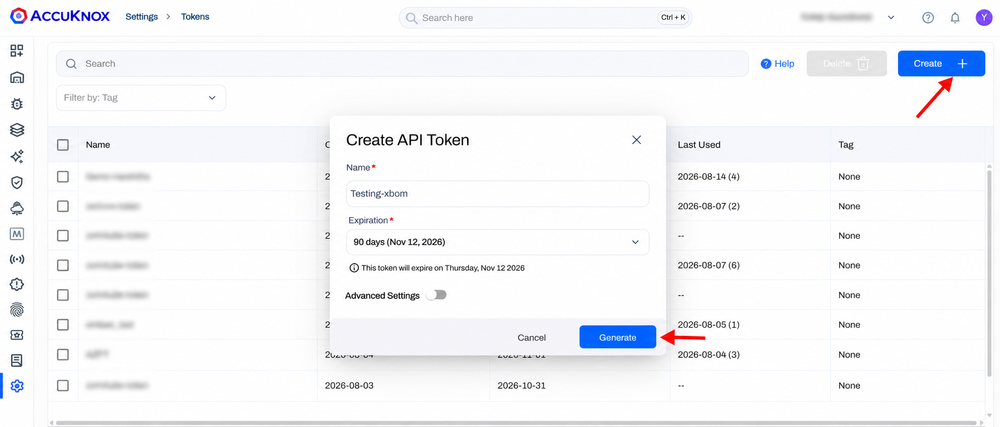
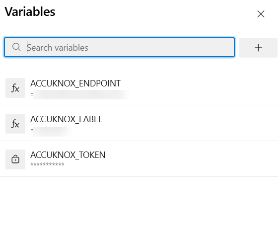
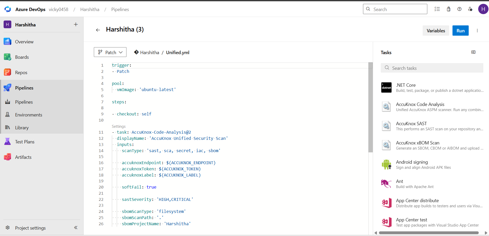
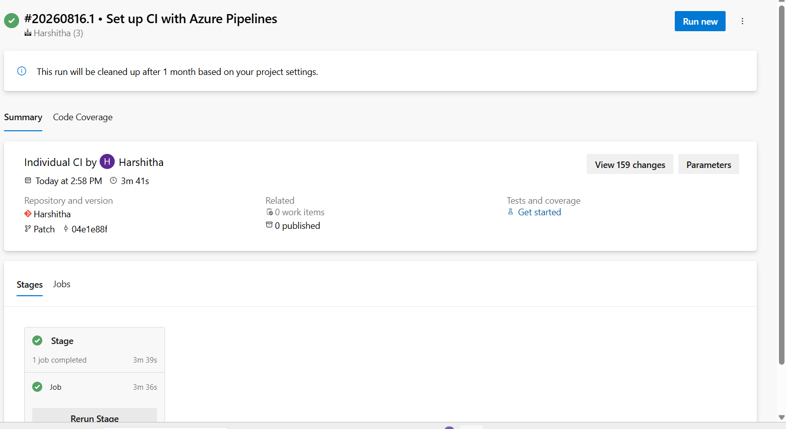
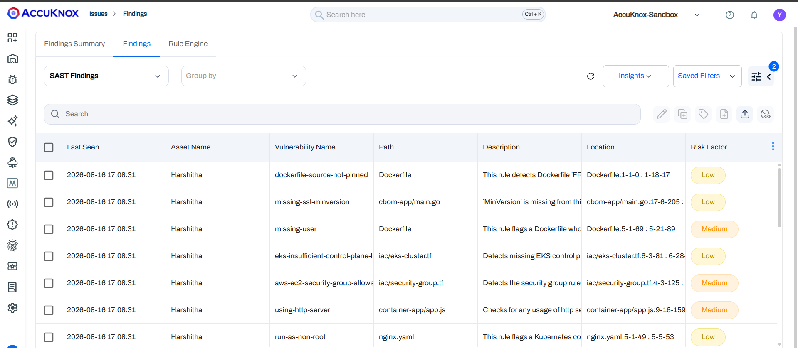
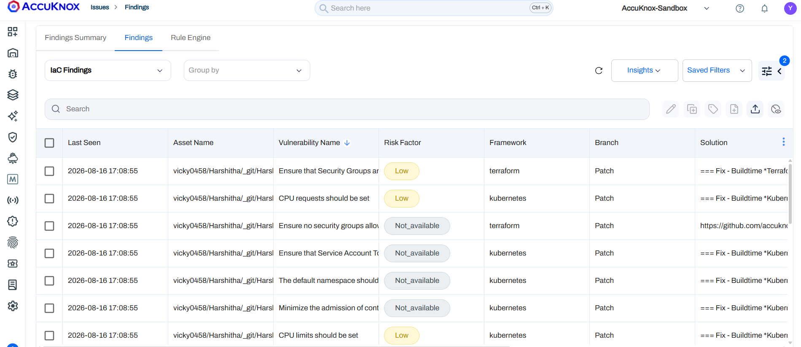
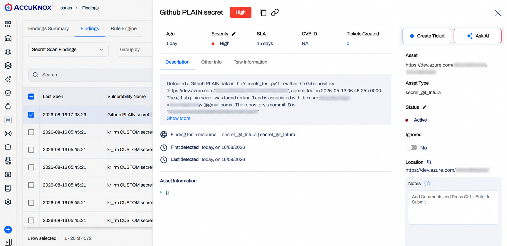

# Unified code analysis with Azure DevOps

One pipeline task runs SAST, SCA, Secret, IaC, and SBOM scans together and pushes every result to AccuKnox. You pick which scans run through a single `scanType` input, so you never configure five separate tasks.

| Scan type | What it finds |
|---|---|
| `sast` | Insecure code patterns in your source |
| `sca` | Known vulnerabilities in open-source and third-party dependencies |
| `secret` | Hardcoded credentials, API keys, and tokens in the repository |
| `iac` | Misconfigurations in Terraform, Kubernetes, and other IaC templates |
| `sbom` | A component and dependency inventory for supply-chain visibility |

## Prerequisites

- Access to the Azure DevOps project that will run the pipeline
- An active AccuKnox account
- Permission to install extensions in your Azure DevOps organization

## Step 1. Create a label in AccuKnox

A label groups the scan results this pipeline sends. In AccuKnox, go to **Settings > Labels**.

Click **+ Label**, enter a unique name such as `azure-uca`, and click **Save**. The message *Label name is available* confirms the name is free.


For the full walkthrough, see [How to Create Labels](../how-to/how-to-create-labels.md).

## Step 2. Create an API token

The token lets the pipeline push results to AccuKnox. Go to **Settings > Tokens**.

Click **Create +**, enter a name, choose an expiration period, and click **Generate**.



!!! warning "Copy the token now"
    Copy and store the token before you leave the page. You use it as a secret pipeline variable in Step 4.

For the full walkthrough, see [How to Create Tokens](../how-to/how-to-create-tokens.md).

## Step 3. Install the AccuKnox Code Analysis extension

1. Open [AccuKnox Code Analysis on the Visual Studio Marketplace](https://marketplace.visualstudio.com/items?itemName=AccuKnox.accuknox-code-analysis).
2. Click **Get it free**.
3. Choose your Azure DevOps organization and click **Install**.

The `AccuKnox-Code-Analysis` task is now available to every pipeline in that organization.

## Step 4. Add the pipeline variables

Open **Project Settings > Pipelines > Library > + Variable Group** and add three variables.

| Variable | Secret | Value |
|---|---|---|
| `ACCUKNOX_ENDPOINT` | No | The CSPM panel URL that receives results, for example `cspm.accuknox.com` |
| `ACCUKNOX_TOKEN` | Yes | The token from Step 2 |
| `ACCUKNOX_LABEL` | No | The label from Step 1 |



!!! warning "Mark the token as secret"
    Set the lock icon on `ACCUKNOX_TOKEN`. Azure DevOps then masks it in logs. Anyone with edit access to the pipeline can still reach the secrets that pipeline consumes, so restrict who can edit it.

## Step 5. Add the task to your pipeline

Add the `AccuKnox-Code-Analysis@2` task to your pipeline YAML. This example runs all five scans in one step.

```yaml
trigger:
  - main

pool:
  vmImage: 'ubuntu-latest'

steps:
  - checkout: self

  - task: AccuKnox-Code-Analysis@2
    displayName: 'AccuKnox Unified Security Scan'
    inputs:
      scanType: 'sast, sca, secret, iac, sbom'

      accuknoxEndpoint: $(ACCUKNOX_ENDPOINT)
      accuknoxToken: $(ACCUKNOX_TOKEN)
      accuknoxLabel: $(ACCUKNOX_LABEL)

      softFail: true

      sastSeverity: 'HIGH,CRITICAL'

      sbomScanType: 'filesystem'
      sbomScanPath: '.'
      sbomProjectName: 'my-project'
```



!!! tip "Drop the inputs you do not need"
    The task ignores inputs that belong to a scan you left out of `scanType`. Run only `sast` and the SBOM inputs do nothing, so a minimal pipeline stays minimal.

### Task inputs

| Input | Required | Default | Description |
|---|---|---|---|
| `scanType` | Yes | — | Comma-separated list of scans to run: `sast`, `sca`, `secret`, `iac`, `sbom` |
| `accuknoxEndpoint` | Yes | — | AccuKnox CSPM panel URL |
| `accuknoxToken` | Yes | — | AccuKnox API token, supplied as a secret variable |
| `accuknoxLabel` | Yes | — | Label used to group the scan results |
| `softFail` | No | `false` | Continue the pipeline even when a scan finds issues or fails |
| `sastSeverity` | No | All | Severity levels to report for SAST, for example `HIGH,CRITICAL` |
| `sbomScanType` | No | — | SBOM target type, for example `filesystem` |
| `sbomScanPath` | No | `.` | Path to scan for SBOM generation |
| `sbomProjectName` | No | — | Project name attached to the generated SBOM |

## Step 6. Run the pipeline

Trigger the pipeline manually or push a commit. Watch the logs and confirm the **AccuKnox Unified Security Scan** task finishes.



## View the results in AccuKnox

Log in to AccuKnox and go to **Issues > Findings**. The findings-type dropdown switches between the results the unified scan produced.

**SAST findings** show the asset, vulnerability name, file path, description, the file and line range, and the risk factor.



**IaC findings** show the affected asset, the rule name, the risk factor, and the branch. Each one names the framework, such as Terraform or Kubernetes, and carries a suggested fix.



**Secret scan findings** open to show severity, SLA, the file and line holding the secret, the commit, and the asset location. Use **Create Ticket** to assign the fix, or **Ask AI** for remediation guidance.



!!! danger "A detected secret is already exposed"
    Rotate the credential first, then move it into a secret manager. Deleting the line from the repository does not remove it from git history. Mark the finding resolved in AccuKnox only after the credential is rotated.

## Related pages

- [Azure DevOps integration overview](azure-overview.md)
- [AccuKnox xBOM with Azure DevOps](azure-xbom.md)
- [Findings lifecycle](../how-to/findings-lifecycle.md)
