# xBOM with Azure DevOps

One pipeline task generates three kinds of Bill of Materials in CycloneDX 1.6 format, uploads them to the AccuKnox Console, and attaches the file to the pipeline run as a downloadable artifact. Pick the type you need with the `bomType` input.

| `bomType` | What it inventories | Why you want it |
|---|---|---|
| `sbom` | Packages and dependencies in a source tree or container image | Know which open-source components ship and which carry known CVEs |
| `cbom` | Cryptographic algorithms, key sizes, protocols, and libraries | Find weak or deprecated cryptography and plan post-quantum migration |
| `aibom` | AI/ML models from HuggingFace or AWS Bedrock | Track every foundation model your application consumes, with provenance, size, and license |

| Capability | Detail |
|---|---|
| BOM standard | CycloneDX 1.6 |
| Scan sources | Source tree (`scanPath`), container image (`imageRef`), or AI model (HuggingFace or AWS Bedrock) |
| Agent support | Linux, macOS, and Windows on amd64 and arm64. The task downloads the matching CLI build at runtime |
| Output | Uploaded to the AccuKnox Console and attached to the pipeline run as an artifact named `<bomType>-<buildId>` |
| Results location | AccuKnox Console, **SBOM > Projects**, filtered by your project and label |
| Task version | `AccuKnox-xBOM@2` |

## Prerequisites

- Access to the Azure DevOps project that will run the pipeline
- An active AccuKnox account
- An Azure DevOps agent on Linux, macOS, or Windows (amd64 or arm64)
- Organization-level permission to install Marketplace extensions, or administrator approval

## Step 1. Install the AccuKnox xBOM extension

1. Open [AccuKnox xBOM Scan on the Visual Studio Marketplace](https://marketplace.visualstudio.com/items?itemName=AccuKnox.accuknox-xbom).
2. Click **Get it free**, choose your Azure DevOps organization, and click **Install**. Submit the request and wait for approval if your organization requires it.
3. Confirm the extension shows as **Active** under **Organization Settings > Extensions**.

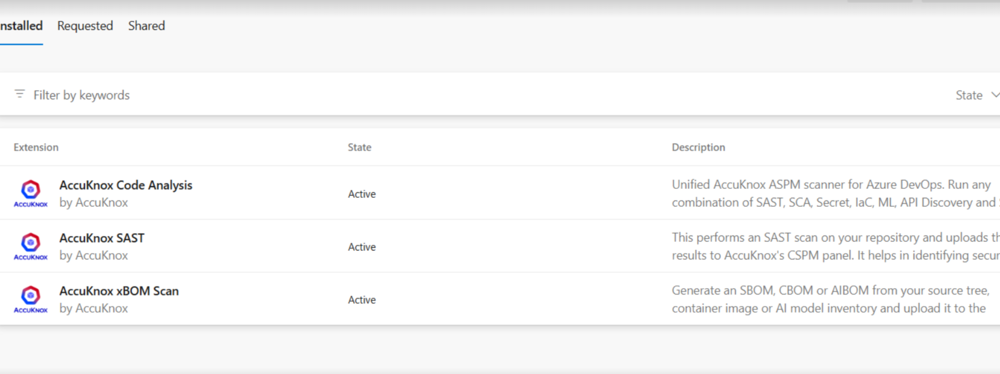

The `AccuKnox-xBOM@2` task is now available to every pipeline in that organization.

## Step 2. Generate an AccuKnox token

In AccuKnox, go to **Settings > Tokens** and click **Create**.

Enter a name, set an expiration period, and click **Generate**.


!!! warning "The token is shown once"
    Copy it before you leave the page. You store it as a secret pipeline variable in Step 4.

For the full walkthrough, see [How to Create Tokens](../how-to/how-to-create-tokens.md).

## Step 3. Create a label and a project

### Create the label

Labels group and filter BOM results across projects and pipeline runs. Go to **Settings > Labels**.

Click **+ Label**, enter a name such as `azure-xbom`, and click **Save**.

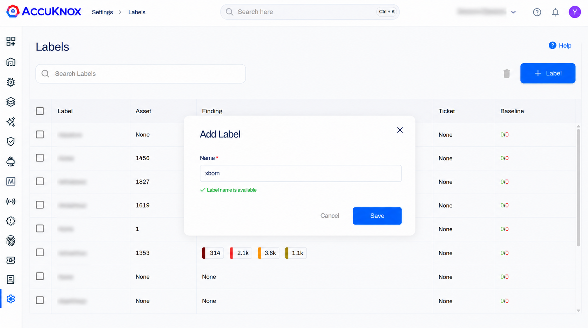

For the full walkthrough, see [How to Create Labels](../how-to/how-to-create-labels.md).

### Create the project

Every BOM upload targets one AccuKnox project. Go to **SBOM > Projects**.

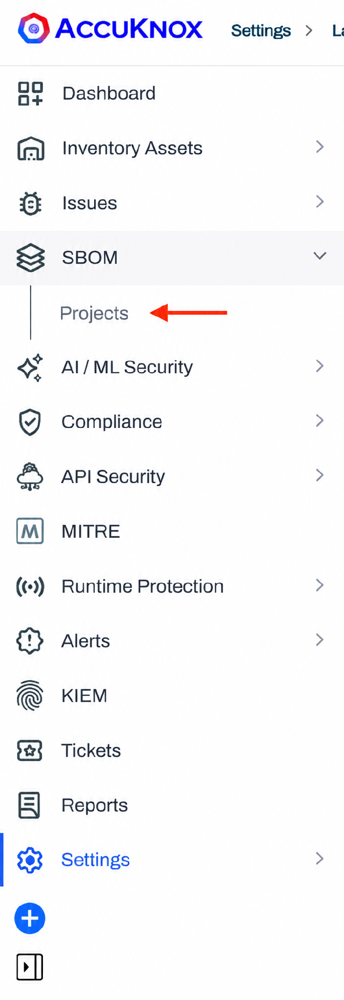

Click **+ Create** and fill in the form.

| Field | Value | Notes |
|---|---|---|
| Name | Your project name | Must match the `projectName` task input exactly |
| Description | Free text, for example `Azure DevOps xBOM` | Optional |
| Classifier | `application` | Must match `projectClassifier`. Valid values: `application`, `container`, `firmware`, `library`, `machine-learning-model` |
| Tags | For example `xbom` | Optional, useful for filtering across projects |

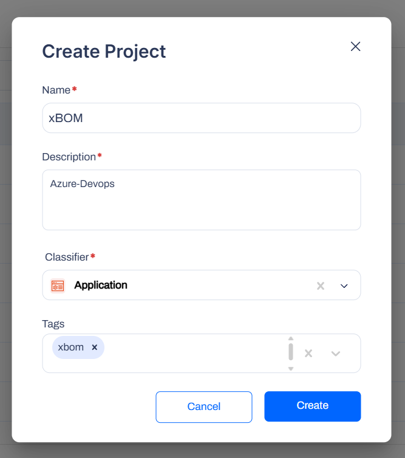{ width="440" }

!!! warning "A name mismatch fails the upload"
    `projectName` and `projectClassifier` in the pipeline must match this project exactly. The scan still runs, then the upload fails.

## Step 4. Add the pipeline variables

Go to **Project Settings > Pipelines > Library > + Variable Group** and add three variables.

| Variable | Secret | Value |
|---|---|---|
| `ACCUKNOX_ENDPOINT` | Recommended | AccuKnox hostname only, with no `https://`. For example `cspm.accuknox.com` |
| `ACCUKNOX_TOKEN` | Yes | The token from Step 2 |
| `ACCUKNOX_LABEL` | No | The label from Step 3 |

!!! warning "Mark the token as secret"
    Secret variables are masked in logs and must never be committed to source control. Anyone with edit access to the pipeline can still reach the secrets that pipeline consumes, so restrict who can edit it. See [Azure Pipelines secret variables](https://learn.microsoft.com/en-us/azure/devops/pipelines/process/variables?tabs=yaml%2Cbatch&view=azure-devops).

## Step 5. Add the task to your pipeline

Add the `AccuKnox-xBOM@2` task to `azure-pipelines.yml`. Pick the example that matches the BOM you want.

=== "SBOM from source"

    Scans a checked-out source tree and lists every package and dependency it finds.

    ```yaml
    trigger:
      - main

    pool:
      name: <agent-pool-name>

    steps:
      - checkout: self

      - task: AccuKnox-xBOM@2
        inputs:
          bomType: 'sbom'
          scanPath: '.'
          accuknoxToken: '$(ACCUKNOX_TOKEN)'
          accuknoxEndpoint: '$(ACCUKNOX_ENDPOINT)'
          accuknoxLabel: '$(ACCUKNOX_LABEL)'
          projectName: '<your-project-name>'
          projectClassifier: 'application'
    ```

=== "SBOM from a container image"

    Builds the image in the same job, then reads the image layers. `imageRef` takes precedence over `scanPath` when you supply both.

    ```yaml
    steps:
      - script: |
          IMAGE="myapp:$(Build.SourceVersion)"
          docker build -t "$IMAGE" .
          echo "##vso[task.setvariable variable=IMAGE]$IMAGE"
        displayName: 'Build image'

      - task: AccuKnox-xBOM@2
        inputs:
          bomType: 'sbom'
          imageRef: '$(IMAGE)'
          accuknoxToken: '$(ACCUKNOX_TOKEN)'
          accuknoxEndpoint: '$(ACCUKNOX_ENDPOINT)'
          accuknoxLabel: '$(ACCUKNOX_LABEL)'
          projectName: '<your-project-name>'
          projectClassifier: 'container'
    ```

=== "CBOM from source"

    Catalogues every cryptographic algorithm, key size, and library in the source.

    ```yaml
    - task: AccuKnox-xBOM@2
      inputs:
        bomType: 'cbom'
        scanPath: '.'
        accuknoxToken: '$(ACCUKNOX_TOKEN)'
        accuknoxEndpoint: '$(ACCUKNOX_ENDPOINT)'
        accuknoxLabel: '$(ACCUKNOX_LABEL)'
        projectName: '<your-project-name>'
        projectClassifier: 'application'
    ```

=== "AIBOM from HuggingFace"

    Captures provenance, model size, and license for one HuggingFace model. For a gated model, your HuggingFace account must have accepted the model license on huggingface.co first.

    ```yaml
    - task: AccuKnox-xBOM@2
      inputs:
        bomType: 'aibom'
        aibomSource: 'huggingface'
        aibomModel: 'google-bert/bert-base-uncased'
        accuknoxToken: '$(ACCUKNOX_TOKEN)'
        accuknoxEndpoint: '$(ACCUKNOX_ENDPOINT)'
        accuknoxLabel: '$(ACCUKNOX_LABEL)'
        projectName: '<your-project-name>'
        projectClassifier: 'machine-learning-model'
    ```

=== "AIBOM from AWS Bedrock"

    Inventories every foundation model available in one Bedrock region. Store `AWS_ACCESS_KEY_ID` and `AWS_SECRET_ACCESS_KEY` as secret pipeline variables.

    ```yaml
    - task: AccuKnox-xBOM@2
      inputs:
        bomType: 'aibom'
        aibomSource: 'bedrock'
        awsRegion: 'us-east-1'
        awsAccessKeyId: '$(AWS_ACCESS_KEY_ID)'
        awsSecretAccessKey: '$(AWS_SECRET_ACCESS_KEY)'
        accuknoxToken: '$(ACCUKNOX_TOKEN)'
        accuknoxEndpoint: '$(ACCUKNOX_ENDPOINT)'
        accuknoxLabel: '$(ACCUKNOX_LABEL)'
        projectName: '<your-project-name>'
        projectClassifier: 'machine-learning-model'
    ```

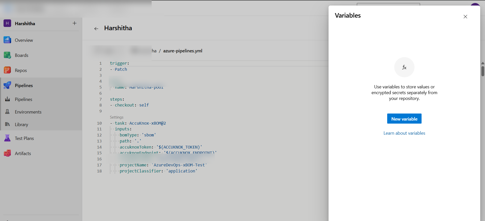

### Task inputs

| Input | Required | Default | Description |
|---|---|---|---|
| `bomType` | Yes | — | `sbom`, `cbom`, or `aibom` |
| `accuknoxEndpoint` | Yes | — | AccuKnox hostname with no `https://`, for example `cspm.accuknox.com` |
| `accuknoxToken` | Yes | — | AccuKnox API token. Always supply it through a secret variable |
| `accuknoxLabel` | Yes | — | Label used to group results in AccuKnox |
| `projectName` | Yes | — | Must match the project name created in Step 3 exactly |
| `projectClassifier` | Yes | — | `application`, `container`, `firmware`, `library`, or `machine-learning-model` |
| `scanPath` | No | `.` | Directory to scan for SBOM and CBOM source-tree scans |
| `imageRef` | No | — | Container image reference. Takes precedence over `scanPath` |
| `aibomSource` | No | `huggingface` | `huggingface` or `bedrock` |
| `aibomModel` | No | — | HuggingFace model ID. Required when `aibomSource` is `huggingface` |
| `awsRegion` | No | — | AWS region for the Bedrock inventory |
| `awsAccessKeyId` | No | — | AWS access key for Bedrock |
| `awsSecretAccessKey` | No | — | AWS secret key for Bedrock |
| `outputFile` | No | — | Path to write the BOM file locally |
| `knoxctlVersion` | No | `v0.10.0` | CLI release tag, downloaded at runtime |
| `skipTlsVerify` | No | `false` | Disable TLS verification on upload. Do not use this in production |

## Step 6. Run the pipeline

Trigger the pipeline manually or push a commit, then watch the logs for the AccuKnox xBOM task.

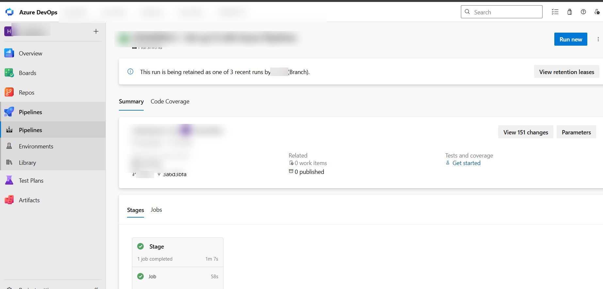

The BOM is attached to the run as an artifact named `<bomType>-<buildId>`. Open the run and go to **Related > Published artifacts** to download it.

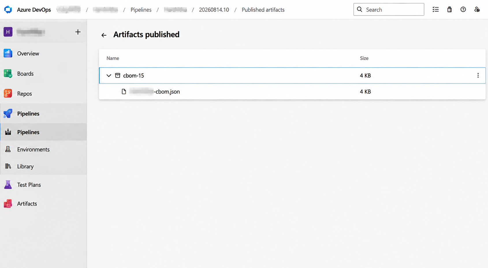

## View the results in AccuKnox

**Step 1.** Go to **SBOM > Projects** and open the project you created in Step 3. The entry shows the component count, the license count, and the Critical, High, Medium, and Low vulnerability breakdown.

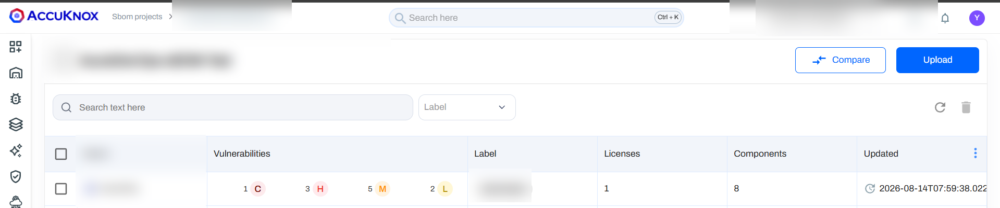

**Step 2.** Open **Components** to browse every package, cryptographic asset, or AI model discovered, and confirm coverage.

**Step 3.** Go to **Issues > Findings** and select **SBOM Findings**. Open any finding to see the severity, the CVE or GHSA identifier, the affected component and version, the description, and the remediation guidance.

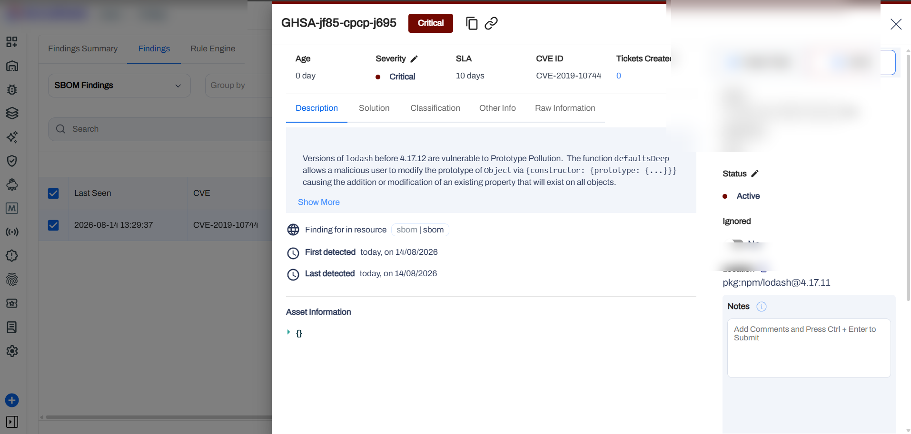

**Step 4.** Use the **Solution** tab for the fix, which is usually an upgrade to a patched version of the affected dependency.

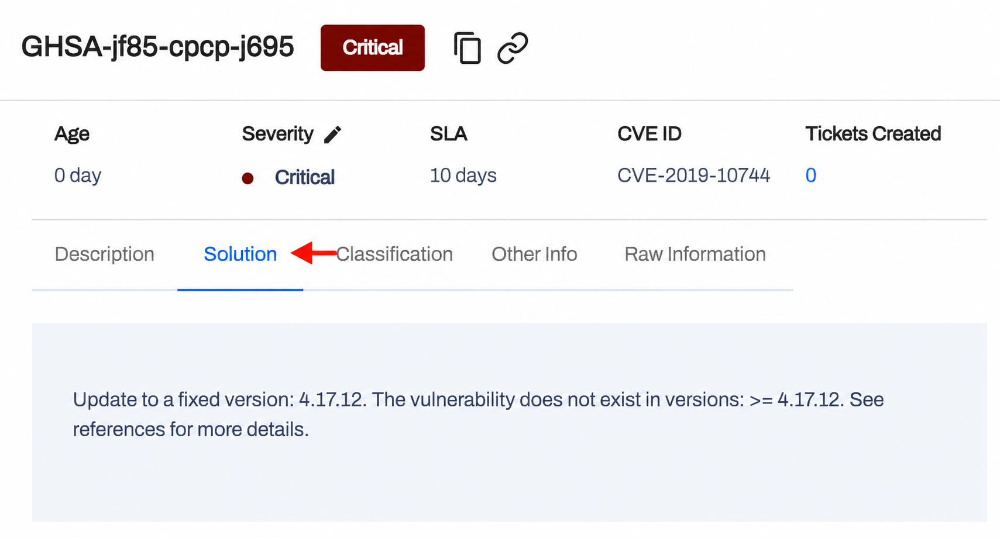

**Step 5.** Create a ticket straight from the finding. AccuKnox connects to Jira, ServiceNow, Freshservice, and other ticketing systems.

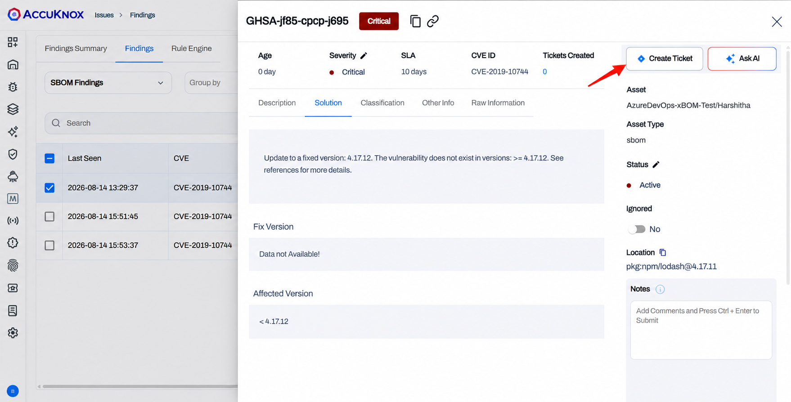

**Step 6.** Apply the fix, then rerun the pipeline. A fresh BOM uploads and the finding drops off the list.

## Related pages

- [xBOM overview](../getting-started/xbom-setup.md)
- [Unified code analysis with Azure DevOps](azure-unified-code-analysis.md)
- [Azure DevOps integration overview](azure-overview.md)
