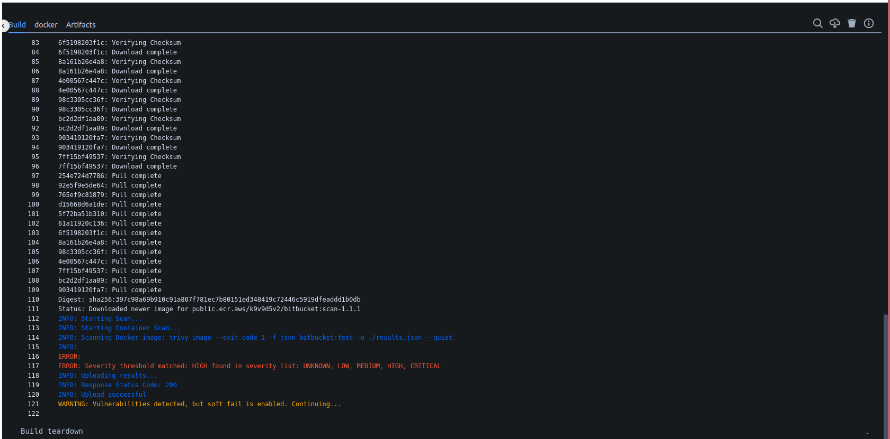
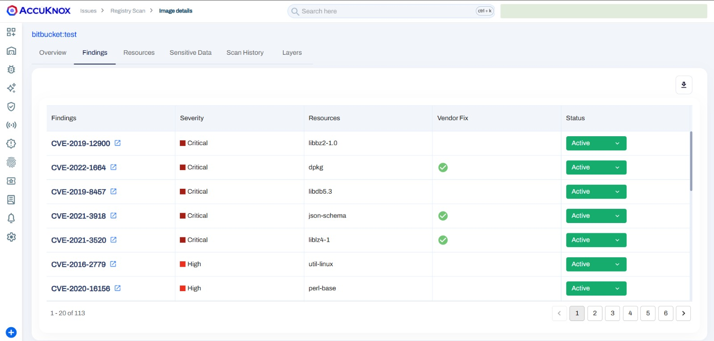
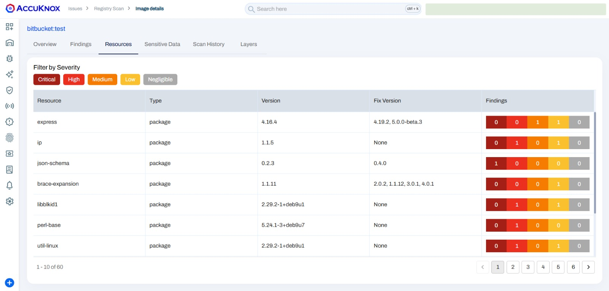

# Enhancing Docker Image Security in Bitbucket Pipelines

This guide demonstrates integrating AccuKnox into a Bitbucket pipeline to identify and remediate vulnerabilities in Docker images. Below, we compare the state of the pipeline before and after integrating AccuKnox, highlighting the security improvements.

## Scenario Before Integrating AccuKnox

### **Context**

The Docker image was built from a Dockerfile using an outdated base image (`node:15-slim`), which contained known security vulnerabilities. Using this old base image unintentionally introduced many security weaknesses to the Docker image.

**Dockerfile Example:**

`FROM node:15-slim`

### **Issues**

- The outdated base image had several known vulnerabilities.

- The Docker image was being pushed to the registry without any security validation.

## Steps for Integrating AccuKnox

**Step 1**: Log in to AccuKnox Navigate to Settings and select Tokens to create an AccuKnox token for forwarding scan results to SaaS. For details on generating tokens, refer to [How to Create Tokens](https://help.accuknox.com/how-to/how-to-create-tokens/?h=token "https://help.accuknox.com/how-to/how-to-create-tokens/?h=token").

**Step 2:** Add the following variables in your Bitbucket repository settings:. For details on configuring variables, refer to [How to Create CI/CD Variables in Bitbucket](https://support.atlassian.com/bitbucket-cloud/docs/variables-and-secrets/ "https://support.atlassian.com/bitbucket-cloud/docs/variables-and-secrets/").

1. **ACCUKNOX_TOKEN**: AccuKnox API token for authorization.

2. **ACCUKNOX_TENANT**: Your AccuKnox tenant ID.

3. **ACCUKNOX_ENDPOINT**: The AccuKnox API URL (e.g., [cspm.demo.accuknox.com](http://cspm.demo.accuknox.com/ "http://cspm.demo.accuknox.com/")).

4. **ACCUKNOX_LABEL**: The label for your scan.

**Step 3:** Configure Bitbucket Pipeline

Use the following YAML configuration for your `bitbucket-pipelines.yml` file:

```yaml
pipelines:
  branches:
    main:
    - step:
        name: AccuKnox Container Scan
        script:
          - pipe: accu-knox/scan:1.0.0
            variables:
              SCAN_TYPE: CONTAINER
              INPUT_SOFT_FAIL: "true"
              DOCKERFILE_CONTEXT: Dockerfile
              REPOSITORY_NAME: "${BITBUCKET_REPO_SLUG}"
              TAG: "${BITBUCKET_BUILD_NUMBER}"
              ACCUKNOX_TOKEN: ${ACCUKNOX_TOKEN}
              ACCUKNOX_TENANT: ${ACCUKNOX_TENANT}
              ACCUKNOX_ENDPOINT: ${ACCUKNOX_ENDPOINT}
              ACCUKNOX_LABEL: ${ACCUKNOX_LABEL}
        services:
          - docker
```

## Scenario After Integrating AccuKnox

**Enhancing the Workflow:** We then added a step to our Bitbucket workflow to run the AccuKnox vulnerability scan on the newly built Docker image.

### **Outcome**

- AccuKnox scanned the Docker image for vulnerabilities, and if critical issues were detected, the pipeline halted the deployment, preventing the image from being pushed to the registry.

- If no critical vulnerabilities were found, the image was approved and successfully pushed.



## View Results in AccuKnox SaaS

**Step 1:** Once the scan is complete, the user can go into the AccuKnox SaaS and navigate to Issues → RegistryScan where they can find their repository name and select it to see the associated findings


**Step 2:** After clicking on the image name, the user will be able to see the metadata for the image that was built during the workflow execution.


**Step 3:** In the `Vulnerabilities` section, the user can see the image-specific vulnerabilities in a list manner that contains relevant information. These findings will also be available in the `Issues → Vulnerabilities` section where the user can manage these findings with others.



**Step 4:** The `Resources` section contains information about packages and modules that were used to build the code base into a container image.



**Step 5:** The user can see the scan history of every scan that happened while triggering the workflow.


## **Conclusion**

Integrating AccuKnox into Bitbucket pipelines improves Docker image security by detecting and mitigating vulnerabilities during the development lifecycle. This ensures that only secure images are deployed, reducing risks in production environments.
