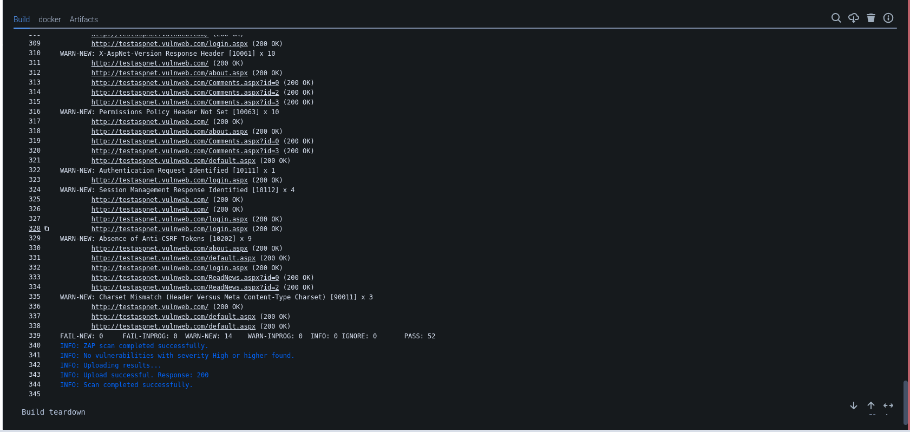

# Integrating DAST in BitBucket CI/CD Pipeline

This guide demonstrates how to integrate AccuKnox and Dynamic Application Security Testing (DAST) into a Bitbucket pipeline to identify and resolve vulnerabilities in a web application. We also support Authenticated and MFA DAST, ensuring comprehensive security coverage for your applications. Below, we outline the process and outcomes.

## Pre-requisites

- Access to Bitbucket Pipelines

- AccuKnox Platform Access

Steps for Integration[¶](https://help.accuknox.com/integrations/gitlab-dast/#steps-for-integration "https://help.accuknox.com/integrations/gitlab-dast/#steps-for-integration")

**Step 1**: Log in to AccuKnox Navigate to Settings and select Tokens to create an AccuKnox token for forwarding scan results to SaaS. For details on generating tokens, refer to [How to Create Tokens](https://help.accuknox.com/how-to/how-to-create-tokens/?h=token "https://help.accuknox.com/how-to/how-to-create-tokens/?h=token").

**Step 2:** Add the following variables in your Bitbucket repository settings: For details on configuring variables, refer to [How to Create CI/CD Variables in Bitbucket](https://support.atlassian.com/bitbucket-cloud/docs/variables-and-secrets/ "https://support.atlassian.com/bitbucket-cloud/docs/variables-and-secrets/").

| Input               | Description                                                                 | Default Value  |
|--------------------|-----------------------------------------------------------------------------|----------------|
| `TARGET_URL`        | The URL of the web application to scan.                                    | N/A (Required) |
| `SEVERITY_THRESHOLD`| The minimum severity level (e.g., High, Medium, Low) that will cause the pipeline to fail if present in the report. | High           |
| `DAST_SCAN_TYPE`    | Type of ZAP scan to run: `'baseline'` or `'full-scan'`.                    | baseline       |
| `SOFT_FAIL`         | Do not return an error code if there are failed checks.                    | true (boolean) |
| `ACCUKNOX_TENANT`   | The ID of the tenant associated with the CSPM panel.                       | N/A (Required) |
| `ACCUKNOX_ENDPOINT` | The URL of the CSPM panel to push the scan results to.                     | N/A (Required) |
| `ACCUKNOX_LABEL`    | The label created in AccuKnox SaaS for associating scan results.           | N/A (Required) |
| `ACCUKNOX_TOKEN`    | The token for authenticating with the CSPM panel.                          | N/A (Required) |

**Step 3:** Configure Bitbucket Pipeline

Use the following YAML configuration for your `bitbucket-pipelines.yml` file:

```yaml
pipelines:
  branches:
    main:
    - step:
        name: AccuKnox DAST Scan
        script:
          - pipe: accu-knox/scan:2.0.0
            variables:
              SCAN_TYPE: DAST
              TARGET_URL: "http://testaspnet.vulnweb.com/login.aspx"
              SEVERITY_THRESHOLD: High
              DAST_SCAN_TYPE: baseline
              ACCUKNOX_TOKEN: ${ACCUKNOX_TOKEN}
              ACCUKNOX_TENANT: ${ACCUKNOX_TENANT}
              ACCUKNOX_ENDPOINT: ${ACCUKNOX_ENDPOINT}
              ACCUKNOX_LABEL: ${ACCUKNOX_LABEL}
```

## Initial CI/CD Pipeline Without AccuKnox Scan

Initially, the CI/CD pipeline does not include the AccuKnox scan. When you push changes to the repository, no security checks are performed, potentially allowing security issues in the application.

## CI/CD Pipeline After AccuKnox Scan Integration

After integrating AccuKnox into your CI/CD pipeline, the next push triggers the CI/CD pipeline. The AccuKnox scan identifies potential vulnerabilities in the application.



## View Results in AccuKnox SaaS

**Step 1**: After the workflow completes, navigate to the AccuKnox SaaS dashboard.

**Step 2**: Go to **Issues** > **Findings** and select **DAST Findings** to see identified vulnerabilities.


**Step 3**: Click on a vulnerability to view more details.


**Step 4**: Fix the Vulnerability

Follow the instructions in the Solutions tab to fix the vulnerability


**Step 5**: Create a Ticket for Fixing the Vulnerability

Create a ticket in your issue-tracking system to address the identified vulnerability.


**Step 6**: Review Updated Results

- After fixing the vulnerability, rerun the CI/CD pipeline.

- Navigate to the AccuKnox SaaS dashboard and verify that the vulnerability has been resolved.

## Conclusion

Integrating AccuKnox and DAST into Bitbucket pipelines enhances application security by identifying vulnerabilities early in the CI/CD process. This seamless integration ensures secure deployments and reduces risks in production environments.
