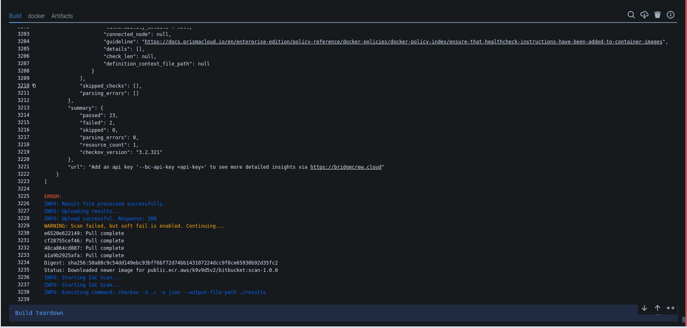

# Enhancing IaC Security in Bitbucket Pipelines

This guide explains how to integrate Infrastructure as Code (IaC) security into a Bitbucket pipeline using AccuKnox. Automated checks will identify vulnerabilities in IaC templates, and results will be forwarded to AccuKnox for detailed analysis and remediation. This ensures your infrastructure adheres to security best practices, reducing deployment risks.

## **Pre-requisites**

- Bitbucket Access

- AccuKnox Platform Access

## Steps for Integration

**Step 1**: Log in to AccuKnox Navigate to Settings and select Tokens to create an AccuKnox token for forwarding scan results to SaaS. For details on generating tokens, refer to [How to Create Tokens](https://help.accuknox.com/how-to/how-to-create-tokens/?h=token "https://help.accuknox.com/how-to/how-to-create-tokens/?h=token").

**Step 2:** Add the following variables in your Bitbucket repository settings:. For details on configuring variables, refer to [How to Create CI/CD Variables in Bitbucket](https://support.atlassian.com/bitbucket-cloud/docs/variables-and-secrets/ "https://support.atlassian.com/bitbucket-cloud/docs/variables-and-secrets/").

1. **ACCUKNOX_TOKEN**: AccuKnox API token for authorization.

2. **ACCUKNOX_TENANT**: Your AccuKnox tenant ID.

3. **ACCUKNOX_ENDPOINT**: The AccuKnox API URL (e.g., [cspm.demo.accuknox.com](http://cspm.demo.accuknox.com/ "http://cspm.demo.accuknox.com")).

4. **ACCUKNOX_LABEL**: The label for your scan.

**Step 3:** Configure Bitbucket Pipeline

| **Parameter**         | **Description**                                                                 | **Default Value**         |
|------------------------|---------------------------------------------------------------------------------|----------------------------|
| `FILE`                 | Specify a file for scanning (e.g., `.tf` for Terraform). Cannot be used with `DIRECTORY`. | `""` *(empty, optional)*   |
| `DIRECTORY`            | Directory with infrastructure code and/or package manager files to scan         | `"."` *(current directory)*|
| `COMPACT`              | Do not display code blocks in the output                                        | `true` *(boolean)*         |
| `QUIET`                | Display only failed checks                                                       | `true` *(boolean)*         |
| `FRAMEWORK`            | Run only on a specific infrastructure (e.g., Kubernetes or Terraform)            | `""` *(empty, optional)*   |
| `SOFT_FAIL`            | Do not return an error code if there are failed checks                           | `true` *(boolean)*         |
| `ACCUKNOX_TENANT`      | The ID of the tenant associated with the CSPM panel                              | **N/A (Required)**         |
| `ACCUKNOX_ENDPOINT`    | The URL of the CSPM panel to push the scan results to                            | **N/A (Required)**         |
| `ACCUKNOX_LABEL`       | The label created in AccuKnox SaaS for associating scan results                  | **N/A (Required)**         |
| `ACCUKNOX_TOKEN`       | The token for authenticating with the CSPM panel                                 | **N/A (Required)**         |

Use the following YAML configuration for your `bitbucket-pipelines.yml` file:

```yaml
pipelines:
  branches:
    main:
    - step:
        name: AccuKnox IaC Scan
        script:
          - pipe: accu-knox/scan:2.0.0
            variables:
              SCAN_TYPE: IAC
              DIRECTORY: "./"
              SOFT_FAIL: "true"
              ACCUKNOX_TOKEN: ${ACCUKNOX_TOKEN}
              ACCUKNOX_TENANT: ${ACCUKNOX_TENANT}
              ACCUKNOX_ENDPOINT: ${ACCUKNOX_ENDPOINT}
              ACCUKNOX_LABEL: ${ACCUKNOX_LABEL}
```

## **Initial CI/CD Pipeline Without AccuKnox IaC Scan**

Initially, the CI/CD pipeline does not include the AccuKnox IaC scan. When changes are pushed to the repository, no infrastructure security checks are performed, potentially allowing misconfigurations or vulnerabilities in the IaC code.

**CI/CD Pipeline After AccuKnox IaC Scan Integration**
Once the AccuKnox IaC scan is integrated into the CI/CD pipeline, every push triggers an IaC security scan. This scan identifies potential security vulnerabilities or misconfigurations in the infrastructure code, enhancing security before deployment. The findings are then sent to the AccuKnox platform.



## **View Results in AccuKnox SaaS**

**Step 1**: After the pipeline completes, navigate to the Accuknox SaaS dashboard.

**Step 2**: Go to **Issues** > **Findings** and select **IaC Findings** to see identified vulnerabilities.


**Step 3**: Click on a vulnerability to view more details and follow the instructions in the **Solutions** tab.


**Step 4**: For unresolved vulnerabilities, create a ticket in your issue tracking system.


**Step 5**: After fixing the vulnerabilities, rerun the CI/CD pipeline and verify that the issues have been resolved in the AccuKnox dashboard.

## **Conclusion**

Integrating IaC scanning with AccuKnox in a Bitbucket pipeline strengthens infrastructure security. By detecting vulnerabilities early, this integration ensures a secure and reliable deployment environment.
