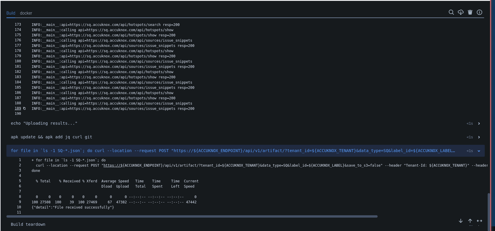
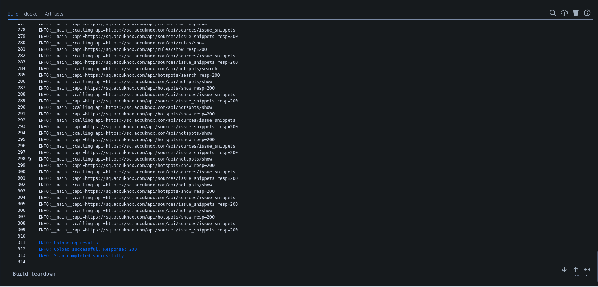
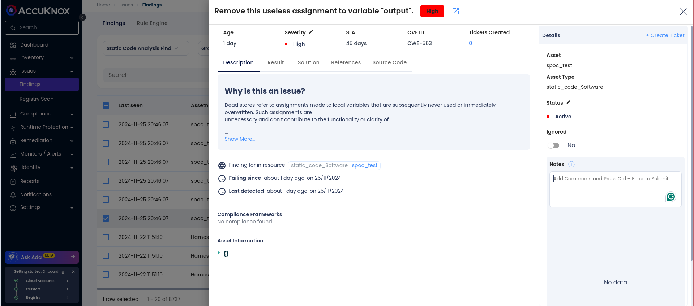
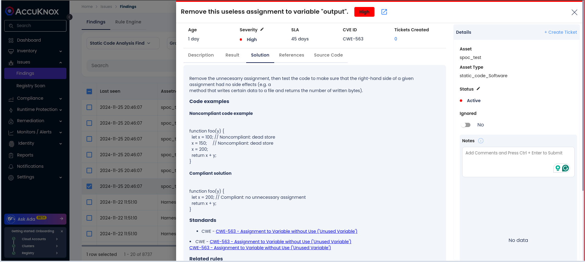

# Integrating SAST in BitBucket CI/CD Pipeline

This guide explains how to integrate AccuKnox into your Bitbucket Pipelines to enhance code security using SonarQube for SAST scanning. It identifies potential vulnerabilities and sends the results to AccuKnox for further analysis and remediation.

## Pre-requisites

- Access to Bitbucket Pipelines

- AccuKnox Platform Access

- SonarQube Access

## Steps for Integration

**Step 1**: Log in to AccuKnox Navigate to Settings and select Tokens to create an AccuKnox token for forwarding scan results to SaaS. For details on generating tokens, refer to [How to Create Tokens](https://help.accuknox.com/how-to/how-to-create-tokens/?h=token "https://help.accuknox.com/how-to/how-to-create-tokens/?h=token").

**Step 2:** Add the following variables in your Bitbucket repository settings:. For details on configuring variables, refer to [How to Create CI/CD Variables in Bitbucket](https://support.atlassian.com/bitbucket-cloud/docs/variables-and-secrets/ "https://support.atlassian.com/bitbucket-cloud/docs/variables-and-secrets/").

1. **ACCUKNOX_TOKEN**: AccuKnox API token for authorization.

2. **ACCUKNOX_TENANT**: Your AccuKnox tenant ID.

3. **ACCUKNOX_ENDPOINT**: The AccuKnox API URL (e.g., [cspm.demo.accuknox.com](http://cspm.demo.accuknox.com/ "http://cspm.demo.accuknox.com")).

4. **ACCUKNOX_LABEL**: The label for your scan.

5. **SONAR_TOKEN**: Your SonarQube API token.

6. **SONAR_HOST_URL**: The URL of your SonarQube server.

7. **SONAR_PROJECT_KEY**: The project key for your SonarQube project.

**Step 3:** Configure Bitbucket Pipeline

Use the following YAML configuration for your `bitbucket-pipelines.yml` file:

```yaml
image: maven:3.3.9

pipelines:
  branches:
    main:
    - step:
        name: SonarQube analysis
        script:
          - pipe: sonarsource/sonarqube-scan:2.0.1
            variables:
              SONAR_HOST_URL: ${SONAR_HOST_URL}
              SONAR_TOKEN: ${SONAR_TOKEN}
              EXTRA_ARGS: '-Dsonar.projectKey=${SONAR_PROJECT_KEY}'
    - step:
        name: Accuknox SAST
        script:
          - echo "Starting SAST scan..."
          - |
            docker run --rm -e SQ_PROJECTS="${SONAR_PROJECT_KEY}" -e SQ_URL=${SONAR_HOST_URL} -e SQ_AUTH_TOKEN=${SONAR_TOKEN} -e REPORT_PATH=/app/data/ -v $PWD:/app/data/ accuknox/sastjob:latest
          - echo "Uploading results..."
          - apk update && apk add jq curl git
          - |
            for file in `ls -1 SQ-*.json`; do
              curl --location --request POST "https://${ACCUKNOX_ENDPOINT}/api/v1/artifact/?tenant_id=${ACCUKNOX_TENANT}&data_type=SQ&label_id=${ACCUKNOX_LABEL}&save_to_s3=false" --header "Tenant-Id: ${ACCUKNOX_TENANT}" --header "Authorization: Bearer ${ACCUKNOX_TOKEN}" --form "file=@\"$file\""
            done
        services:
          - docker
```

## Initial CI/CD Pipeline Without AccuKnox Scan

Initially, the CI/CD pipeline does not include the AccuKnox scan. Vulnerabilities in the code could go unnoticed without security checks.

## CI/CD Pipeline After AccuKnox Integration

After integrating AccuKnox into the pipeline, pushing changes triggers the SonarQube scan, which sends its results to AccuKnox. AccuKnox helps identify potential code vulnerabilities.



## View Results in AccuKnox SaaS

**Step 1**: After the workflow completes, navigate to the AccuKnox SaaS dashboard.

**Step 2**: Go to **Issues** > **Findings** and select **SAST Findings** to see identified vulnerabilities.



**Step 3**: Click on a vulnerability to view more details.



**Step 4**: Fix the Vulnerability

Follow the instructions in the Solutions tab to fix the vulnerability



**Step 5**: Create a Ticket for Fixing the Vulnerability

Create a ticket in your issue-tracking system to address the identified vulnerability.


**Step 6**: Review Updated Results

- After fixing the vulnerability, rerun the CI/CD pipeline.

- Navigate to the AccuKnox SaaS dashboard and verify that the vulnerability has been resolved.

## Conclusion

Integrating SonarQube with AccuKnox in Bitbucket Pipelines helps detect and remediate vulnerabilities early in the development lifecycle, ensuring a secure deployment environment.
