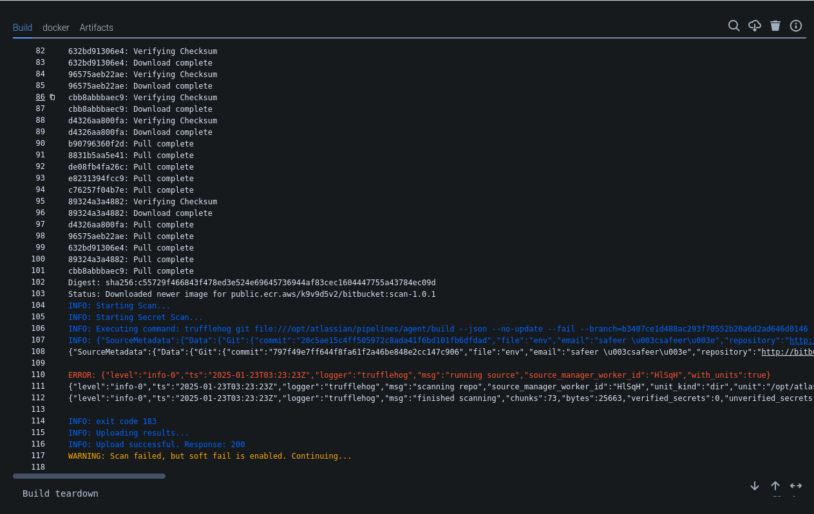
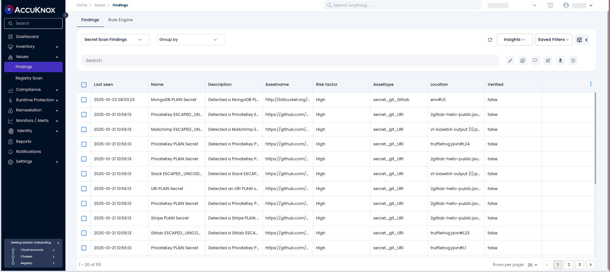
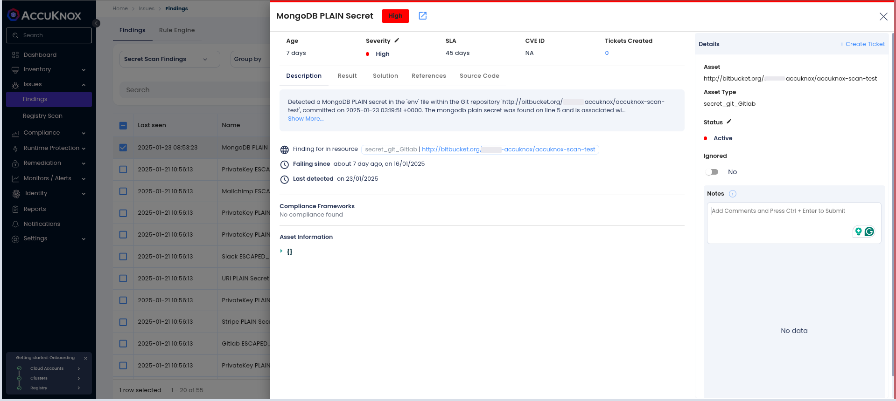
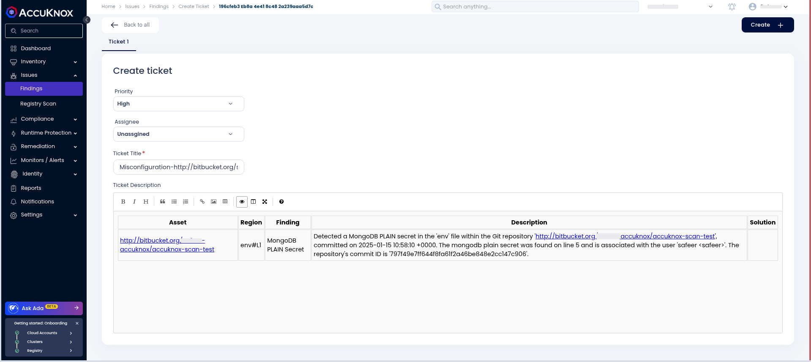

# Bitbucket Secret Scan

This guide explains integrating **AccuKnox Secret Scanning** into your **Bitbucket CI/CD Pipeline**. The integration enhances code security by detecting hard-coded secrets and sensitive information in your repositories. It then uploads the results to the AccuKnox SaaS platform for further analysis and remediation.

## Pre-requisites

To integrate AccuKnox Secret Scanning, ensure you have:

- Access to **Bitbucket Pipelines**.

- An active **AccuKnox Platform** account.

## Steps for Integration

### Step 1: Log in to AccuKnox

1.  Log in to the **AccuKnox SaaS** platform.

2.  Navigate to **Settings > Tokens** and generate a token to enable scan result uploads. For details on generating tokens, refer to [How to Create Tokens](https://help.accuknox.com/how-to/how-to-create-tokens/?h=token "https://help.accuknox.com/how-to/how-to-create-tokens/?h=token").

### Step 2: Configure CI/CD Variables

3.  Go to your **Bitbucket repository settings**.

4.  Add the following variables, for details on configuring variables, refer to [How to Create CI/CD Variables in Bitbucket](https://support.atlassian.com/bitbucket-cloud/docs/variables-and-secrets/ "https://support.atlassian.com/bitbucket-cloud/docs/variables-and-secrets/").

    - **ACCUKNOX_TOKEN**: Your AccuKnox API token.

    - **ACCUKNOX_TENANT**: Your AccuKnox tenant ID.

    - **ACCUKNOX_ENDPOINT**: Your AccuKnox API endpoint.

    - **ACCUKNOX_LABEL**: Label for scan results.

### Step 3: Update the `bitbucket-pipelines.yml` File

| **Input Value**         | **Description**                                                                      | **Default Value**     |
|-------------------------|--------------------------------------------------------------------------------------|------------------------|
| `RESULTS`               | Specifies which type(s) of results to output: `verified`, `unknown`, `unverified`, `filtered_unverified`. Defaults to all types. | `""`                   |
| `BRANCH`                | The branch to scan. Use `all-branches` to scan all branches.                         | `""`                   |
| `EXCLUDE_PATHS`         | Paths to exclude from the scan.                                                      | `""`                   |
| `ADDITIONAL_ARGUMENTS`  | Extra parameters for secret scanning.                                                | `""`                   |
| `SOFT_FAIL`             | Do not return an error code if secrets are found.                                    | `true`                 |
| `ACCUKNOX_TOKEN`        | The token for authenticating with the CSPM panel.                                    | N/A (Required)         |
| `ACCUKNOX_TENANT`       | The ID of the tenant associated with the CSPM panel.                                 | N/A (Required)         |
| `ACCUKNOX_ENDPOINT`     | The URL of the CSPM panel to push the scan results to.                               | N/A (Required)         |
| `ACCUKNOX_LABEL`        | The label created in AccuKnox SaaS for associating scan results.                     | N/A (Required)         |

Add the following secret scanning configuration to your pipeline:

```yaml
pipelines:
  branches:
    main:
    - step:
        name: AccuKnox Secret Scan
        script:
          - pipe: accu-knox/scan:2.0.0
            variables:
              SCAN_TYPE: SECRET
              SOFT_FAIL: "true"
              ACCUKNOX_TOKEN: ${ACCUKNOX_TOKEN}
              ACCUKNOX_TENANT: ${ACCUKNOX_TENANT}
              ACCUKNOX_ENDPOINT: ${ACCUKNOX_ENDPOINT}
              ACCUKNOX_LABEL: ${ACCUKNOX_LABEL}
```

### Step 4: Commit and Push Changes

- Commit the updated `bitbucket-pipelines.yml` file to your repository.

- Push the changes to trigger the pipeline.

## Initial CI/CD Pipeline Without AccuKnox Secret Scan

Before integrating AccuKnox Secret Scanning, your pipeline might lack any security checks for detecting hardcoded secrets, potentially exposing sensitive information.

## CI/CD Pipeline After AccuKnox Secret Scan Integration

Once the AccuKnox Secret Scanning is integrated into the CI/CD pipeline, every push triggers a secret scan. This scan detects hardcoded secrets and sensitive information in the code, ensuring immediate identification and remediation. The findings are then sent to the AccuKnox platform. Only the findings details are sent to the AccuKnox platform, not the secrets themselves.



## View Results in AccuKnox SaaS

### Step 1: Navigate to the Dashboard

Go to **Issues** > **Findings** and select **Secret Scan Findings**.



### Step 2: Review Detected Secrets

Examine the list of identified hardcoded secrets an d sensitive information.



### Step 3: Resolve Findings

Create a ticket in your issue-tracking system for each finding, recommending rotating the exposed secret and using a secure secret management solution for handling secrets. Once the issue is resolved, mark it as fixed in the AccuKnox platform.



## Conclusion

Integrating **AccuKnox Secret Scanning** into your Bitbucket pipeline provides an essential layer of security, identifying and mitigating risks early in the development lifecycle. This proactive approach ensures that sensitive information is safeguarded, contributing to a more secure codebase.
