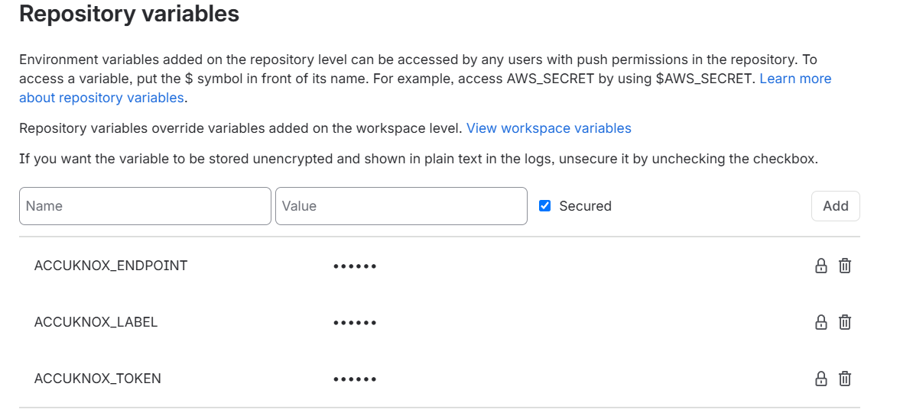
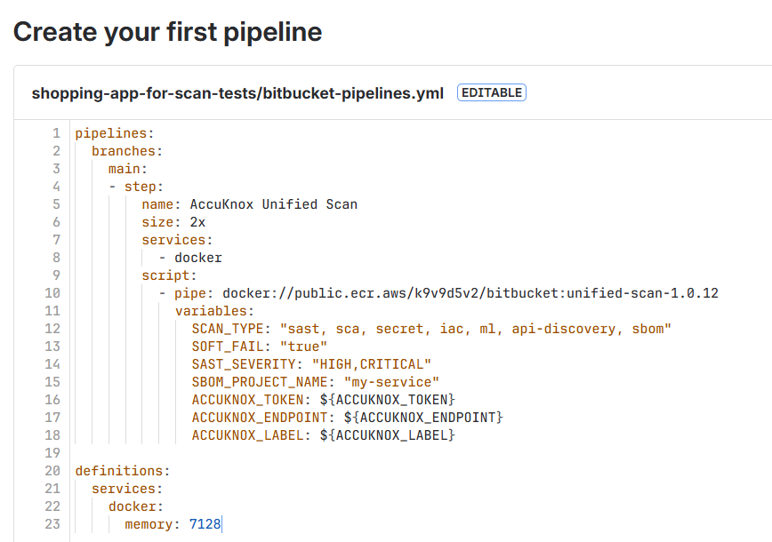
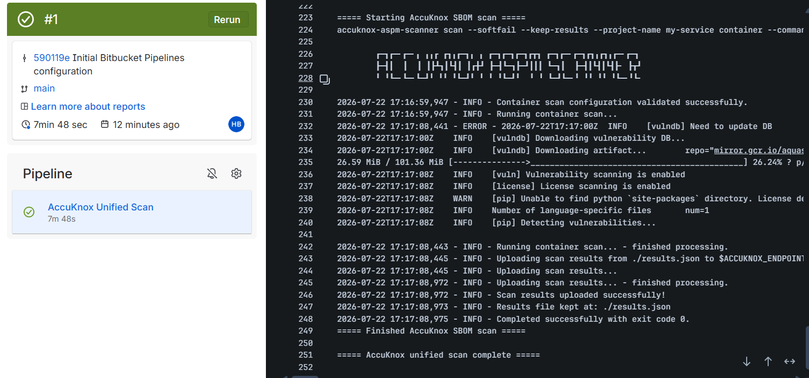
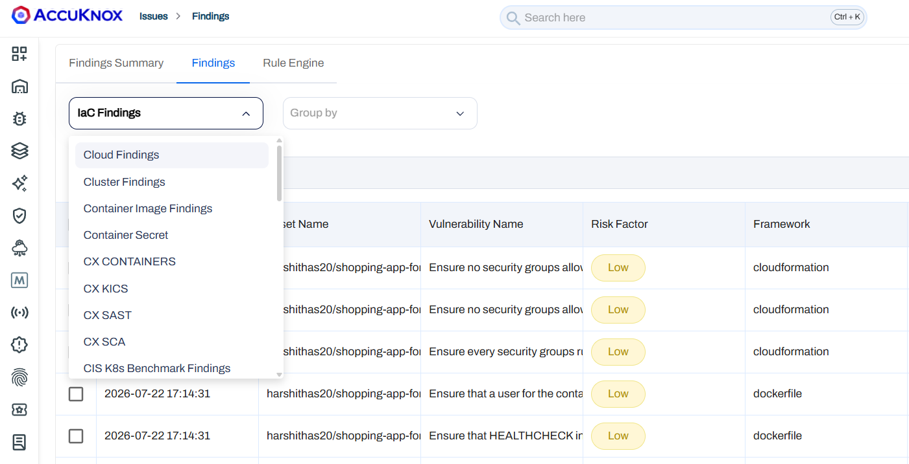
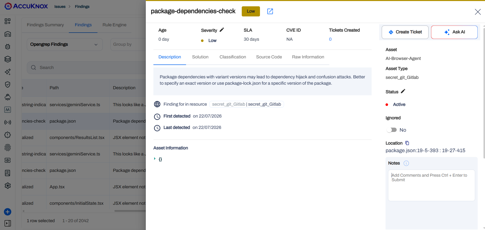

# Running Unified Scans with AccuKnox in a Bitbucket Pipeline

## Overview

This guide demonstrates how to integrate the **AccuKnox Unified Scan** pipe into a Bitbucket Pipelines workflow. Instead of adding a separate pipe step per scan, you list the scans you want in the `SCAN_TYPE` variable, and the pipe runs them sequentially in a single step, pushing all results to the AccuKnox SaaS panel for security analysis and remediation.

### Supported Scans

| Scan | `SCAN_TYPE` token |
|------|--------------------|
| SAST | `sast` |
| SCA | `sca` |
| Secret | `secret` |
| IaC | `iac` |
| ML Static Scan | `ml` |
| SBOM | `sbom` |

## Prerequisites

- A Bitbucket repository with Pipelines enabled.
- An AccuKnox SaaS account.

## Integration Steps

**Step 1: Generate an AccuKnox API Token**

1. Log in to AccuKnox and navigate to **Settings → Tokens**.
2. Create an API token for forwarding scan results.


**Step 2: Create an AccuKnox Label**

Navigate to **Dashboard → Labels** and create a label, you'll use this value for the `ACCUKNOX_LABEL` repository variable.


**Step 3: Configure Bitbucket Repository Variables**

Define the following variables under **Repository Settings → Repository variables**. Mark each as **Secured** so values are masked in the pipeline logs.

| Variable | Description |
|----------|-------------|
| `ACCUKNOX_TOKEN` | AccuKnox API token for authorization |
| `ACCUKNOX_ENDPOINT` | The AccuKnox API URL (for example `cspm.demo.accuknox.com`) |
| `ACCUKNOX_LABEL` | The label created above |



### Common Variables

These apply to every scan.

| Variable | Description |
|----------|-------------|
| `SCAN_TYPE` | Comma or space separated list of scans to run: `sast`, `sca`, `secret`, `iac`, `ml`, `sbom`. Required. |
| `ACCUKNOX_ENDPOINT` | URL of the AccuKnox Console to push scan results to. Required. |
| `ACCUKNOX_TOKEN` | Token for authenticating with the AccuKnox Console. Required. |
| `ACCUKNOX_LABEL` | Label created in AccuKnox SaaS for associating scan results. Required. |
| `SOFT_FAIL` | Do not return a non-zero exit code if a scan finds issues (applies to all scans). |

Repository metadata (repo URL, branch, commit, pipeline ID, job URL) is derived automatically from Bitbucket's predefined variables. Override the derived values if needed with `REPOSITORY_URL`, `COMMIT_REF`, `COMMIT_SHA`, `PIPELINE_ID`, `JOB_URL`, `REPO_FULL_NAME`.

**Step 4: Define the Bitbucket Pipeline**

Create a `bitbucket-pipelines.yml` file at the root of your repository:

```yaml
pipelines:
  branches:
    main:
      - step:
          name: AccuKnox Unified Scan
          size: 2x
          services:
            - docker
          script:
            - pipe: docker://public.ecr.aws/k9v9d5v2/bitbucket:unified-scan-1.0.12
              variables:
                SCAN_TYPE: "sast, sca, secret, iac"
                SOFT_FAIL: "true"
                ACCUKNOX_TOKEN: ${ACCUKNOX_TOKEN}
                ACCUKNOX_ENDPOINT: ${ACCUKNOX_ENDPOINT}
                ACCUKNOX_LABEL: ${ACCUKNOX_LABEL}

definitions:
  services:
    docker:
      memory: 7128
```

!!! note
    The `docker` service is required, every scan runs in `--container-mode`, which pulls the per-tool scanner images at runtime.



## Per-Scan Variables

Only the variables for the scans you list in `SCAN_TYPE` are used. Each scan below shows an example step followed by its variables. All examples require the `docker` service and the common `ACCUKNOX_*` variables.

### SAST

```yaml
- step:
    name: AccuKnox SAST
    services:
      - docker
    script:
      - pipe: docker://public.ecr.aws/k9v9d5v2/bitbucket:unified-scan-1.0.12
        variables:
          SCAN_TYPE: "sast"
          SAST_SEVERITY: "HIGH,CRITICAL"
          ACCUKNOX_TOKEN: ${ACCUKNOX_TOKEN}
          ACCUKNOX_ENDPOINT: ${ACCUKNOX_ENDPOINT}
          ACCUKNOX_LABEL: ${ACCUKNOX_LABEL}
```

| Variable | Description |
|----------|-------------|
| `SAST_COMMAND` | Command text passed to `--command` (target to scan). |
| `SAST_SEVERITY` | Comma-separated severities: `LOW`, `MEDIUM`, `HIGH`, `CRITICAL`. |

### SCA

```yaml
- step:
    name: AccuKnox SCA
    services:
      - docker
    script:
      - pipe: docker://public.ecr.aws/k9v9d5v2/bitbucket:unified-scan-1.0.12
        variables:
          SCAN_TYPE: "sca"
          SCA_SEVERITY: "HIGH,CRITICAL"
          ACCUKNOX_TOKEN: ${ACCUKNOX_TOKEN}
          ACCUKNOX_ENDPOINT: ${ACCUKNOX_ENDPOINT}
          ACCUKNOX_LABEL: ${ACCUKNOX_LABEL}
```

| Variable | Description |
|----------|-------------|
| `SCA_COMMAND` | Command text passed to `--command` (for example `fs .`). |
| `SCA_SEVERITY` | Comma-separated severities to fail on: `UNKNOWN`, `LOW`, `MEDIUM`, `HIGH`, `CRITICAL`. |

### Secret

```yaml
- step:
    name: AccuKnox Secret
    services:
      - docker
    script:
      - pipe: docker://public.ecr.aws/k9v9d5v2/bitbucket:unified-scan-1.0.12
        variables:
          SCAN_TYPE: "secret"
          ACCUKNOX_TOKEN: ${ACCUKNOX_TOKEN}
          ACCUKNOX_ENDPOINT: ${ACCUKNOX_ENDPOINT}
          ACCUKNOX_LABEL: ${ACCUKNOX_LABEL}
```

| Variable | Description |
|----------|-------------|
| `SECRET_COMMAND` | Command text passed to `--command` (for example `git file://.` or `filesystem .`). |
| `SECRET_ADDITIONAL_ARGUMENTS` | Extra args appended to the secret command (for example `--results verified --branch main`). |

### IaC

```yaml
- step:
    name: AccuKnox IaC
    services:
      - docker
    script:
      - pipe: docker://public.ecr.aws/k9v9d5v2/bitbucket:unified-scan-1.0.12
        variables:
          SCAN_TYPE: "iac"
          IAC_FRAMEWORK: "Kubernetes,Terraform"
          ACCUKNOX_TOKEN: ${ACCUKNOX_TOKEN}
          ACCUKNOX_ENDPOINT: ${ACCUKNOX_ENDPOINT}
          ACCUKNOX_LABEL: ${ACCUKNOX_LABEL}
```

| Variable | Description |
|----------|-------------|
| `IAC_COMMAND` | Raw command text passed to `--command`. When set, overrides the individual `IAC_*` variables. |
| `IAC_DIRECTORY` | Directory with infrastructure code to scan. |
| `IAC_FILE` | Specific file to scan; cannot be used with `IAC_DIRECTORY`. |
| `IAC_FRAMEWORK` | Restrict to specific framework(s), e.g. `Kubernetes,Terraform` (comma-separated). |
| `IAC_COMPACT` | Do not display code blocks in output. |
| `IAC_QUIET` | Display only failed checks. |

### ML Static Scan

```yaml
- step:
    name: AccuKnox ML Scan
    services:
      - docker
    script:
      - pipe: docker://public.ecr.aws/k9v9d5v2/bitbucket:unified-scan-1.0.12
        variables:
          SCAN_TYPE: "ml"
          ACCUKNOX_TOKEN: ${ACCUKNOX_TOKEN}
          ACCUKNOX_ENDPOINT: ${ACCUKNOX_ENDPOINT}
          ACCUKNOX_LABEL: ${ACCUKNOX_LABEL}
```

| Variable | Description |
|----------|-------------|
| `ML_COMMAND` | Command text passed to `--command`. |
| `ML_MODEL_NAME` | Custom collector/model identifier (optional). |
| `ML_SOURCE_TYPE` | Source type for metadata. |

### SBOM

SBOM supports two targets, a filesystem path or a container image. `SBOM_PROJECT_NAME` is required for both.

!!! note
    **Prerequisite.** To associate SBOM data with the correct entity, create a **Project** in the AccuKnox Console first. Go to **SBOM → Projects → New Project**. Use the name as `SBOM_PROJECT_NAME`, and select **Container** as the classifier for an image SBOM, or **Application** for a filesystem SBOM.

**Filesystem SBOM:**

```yaml
- step:
    name: AccuKnox SBOM (filesystem)
    services:
      - docker
    script:
      - pipe: docker://public.ecr.aws/k9v9d5v2/bitbucket:unified-scan-1.0.12
        variables:
          SCAN_TYPE: "sbom"
          SBOM_PROJECT_NAME: "my-service"
          SBOM_SCAN_TYPE: "filesystem"
          SBOM_SCAN_PATH: "."
          ACCUKNOX_TOKEN: ${ACCUKNOX_TOKEN}
          ACCUKNOX_ENDPOINT: ${ACCUKNOX_ENDPOINT}
          ACCUKNOX_LABEL: ${ACCUKNOX_LABEL}
```

**Image SBOM.** `SBOM_IMAGE_REF` is required when `SBOM_SCAN_TYPE` is `image`:

```yaml
- step:
    name: AccuKnox SBOM (image)
    services:
      - docker
    script:
      - pipe: docker://public.ecr.aws/k9v9d5v2/bitbucket:unified-scan-1.0.12
        variables:
          SCAN_TYPE: "sbom"
          SBOM_PROJECT_NAME: "my-service"
          SBOM_SCAN_TYPE: "image"
          SBOM_IMAGE_REF: "my-service:latest"
          ACCUKNOX_TOKEN: ${ACCUKNOX_TOKEN}
          ACCUKNOX_ENDPOINT: ${ACCUKNOX_ENDPOINT}
          ACCUKNOX_LABEL: ${ACCUKNOX_LABEL}
```

| Variable | Description |
|----------|-------------|
| `SBOM_PROJECT_NAME` | Project name (AccuKnox entity). Required for `sbom`. |
| `SBOM_SCAN_TYPE` | Target type: `image` or `filesystem`. |
| `SBOM_IMAGE_REF` | Full registry image reference (required when `SBOM_SCAN_TYPE` is `image`). |
| `SBOM_SCAN_PATH` | Filesystem path (used when `SBOM_SCAN_TYPE` is `filesystem`). |
| `SBOM_COMMAND` | Raw command text passed to `--command`. When set, overrides the other SBOM variables. |
| `SBOM_SEVERITY` | Comma-separated severities: `UNKNOWN`, `LOW`, `MEDIUM`, `HIGH`, `CRITICAL`. |

## Example Configurations

### Run Every Scan in One Step

```yaml
pipelines:
  branches:
    main:
      - step:
          name: AccuKnox Unified Scan
          size: 2x
          services:
            - docker
          script:
            - pipe: docker://public.ecr.aws/k9v9d5v2/bitbucket:unified-scan-1.0.12
              variables:
                SCAN_TYPE: "sast, sca, secret, iac, ml, sbom"
                SOFT_FAIL: "true"
                SAST_SEVERITY: "HIGH,CRITICAL"
                SBOM_PROJECT_NAME: "my-service"
                ACCUKNOX_TOKEN: ${ACCUKNOX_TOKEN}
                ACCUKNOX_ENDPOINT: ${ACCUKNOX_ENDPOINT}
                ACCUKNOX_LABEL: ${ACCUKNOX_LABEL}

definitions:
  services:
    docker:
      memory: 7128
```

### SBOM of a Built Image

```yaml
- step:
    name: AccuKnox SBOM
    services:
      - docker
    script:
      - docker build -t my-service:$BITBUCKET_BUILD_NUMBER .
      - pipe: docker://public.ecr.aws/k9v9d5v2/bitbucket:unified-scan-1.0.12
        variables:
          SCAN_TYPE: "sbom"
          SBOM_SCAN_TYPE: "image"
          SBOM_IMAGE_REF: "my-service:$BITBUCKET_BUILD_NUMBER"
          SBOM_PROJECT_NAME: "my-service"
          ACCUKNOX_TOKEN: ${ACCUKNOX_TOKEN}
          ACCUKNOX_ENDPOINT: ${ACCUKNOX_ENDPOINT}
          ACCUKNOX_LABEL: ${ACCUKNOX_LABEL}
```

### Keeping Result Files as Build Artifacts

The secret, SAST, and SBOM scans keep their result files (`results*.json`, `results*.jsonl`) in the clone directory. Capture them with a Bitbucket artifacts block:

```yaml
- step:
    name: AccuKnox Unified Scan
    services:
      - docker
    script:
      - pipe: docker://public.ecr.aws/k9v9d5v2/bitbucket:unified-scan-1.0.12
        variables:
          SCAN_TYPE: "secret, sast"
          ACCUKNOX_TOKEN: ${ACCUKNOX_TOKEN}
          ACCUKNOX_ENDPOINT: ${ACCUKNOX_ENDPOINT}
          ACCUKNOX_LABEL: ${ACCUKNOX_LABEL}
    artifacts:
      - results*.json
      - results*.jsonl
```

## Pipeline Execution

**Before AccuKnox Integration**

Initially, there are no centralized security checks in place, and even where individual scans are integrated, vulnerabilities can go unnoticed since they must be reviewed manually within pipeline logs.

**After AccuKnox Integration**

With Unified Scan integrated, results from every selected scan type are automatically forwarded to AccuKnox for centralized risk assessment, prioritization, and remediation tracking. Commit the pipeline file to trigger the run, then monitor progress under **Pipelines** in the repository sidebar.



## Viewing Results in AccuKnox

**Step 1**: Log in to the AccuKnox SaaS dashboard.

**Step 2**: Go to **Issues → Findings** and select the finding type that matches the scan you ran (for example, IaC Findings, Opengrep Findings for SAST, or the equivalent view for SCA, Secret, or ML). For SBOM, go to **SBOM → Projects** and open the project named in `SBOM_PROJECT_NAME`.



**Step 3**: Click on a finding to see the full detail.



**Step 4**: Fix the finding using the instructions in the Solutions tab, or use Ask AI for a suggested fix.

**Step 5**: Create a ticket in your issue tracking system to assign and track the fix.

**Step 6**: Review the updated results. After the fix ships, rerun your Bitbucket pipeline, then check the AccuKnox SaaS dashboard to confirm the finding is resolved.

## Conclusion

Integrating Unified Scan with AccuKnox in Bitbucket Pipelines consolidates SAST, SCA, Secrets, IaC, ML, and SBOM scanning into a single pipe step. You get centralized monitoring, early detection across the full application security surface, and actionable findings you can act on before code ships.
