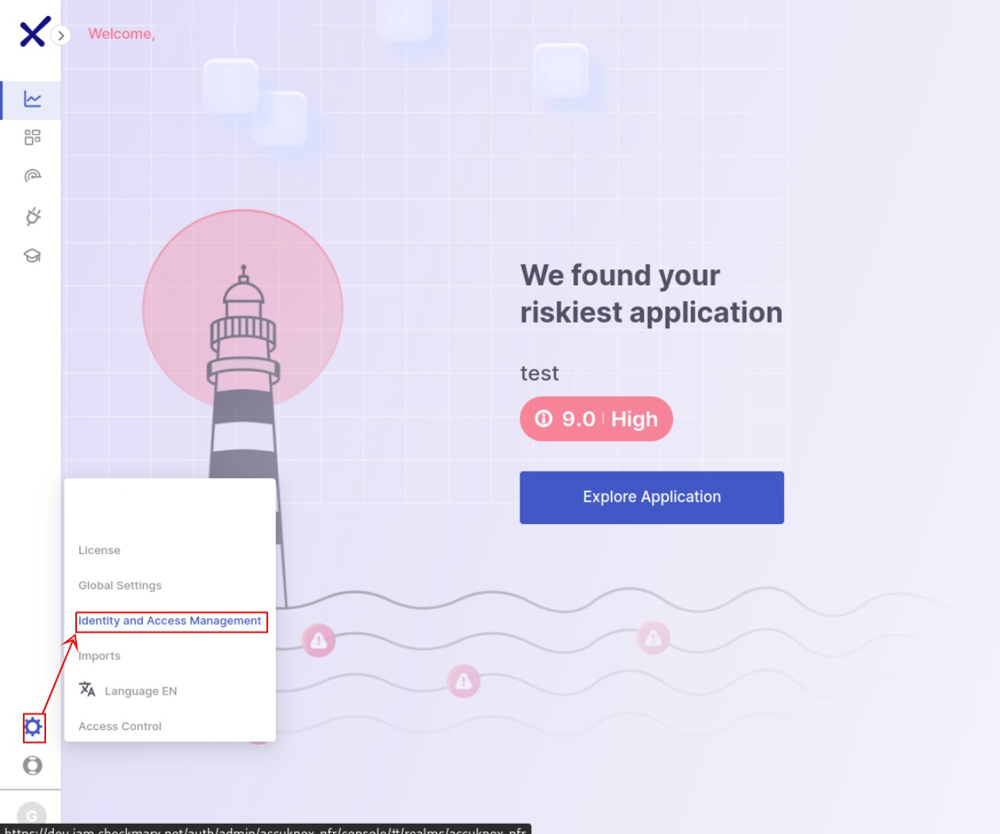
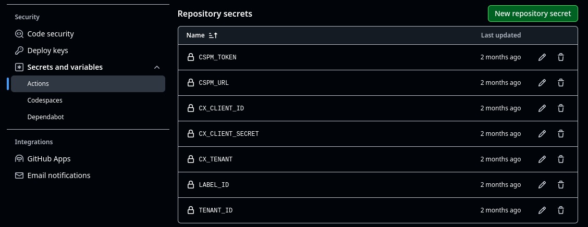
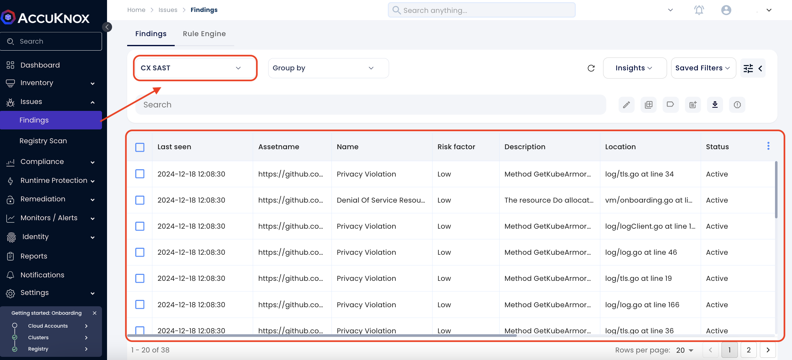
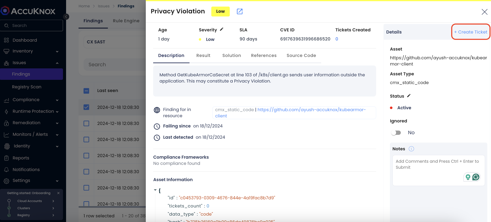

# Checkmarx SAST Integration with AccuKnox

## Introduction

This guide walks you through integrating Checkmarx Static Application Security Testing (SAST) scans with AccuKnox using a CI/CD pipeline workflow. The scan results, formatted in SARIF, will be enriched with metadata and code snippets and then integrated with AccuKnox for further analysis.

## Pre-requisites

- **GitHub repository** with the appropriate permissions.

- **Checkmarx AST API credentials** (Client ID, Client Secret, Tenant ID).

- **AccuKnox CSPM credentials** (Tenant ID, CSPM URL, Token).

## Step 1: Obtain Checkmarx and AccuKnox Credentials

### Getting Checkmarx Credentials

1. **Login to the Checkmarx AST Platform**.

2. Navigate to the **API Access Management** section.

3. **Create a new API client**, and note the **Client ID**, **Client Secret**, and **Tenant ID**.

### Getting AccuKnox Credentials

**1. Generate the AccuKnox token**

The first step is to generate an AccuKnox token. For generating the AccuKnox token, open up the AccuKnox, Go to Settings > Tokens then click on the create button.

Give your token a name and click on the Generate button.

Once you have generated the the token, click on the copy button and take a note of it. It will be required to configured as a variable in the pipeline. Also copy the Tenant Id and take a note of it.

**2. Create a label**

In AccuKnox, labels are used for grouping the similar types of assets together. For creating a label navigate to the Settings > Labels and click on the create label button.

Give your label a name and a filename prefix. Take a note of the label and click on the save button.

## Step 2: Configure GitHub Workflow

In your GitHub repository, create a workflow file (e.g., `.github/workflows/checkmarx-accuknox.yml`) with the following content:

## Step 3: Set Up GitHub Secrets

Ensure the following secrets are configured in your GitHub repository under **Settings > Secrets and Variables**:

- `CX_CLIENT_ID`: Checkmarx Client ID

- `CX_CLIENT_SECRET`: Checkmarx Client Secret

- `CX_TENANT`: Checkmarx Tenant ID

- `CSPM_URL`: AccuKnox CSPM URL

- `TENANT_ID`: AccuKnox Tenant ID

- `LABEL_ID`: AccuKnox Label ID

- `CSPM_TOKEN`: AccuKnox CSPM API Token

## Step 4: Running the Workflow

1. Push changes to the repository's `master` branch or open a pull request.

2. The Checkmarx scan runs, generating a SARIF file.

3. The workflow enriches the SARIF file with metadata and code snippets, then uploads it to AccuKnox for analysis.

## Step 5: View findings in AccuKnox

To see your findings navigate to AccuKnox > Issues > Findings and select the CMX SAST findings.

Click on any finding to get more details. You can also click on the Create Ticket button to create a ticket.

## Conclusion

By following this guide, you've successfully integrated Checkmarx SAST scans into your CI/CD pipeline and connected them with AccuKnox for further insights. You can now analyze and prioritize vulnerabilities within the AccuKnox dashboard
