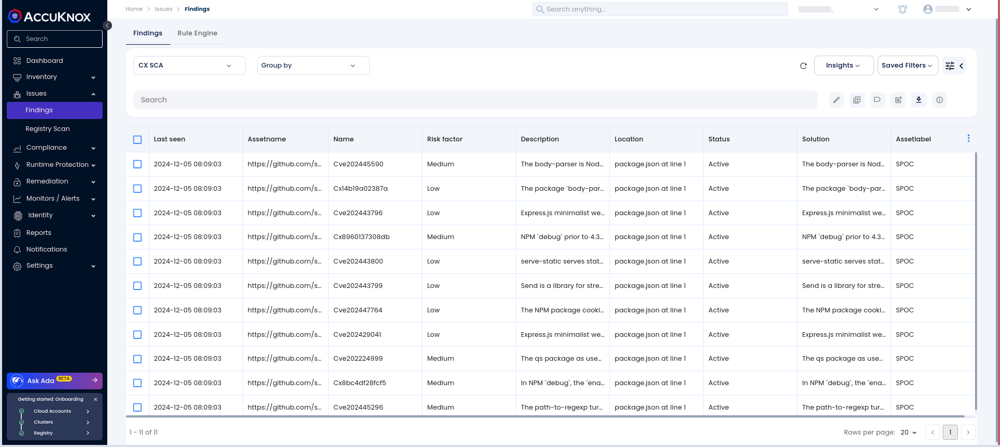

# Checkmarx SCA Integration

## **Introduction**

This guide walks you through integrating Checkmarx Software Composition Analysis (SCA) scans with AccuKnox using a CI/CD pipeline workflow. The scan results, formatted in SARIF, will be enriched with metadata and code snippets and then integrated with AccuKnox for further analysis.

**Pre-requisites**

- GitHub repository with the appropriate permissions.

- Checkmarx SCA API credentials (Client ID, Client Secret, Tenant ID).

- AccuKnox CSPM credentials (Tenant ID, CSPM URL, Token).

## **Step 1: Obtain Checkmarx and AccuKnox Credentials**

**Getting Checkmarx SCA Credentials**

1. Log in to the Checkmarx SCA Platform.

2. Follow [Checkmarx API Authentication Documentation](https://docs.checkmarx.com/en/34965-118315-authentication-for-checkmarx-one-cli.html#UUID-a4e31a96-1f36-6293-e95a-97b4b9189060_orderedlist-idm33324220678908 "https://docs.checkmarx.com/en/34965-118315-authentication-for-checkmarx-one-cli.html#UUID-a4e31a96-1f36-6293-e95a-97b4b9189060_orderedlist-idm33324220678908") to create a new API client.

3. Note the Base URI, Client ID, Client Secret, and Tenant ID.

**Getting AccuKnox Credentials**

1. **Generate the AccuKnox Token**
Open AccuKnox and go to **Settings > Tokens**. Click **Create**, give your token a name, and click **Generate**. Once generated, click **Copy** to save the token. Also, note down the Tenant ID. For details, refer to [How to Create Tokens](https://help.accuknox.com/how-to/how-to-create-tokens/?h=token "https://help.accuknox.com/how-to/how-to-create-tokens/?h=token").

2. **Create a Label**
Navigate to **Settings > Labels**, click **Create Label**, provide a name, and set the filename prefix. Click **Save** and note down the Label ID.
For details, refer to [How to Create Labels](https://help.accuknox.com/how-to/how-to-create-labels/?h=label "https://help.accuknox.com/how-to/how-to-create-labels/?h=label").

## **Step 2: Configure GitHub Workflow**

In your GitHub repository, create a workflow file (e.g., `.github/workflows/checkmarx-sca-accuknox.yml`) with the following content:


```yaml
name: Checkmarx Sarif Integration for SCA

on:
  push:
    branches: [ "sca" ]

permissions:
  security-events: write
  contents: read

jobs:
  build:
    runs-on: ubuntu-latest

    steps:
      - name: Checkout repository
        uses: actions/checkout@v2

      - name: Checkmarx scan
        uses: checkmarx/ast-github-action@main
        with:
          base_uri: https://deu.iam.checkmarx.net/
          cx_client_id: ${{ secrets.CX_CLIENT_ID }}
          cx_client_secret: ${{ secrets.CX_CLIENT_SECRET }}
          cx_tenant: ${{ secrets.CX_TENANT }}
          additional_params: --scan-types sca --report-format sarif --output-path .

      - name: Fix SARIF file levels
        run: |
          jq 'walk(if type == "object" and has("level") then .level |= (if . == "none" or . == "note" or . == "warning" or . == "error" then . else "note" end) else . end)' cx_result.sarif > tmp.sarif && mv tmp.sarif cx_result.sarif

      - name: Append GitHub metadata to SARIF
        env:
          GITHUB_REPOSITORY: ${{ github.repository }}
          GITHUB_SHA: ${{ github.sha }}
          GITHUB_REF: ${{ github.ref }}
          GITHUB_RUN_ID: ${{ github.run_id }}
          GITHUB_RUN_NUMBER: ${{ github.run_number }}
          SOURCE: "GitHub"
        run: |
          GITHUB_URL="${{ github.server_url }}/${{ github.repository }}"
          GITHUB_RUN_URL="${{ github.server_url }}/${{ github.repository }}/actions/runs/${{ github.run_id }}"
          jq --arg repo "$GITHUB_REPOSITORY" \
             --arg sha "$GITHUB_SHA" \
             --arg ref "$GITHUB_REF" \
             --arg run_id "$GITHUB_RUN_ID" \
             --arg run_number "$GITHUB_RUN_NUMBER" \
             --arg github_url "$GITHUB_URL" \
             --arg github_run_url "$GITHUB_RUN_URL" \
             --arg source "$SOURCE" \
             '.runs[0].invocations += [{
                "executionSuccessful": true,
                "toolExecutionNotifications": [],
                "toolConfigurationNotifications": [],
                "properties": {
                  "repository": $repo,
                  "commit": $sha,
                  "ref": $ref,
                  "workflow_run_id": $run_id,
                  "workflow_run_number": $run_number,
                  "repository_url": $github_url,
                  "workflow_run_url": $github_run_url,
                  "source": $source
                }
              }]' cx_result.sarif > tmp.sarif && mv tmp.sarif cx_result.sarif

      - name: Extract and Embed Code Snippets in SARIF using Python
        id: embed_snippets
        run: |
          python3 <<EOF
          import os
          import json

          def get_code_snippet(lines, start_line, start_column, end_column):
              start_line_index = max(start_line - 3, 0)  # Start 2 lines before or 0
              end_line_index = min(start_line + 2, len(lines))  # End 2 lines after

              snippet_lines = lines[start_line_index:end_line_index]
              highlighted_snippet = []

              for i, line in enumerate(snippet_lines):
                  line_number = start_line_index + i + 1

                  if line_number == start_line:
                      try:
                          highlighted_snippet.append(
                              line[:max(0, start_column - 1)] +
                              "<<<HIGHLIGHT>>>" +
                              line[max(0, start_column - 1):min(len(line), end_column)] +
                              "<<<END_HIGHLIGHT>>>" +
                              line[min(len(line), end_column):]
                          )
                      except Exception as e:
                          print(f"Error highlighting line {line_number}: {e}")
                          highlighted_snippet.append(line)
                  else:
                      highlighted_snippet.append(line)

              snippet_with_comments = "// Start of snippet\n"
              snippet_with_comments += "".join(highlighted_snippet)
              snippet_with_comments += "// End of snippet\n"

              return snippet_with_comments

          def process_sarif_file(sarif_path):
              with open(sarif_path, "r") as sarif_file:
                  sarif_data = json.load(sarif_file)

              for run in sarif_data.get("runs", []):
                  for result in run.get("results", []):
                      for location in result.get("locations", []):
                          physical_location = location.get("physicalLocation", {})
                          artifact_location = physical_location.get("artifactLocation", {})
                          region = physical_location.get("region", {})

                          uri = artifact_location.get("uri")
                          start_line = region.get("startLine")
                          start_column = region.get("startColumn")
                          end_column = region.get("endColumn")

                          if uri and start_line and start_column and end_column:
                              file_path = os.path.join(".", uri.lstrip("./"))
                              try:
                                  with open(file_path, "r") as source_file:
                                      lines = source_file.readlines()
                                      snippet_with_comments = get_code_snippet(
                                          lines, start_line, start_column, end_column
                                      )
                                      region["snippet"] = {
                                          "text": snippet_with_comments
                                      }
                              except FileNotFoundError:
                                  print(f"Failed to process file {file_path}: File not found.")
                              except Exception as e:
                                  print(f"Failed to process file {file_path}: {e}")

              with open("tmp_sarif_with_snippets.sarif", "w") as output_file:
                  json.dump(sarif_data, output_file, indent=2)

          process_sarif_file("cx_result.sarif")
          EOF

      - name: Upload SARIF file with code snippets
        uses: actions/upload-artifact@v3
        with:
          name: sarif-results-with-snippets
          path: tmp_sarif_with_snippets.sarif

      - name: Upload SARIF file
        uses: github/codeql-action/upload-sarif@v3
        with:
          sarif_file: tmp_sarif_with_snippets.sarif

      - name: Push SARIF file to AccuKnox
        run: |
          curl --location 'https://${{ secrets.ACCUKNOX_ENDPOINT }}/api/v1/artifact/?tenant_id=${{ secrets.ACCUKNOX_TENANT }}&data_type=CMX&save_to_s3=true&label_id=${{ secrets.ACCUKNOX_LABEL }}' \
            --header 'Tenant-Id: ${{ secrets.ACCUKNOX_TENANT }}' \
            --header 'Authorization: Bearer ${{ secrets.ACCUKNOX_TOKEN }}' \
            --form 'file=@./tmp_sarif_with_snippets.sarif'
```


## **Step 3: Set Up GitHub Secrets**

Ensure the following secrets are configured in your GitHub repository under **Settings > Secrets and Variables**:

- `CX_CLIENT_ID`: Checkmarx Client ID

- `CX_CLIENT_SECRET`: Checkmarx Client Secret

- `CX_TENANT`: Checkmarx Tenant ID

- `ACCUKNOX_ENDPOINT`: AccuKnox CSPM URL

- `ACCUKNOX_TENANT`: AccuKnox Tenant ID

- `ACCUKNOX_LABEL`: AccuKnox Label ID

- `ACCUKNOX_TOKEN`: AccuKnox CSPM API Token


## **Step 4: Running the Workflow**

1. Push changes to the repository's main branch or open a pull request.

2. The Checkmarx SCA scan will run, generating a SARIF file.

3. The workflow will enrich the SARIF file with metadata and code snippets, and then upload it to AccuKnox for analysis.


## **Step 5: View Findings in AccuKnox**

To see your findings navigate to AccuKnox > Issues > Findings and select the **CMX SCA** findings.



Click on any finding to get more details. You can also click on **Create Ticket** to create a ticket for further resolution.


## **Conclusion**

By following this guide, you've successfully integrated Checkmarx SCA scans into your CI/CD pipeline and connected them with AccuKnox for further insights. You can now analyze and prioritize vulnerabilities within the AccuKnox dashboard.
