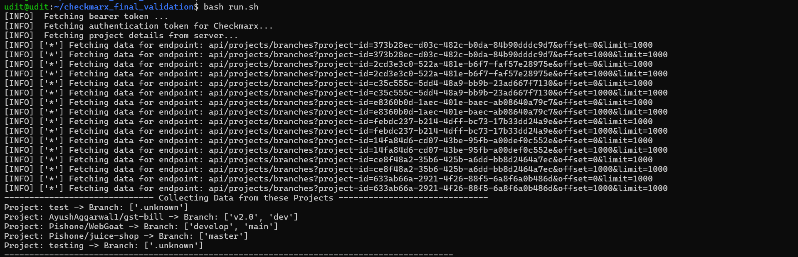
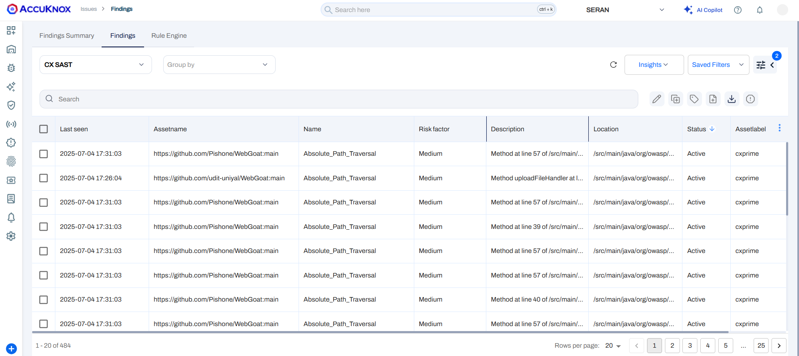

# Checkmarx (SAST, SCA, KICS, Container Scan) Integration with AccuKnox

This integration fetches **SAST, SCA, KICS, and Container scan** results from **Checkmarx One** and sends them to **AccuKnox** to visualize and prioritize vulnerabilities across projects.

## Prerequisites

- Docker installed
- `.env` file created with the necessary variables (see below)

## Environment Variables

Below are the required variables to configure the integration:

### Checkmarx Variables

| Variable            | Description                                                                                                                           |
| ------------------- | ------------------------------------------------------------------------------------------------------------------------------------- |
| `CX_API_KEY`        | API token to authenticate with Checkmarx One [Generate API Key](https://docs.checkmarx.com/en/34965-68618-generating-an-api-key.html) |
| `CX_PROJECT`        | Project filter (supports wildcards and exclusion)                                                                                     |
| `CX_PRIMARY_BRANCH` | `true` to consider only the primary branch of projects                                                                                |

#### `CX_PROJECT` Usage Guide:

- `{"*":"*"}` → All projects, all branches
- `{"*dvwa*":"*"}` → Only projects with _dvwa_ in the name, all branches
- `{"*dvwa*":"main"}` → Only projects with _dvwa_ in the name and branch = `main`
- `{-*dvwa*:"main"}` → Exclude projects with _dvwa_ in the name; only include `main` branch from others

### AccuKnox Variables

| Variable       | Description                                                                                                              |
| -------------- | ------------------------------------------------------------------------------------------------------------------------ |
| `AK_ENDPOINT`  | AccuKnox API endpoint (e.g., `https://cspm.demo.accuknox.com`)                                                           |
| `AK_LABEL`     | Label to tag the findings in AccuKnox UI [Create Labels](https://help.accuknox.com/how-to/how-to-create-labels/?h=label) |
| `AK_TENANT_ID` | Tenant ID in AccuKnox platform [Get Tenant ID](https://help.accuknox.com/how-to/how-to-create-tokens/?h=token)           |
| `AK_TOKEN`     | API token to authenticate with AccuKnox [Generate Token](https://help.accuknox.com/how-to/how-to-create-tokens/?h=token) |

## Sample `.env` file

```dotenv
CX_API_KEY=eyJhbGciOiJIUzUxMiIsInR5..................
CX_PROJECT={"*":"*"}
CX_PRIMARY_BRANCH=false
AK_ENDPOINT=https://cspm.demo.accuknox.com
AK_LABEL=cxprime
AK_TENANT_ID=123
AK_TOKEN=eyJ0eXAiOiJKV1QiLCJhbGciOiJSUzI1NiJ9.eyJ0b2tl...............
```

## Run the Integration

```bash
docker run --rm -it \
  --env-file .env \
  -v $PWD:/app/data/ \
  accuknox/checkmarx-one-job:1.4
```



The script fetches results from Checkmarx One using the API key and project filter, then forwards them to AccuKnox for visualization and risk prioritization.

## View Results in AccuKnox SaaS

To view the Checkmarx findings:

1. Navigate to the AccuKnox Console.
2. Go to **Issues > Findings**.
3. Select one of the following categories to view the identified vulnerabilities:
   - CX SAST
   - CX SCA
   - CX KICS
   - CX Containers



## Notes

- Make sure your `.env` file does not contain trailing spaces or special characters that could break parsing.
- The `AK_LABEL` helps categorize data inside the AccuKnox dashboard (e.g., `cxprime`, `checkmarx-scan`). [Learn More](https://help.accuknox.com/how-to/how-to-create-labels/?h=label)
- To schedule this job, you can embed this in a CI/CD pipeline or cron job runner.
