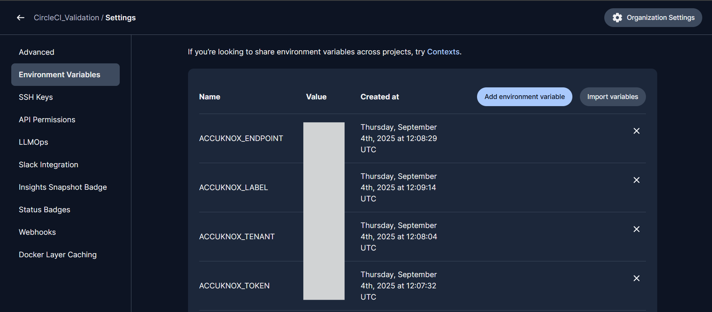
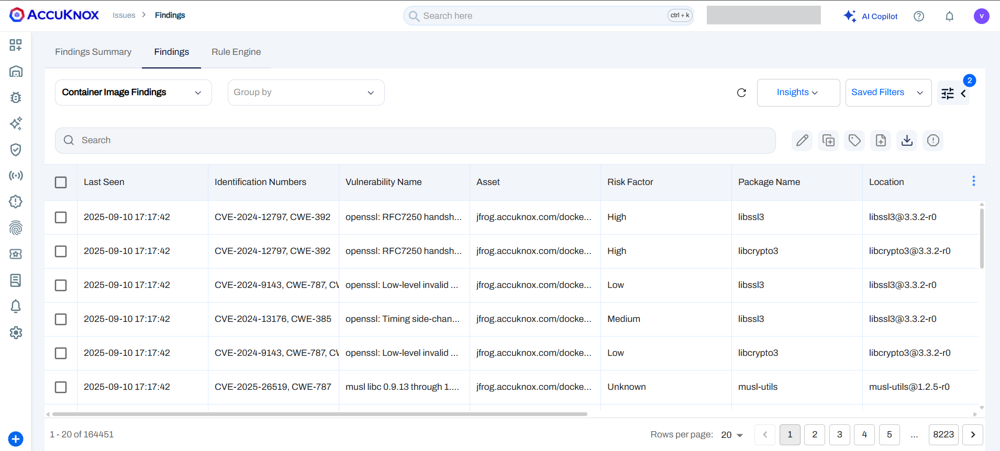
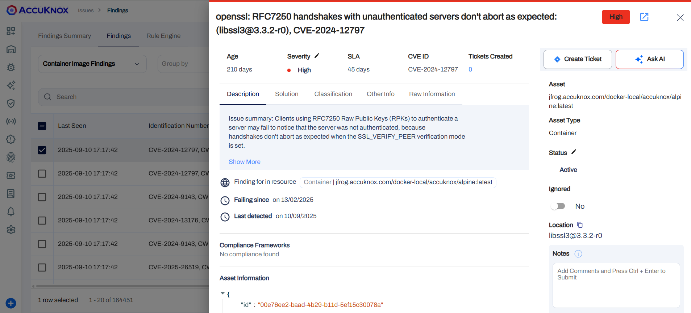

# Container Scanning Integration using AccuKnox CircleCI Plugin

AccuKnox’s Container Scanning capability allows you to **detect vulnerabilities in your Docker images** directly within your CI/CD pipeline. Integrating this with CircleCI helps ensure that insecure containers are flagged and addressed before deployment, significantly enhancing the security posture of your workloads.

## Prerequisites

Before integrating container scanning, ensure you have:

- A **CircleCI project** connected to your codebase and container build workflow.
- **Admin access** to manage CircleCI Contexts or Project-level Environment Variables.
- **Access to the AccuKnox Console**.

## Step 1: Log in to AccuKnox and Generate API Token

To begin, you'll need an API token from AccuKnox:

1.  Log into your **AccuKnox Console**.
2.  Navigate to **Settings → Tokens**.
3.  **Create a new token** to securely send scan results from CircleCI to AccuKnox. For detailed instructions, refer to the "How to Create Tokens" documentation.


## Step 2: Set Environment Variables in CircleCI

You have two options for configuring environment variables in CircleCI:

### Option A: Use CircleCI Contexts (Recommended)

Using contexts is the recommended approach for managing environment variables across multiple jobs.

1.  Go to **CircleCI → Organization Settings → Contexts**.
2.  **Create a new context** (e.g., `accuknox-context`).
3.  Add the following environment variables to the new context:

| Name                | Description                                                    |
| :------------------ | :------------------------------------------------------------- |
| `ACCUKNOX_TOKEN`    | API token from AccuKnox                                        |
| `ACCUKNOX_ENDPOINT` | AccuKnox API endpoint (e.g., `https://cspm.demo.accuknox.com`) |
| `ACCUKNOX_TENANT`   | Your tenant ID from AccuKnox                                   |
| `ACCUKNOX_LABEL`    | Logical grouping label for scan results                        |

4.  Attach this context to your scan jobs within your `.circleci/config.yml` file, like so:

    ```yaml
    - accuknox-scan/container:
        context: accuknox-context
        IMAGE_NAME: circleci
        TAG: test
        SOFT_FAIL: true
    ```

### Option B: Use Project-Level Environment Variables

If contexts aren't suitable for your setup, you can use project-level environment variables:

1.  Navigate to **CircleCI → Project Settings → Environment Variables**.
2.  **Add the same four variables manually** as described in Option A.



## Step 3: Add the Container Scan Job to Your Pipeline

Update your CircleCI configuration file (`.circleci/config.yml`) to include the container scan job provided by the AccuKnox plugin:

```yaml
version: 2.1

orbs:
  accuknox-scan: accuknox/scan@1.0.0

workflows:
  accuknox:
    jobs:
      - accuknox-scan/container:
          context: accuknox-context
          IMAGE_NAME: circleci
          TAG: test
          SOFT_FAIL: true
```

### Explanation of Parameters

The `accuknox-scan/container` job accepts several parameters to define the image to scan and its behavior:

| Parameter    | Description                                                                         | Default Value                      |
| :----------- | :---------------------------------------------------------------------------------- | :--------------------------------- |
| `IMAGE_NAME` | Name of the Docker image to scan.                                                   | _Required_                         |
| `TAG`        | Tag/version of the image.                                                           | _Required_                         |
| `SEVERITY`   | Comma-separated list of severities: `UNKNOWN`, `LOW`, `MEDIUM`, `HIGH`, `CRITICAL`. | `UNKNOWN,LOW,MEDIUM,HIGH,CRITICAL` |
| `SOFT_FAIL`  | If `true`, the job will not fail even if issues are found.                          | `true`                             |

## Step 4: View Scan Results in AccuKnox Console

After the pipeline runs, the scan results are sent to AccuKnox:

1.  Log in to the **AccuKnox Console**.
2.  Navigate to **Issues → Findings → Container Findings**.
    

3.  Click on individual findings to view details such as:
    _ **Vulnerability name and description**
    _ **CVE details**
    _ **Affected packages**
    _ **Severity and remediation guidance**
    

## Step 5: Fix and Verify

Once vulnerabilities are fixed:

1.  **Rebuild and tag** the Docker image.
2.  **Push updated code/image** to trigger the CircleCI pipeline.
3.  The CircleCI pipeline will **rerun the container scan**.
4.  **Verify that no critical issues are reported** in the AccuKnox Console.

## Conclusion

By integrating container scanning into your CircleCI pipeline with AccuKnox, your team can continuously validate the security of your images and maintain compliance with best practices. This ensures your container deployments are hardened before they reach production.

For more help, contact `support@accuknox.com` or refer to the AccuKnox Developer Documentation.
