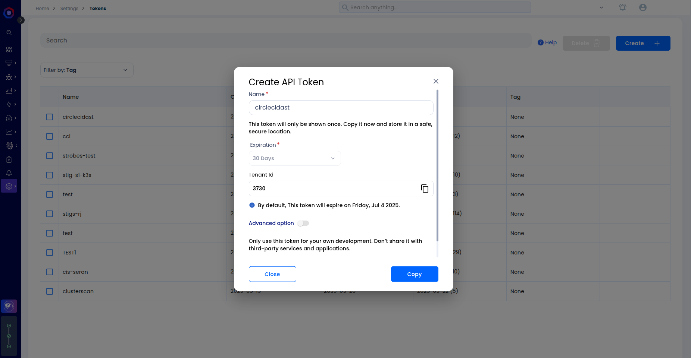

---
title:
description:
---

# DAST Scanning Integration using AccuKnox CircleCI Plugin

To demonstrate the benefits of incorporating AccuKnox into a CI/CD pipeline using CircleCI, this guide explains how to integrate Dynamic Application Security Testing (DAST) scans into your build process. By using the AccuKnox CircleCI plugin, teams can identify and resolve application-layer vulnerabilities before pushing to production.

## Prerequisites

- A configured CircleCI project connected to your application’s source repository.
- Admin access to create CircleCI Contexts or add Project-level Environment Variables.
- Access to the AccuKnox platform.

## Steps for Integration

### Step 1: Log in to AccuKnox and Generate API Token

1.  Log into your AccuKnox Console
2.  Navigate to **Settings → Tokens**.
3.  Create a new token to be used for sending scan results securely from CircleCI to AccuKnox. For detailed steps, refer to [How to Create Tokens](https://help.accuknox.com/how-to/how-to-create-tokens/).



### Step 2: Set Environment Variables in CircleCI

You can configure environment variables in two ways:

#### Option A: Use CircleCI Contexts (Recommended)

1.  Go to **CircleCI > Organization Settings > Contexts**.
2.  Create a new context (e.g., `accuknox-context`).
3.  Add the following environment variables to the context:

| Name                | Description                                                    |
| :------------------ | :------------------------------------------------------------- |
| `ACCUKNOX_TOKEN`    | API token from AccuKnox                                        |
| `ACCUKNOX_ENDPOINT` | AccuKnox API endpoint (e.g., <https://cspm.demo.accuknox.com>) |
| `ACCUKNOX_TENANT`   | Your tenant ID from AccuKnox                                   |
| `ACCUKNOX_LABEL`    | Logical grouping label for scan results                        |

Then, attach this context to your scan jobs as shown in the configuration below.

```yaml
- accuknox-scan/dast:
    context: dast-context
    SOFT_FAIL: true
    TARGET_URL: "[http://testphp.vulnweb.com](http://testphp.vulnweb.com)"
```

#### Option B: Project-Level Variables

1.  Navigate to your **CircleCI Project Settings → Environment Variables**.
2.  Add the same four environment variables manually.


### Step 3: Add the DAST Job to CircleCI Configuration

To integrate DAST scanning, modify your `.circleci/config.yml` file using the AccuKnox CircleCI Orb.

```yaml
version: 2.1

orbs:
  accuknox-scan: accuknox/scan@1.0.0

workflows:
  accuknox:
    jobs:
      - accuknox-scan/dast:
          context: accuknox-context
          TARGET_URL: "[http://testphp.vulnweb.com](http://testphp.vulnweb.com)"
          DAST_SCAN_TYPE: "baseline"
          SEVERITY_THRESHOLD: "High"
          SOFT_FAIL: true
```

Explanation of Parameters:

| Parameter            | Description                                                                         |
| :------------------- | :---------------------------------------------------------------------------------- |
| `TARGET_URL`         | The URL of the web application you want to scan. This must be externally reachable. |
| `DAST_SCAN_TYPE`     | Type of scan to perform. Accepts `baseline` or `full-scan`.                         |
| `SEVERITY_THRESHOLD` | Minimum severity level that causes the job to fail (`Low`, `Medium`, `High`).       |
| `SOFT_FAIL`          | If set to `true`, the job will not fail even if issues above threshold are found.   |


### View Results in AccuKnox Console

After the scan is complete:

1. Log into AccuKnox Console.
2. Navigate to **Issues → Findings → DAST Findings**.
3. Identify vulnerabilities reported during the scan.


4. Click on a finding to view details including:
   - Vulnerability description
   - Affected endpoint
   - Severity
   - Suggested remediation steps


5. Follow the recommendations to remediate the issue.
6. Optionally, create a ticket in your internal tracking system (e.g., Jira, GitHub Issues) to assign this to your dev team.


### Step 4: Validate the Fix

After implementing the fix, push the changes again. The DAST job will rerun in CircleCI, and the new scan results will be forwarded to AccuKnox.

Return to the DAST Findings section in AccuKnox to verify that the vulnerability has been resolved.

## Conclusion

By integrating AccuKnox’s DAST scanning into your CircleCI pipeline, your organization gains continuous visibility into application-layer security risks. This enables faster remediation, enforces shift-left security practices, and improves compliance posture.

The plugin is lightweight, configuration-driven, and designed for easy use across all CI/CD stages. DAST scanning with AccuKnox is also supported on other platforms like GitHub Actions, GitLab CI, Jenkins, Azure Pipelines, and AWS CodePipelines.

For more help, contact [support@accuknox.com](mailto:support@accuknox.com) or refer to the [AccuKnox Developer Documentation](https://help.accuknox.com/).

!!! note
    Since the AccuKnox CircleCI plugin is currently unverified, you must enable the usage of unverified orbs in your CircleCI project settings.
    Navigate to **Organization Settings → Security** and toggle **"Allow uncertified public orbs"** to `true`.
    
