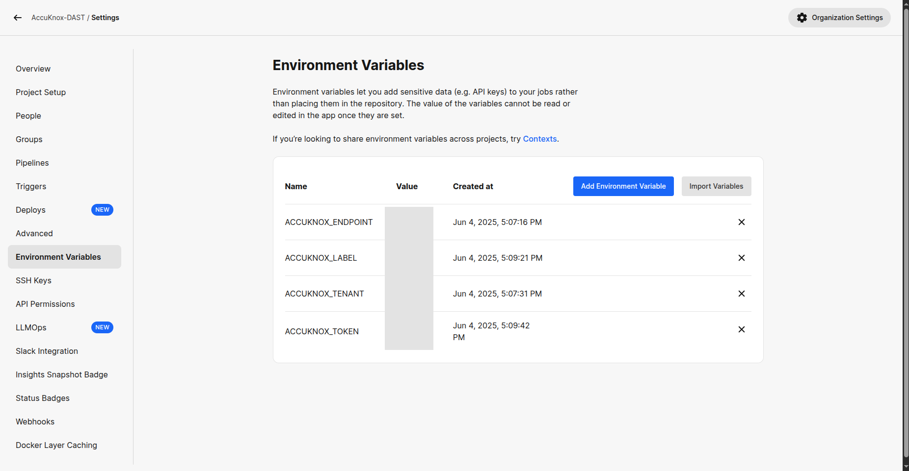
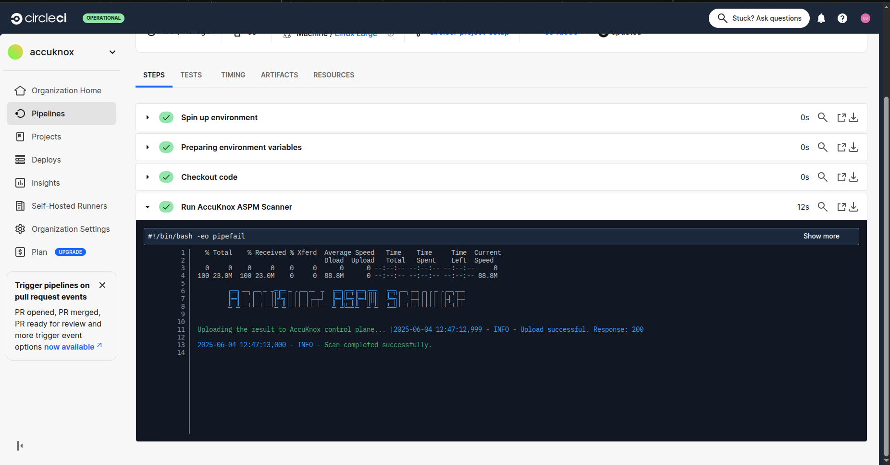
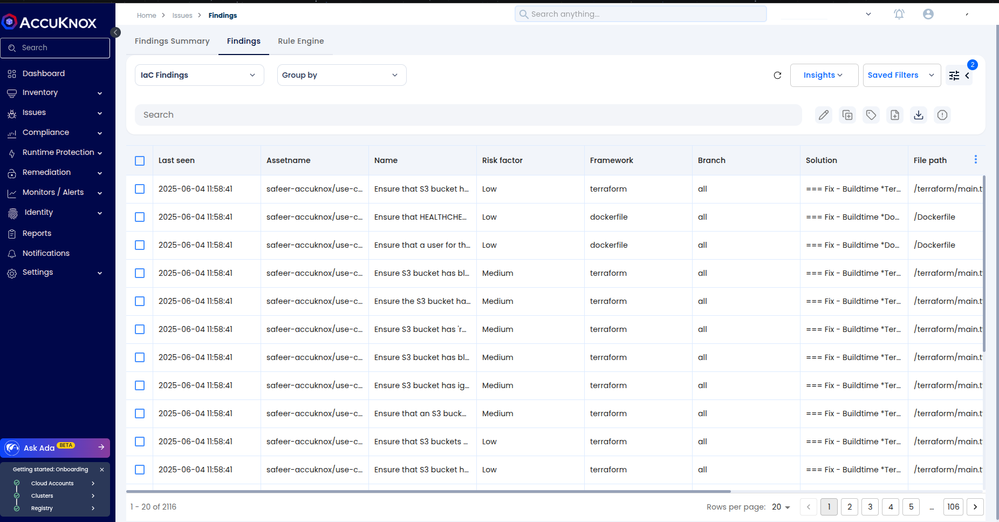
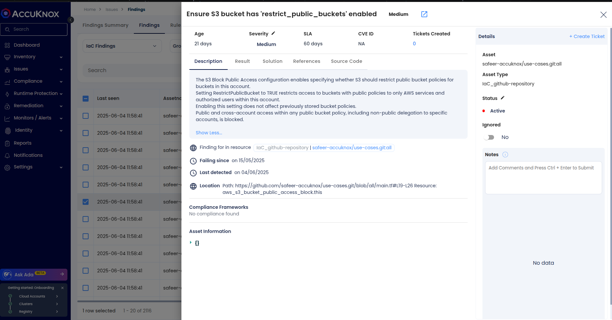
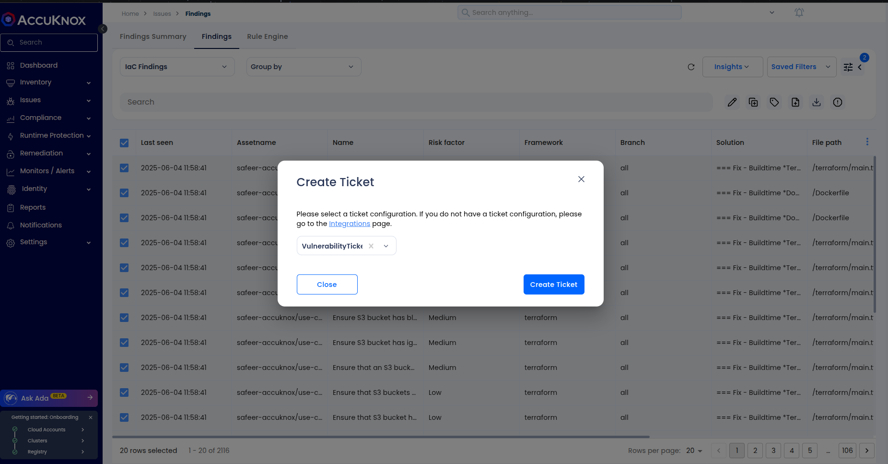

# IaC Scanning Integration using AccuKnox CircleCI Plugin

This guide outlines how to integrate Infrastructure as Code (IaC) scanning into your CircleCI pipeline using the AccuKnox plugin. IaC scanning helps identify misconfigurations and security issues in infrastructure code such as Terraform, Kubernetes YAML, or Helm charts before they are deployed to production.

## Prerequisites

  * A configured **CircleCI project** connected to your application's source repository.
  * **Admin access** to create CircleCI Contexts or add Project-level Environment Variables.
  * **Access to the AccuKnox platform**.

## Step 1: Log in to AccuKnox and Generate API Token

1.  Log into your **AccuKnox Console**.
2.  Navigate to **Settings → Tokens**.
3.  Create a new token to use for sending scan results securely from CircleCI to AccuKnox. For detailed steps, refer to [How to Create Tokens](https://help.accuknox.com/how-to/how-to-create-tokens/).


## Step 2: Set Environment Variables in CircleCI

You can configure environment variables in two ways:

### Option A: Use CircleCI Contexts (Recommended)

1.  Go to **CircleCI → Organization Settings → Contexts**.
2.  Create a new context (e.g., `accuknox-context`).
3.  Add the following environment variables:

| Name              | Description                    |
| :---------------- | :----------------------------- |
| `ACCUKNOX_TOKEN`  | API token from AccuKnox        |
| `ACCUKNOX_ENDPOINT` | AccuKnox API endpoint (e.g., `https://cspm.demo.accuknox.com`) |
| `ACCUKNOX_TENANT` | Your tenant ID from AccuKnox   |
| `ACCUKNOX_LABEL`  | Logical grouping label for scan results |

Attach the context to your scan jobs like this:

```yaml
- accuknox-scan/iac:
    context: accuknox-context
    SOFT_FAIL: false
```

### Option B: Use Project-Level Environment Variables

1.  Navigate to **CircleCI → Project Settings → Environment Variables**.
2.  Add the same four variables manually.



## Step 3: Add the IaC Job to CircleCI Configuration

Update your `.circleci/config.yml` with the `iac` job from the AccuKnox plugin.

```yaml
version: 2.1

orbs:
  accuknox-scan: accuknox/scan@1.0.0

workflows:
  accuknox:
    jobs:
      - accuknox-scan/iac:
          context: accuknox-context
          FRAMEWORK: "terraform"
          DIRECTORY: "."
          SOFT_FAIL: true
```

### Explanation of Parameters

| Parameter   | Description                                           |
| :---------- | :---------------------------------------------------- |
| `FILE`      | Specific file to scan (e.g., `main.tf`). Cannot be used with `DIRECTORY`. |
| `DIRECTORY` | Directory containing infrastructure code files. Default: `.`. |
| `COMPACT`   | If `true`, suppresses full code blocks in the output. Default: `true`. |
| `QUIET`     | If `true`, displays only failed checks. Default: `true`. |
| `FRAMEWORK` | The infrastructure type (e.g., `terraform`, `kubernetes`). Optional. |
| `SOFT_FAIL` | If `true`, does not fail pipeline on vulnerabilities. Default: `true`. |



## View Results in AccuKnox Console

After the pipeline runs:

1.  Log into the **AccuKnox Console**.
2.  Navigate to **Issues → Findings → IaC Findings**.


3.  Review the scan output, which includes:
      * Misconfigured parameters
      * Severity and affected resource
      * File and line number
      * Suggested remediation


4.  Optionally, create a ticket in your internal tracking system (e.g., Jira, GitHub Issues) to assign this to your dev team.


## Step 4: Remediate and Re-Scan

After fixing the issues:

  * Push your changes to the repo to trigger a re-scan via CircleCI.
  * Confirm the updated status under IaC Findings in the AccuKnox Console.

## Conclusion

By incorporating AccuKnox's IaC scanning into your CI/CD workflow, you ensure misconfigurations and security weaknesses in infrastructure code are caught early. This reduces risk and supports secure infrastructure provisioning across environments. AccuKnox plugins are lightweight, CI-friendly, and support GitHub Actions, GitLab, Jenkins, Azure Pipelines, and AWS CodePipeline.

For more help, contact `support@accuknox.com` or refer to the [AccuKnox Developer Documentation](https://help.accuknox.com/).