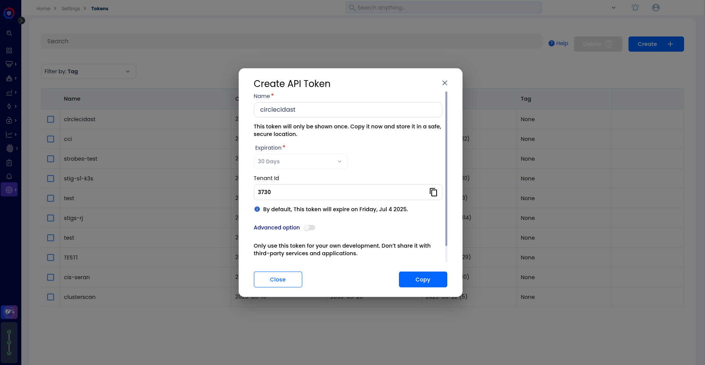
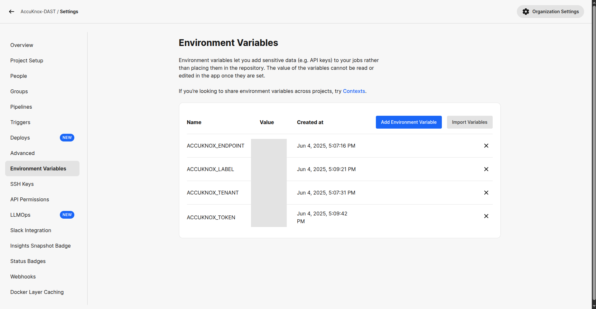
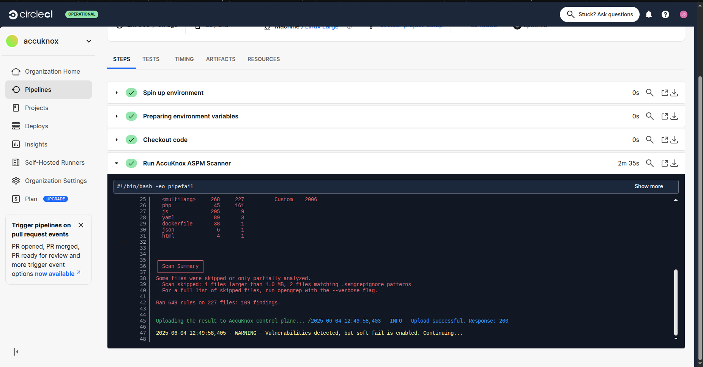
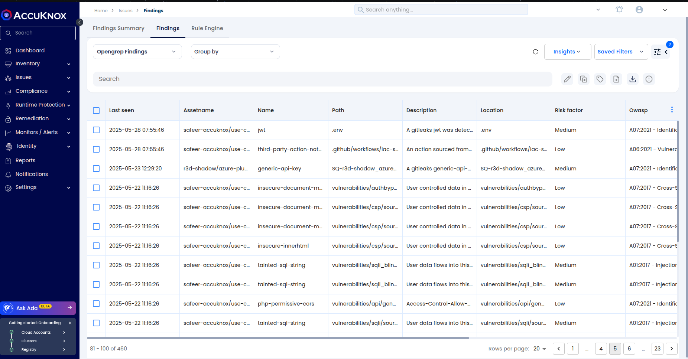
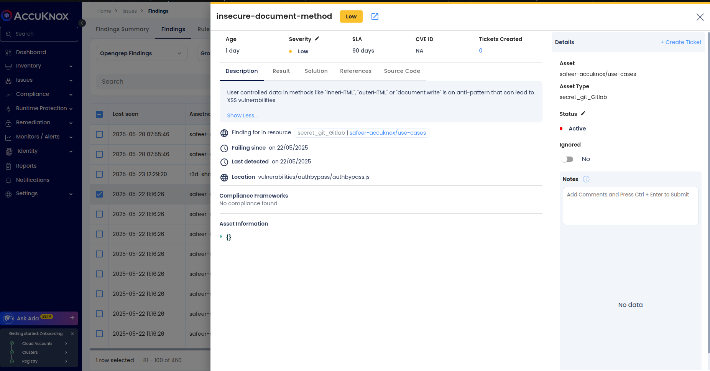
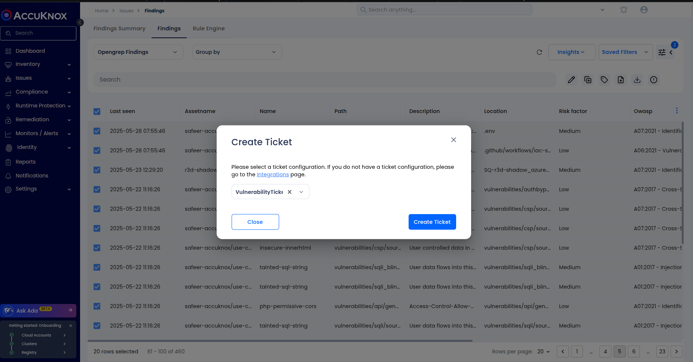

# SAST Scanning Integration using AccuKnox CircleCI Plugin

This guide explains how to integrate Static Application Security Testing (SAST) scans into your CircleCI CI/CD pipeline using the AccuKnox plugin. SAST helps identify vulnerabilities in source code early in the development lifecycle, enabling teams to implement secure coding practices and prevent potential exploits before deployment.

## Prerequisites

- A configured CircleCI project connected to your application's source repository.
- Admin access to create CircleCI Contexts or add Project-level Environment Variables.
- Access to the AccuKnox platform.

## Step 1: Log in to AccuKnox and Generate API Token

1.  Log into your AccuKnox Console.
2.  Navigate to **Settings → Tokens**.
3.  Create a new token to use for sending scan results securely from CircleCI to AccuKnox. For detailed steps, refer to [How to Create Tokens](https://help.accuknox.com/how-to/how-to-create-tokens/).



## Step 2: Set Environment Variables in CircleCI

You can configure environment variables in two ways:

### Option A: Use CircleCI Contexts (Recommended)

1.  Go to **CircleCI → Organization Settings → Contexts**.
2.  Create a new context (e.g., `accuknox-context`).
3.  Add the following environment variables:

| Name                | Description                                                    |
| :------------------ | :------------------------------------------------------------- |
| `ACCUKNOX_TOKEN`    | API token from AccuKnox                                        |
| `ACCUKNOX_ENDPOINT` | AccuKnox API endpoint (e.g., `https://cspm.demo.accuknox.com`) |
| `ACCUKNOX_TENANT`   | Your tenant ID from AccuKnox                                   |
| `ACCUKNOX_LABEL`    | Logical grouping label for scan results                        |

Attach the context to your scan jobs like this:

```yaml
- accuknox-scan/sast:
    context: accuknox-context
    SOFT_FAIL: false
```

### Option B: Use Project-Level Environment Variables

1.  Navigate to **CircleCI → Project Settings → Environment Variables**.
2.  Add the same four variables manually.
    

## Step 3: Add the SAST Job to CircleCI Configuration

Update your `.circleci/config.yml` file to include the AccuKnox SAST scan:

```yaml
version: 2.1

orbs:
  accuknox-scan: accuknox/scan@1.0.0

workflows:
  accuknox:
    jobs:
      - accuknox-scan/sast:
          context: accuknox-context
          SOFT_FAIL: false
```

### Explanation of Parameters

| Parameter   | Description                                                                |
| :---------- | :------------------------------------------------------------------------- |
| `SOFT_FAIL` | If set to `true`, the job will not fail even if vulnerabilities are found. |



## View Results in AccuKnox Console

After the scan completes:

1.  Log in to the AccuKnox Console.
2.  Navigate to **Issues → Findings → SAST Findings**.
    

3.  View details including: - Vulnerability description - File and line number - Severity - Suggested remediation steps
    

4.  Optionally, create a ticket in your internal tracking system (e.g., Jira, GitHub Issues) to assign this to your dev team.
    

## Step 4: Validate the Fix

After remediating the issue:

- Push your changes to trigger a new scan.
- The job will rerun, and new scan results will be sent to AccuKnox.
- Confirm that the vulnerability no longer appears under SAST Findings.

## Conclusion

Integrating SAST scanning with AccuKnox in your CircleCI pipeline ensures vulnerabilities are detected and fixed early in the SDLC. This enables better compliance, reduces security debt, and supports shift-left security practices. The AccuKnox plugin is lightweight, easy to configure, and supports integration across GitHub Actions, GitLab, Jenkins, Azure DevOps, and other CI/CD tools.

For more help, contact `support@accuknox.com` or refer to the [AccuKnox Developer Documentation](https://help.accuknox.com/).