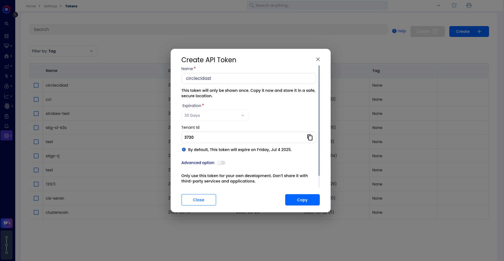
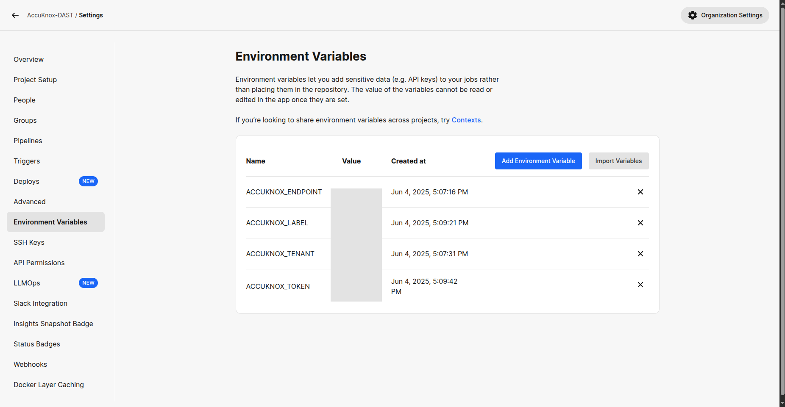
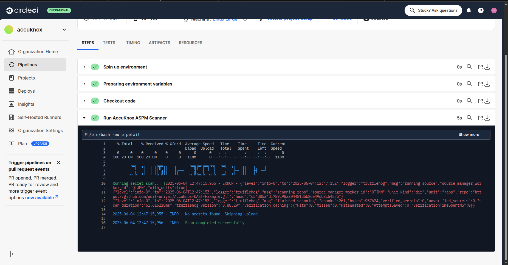
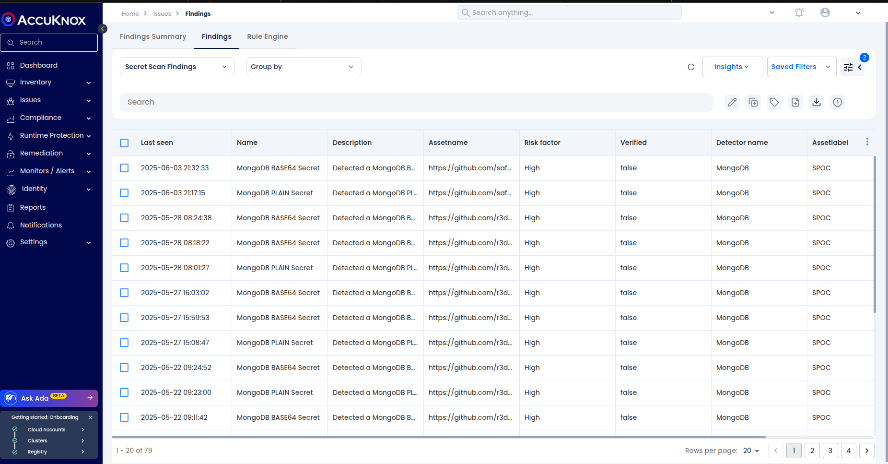
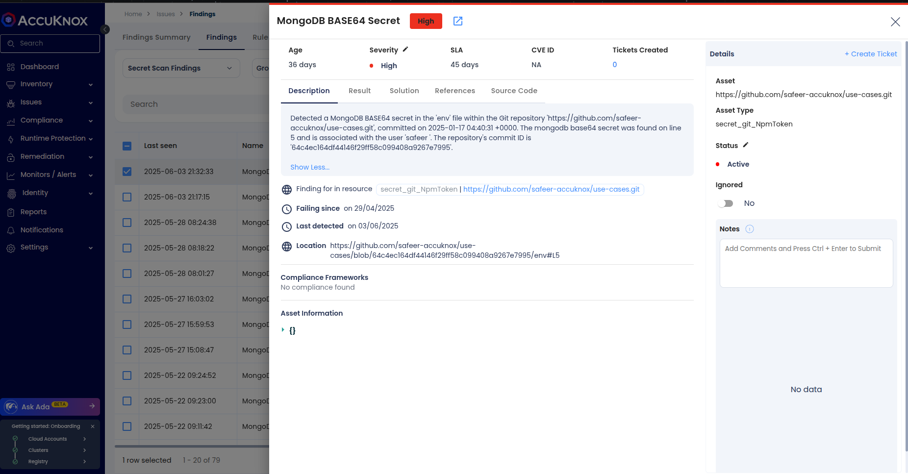
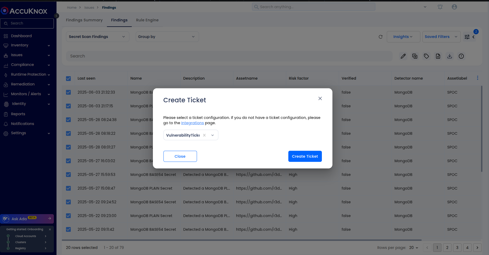

# Secret Scanning Integration using AccuKnox CircleCI Plugin

AccuKnox’s Secret Scanning capability is a powerful tool for **early detection of hardcoded secrets and sensitive credentials** within your codebase. Integrating this functionality into your CircleCI pipeline enforces robust security best practices and helps prevent credential leakage before your code reaches production.

## Prerequisites

Before you begin the integration, ensure you have the following:

* A **CircleCI project** connected to your source code repository.
* **Admin privileges** to create CircleCI Contexts or manage Project-level Environment Variables.
* **Access to the AccuKnox platform**.

## Step 1: Log in to AccuKnox and Generate API Token

To begin, you'll need an API token from AccuKnox:

1.  Log into your **AccuKnox Console**.
2.  Navigate to **Settings → Tokens**.
3.  **Create a new token** that will be used to securely send scan results from CircleCI to AccuKnox. For detailed instructions, refer to the ["How to Create Tokens"](https://help.accuknox.com/how-to/how-to-create-tokens/) documentation.



## Step 2: Set Environment Variables in CircleCI

You have two options for configuring environment variables in CircleCI:

### Option A: Use CircleCI Contexts (Recommended)

Using contexts is the recommended approach for managing environment variables across multiple jobs.

1.  Go to **CircleCI → Organization Settings → Contexts**.
2.  **Create a new context** (e.g., `accuknox-context`).
3.  Add the following environment variables to the new context:

| Name              | Description                               |
| :---------------- | :---------------------------------------- |
| `ACCUKNOX_TOKEN`  | API token from AccuKnox                   |
| `ACCUKNOX_ENDPOINT` | AccuKnox API endpoint (e.g., `https://cspm.demo.accuknox.com`) |
| `ACCUKNOX_TENANT` | Your tenant ID from AccuKnox              |
| `ACCUKNOX_LABEL`  | Logical grouping label for scan results   |

4.  Attach this context to your scan jobs within your `.circleci/config.yml` file, like so:

    ```yaml
         - accuknox-scan/secret:
              context: accuknox-context
              SOFT_FAIL: false
    ```

### Option B: Use Project-Level Environment Variables

If contexts aren't suitable for your setup, you can use project-level environment variables:

1.  Navigate to **CircleCI → Project Settings → Environment Variables**.
2.  **Add the same four variables manually** as described in Option A.



## Step 3: Add the Secret Scanning Job to `.circleci/config.yml`

Update your CircleCI configuration file (`.circleci/config.yml`) to include the secret scanning job from the AccuKnox plugin:

```yaml
version: 2.1

orbs:
  accuknox-scan: accuknox/scan@1.0.0

workflows:
  accuknox:
    jobs:
      - accuknox-scan/secret:
          context: accuknox-context
          SOFT_FAIL: true
```

### Explanation of Parameters

The `accuknox-scan/secret` job accepts several optional parameters to fine-tune its behavior:

| Parameter          | Description                                                              |
| :----------------- | :----------------------------------------------------------------------- |
| `RESULTS`          | Types of results to include (verified, unverified, etc.). *Optional.* |
| `BRANCH`           | Branch to scan (e.g., `main`, `all-branches`). *Optional.* |
| `EXCLUDE_PATHS`    | Comma-separated paths to exclude from scanning.                          |
| `ADDITIONAL_ARGUMENTS` | Any additional flags for fine-tuning secret scanning.                    |
| `SOFT_FAIL`        | If `true`, the job won’t fail even if secrets are found. Default: `true`. |



## View Results in AccuKnox Console

Once the scan completes, you can review the findings:

1.  Log in to the **AccuKnox Console**.
2.  Navigate to **Issues → Findings → Secret Findings**.


3.  Review the results, paying attention to:
    * **Type of secret found** (e.g., API keys, tokens, credentials).
    * **File and line number** where the secret was detected.
    * **Suggested action/remediation**.


4.  Optionally, create a ticket in your internal tracking system (e.g., Jira, GitHub Issues) to assign the remediation to your development team.


## Step 4: Remediate and Re-Scan

After you've addressed the identified secrets:

1.  **Push the updated code** to your repository.
2.  CircleCI will automatically **re-trigger the pipeline**, which will re-run the secret scan.
3.  Confirm the resolution of the secrets in the **AccuKnox Console** under the **Secret Findings** section.

## Conclusion

Integrating secret scanning into your CI/CD pipeline with AccuKnox is a critical step in **preventing sensitive information leaks during development**. This approach enables a **shift-left security strategy**, ensuring that credentials are identified and remediated before they ever reach production code. The AccuKnox CircleCI plugin is designed for speed and ease of use, and its capabilities can be extended to other platforms like GitHub Actions, GitLab, Jenkins, Azure DevOps, and more.

For more help, contact `support@accuknox.com` or refer to the [AccuKnox Developer Documentation](https://help.accuknox.com/).

!!! note
    Since the AccuKnox CircleCI plugin is currently unverified, you must enable the usage of unverified orbs in your CircleCI project settings.
    Navigate to **Organization Settings → Security** and toggle **"Allow uncertified public orbs"** to `true`.
    
