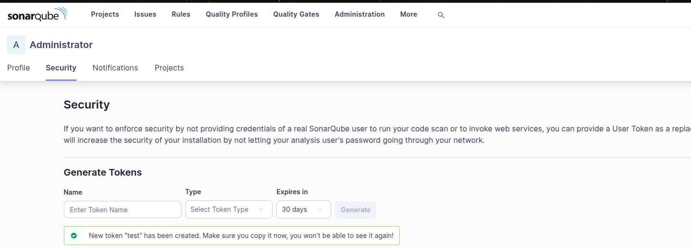
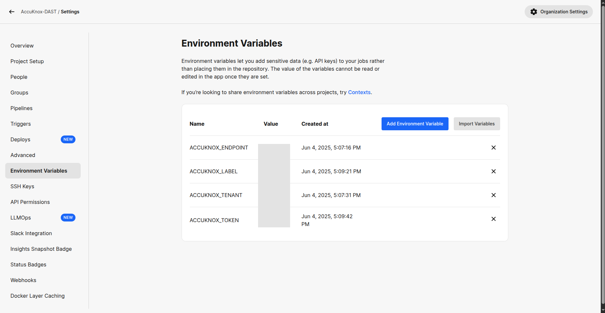
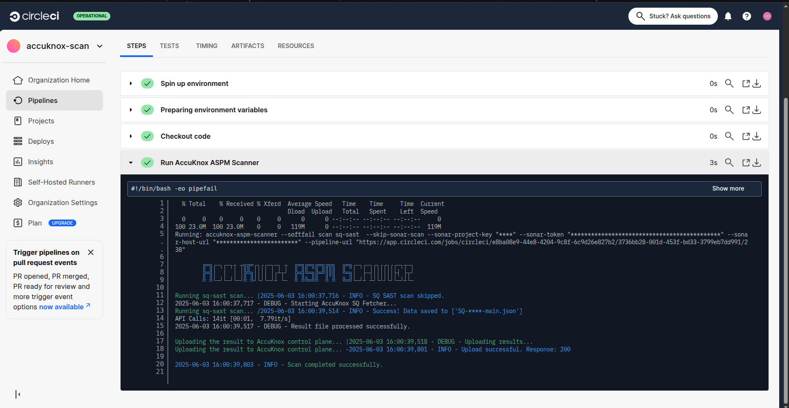
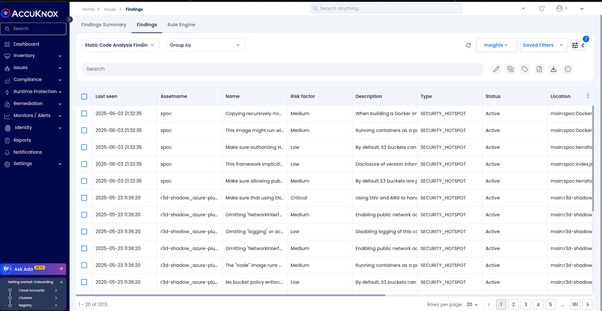
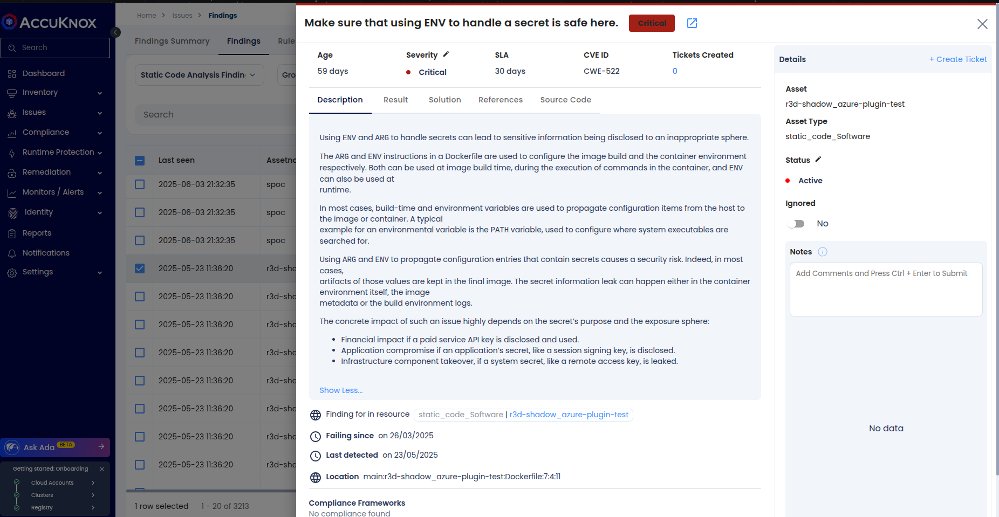
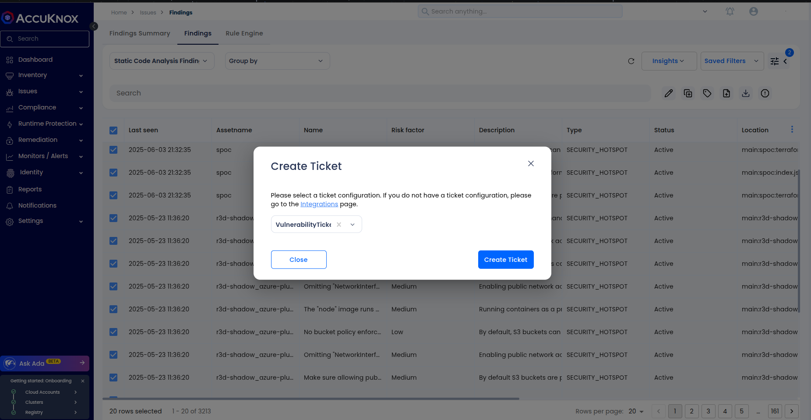

# SonarQube Static Application Security Testing (SQ-SAST) Integration using AccuKnox CircleCI Plugin

This section details the integration of SonarQube-based Static Application Security Testing (SAST) into your CircleCI pipeline using the AccuKnox CircleCI plugin. This integration allows you to statically analyze your source code for vulnerabilities and automatically forward the results to AccuKnox for centralized visibility and triage.

## Prerequisites

Before integrating, ensure you have the following in place:

* A **running instance of SonarQube or SonarCloud**.
* A **configured project in SonarQube**.
* A **CircleCI project** connected to your repository.
* **Admin access** to manage CircleCI Contexts or Environment Variables.
* **Access to the AccuKnox Console**.

## Step 1: Generate Tokens

You'll need to generate API tokens from both SonarQube and AccuKnox.

### In SonarQube:

1.  Go to **My Account → Security**.
2.  **Generate a `SONAR_TOKEN`** (user token).


### In AccuKnox:

1.  Log into your **AccuKnox Console**.
2.  Navigate to **Settings → Tokens**.
3.  **Create a new token** to securely send scan results from CircleCI to AccuKnox. For detailed instructions, refer to the ["How to Create Tokens"](https://help.accuknox.com/how-to/how-to-create-tokens/) documentation.


## Step 2: Configure Environment Variables in CircleCI

You can configure environment variables using either CircleCI Contexts (recommended) or Project-level Environment Variables.

### Required Environment Variables

Here are the variables you'll need to set:

#### SonarQube Variables

| Variable          | Description                               |
| :---------------- | :---------------------------------------- |
| `SONAR_TOKEN`     | User token from SonarQube                 |
| `SONAR_HOST_URL`  | SonarQube instance URL                    |
| `SONAR_PROJECT_KEY` | Unique project key in SonarQube         |
| `SONAR_ORG_ID`    | Required for SonarCloud Enterprise        |

#### AccuKnox Variables

| Variable          | Description                               |
| :---------------- | :---------------------------------------- |
| `ACCUKNOX_TOKEN`  | API Token from AccuKnox Console           |
| `ACCUKNOX_ENDPOINT` | AccuKnox API endpoint (e.g., `https://cspm.demo.accuknox.com`) |
| `ACCUKNOX_TENANT` | Your tenant ID in AccuKnox                |
| `ACCUKNOX_LABEL`  | Logical label to group scan results       |

### Option A: Using CircleCI Contexts (Recommended)

1.  Go to **Organization Settings → Contexts**.
2.  **Create a new context** (e.g., `sonarqube-accuknox-context`).
3.  **Add all the SonarQube and AccuKnox variables** listed above to this new context.
4.  Attach the context to your job as shown in Step 3.

### Option B: Project-Level Variables

1.  Navigate to **Project Settings → Environment Variables**.
2.  **Add the same set of variables** under the project settings.


## Step 3: Update CircleCI Configuration

Add the `sq-sast` job to your `.circleci/config.yml` file and attach the context:

```yaml
version: 2.1

orbs:
  accuknox-scan: accuknox/scan@1.0.0

workflows:
  accuknox:
    jobs:
      - accuknox-scan/sq-sast:
          context: sonarqube-accuknox-context
          SKIP_SONAR_SCAN: false
          SOFT_FAIL: false
```

### Input Parameters

The `accuknox-scan/sq-sast` job accepts the following parameters:

| Parameter        | Description                                       | Default |
| :--------------- | :------------------------------------------------ | :------ |
| `SOFT_FAIL`      | Prevents pipeline failure on vulnerabilities if set to `true`. | `true`  |
| `SKIP_SONAR_SCAN` | If `true`, skips the SonarQube scan step entirely. | `false` |



## View Results in AccuKnox Console

Once the scan completes, you can review the findings in AccuKnox:

1.  Log in to the **AccuKnox Console**.
2.  Navigate to **Issues → Findings → Static Code Analysis Findings**.


3.  Review the results, checking for:
    * **Vulnerability description**
    * **File and line number**
    * **Severity**
    * **Suggested remediation steps**


4.  Optionally, create a ticket in your internal tracking system (e.g., Jira, GitHub Issues) to assign this to your development team.


## Step 5: Remediation Workflow

Follow these steps to remediate identified issues:

1.  **Review and fix the issues** found in the codebase.
2.  **Push your changes** to trigger the CircleCI workflow again.
3.  **Confirm that resolved issues are no longer listed** in both your SonarQube and AccuKnox dashboards.

## Summary

By integrating SonarQube with AccuKnox via CircleCI, you achieve a more robust security posture:

* **Automate static analysis** for every commit.
* **Forward findings securely** to AccuKnox for centralized triage.
* **Align security reviews** with your CI/CD lifecycle.

AccuKnox also supports integrations across other CI tools such as GitHub Actions, Jenkins, GitLab, and Azure DevOps.

For more help, contact `support@accuknox.com` or refer to the [AccuKnox Developer Documentation](https://help.accuknox.com/).