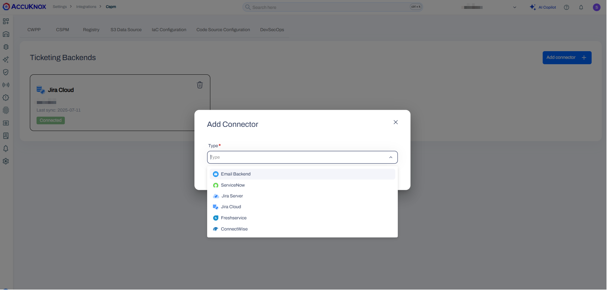
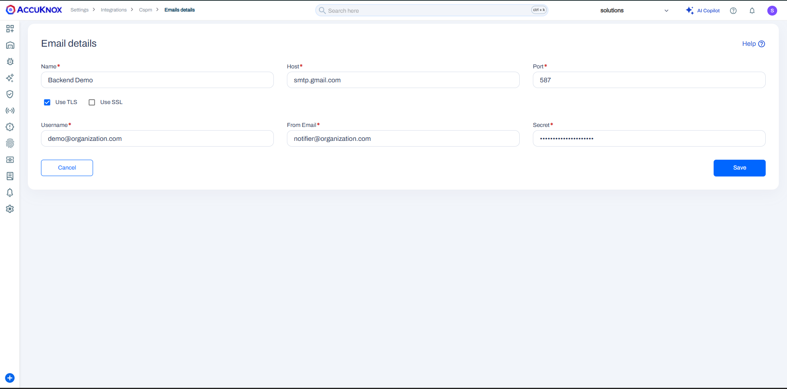

# Email Backend Integration

The Email Backend Integration allows making use of your own SMTP server to send all Emails that originate from the AccuKnox platform.

### Prerequisites

You need to have the following credentials of your SMTP server handy:

- SMTP Hostname

- SMTP Port and whether SSL or TLS needs to be used

- Your SMTP mail address and a trusted address which you would like to be the sender(Both can be same)

- The Password of the SMTP account or an App Password

For Gmail, you can find the credentials following this <a href="https://support.google.com/a/answer/176600?hl=en" target="_blank">help article for SMTP server</a>.

### Integration Steps

- Navigate to Settings → Integrations → CSPM tab

- Click on **Add Connector** and select **Email Backend**

- Specify the following details to make use of the Email Backend:

    - **Name**: Enter the name for the integration. You can set any name. e.g.,`Secure Email Backend`

    - **Host**: The SMTP Hostname. e.g.,`smtp.google.com`

    - **Port**: The port number to be used for the SMTP server. e.g.,`587`

    - Select to use TLS or SSL based on the port number specified in the Port field

    - **Username**: The email address to authenticate with the SMTP server. e.g.,`admin@gmail.com`

    - **From Email**: The email address that will be in the Sender field of the emails. e.g.,`notify@gmail.com`

    - **Secret**: The Password to authenticate with the SMTP server. This could be an <a href="https://support.google.com/accounts/answer/185833?hl=en" target="_blank">App Password</a>

- Click on **Save**

- An email is received on the email address used for integration with the subject "Init Mail" for the AccuKnox tenant.

The Email Backend has now been configured successfully and all emails originating from the AccuKnox platform will henceforth be sent using this SMTP server.
