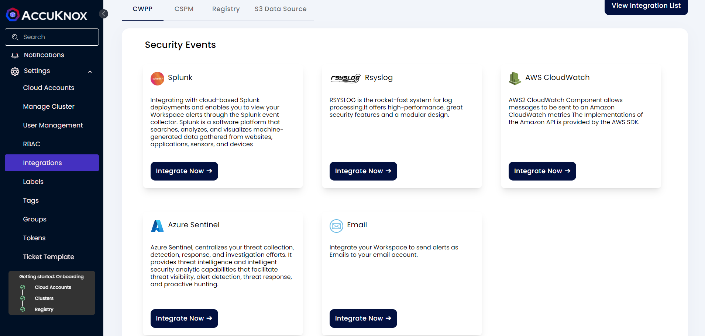
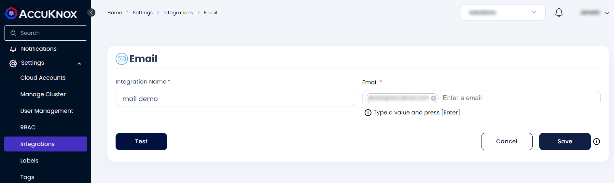

# Email Integration

To send an alert notification via mail you must first set up the Email notification Channel.

### Steps to integrate

- Navigate to Settings → Integrations → CWPP tab

- Click on the **Integrate Now** button for email



- Fill the following fields:

    + **Integration Name**: Enter the name for the integration. You can set any name. e.g., ``` Container Security Alerts ```

    + **Email**: Enter the Email that will receive the notification and press ENTER. You can specify multiple email addresses in this field by pressing ENTER after each email address. e.g.,```demo@organization.com```



- Click **Test** to check the new functionality, You will receive a test mail on the specified mail addresses with subject "Test email"

- Click **Save** to save the Integration. You can now [configure Alert Triggers](./../saas/triggers.md) for Email Notifications.

- - -
[SCHEDULE DEMO](https://www.accuknox.com/contact-us){ .md-button .md-button--primary }