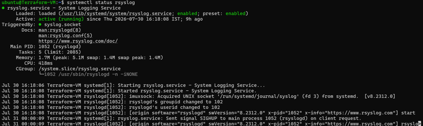
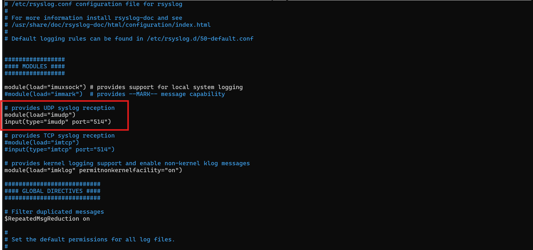
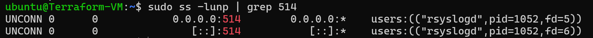
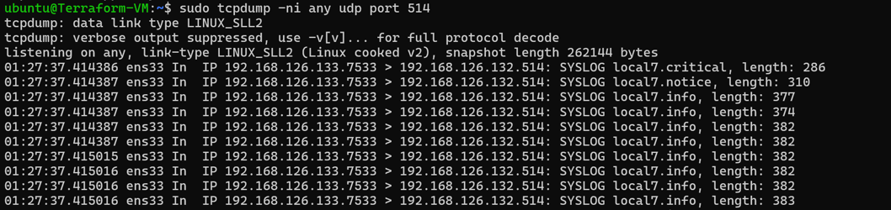
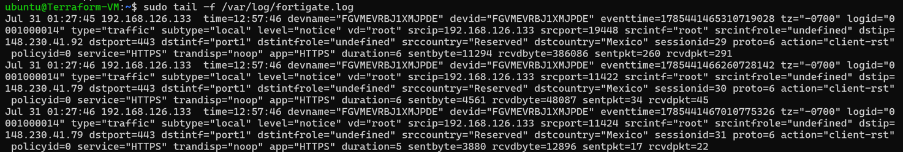
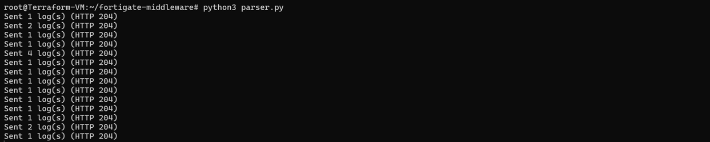
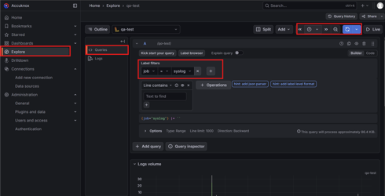
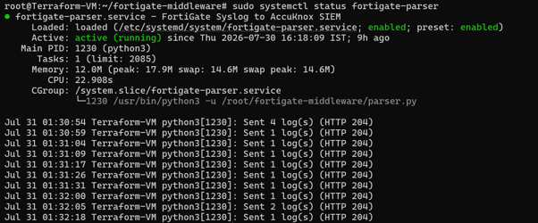

# FortiGate Logs to AccuKnox SIEM

## Overview

This guide shows how to configure a FortiGate firewall to forward Syslog logs to an Ubuntu middleware server, convert the logs into structured JSON, and prepare them for ingestion into AccuKnox SIEM. The middleware acts as an intermediate processing layer that receives FortiGate Syslog events, parses them into JSON, and continuously forwards structured security events for analysis within the AccuKnox platform.

The integration flow is:

```
FortiGate Firewall → Ubuntu middleware (rsyslog) → Python parser (NDJSON) → AccuKnox SIEM
```

## Prerequisites

- FortiGate firewall
- Ubuntu/Linux middleware server
- Network connectivity between the FortiGate firewall and the middleware server
- Root or sudo access on the middleware server
- rsyslog
- Python 3
- Python requests library

## Step 1: Configure the Network

Configure the network as shown below.

| Device | IP Address | Purpose |
| -- | -- | -- |
| Ubuntu Middleware VM | 192.168.126.132 | Receives Syslog |
| FortiGate Port1 | 192.168.126.133 | Sends Syslog |
| FortiGate Port2 | 192.168.17.11 | Internal Interface |

Verify that both the FortiGate and Ubuntu middleware are reachable over the same subnet.

## Step 2: Configure FortiGate Syslog

Login to the FortiGate CLI, then configure Syslog forwarding.

```sh
config log syslogd setting
    set status enable
    set server 192.168.126.132
    set mode udp
    set port 514
end
```

This forwards FortiGate Syslog events to the middleware over UDP port 514.

## Step 3: Install rsyslog

Update the package repository.

```sh
sudo apt update
```

Install rsyslog.

```sh
sudo apt install rsyslog -y
```

Verify the installation.

```sh
systemctl status rsyslog
```

Expected:

```
Active: active (running)
```



## Step 4: Enable UDP Syslog Listener

Open the rsyslog configuration.

```sh
sudo nano /etc/rsyslog.conf
```

Enable the UDP listener.

```sh
module(load="imudp")
input(type="imudp" port="514")
```



Restart rsyslog.

```sh
sudo systemctl restart rsyslog
```

## Step 5: Configure FortiGate Log Filtering

Create a dedicated FortiGate configuration file.

```sh
sudo nano /etc/rsyslog.d/10-fortigate.conf
```

Add the following configuration.

```sh
template(name="FortiGateFormat" type="string"
string="%timestamp% %fromhost-ip% %msg%\n")

if ($fromhost-ip == '192.168.126.133') then {
    action(
        type="omfile"
        file="/var/log/fortigate.log"
        template="FortiGateFormat"
    )
    stop
}
```

This configuration filters logs received from the FortiGate firewall and stores them in `/var/log/fortigate.log`.

## Step 6: Restart rsyslog

Restart the service.

```sh
sudo systemctl restart rsyslog
```

Verify the status.

```sh
sudo systemctl status rsyslog
```

Expected:

```
Active: active (running)
```

## Step 7: Verify UDP Listener

Verify that rsyslog is listening on UDP port 514.

```sh
sudo ss -lunp | grep 514
```

Expected:

```
0.0.0.0:514
```



## Step 8: Verify Firewall Configuration

Check the Ubuntu firewall.

```sh
sudo ufw status
```

Verify that UDP port 514 is allowed.

## Step 9: Verify Syslog Traffic

Capture incoming packets.

```sh
sudo tcpdump -ni any udp port 514
```

Expected output should show packets similar to:

```
192.168.126.133 → 192.168.126.132:514
```



This confirms that:

- FortiGate is transmitting Syslog events.
- The middleware is receiving the packets successfully.

## Step 10: Verify Log Collection

Monitor the FortiGate log file.

```sh
sudo tail -f /var/log/fortigate.log
```

Example output:

```
2026-07-21T14:01:06
192.168.126.133
type="traffic"
action="accept"
srcip=192.168.126.133
dstip=96.45.45.45
service="DNS"
```

Open the created middleware configuration and verify that incoming FortiGate Syslog events are written to `/var/log/fortigate.log`.



## Step 11: Verify Python Installation

Verify that Python 3 is installed on the middleware server.

```sh
python3 --version
```

Expected output:

```
Python 3.12.3
```

## Step 12: Create the Working Directory

Create a dedicated directory for the FortiGate middleware parser.

```sh
mkdir ~/fortigate-middleware
cd ~/fortigate-middleware
```

Verify the current working directory.

```sh
pwd
```

Expected output:

```
/root/fortigate-middleware
```

## Step 13: Create the Syslog Parser

Create the parser file.

```sh
nano parser.py
```

Paste the following code into `parser.py`. Replace `SIEM_URL` with the Syslog push endpoint for your own AccuKnox SIEM tenant.

```py
import json
import re
import time
import requests

LOG_FILE = "/var/log/fortigate.log"
SIEM_URL = "https://in.siem.v2.accuknox.com/in-prod-siem-v2/<tenant-name>/<push-token>/syslog/push"

MAX_BATCH_SIZE = 3 * 1024 * 1024  # 3 MB
BATCH_TIMEOUT = 5  # seconds

LOG_PATTERN = re.compile(r'(\w+)=(".*?"|\S+)')


def parse_log(line):
    data = {
        "received_at": time.strftime("%Y-%m-%d %H:%M:%S")
    }

    for key, value in LOG_PATTERN.findall(line):
        data[key] = value.strip('"')

    return data


def send_batch(buffer):
    if not buffer:
        return

    payload = "\n".join(buffer)

    try:
        response = requests.post(
            SIEM_URL,
            data=payload,
            headers={"Content-Type": "application/x-ndjson"},
            timeout=30
        )

        response.raise_for_status()

        print(f"Sent {len(buffer)} log(s) (HTTP {response.status_code})")

    except requests.RequestException as e:
        print(f"Failed to send logs: {e}")


buffer = []
batch_size = 0
last_send = time.time()

with open(LOG_FILE, "r") as log_file:
    log_file.seek(0, 2)

    while True:
        line = log_file.readline()

        if line:
            json_line = json.dumps(
                parse_log(line),
                ensure_ascii=False,
                separators=(",", ":")
            )

            buffer.append(json_line)
            batch_size += len(json_line.encode("utf-8")) + 1

        else:
            time.sleep(0.2)

        current_time = time.time()

        if buffer and (
            batch_size >= MAX_BATCH_SIZE
            or current_time - last_send >= BATCH_TIMEOUT
        ):
            send_batch(buffer)
            buffer.clear()
            batch_size = 0
            last_send = current_time
```

Save the file.

## Step 14: Execute the Parser

Run the parser manually.

```sh
python3 parser.py
```

The parser continuously monitors newly generated FortiGate Syslog events and forwards them to the configured AccuKnox SIEM endpoint in NDJSON format.



## Step 15: Verify Log Forwarding

Generate traffic through the FortiGate firewall. For example:

- Ping external IPs
- Login to the FortiGate GUI

These activities generate Syslog events. The parser then:

- Reads the new Syslog event
- Converts it into JSON
- Buffers multiple JSON objects
- Creates an NDJSON payload and adds it to the current batch
- Sends the batch to the AccuKnox SIEM endpoint every 5 seconds, or sooner when the batch size reaches 3 MB

A successful upload returns an HTTP success response (204 No Content). This confirms that FortiGate logs are reaching AccuKnox SIEM.

## Step 16: Verify Logs in AccuKnox SIEM

Open the AccuKnox SIEM Dashboard.

```
https://in.siem.v2.accuknox.com/dashboards/<tenant-name>
```

Navigate to **Explore** and run a query similar to:

```
{job=~"syslog"}
```

Verify that newly generated FortiGate events appear in the log stream.



## Step 17: Configure the Parser as a systemd Service

Create a systemd service so that the parser starts automatically after every system reboot.

Create the service file.

```sh
sudo nano /etc/systemd/system/fortigate-parser.service
```

Add the following configuration.

```ini
[Unit]
Description=FortiGate Syslog to AccuKnox SIEM Forwarder
After=network.target rsyslog.service

[Service]
Type=simple
User=root
WorkingDirectory=/root/fortigate-middleware
ExecStart=/usr/bin/python3 -u /root/fortigate-middleware/parser.py
Restart=always
RestartSec=5

[Install]
WantedBy=multi-user.target
```

Reload systemd.

```sh
sudo systemctl daemon-reload
```

Enable the service.

```sh
sudo systemctl enable fortigate-parser
```

Start the service.

```sh
sudo systemctl start fortigate-parser
```

## Step 18: Verify the Parser Service

Verify that the parser service is running.

```sh
sudo systemctl status fortigate-parser
```

Expected output:

```
Active: active (running)
```



Monitor the service logs.

```sh
sudo journalctl -u fortigate-parser -f
```

The service continuously monitors new FortiGate Syslog events, converts them into structured JSON, batches them into NDJSON, and forwards them to the configured AccuKnox SIEM endpoint.

- - -
[SCHEDULE DEMO](https://www.accuknox.com/contact-us){ .md-button .md-button--primary }
