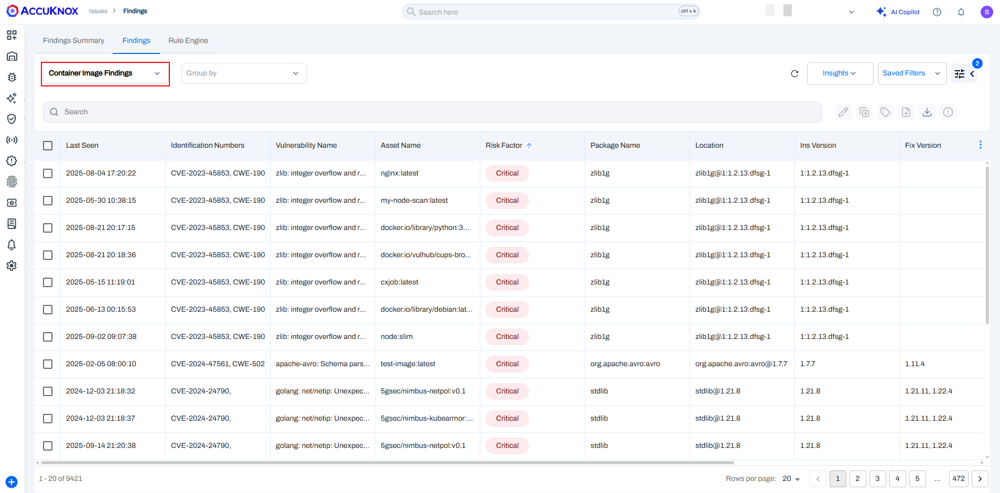
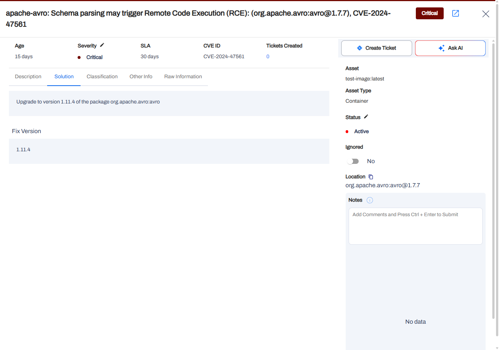

In this guide, we demonstrate how to incorporate AccuKnox's container scanning capabilities into a GitHub Actions workflow. The process ensures that vulnerabilities in Docker images are identified and remediated before deployment, significantly improving the security posture of your CI/CD pipeline.

## **Scenario Before Integration**

- **Context**: The Docker image was built using an outdated base image (`node:15-slim`) with known vulnerabilities, introducing security risks into the deployment pipeline.

- **Issues**:

    - Vulnerabilities in the base image were not detected.

    - The image was pushed to the registry without any security validation.

## **Steps for Integrating AccuKnox**

### **Step 1: Generate AccuKnox Token**

Log in to AccuKnox Navigate to Settings and select Tokens to create an AccuKnox token for forwarding scan results to SaaS. For details on generating tokens, refer to [How to Create Tokens](https://help.accuknox.com/how-to/how-to-create-tokens/?h=token "https://help.accuknox.com/how-to/how-to-create-tokens/?h=token").

### **Step 2: Configure GitHub Secrets**

Store the following values as GitHub repository secrets:

- `TOKEN`: AccuKnox API token.

- `TENANT_ID`: AccuKnox Tenant ID.

- `LABEL`: Custom label for associating scan results.

- `ENDPOINT`: (Optional) AccuKnox API URL (default: `cspm.demo.accuknox.com`).

### **Step 3: Set Up GitHub Actions Workflow**

Create a workflow YAML file in your repository `.github/workflows/accuknox-scan.yml`:


```yaml
name: AccuKnox Scan Workflow

on:
  push:
    branches:
      - main
  pull_request:
    branches:
      - main

jobs:
  accuknox-cicd:
    runs-on: ubuntu-latest
    steps:
      - name: Checkout code
        uses: actions/checkout@v3

      - name: Run AccuKnox CSPM Scan
        uses: accuknox/container-scan-action@v0.0.1
        with:
          token: ${{ secrets.TOKEN }}
          tenant_id: ${{ secrets.TENANT_ID }}
          repository_name: ${{ github.repository }}
          label: ${{ secrets.LABEL }}
          endpoint: ${{ secrets.ENDPOINT }}
          dockerfile_context: Dockerfile
          tag: ${{ github.run_id }}
          severity: CRITICAL
          exit_code: 1

```


## **Scenario After Integration**

- **Workflow Enhancements**:

    - The pipeline scans Docker images during the build process.

    - Critical vulnerabilities halt the pipeline, ensuring only secure images are deployed.

- **Outcome**:

    - Vulnerabilities are identified and remediated before the image reaches production.

    - Secure images are pushed to the registry with confidence.

## **Viewing Results in AccuKnox SaaS**

1. Navigate to **Issues > RegistryScan** to view scan results.



1. Click on the repository name to see detailed findings, including:

    - **Metadata**: Information about the scanned image.

    - **Vulnerabilities**: A list of detected issues with severity and actionable insights.

    - **Resources**: Packages and modules included in the image.

    - **Scan History**: Logs of all triggered scans.





## **Conclusion**

By integrating AccuKnox into your GitHub CI/CD pipeline, container images are scanned and validated for security vulnerabilities. The integration prevents insecure images from being deployed and ensures a secure development lifecycle.
