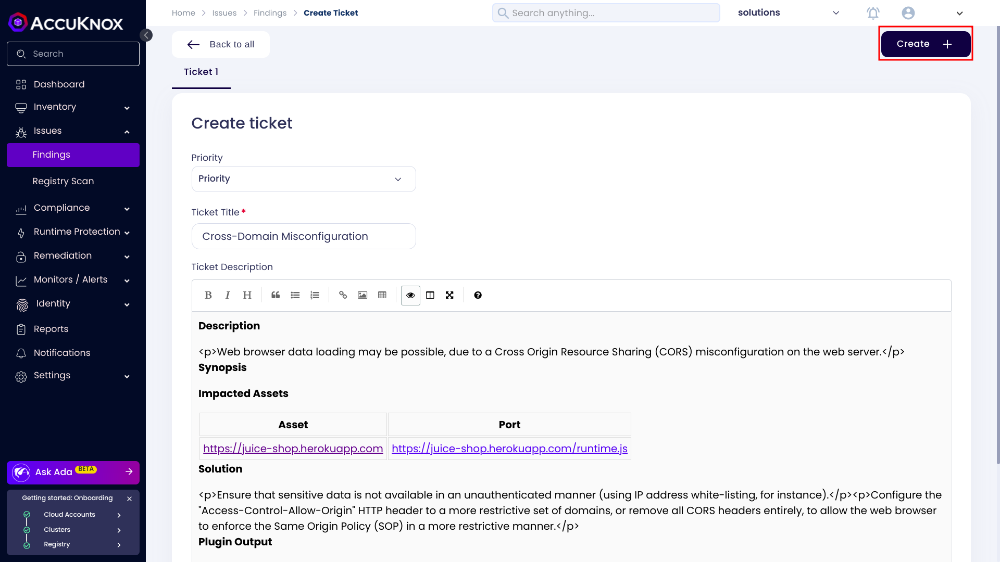

To demonstrate the benefits of incorporating AccuKnox into a CI/CD pipeline using GitHub Actions to enhance security, consider a specific scenario involving a domain with known vulnerabilities. By integrating AccuKnox scanning into the pipeline, we can identify and resolve these security issues.

## Prerequisites

- GitHub repository access.

- AccuKnox platform access.

## Steps for Integration

### Step 1: Log in to AccuKnox

Log in to AccuKnox Navigate to Settings and select Tokens to create an AccuKnox token for forwarding scan results to SaaS. For details on generating tokens, refer to [How to Create Tokens](https://help.accuknox.com/how-to/how-to-create-tokens/?h=token "https://help.accuknox.com/how-to/how-to-create-tokens/?h=token").

### Step 2: Configure GitHub Secrets

Add the following secrets in your GitHub repository under **Settings > Secrets and Variables > Actions**:

| **Secret Name**      | **Description**                                      |
|-----------------------|------------------------------------------------------|
| `ACCUKNOX_TOKEN`      | AccuKnox API token for authorization.                |
| `ACCUKNOX_ENDPOINT`   | The AccuKnox API URL (e.g., `cspm.demo.accuknox.com`).|
| `TENANT_ID`           | Your AccuKnox tenant ID.                             |


### Step 3: Set Up GitHub Actions Workflow

Create or update the `.github/workflows/dast-scan.yml` file in your repository with the following YAML configuration:



```yaml
name: AccuKnox DAST Scan Workflow
on:
  push:
    branches:
      - main

jobs:
  dast-scan:
    runs-on: ubuntu-latest
    steps:
      - name: Checkout code
        uses: actions/checkout@v2

      - name: Run AccuKnox DAST Scan
        uses: accuknox/dast-scan-action@v1.0.0
        with:
          target_url: "http://testphp.vulnweb.com"
          accuknox_endpoint: ${{ secrets.ACCUKNOX_ENDPOINT }}
          tenant_id: ${{ secrets.TENANT_ID }}
          accuknox_token: ${{ secrets.ACCUKNOX_TOKEN }}
          label: "my-dast-scan"
          severity_threshold: "High"
          scan_type: "baseline"
```



!!!info "NOTE"
    The `label` parameter in the workflow (`"my-dast-scan"`) helps identify the scan in AccuKnox. You can customize this label by updating the value in the YAML file. For more details on creating and managing labels, refer to the [How to Create Labels](https://help.accuknox.com/how-to/how-to-create-labels/) documentation.

## Initial Workflow Without AccuKnox Scan

Initially, the CI/CD pipeline does not include the AccuKnox scan. When you push changes to the repository, no security checks are performed, potentially allowing security issues in the application.

## Workflow After AccuKnox Scan Integration

After integrating AccuKnox into your GitHub Actions workflow, the next push triggers the pipeline to run a DAST scan. The AccuKnox scan identifies potential vulnerabilities in the application.


**View Results in AccuKnox SaaS**[¶](https://help.accuknox.com/integrations/azure-dast/#view-results-in-accuknox-saas "https://help.accuknox.com/integrations/azure-dast/#view-results-in-accuknox-saas")

**Step 1**: After the workflow completes, navigate to the AccuKnox SaaS dashboard.

**Step 2**: Go to **Issues** > **Findings** and select **DAST Findings** to see identified vulnerabilities.


**Step 3**: Click on a vulnerability to view more details.


**Step 4**: Fix the Vulnerability

Follow the instructions in the Solutions tab to fix the vulnerability (e.g., Cross-Domain Misconfiguration).


**Step 5**: Create a Ticket for Fixing the Vulnerability

Create a ticket in your issue tracking system to address the identified vulnerability.



**Step 6**: Review Updated Results

- After fixing the vulnerability, rerun the Github CI/CD pipeline.

- Navigate to the AccuKnox SaaS dashboard and verify that the vulnerability has been resolved.

## Conclusion

GitHub Actions, combined with AccuKnox scanning, provides enhanced security by identifying and mitigating vulnerabilities during the CI/CD process. This integration offers visibility into potential security issues and helps ensure a secure deployment environment. AccuKnox DAST integrates seamlessly with various CI/CD tools, including Jenkins, GitHub, GitLab, Azure Pipelines, and AWS CodePipelines.
