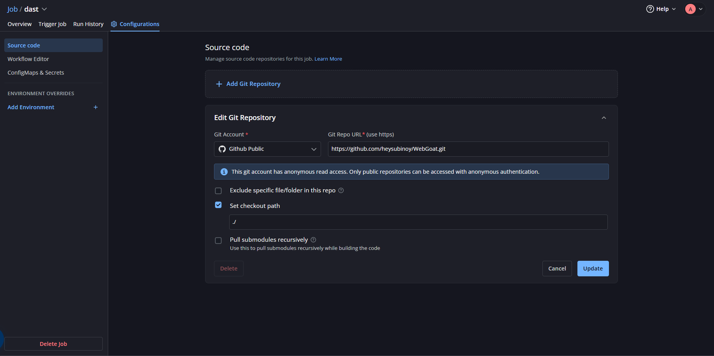
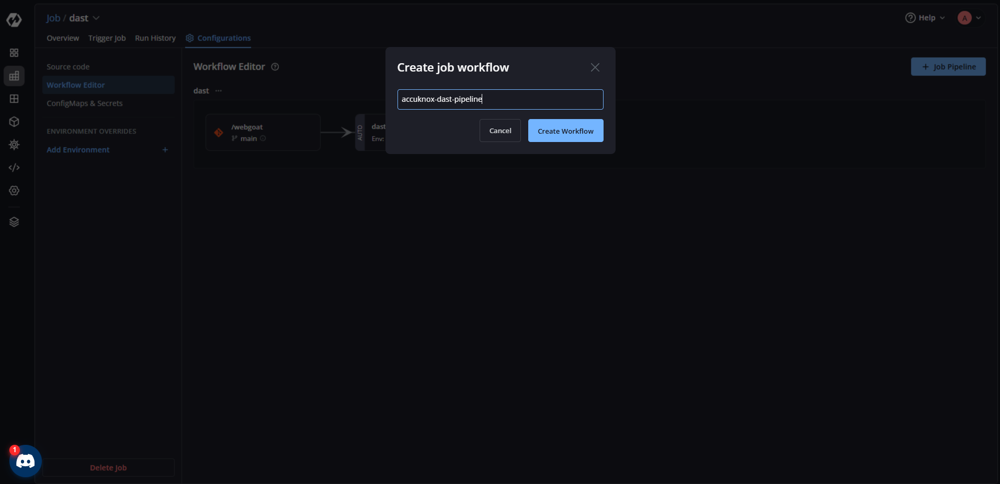
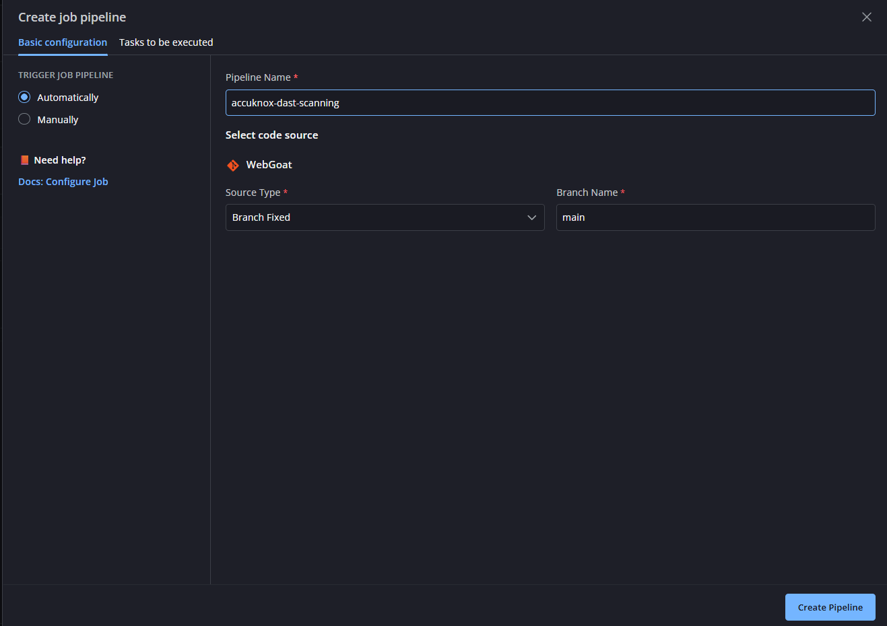
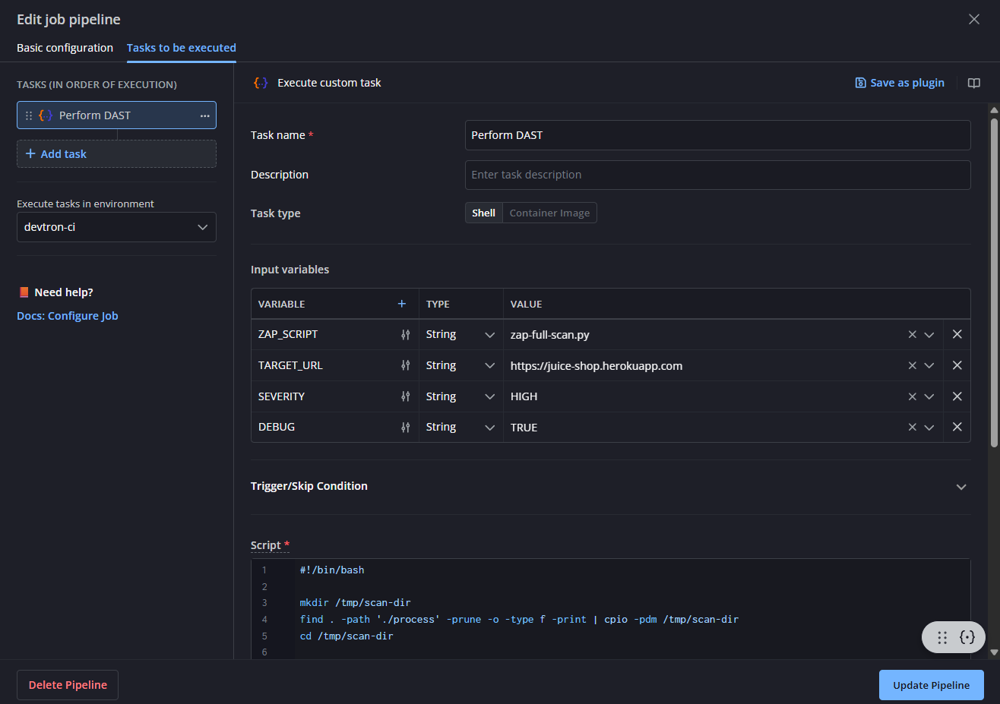
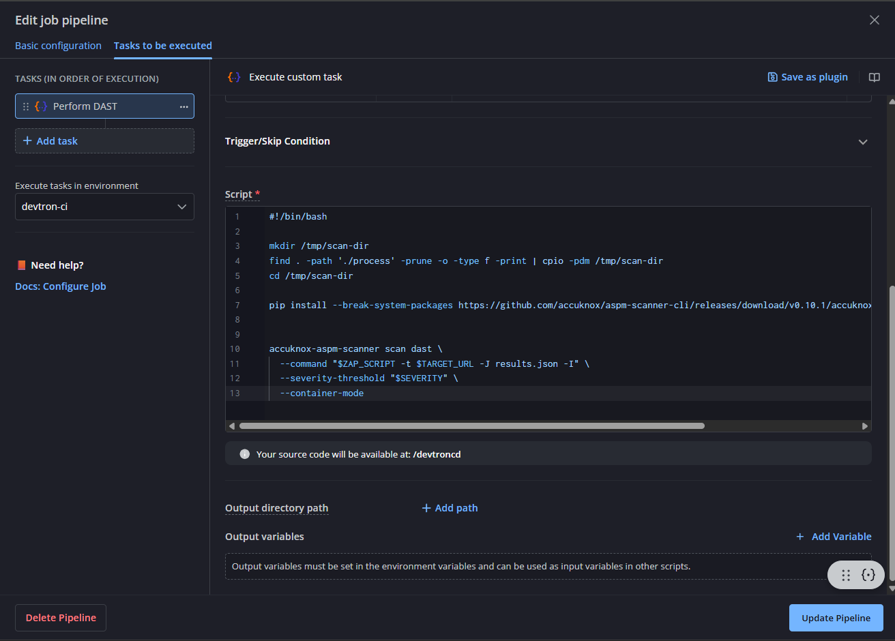
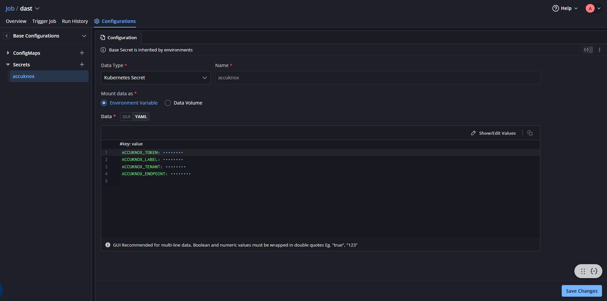
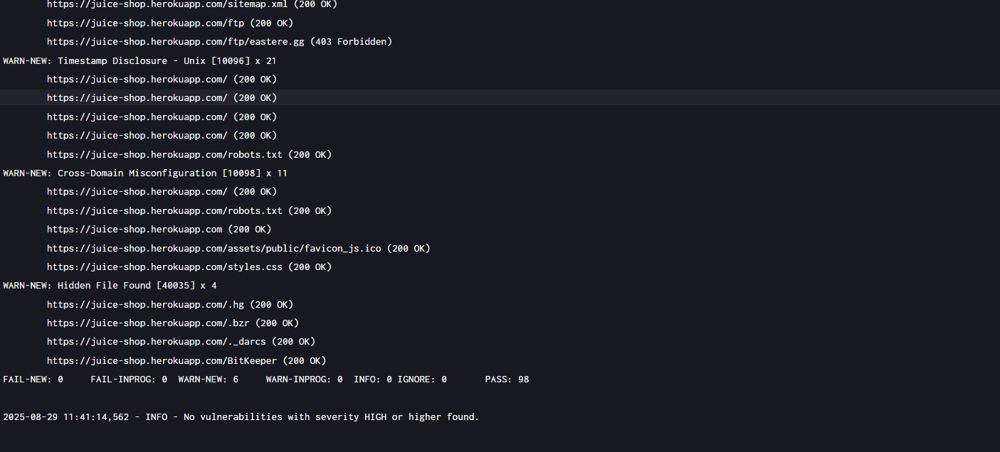
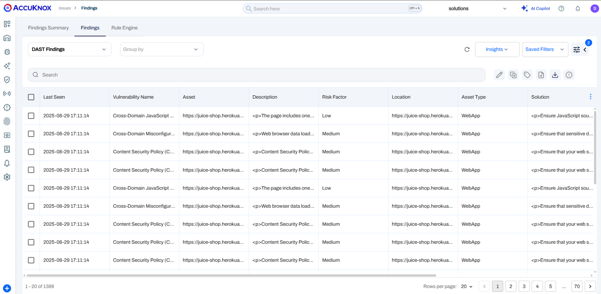

# AccuKnox ASPM DAST on Devtron with GitHub Integration

This document outlines the process of configuring **AccuKnox ASPM DAST scans** using **Devtron** and **GitHub**.
The setup ensures that every code push to the configured branch triggers an automated DAST scan.

## Prerequisites

- A running **Devtron instance** with admin access
- A **GitHub repository** containing your application code
- AccuKnox ASPM DAST **API credentials** (Tenant ID, Token, Endpoint, Label, etc.)
- Docker access on the Devtron cluster

## Setup Steps

### 1. Create a Job in Devtron

1. From the **Devtron dashboard**, go to **Create → Job**.
2. Select **Source Code**.
3. Choose your **Git Account**.
4. Enter the **Git URL** of your repository.
5. Add an empty `devtron-ci.yaml` to the root of your git directory:

```yaml
version: v1
pipeline:
  - name: clone-only
    type: CI
    tasks: []
```



### 2. Create Job Workflow

1. Open the created job → **Create Workflow**.
2. Inside the workflow, **create a new pipeline**:
   - **Name** → e.g., `accuknox-dast-pipeline`
   - **Source Type** → Branch Fixed
   - **Branch Name** → The branch you want to scan (e.g., `main` or `develop`)

3. In **Basic Configuration**, select **Automatically** trigger.



### 3. Add DAST Task in Workflow

1. Inside the pipeline, go to **Task to be executed → Add Task**.
2. Configure task:

   * **Task Name** → `Perform DAST`
   * **Task Type** → `Shell`
   * Paste your **DAST shell script**

**Example execution command:**

```bash
#!/bin/bash

mkdir /tmp/scan-dir
find . -path './process' -prune -o -type f -print | cpio -pdm /tmp/scan-dir
cd /tmp/scan-dir

pip install --break-system-packages https://github.com/accuknox/aspm-scanner-cli/releases/download/v0.10.1/accuknox_aspm_scanner-0.10.1-py3-none-any.whl

accuknox-aspm-scanner scan dast\
  --command "$ZAP_SCRIPT -t $TARGET_URL -J results.json -I"\
  --severity-threshold "$SEVERITY"\
  --container-mode
```

### 4. Input Variables

Add the necessary input variables for the script:

| **Variable Name** | **Type** | **Value / Options**                                                               | **Description**                                                                                                       |
| ----------------- | -------- | --------------------------------------------------------------------------------- | --------------------------------------------------------------------------------------------------------------------- |
| `SEVERITY`        | String   | HIGH / MEDIUM / LOW                                                               | Minimum severity level that will fail the job. Example: `SEVERITY=HIGH` fails only if HIGH vulnerabilities are found. |
| `TARGET_URL`      | String   | URL (e.g., [https://juice-shop.herokuapp.com](https://juice-shop.herokuapp.com/)) | The web application endpoint that ZAP will scan.                                                                      |
| `ZAP_SCRIPT`      | String   | `zap-full-scan.py` / `zap-baseline.py`                                            | `zap-full-scan.py` performs a full active scan (modifies target). `zap-baseline.py` performs a passive scan (safer).  |







### 5. Add AccuKnox Credentials (ConfigMaps & Secrets)

1. Go to **ConfigMaps and Secrets** section.
2. Add required environment variables:

**Environment Variables (Examples):**

```bash
ACCUKNOX_ENDPOINT=cspm.demo.accuknox.com
ACCUKNOX_TENANT=XXX
ACCUKNOX_LABEL=test123
ACCUKNOX_TOKEN=your_api_token_here
```

3. Choose **Mount Data as an Environment Variable**.



### 6. Triggering the Scan

* Once the setup is done, every **GitHub push** to the specified branch will trigger the Devtron job.
* The job will:

  1. Pull the latest code
  2. Run the **AccuKnox ASPM DAST shell script** inside the container against your provided URL
  3. Upload scan results to the **AccuKnox dashboard**





