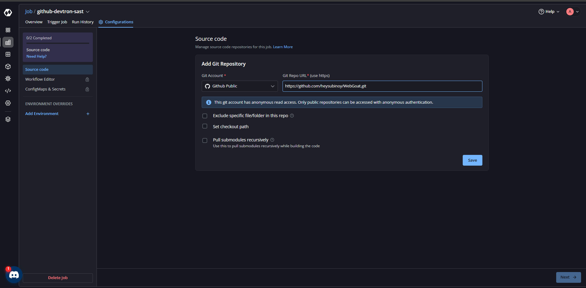
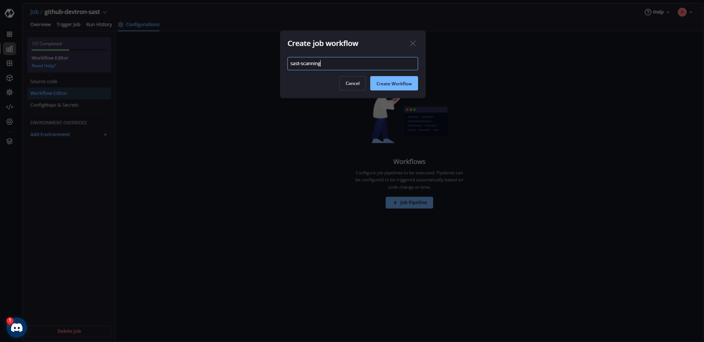
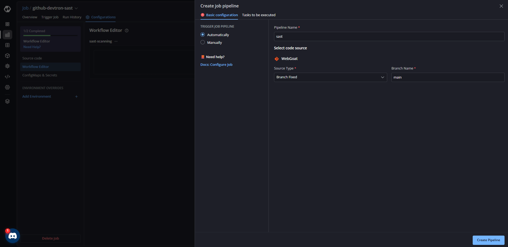
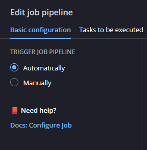
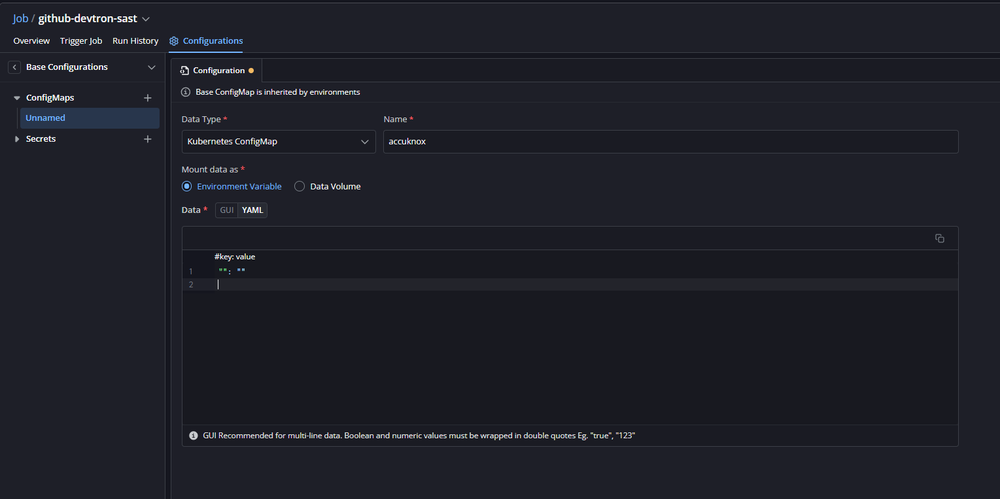
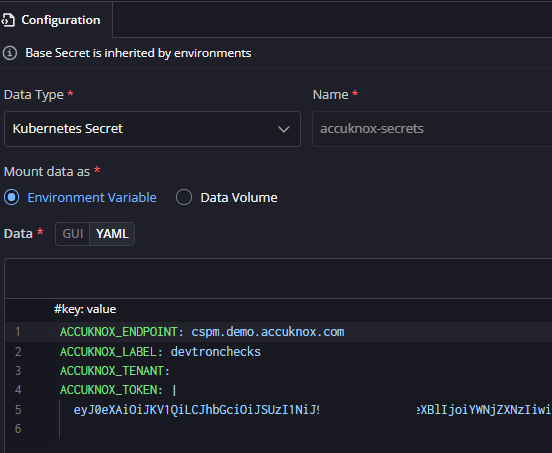
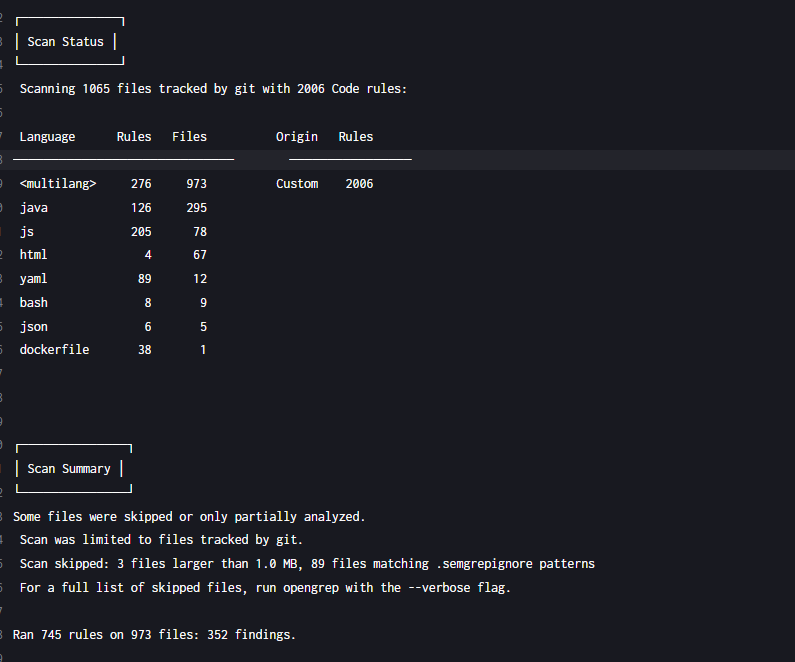
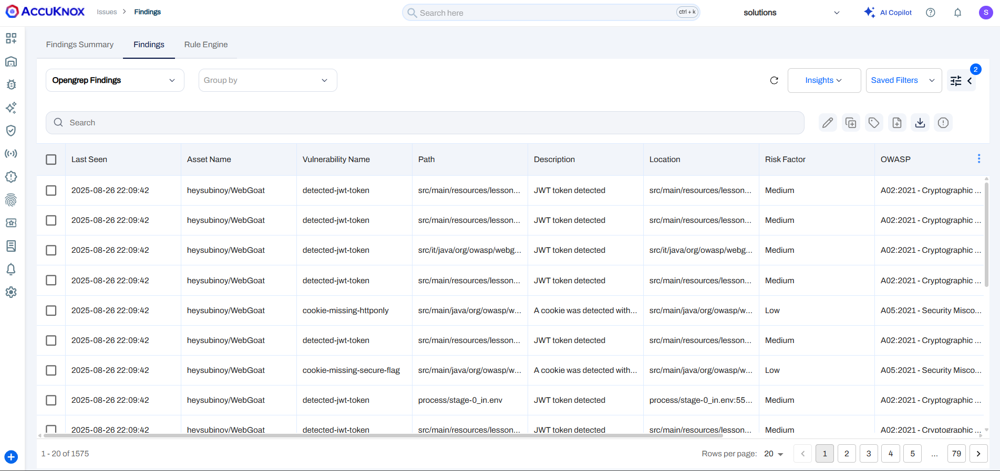

# AccuKnox ASPM SAST on Devtron with GitHub Integration


This document outlines the process of configuring **AccuKnox ASPM SAST scans** using **Devtron** and GitHub. The setup ensures that every code push to the configured branch triggers an automated SAST scan.

## Prerequisites

* A running **Devtron instance** with admin access
* A **GitHub repository** containing your application code
* AccuKnox ASPM SAST **API credentials (Tenant ID, Token, Endpoint, Label, etc.)**

## Setup Steps

### 1. Create a Job in Devtron

1. From the **Devtron dashboard**, go to **Create → Job**.
2. Select **Source Code**.
3. Choose your **Git Account**.
4. Enter the **Git URL** of your repository.

   * For private repos, use this: [https://docs.devtron.ai/global-configurations/git-accounts](https://docs.devtron.ai/global-configurations/git-accounts)
5. Add an empty `devtron-ci.yaml` to the root of your Git directory (this ensures the repo is cloned by Devtron):



```yaml
version: v1
pipeline:
  - name: clone-only
    type: CI
    tasks: []
```

### 2. Create Job Workflow

1. Open the created job → **Create Workflow**.
2. Inside the workflow, **create a new pipeline**:

   * **Name** → e.g., `accuknox-sast-pipeline`
   * **Source Type** → Branch Fixed
   * **Branch Name** → The branch you want to scan (e.g., `main` or `develop`)
3. In **Basic Configuration**, select **Automatically** trigger.









### 3. Add SAST Task in Workflow

1. Inside the pipeline, **Task to be executed → Add Task**.
2. Configure task:

   * **Task Name** → `Perform SAST`
   * **Task Type** → Shell
   * Paste your **SAST scan shell script**

> N.B — We are using [ASPM CLI by AccuKnox](https://github.com/accuknox/aspm-scanner-cli)

**Example execution command:**

```bash
#!/bin/bash

mkdir /tmp/scan-dir
find . -path './process' -prune -o -type f -print | cpio -pdm /tmp/scan-dir
cd /tmp/scan-dir

pip install --break-system-packages https://github.com/accuknox/aspm-scanner-cli/releases/download/v0.10.1/accuknox_aspm_scanner-0.10.1-py3-none-any.whl
accuknox-aspm-scanner scan --softfail sast
```

### 4. Add AccuKnox Credentials (ConfigMaps & Secrets)

1. Go to **ConfigMaps and Secrets** section.
2. Add required environment variables:

**Environment Variables (Examples):**

```bash
ACCUKNOX_ENDPOINT=https://cspm.demo.accuknox.com
ACCUKNOX_TENANT=XXX
ACCUKNOX_LABEL=test123
ACCUKNOX_TOKEN=your_api_token_here
```

3. Choose **Mount Data as Environment Variable**.




### 5. Triggering the Scan

Once the setup is done, every **GitHub push** to the specified branch will trigger the Devtron job.

The job will:

1. Pull the latest code
2. Run the **AccuKnox ASPM SAST shell script** inside the container
3. Upload scan results to the **AccuKnox dashboard**




