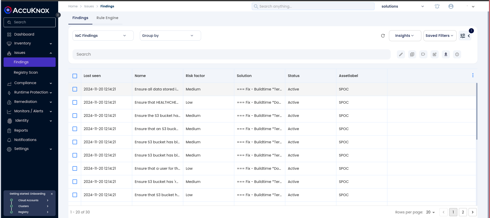
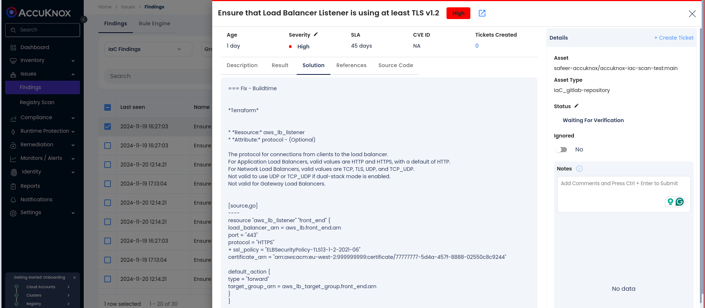
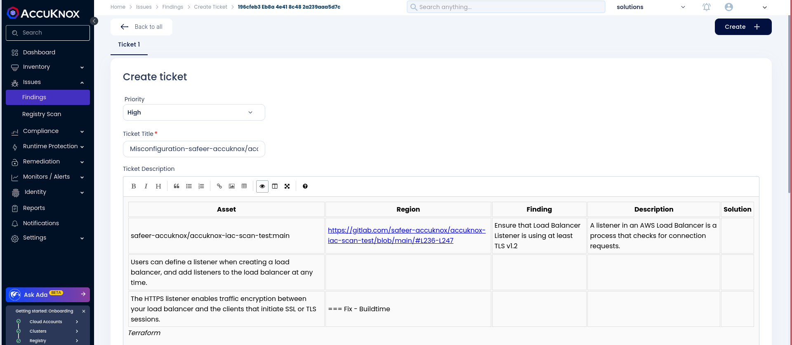

# Integrating IaC with AccuKnox in a GitHub CI/CD Pipeline

This guide demonstrates how to integrate Infrastructure as Code (IaC) security into a GitHub CI/CD pipeline using AccuKnox. We will implement automated checks to identify configuration vulnerabilities in your IaC templates and send the results to AccuKnox for thorough analysis and remediation. This approach ensures your infrastructure is resilient and aligns with security best practices, effectively minimizing deployment risks.

## Pre-requisites

1. **GitHub Repository Access**

2. **AccuKnox Platform Access**

## **Steps for Integration**

### **Step 1: Log in to AccuKnox**

Navigate to **Settings** in the AccuKnox platform and select **Tokens** to create an AccuKnox token. This token will be used to forward scan results to SaaS.
Refer to [How to Create Tokens] for details [on generating tokens](https://help.accuknox.com/how-to/how-to-create-tokens/?h=token "https://help.accuknox.com/how-to/how-to-create-tokens/?h=token").

### **Step 2: Configure GitHub Secrets**

Go to your GitHub repository and configure the following secrets:

- `TOKEN`: AccuKnox API token for authorization.

- `TENANT_ID`: Your AccuKnox tenant ID.

- `ENDPOINT`: The AccuKnox API URL (e.g., `cspm.demo.accuknox.com`).

- `LABEL`: The label for your scan.

To add secrets, go to **Settings > Secrets and variables > Actions > New repository secret** in your GitHub repository.

### **Step 3: Set Up the GitHub Actions Workflow**

Create or edit a GitHub Actions workflow YAML file (e.g., `.github/workflows/iac-scan.yml`) with the following configuration:



```yaml
name: AccuKnox IaC Scan Workflow

on:
  push:
    branches:
      - main
  pull_request:
    branches:
      - main

jobs:
  tests:
    runs-on: ubuntu-latest
    steps:
      - name: Checkout code
        uses: actions/checkout@v3

      - name: Run IaC scan
        uses: accuknox/iac-scan-action@v0.0.1
        with:
          directory: "." # Optional: Directory to scan
          compact: true  # Optional: Minimize output
          quiet: true    # Optional: Show only failed checks
          output_format: json  # Optional: Format of output
          output_file_path: "./results.json" # Optional: Output file path
          token: ${{ secrets.TOKEN }}
          tenant_id: ${{ secrets.TENANT_ID }}
          endpoint: ${{ secrets.ENDPOINT }}
          label: ${{ secrets.LABEL }}
```


## **Initial CI/CD Pipeline Without AccuKnox IaC Scan**

Initially, the GitHub Actions workflow does not include the AccuKnox IaC scan. When changes are pushed to the repository, no infrastructure security checks are performed, potentially allowing misconfigurations or vulnerabilities in the IaC code.

## **CI/CD Pipeline After AccuKnox IaC Scan Integration**

Once the AccuKnox IaC scan is integrated into the GitHub Actions workflow, every push or pull request triggers an IaC security scan. This scan identifies potential vulnerabilities or misconfigurations in the infrastructure code, enhancing security before deployment. The findings are then sent to the AccuKnox platform.

## **View Results in AccuKnox SaaS**

**Step 1:** After the pipeline completes, navigate to the **AccuKnox SaaS Dashboard**

**Step 2:** Go to **Issues > Findings** and select **IaC Findings** to see identified vulnerabilities



**Step 3:** Click on a vulnerability to view more details and follow the instructions in the **Solutions** tab



**Step 4:** For unresolved vulnerabilities, create a ticket in your issue tracking system



**Step 5:** After fixing the vulnerabilities, rerun the GitHub Actions workflow and verify that the issues have been resolved in the AccuKnox dashboard

## **Conclusion**

By integrating the AccuKnox IaC scan into a GitHub CI/CD pipeline, you strengthen the security of your infrastructure code. This integration allows for early detection and remediation of misconfigurations and vulnerabilities in the development lifecycle, ensuring a more secure deployment environment.
