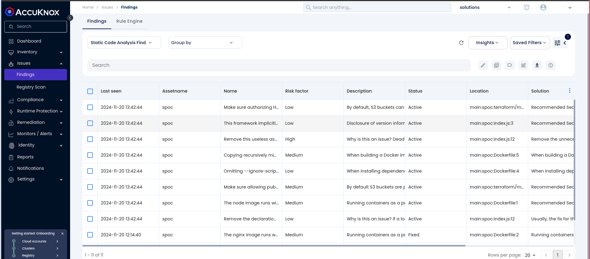
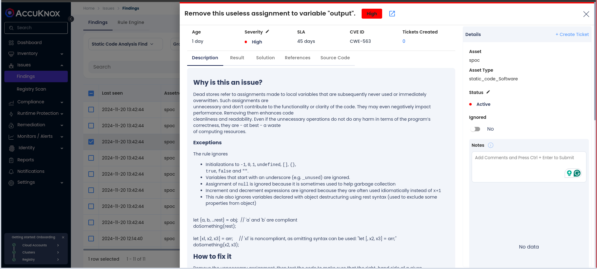
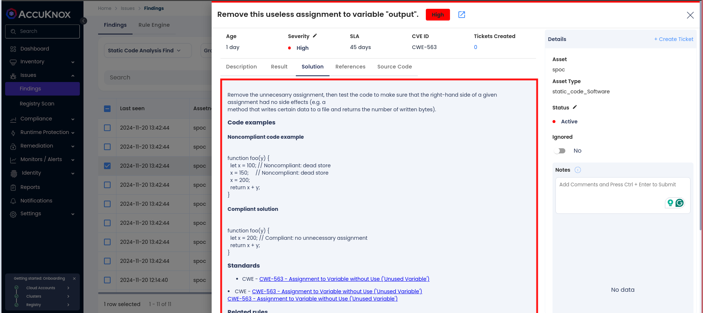
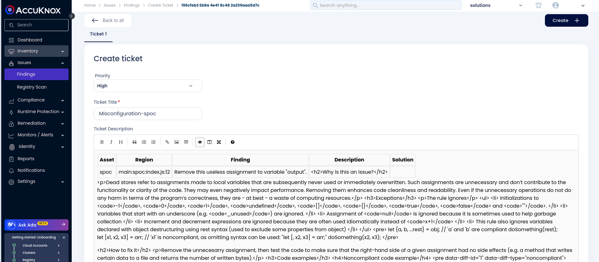

# Integrating SAST with AccuKnox in a GitHub CI/CD Pipeline

## **Overview**

This guide explains how to use the **AccuKnox SAST GitHub Action** for integrating Static Application Security Testing (SAST) into a GitHub CI/CD pipeline. The process leverages **SonarQube** for scanning source code and uploads the results to **AccuKnox CSPM** for comprehensive vulnerability analysis and remediation.

## **Prerequisites**

1. **GitHub Repository Access**: Ensure you have access to your repository where the workflow will be implemented.

2. **SonarQube Access**: Obtain API tokens and project details for SAST scanning.

3. **AccuKnox Platform Access**: Access your AccuKnox CSPM dashboard and generate an API token for integrations.

## **Steps for Integration**

**Step 1:** Log in to AccuKnox Navigate to Settings and select Tokens to create an AccuKnox token for forwarding scan results to SaaS. For details on generating tokens, refer to [How to Create Tokens](https://help.accuknox.com/how-to/how-to-create-tokens/?h=token "https://help.accuknox.com/how-to/how-to-create-tokens/?h=token")

**Step 2: Define GitHub Secrets**

To securely store sensitive values, define the following secrets in your GitHub repository settings:

**Secret Configuration Table**

| Secret Name         | Description                                   |
|---------------------|-----------------------------------------------|
| `SONAR_TOKEN`       | API token for authenticating with SonarQube. |
| `SONAR_HOST_URL`    | URL of your SonarQube server.                |
| `TENANT_ID`         | AccuKnox CSPM tenant ID.                     |
| `ACCUKNOX_TOKEN`    | API token for authenticating with AccuKnox.  |
| `ACCUKNOX_ENDPOINT` | URL of the AccuKnox CSPM API.                |

**Step 3: Create GitHub Workflow**

Add a new workflow file (`.github/workflows/sast.yml`) to your repository with the following configuration:



```yaml
name: AccuKnox SAST Workflow
on:
  push:
    branches:
      - main

jobs:
  sast-scan:
    runs-on: ubuntu-latest
    steps:
      - name: Checkout code
        uses: actions/checkout@v2

      - name: Run AccuKnox SAST
        uses: accuknox/accuknox-sast@v1.0.0
        with:
          sonar_token: ${{ secrets.SONAR_TOKEN }}
          sonar_host_url: ${{ secrets.SONAR_HOST_URL }}
          accuknox_endpoint: ${{ secrets.ACCUKNOX_ENDPOINT }}
          tenant_id: ${{ secrets.TENANT_ID }}
          accuknox_token: ${{ secrets.ACCUKNOX_TOKEN }}
          label: "my-sast-scan"
          sonar_project_key: "my-project-key"

```



### Inputs for AccuKnox SAST Action

| **Input Name**       | **Description**                                       | **Required** | **Default** |
|-----------------------|-------------------------------------------------------|--------------|-------------|
| `sonar_token`         | Personal access token for authenticating with SonarQube. | Yes          | None        |
| `sonar_host_url`      | URL of the SonarQube server for SAST.                 | Yes          | None        |
| `accuknox_endpoint`   | URL of AccuKnox API to upload results.               | Yes          | None        |
| `tenant_id`           | Unique ID of the tenant for AccuKnox CSPM.           | Yes          | None        |
| `accuknox_token`      | Token for authenticating with the AccuKnox API.      | Yes          | None        |
| `label`               | Label for tagging results in AccuKnox SaaS.          | Yes          | None        |
| `sonar_project_key`   | SonarQube project key for identifying the project.   | Yes          | None        |

## **How It Works**

1. **Checkout Code**: The workflow pulls the latest code from the repository.

2. **SonarQube SAST Scan**: Runs a SAST scan on the code using SonarQube.

3. **Upload Results to AccuKnox**: The scan results are uploaded to the AccuKnox CSPM platform for analysis and centralized monitoring.

4. **Quality Gate Check**: Ensures the project meets the quality standards defined in SonarQube.

## **Viewing Results in AccuKnox SaaS**

### View Results in AccuKnox SaaS

**Step 1**: After the workflow completes, navigate to the AccuKnox SaaS dashboard.

**Step 2**: Go to **Issues** > **Findings** and select **SAST Findings** to see identified vulnerabilities.



**Step 3**: Click on a vulnerability to view more details.



**Step 4**: Fix the Vulnerability

Follow the instructions in the Solutions tab to fix the vulnerability



**Step 5**: Create a Ticket for Fixing the Vulnerability

Create a ticket in your issue-tracking system to address the identified vulnerability.



**Step 6**: Review Updated Results

- After fixing the vulnerability, rerun the GitLab CI/CD pipeline.

- Navigate to the AccuKnox SaaS dashboard and verify that the vulnerability has been resolved.

## **Benefits of Integration**

- Centralized monitoring and reporting of vulnerabilities.

- Early detection of issues during the development lifecycle.

- Actionable remediation guidance to improve code quality.

- Easy integration into existing GitHub pipelines.

By integrating SonarQube SAST with AccuKnox in a GitHub Actions workflow, you ensure a secure development pipeline while leveraging the best practices in vulnerability management.
