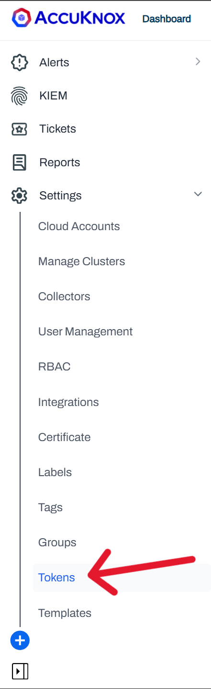
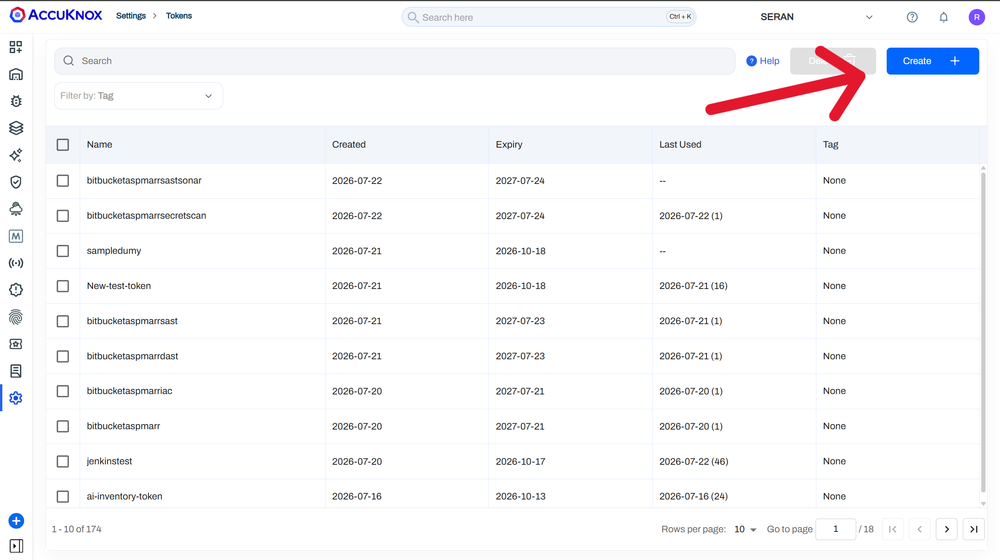
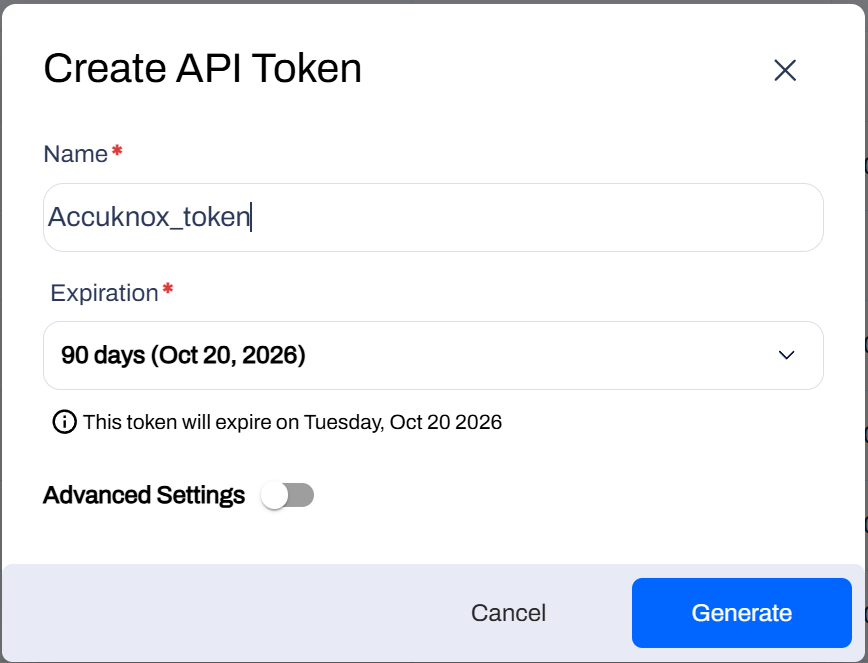
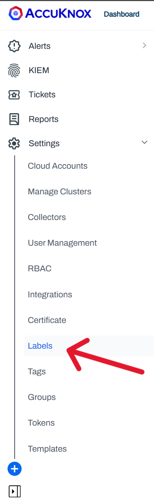
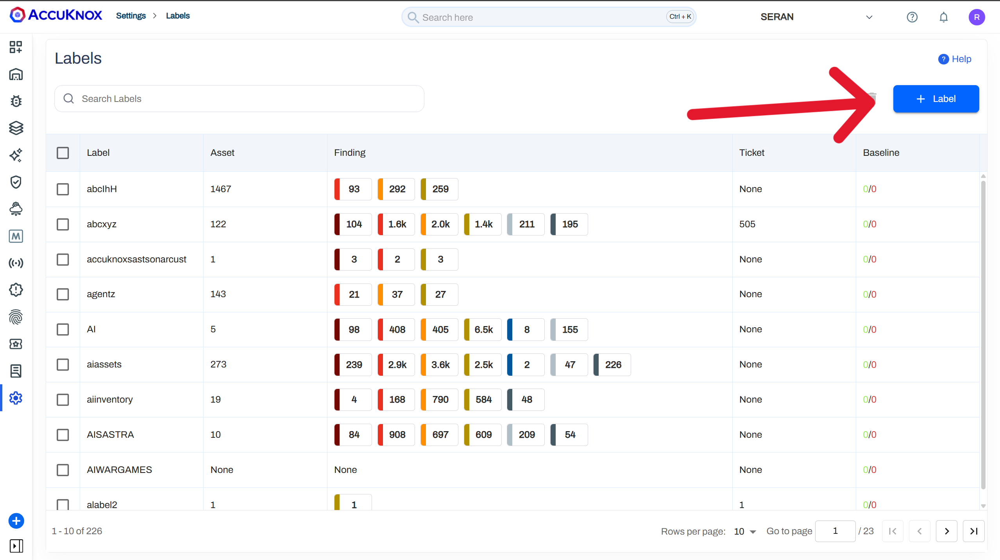
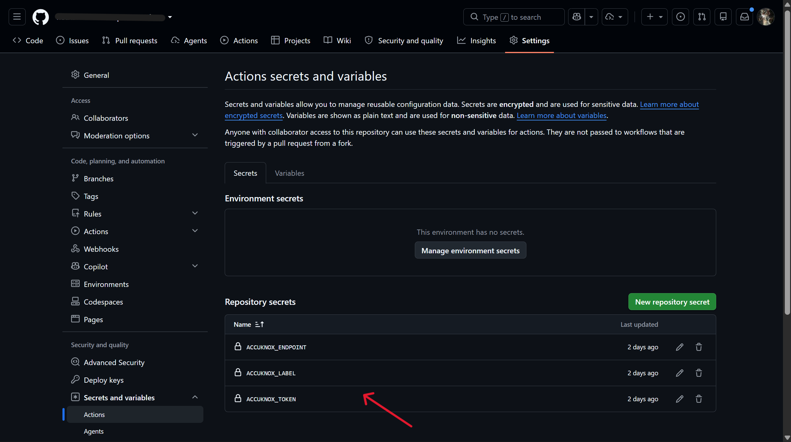
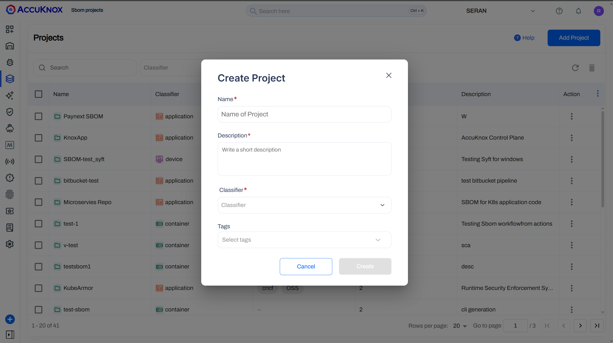
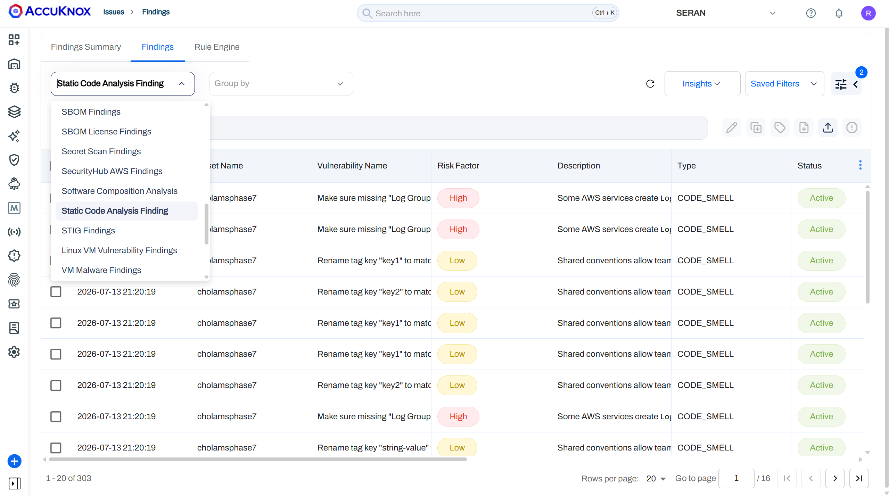
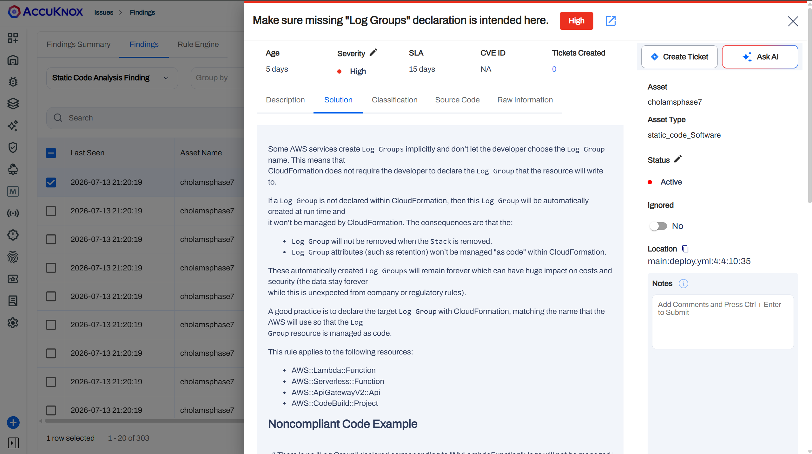

# Running Code Analysis Scans with AccuKnox in a GitHub CI/CD Pipeline

## Overview

The **AccuKnox Code Analysis GitHub Action** is a single action that runs any combination of AccuKnox ASPM code analysis scans, SAST, SCA, Secret, IaC, ML Static Scan, and SBOM, and pushes the results to the **AccuKnox Console** for centralized visibility, risk tracking, and remediation.

Rather than setting up a separate action for each scanner, you configure one step, choose the scans you need with `scan_type`, and catch security issues across your codebase before they reach production.

## Key Features

- **Six scanners in one action**: SAST (OpenGrep), SCA (Trivy), Secret (TruffleHog), IaC (Checkov), ML Static Scan (ModelScan), and SBOM (image and filesystem).
- **Run any combination**: select one or several scans through a single `scan_type` input, separated by commas or spaces.
- **A command input per scan**: every scanner has its own `<type>_command` input that maps straight to the CLI's `--command` flag, so you decide exactly what each tool runs.
- **IaC scans by framework**: limit IaC scans to one or more frameworks, for example `Kubernetes,Terraform`.
- **SBOM for image or filesystem**: generate a CycloneDX SBOM from a container image or your source tree.
- **Shift left security**: run every check directly inside your CI/CD pipeline for early detection.
- **Seamless AccuKnox Console integration**: findings flow into the AccuKnox dashboard automatically.

## Prerequisites

Before setting up this GitHub Action, make sure you have the following in place:

1. **AccuKnox Console Access**: sign in to your AccuKnox tenant.
2. **API Token**: retrieve this from the AccuKnox Console (see Step 1 below).
3. **A Label Created in Console**: used to tag your uploaded scan reports.
4. **GitHub Secrets Configured**: store the required credentials securely in your repository's GitHub Secrets.

## Steps for Integration

**Step 1: Retrieve Your AccuKnox Credentials**

1. Log in to your AccuKnox Console.
2. Navigate to **Settings → Tokens**.



3. Click **Create Token** and save the token value securely (you will add it to GitHub Secrets as `ACCUKNOX_TOKEN` in Step 2).




4. Create a label under **Dashboard → Labels** to tag your scan results.




**Step 2: Configure GitHub Secrets**

Go to your repository's **Settings → Secrets and variables → Actions → New repository secret**, and add each of the following:

| Secret Name | Description |
|-------------|-------------|
| `ACCUKNOX_TOKEN` | Your AccuKnox API token, used for authentication |
| `ACCUKNOX_ENDPOINT` | The AccuKnox API URL (for example `cspm.demo.accuknox.com`) |
| `ACCUKNOX_LABEL` | Label used to tag and group your scan results |



**Step 3: Define Your GitHub Workflow**

Create a workflow file (for example `.github/workflows/accuknox-code-analysis.yml`) with the following configuration:

```yaml
name: AccuKnox Code Analysis Workflow

on:
  push:
    branches:
      - main
  pull_request:
    branches:
      - main

jobs:
  code-analysis:
    runs-on: ubuntu-latest
    steps:
      - name: Checkout code
        uses: actions/checkout@v7.0.0

      - name: Run AccuKnox Code Analysis
        uses: accuknox/accuknox-code-analysis@latest
        with:
          # Pick any combination of scans
          scan_type: "sast, sca, secret, iac, ml, sbom"

          # AccuKnox credentials
          accuknox_token: ${{'{{'}} secrets.ACCUKNOX_TOKEN {{'}}'}}
          accuknox_endpoint: ${{'{{'}} secrets.ACCUKNOX_ENDPOINT {{'}}'}}
          accuknox_label: ${{'{{'}} secrets.ACCUKNOX_LABEL {{'}}'}}

          # Common options
          soft_fail: true            # Continue the pipeline on findings
          upload_artifact: true      # Upload kept result files as an artifact

          # SBOM – image or filesystem (project_name required)
          sbom_scan_type: "image"
          sbom_image_ref: "myapp:latest"
          sbom_project_name: "my-project"
```

Only the inputs tied to the scans you list in `scan_type` are actually used, everything else gets ignored, so your workflow file can stay minimal.

### Configuration Options (Inputs)

**Common**

| Input | Description | Optional/Required | Default |
|-------|-------------|--------------------|---------|
| `scan_type` | Scans to run, separated by commas or spaces: `sast`, `sca`, `secret`, `iac`, `ml`, `sbom` | Required | — |
| `accuknox_token` | API token for authenticating with AccuKnox SaaS | Required | — |
| `accuknox_endpoint` | URL of the AccuKnox Console where results get pushed | Required | — |
| `accuknox_label` | Label used in AccuKnox SaaS to organize and identify results | Required | — |
| `soft_fail` | Keeps CI from failing on findings (applies to all scans) | Optional | `true` |
| `upload_artifact` | Uploads kept result files (`results*.json`, `results*.jsonl`) as a GitHub artifact | Optional | `false` |

**SAST (`sast`)**

| Input | Description | Optional/Required | Default |
|-------|-------------|--------------------|---------|
| `sast_command` | Command text passed to `--command` (the target to scan) | Optional | `.` |
| `sast_severity` | Comma separated severities (`LOW, MEDIUM, HIGH, CRITICAL`) | Optional | `HIGH` |

**SCA (`sca`)**

| Input | Description | Optional/Required | Default |
|-------|-------------|--------------------|---------|
| `sca_command` | Command text passed to `--command` (for example `fs .`) | Optional | `fs .` |
| `sca_severity` | Comma-separated severities to fail on | Optional | `""` |

**Secret (`secret`)**

| Input | Description | Optional/Required | Default |
|-------|-------------|--------------------|---------|
| `secret_command` | Command text passed to `--command` (for example `git file://.` or `filesystem .`) | Optional | `git file://.` |
| `secret_additional_arguments` | Extra arguments appended to the command (for example `--results verified --branch main`) | Optional | `""` |

**IaC (`iac`)**

| Input | Description | Optional/Required | Default |
|-------|-------------|--------------------|---------|
| `iac_command` | Raw command text passed to `--command`. Overrides the structured inputs below when set | Optional | `""` |
| `iac_directory` | Directory holding the infrastructure code to scan | Optional | `.` |
| `iac_file` | Specific file to scan; cannot be combined with `iac_directory` | Optional | `""` |
| `iac_framework` | One or more frameworks, comma separated, for example `Kubernetes,Terraform` | Optional | `""` (all) |
| `iac_compact` | Hides code blocks in the output | Optional | `true` |
| `iac_quiet` | Shows only failed checks | Optional | `true` |

**ML Static Scan (`ml`)**

| Input | Description | Optional/Required | Default |
|-------|-------------|--------------------|---------|
| `ml_command` | Command text passed to `--command` (for example `scan -p . -r json`) | Optional | `scan -p . -r json` |
| `ml_model_name` | Custom collector or model identifier | Optional | `""` |
| `ml_source_type` | Source type used for metadata | Optional | `github` |


**SBOM (`sbom`)**

| Input | Description | Optional/Required | Default |
|-------|-------------|--------------------|---------|
| `sbom_scan_type` | Target type, `image` or `filesystem` | Optional | `filesystem` |
| `sbom_image_ref` | Image reference (required when `sbom_scan_type` is `image`) | Optional | `""` |
| `sbom_scan_path` | Filesystem path (used when `sbom_scan_type` is `filesystem`) | Optional | `.` |
| `sbom_command` | Raw command text passed to `--command`. Overrides the structured inputs above when set | Optional | `""` |
| `sbom_severity` | Comma separated severities | Optional | `""` |
| `sbom_project_name` | Project name (the AccuKnox entity). Required for SBOM | Optional* | `""` |

*Required only when `sbom` is part of `scan_type`.

## Examples

Each example below is a complete workflow you can copy directly. The per scanner examples show the minimum inputs needed for a single scan, and the unified example runs every scanner in one step.

All examples assume you have already configured the `ACCUKNOX_TOKEN`, `ACCUKNOX_ENDPOINT`, and `ACCUKNOX_LABEL` secrets.

### 1. SAST

```yaml
name: AccuKnox SAST
on:
  push:
    branches: [main]
jobs:
  sast:
    runs-on: ubuntu-latest
    steps:
      - uses: actions/checkout@v7.0.0
      - name: Run AccuKnox SAST
        uses: accuknox/accuknox-code-analysis@latest
        with:
          scan_type: "sast"
          accuknox_token: ${{'{{'}} secrets.ACCUKNOX_TOKEN {{'}}'}}
          accuknox_endpoint: ${{'{{'}} secrets.ACCUKNOX_ENDPOINT {{'}}'}}
          accuknox_label: ${{'{{'}} secrets.ACCUKNOX_LABEL {{'}}'}}
          sast_severity: "HIGH,CRITICAL"
          soft_fail: true
```

### 2. SCA

```yaml
name: AccuKnox SCA
on:
  push:
    branches: [main]
jobs:
  sca:
    runs-on: ubuntu-latest
    steps:
      - uses: actions/checkout@v7.0.0
      - name: Run AccuKnox SCA
        uses: accuknox/accuknox-code-analysis@latest
        with:
          scan_type: "sca"
          accuknox_token: ${{'{{'}} secrets.ACCUKNOX_TOKEN {{'}}'}}
          accuknox_endpoint: ${{'{{'}} secrets.ACCUKNOX_ENDPOINT {{'}}'}}
          accuknox_label: ${{'{{'}} secrets.ACCUKNOX_LABEL {{'}}'}}
          sca_severity: "HIGH,CRITICAL"
          soft_fail: true
```

### 3. Secret

```yaml
name: AccuKnox Secret Scan
on:
  push:
    branches: [main]
jobs:
  secret:
    runs-on: ubuntu-latest
    steps:
      - uses: actions/checkout@v7.0.0
        with:
          fetch-depth: 0   # full history for git-based secret scanning
      - name: Run AccuKnox Secret Scan
        uses: accuknox/accuknox-code-analysis@latest
        with:
          scan_type: "secret"
          accuknox_token: ${{'{{'}} secrets.ACCUKNOX_TOKEN {{'}}'}}
          accuknox_endpoint: ${{'{{'}} secrets.ACCUKNOX_ENDPOINT {{'}}'}}
          accuknox_label: ${{'{{'}} secrets.ACCUKNOX_LABEL {{'}}'}}
          soft_fail: true
```

### 4. IaC

```yaml
name: AccuKnox IaC
on:
  push:
    branches: [main]
jobs:
  iac:
    runs-on: ubuntu-latest
    steps:
      - uses: actions/checkout@v7.0.0
      - name: Run AccuKnox IaC Scan
        uses: accuknox/accuknox-code-analysis@latest
        with:
          scan_type: "iac"
          accuknox_token: ${{'{{'}} secrets.ACCUKNOX_TOKEN {{'}}'}}
          accuknox_endpoint: ${{'{{'}} secrets.ACCUKNOX_ENDPOINT {{'}}'}}
          accuknox_label: ${{'{{'}} secrets.ACCUKNOX_LABEL {{'}}'}}
          soft_fail: true
```

### 5. ML Static Scan

```yaml
name: AccuKnox ML Static Scan
on:
  push:
    branches: [main]
jobs:
  ml:
    runs-on: ubuntu-latest
    steps:
      - uses: actions/checkout@v7.0.0
      - name: Run AccuKnox ML Static Scan
        uses: accuknox/accuknox-code-analysis@latest
        with:
          scan_type: "ml"
          accuknox_token: ${{'{{'}} secrets.ACCUKNOX_TOKEN {{'}}'}}
          accuknox_endpoint: ${{'{{'}} secrets.ACCUKNOX_ENDPOINT {{'}}'}}
          accuknox_label: ${{'{{'}} secrets.ACCUKNOX_LABEL {{'}}'}}
          soft_fail: true
```

### 6. SBOM

!!! note
    **Prerequisite; create a Project.** To tie SBOM data to the right entity, you need to create a **Project** in the AccuKnox Console first.

1. Log in to the **AccuKnox Dashboard**.
2. Navigate to **SBOM → Projects**.
3. Click **New Project**.
4. Fill in the required details:
   - **Name*** – Project name (use this same value for `sbom_project_name` in the workflow).
   - **Description** – a short description of the project.
   - **Classifier*** – choose **Container** for an **image** SBOM, or **Application** for a **filesystem** SBOM.
   - **Tags** – (Optional) add relevant tags.
5. Click **Create**.




```yaml
name: AccuKnox SBOM
on:
  push:
    branches: [main]
jobs:
  sbom:
    runs-on: ubuntu-latest
    steps:
      - uses: actions/checkout@v7.0.0
      - name: Run AccuKnox SBOM (filesystem)
        uses: accuknox/accuknox-code-analysis@latest
        with:
          scan_type: "sbom"
          accuknox_token: ${{'{{'}} secrets.ACCUKNOX_TOKEN {{'}}'}}
          accuknox_endpoint: ${{'{{'}} secrets.ACCUKNOX_ENDPOINT {{'}}'}}
          accuknox_label: ${{'{{'}} secrets.ACCUKNOX_LABEL {{'}}'}}
          sbom_scan_type: "filesystem"
          sbom_scan_path: "."
          sbom_project_name: "my-project"   # required for SBOM
          soft_fail: true
```

For an **image** SBOM, set `sbom_scan_type: "image"` and `sbom_image_ref: "myapp:latest"` (build or pull the image earlier in the same job).

### 7. Unified, All Scans in One Step

```yaml
name: AccuKnox Code Analysis (Unified)
on:
  push:
    branches: [main]
  pull_request:
    branches: [main]
jobs:
  code-analysis:
    runs-on: ubuntu-latest
    steps:
      - uses: actions/checkout@v7.0.0

      - name: Run AccuKnox Code Analysis
        uses: accuknox/accuknox-code-analysis@latest
        with:
          # Run every scanner in a single step
          scan_type: "sast, sca, secret, iac, ml, sbom"

          # AccuKnox credentials
          accuknox_token: ${{'{{'}} secrets.ACCUKNOX_TOKEN {{'}}'}}
          accuknox_endpoint: ${{'{{'}} secrets.ACCUKNOX_ENDPOINT {{'}}'}}
          accuknox_label: ${{'{{'}} secrets.ACCUKNOX_LABEL {{'}}'}}

          # Common options
          soft_fail: true
          upload_artifact: true

          # SAST – override default severity (HIGH)
          sast_severity: "HIGH,CRITICAL"

          # SBOM (project_name required)
          sbom_scan_type: "filesystem"
          sbom_scan_path: "."
          sbom_project_name: "my-project"
```

## How It Works

1. **Developer pushes code**: a push or pull request triggers the GitHub Action.
2. **Scanner setup (once)**: the action checks credentials, parses `scan_type`, and downloads the `accuknox-aspm-scanner` binary for the requested `scanner_version`.
3. **Selected scans run**: each enabled scan runs in `--command` mode inside a container, building its arguments from your `<type>_command` and scan specific inputs:

       - **SAST** → OpenGrep static analysis
       - **SCA** → Trivy dependency and composition analysis
       - **Secret** → TruffleHog secret detection
       - **IaC** → Checkov misconfiguration checks (per framework, if you set one)
       - **ML** → ModelScan static ML model analysis
       - **SBOM** → CycloneDX bill of materials for an image or filesystem
       
4. **Results uploaded to AccuKnox Console**: using the `accuknox_token` and `accuknox_label` you provided.
5. **Optional artefact upload**: when `upload_artifact: true`, kept result files get saved as a GitHub artifact.
6. **Review findings**: available in the AccuKnox Console under **Dashboard → Issues → Findings**, filtered by scan type.
7. **Pipeline decision**: if `soft_fail: false`, the pipeline fails once findings are detected.

## Viewing Results in AccuKnox Console

**Step 1**: Once the workflow finishes, open the AccuKnox SaaS dashboard.

**Step 2**: Go to **Issues → Findings** and select the finding type that matches the scan you ran (for example, Static Code Analysis Findings for SAST, or the equivalent view for SCA, Secret, IaC, ML, or SBOM).



**Step 3**: Click on a finding to see the full detail.

**Step 4**: Fix the finding using the instructions in the Solutions tab, or use Ask AI for a suggested fix.



**Step 5**: Create a ticket in your issue tracking system to assign and track the fix.

**Step 6**: Review the updated results. After the fix ships, rerun your GitHub Actions pipeline, then check the AccuKnox SaaS dashboard to confirm the finding is resolved.

## Benefits of Integration

- Centralized monitoring and reporting across all six scan types
- Early detection of issues during the development lifecycle, before code reaches production
- Actionable remediation guidance for every finding
- One action to configure instead of stitching together six separate integrations
- Drops into an existing GitHub Actions pipeline with minimal setup

## Support & Documentation

- Read more in the [AccuKnox Docs](https://help.accuknox.com/integrations/github-overview/)
- Contact support at support@accuknox.com

## Conclusion

The AccuKnox Code Analysis GitHub Action brings six scanners, SAST, SCA, Secret, IaC, ML, and SBOM, into one configurable step. Run them together, review findings in the AccuKnox Console, and enforce policy gates across your CI/CD pipeline from a single action, all the way from commit to cloud.
