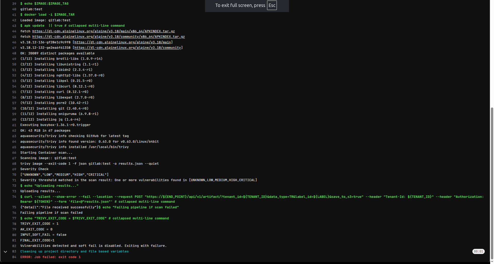
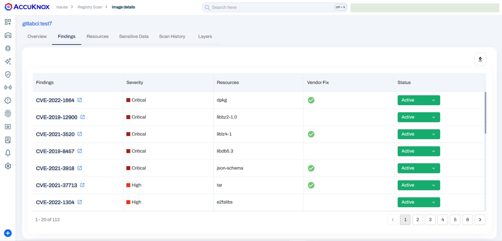

To show how incorporating AccuKnox into a CI/CD pipeline with Gitlab can improve security, let's look at a detailed example involving a Docker image that initially had known vulnerabilities. By running AccuKnox scanning in the pipeline, we can find and fix these vulnerabilities before deploying the image. The following narrative illustrates this process by comparing the situations before and after adding AccuKnox, as seen in the Gitlab jobs log.

## Scenario Before Integrating AccuKnox

### **Context**

The Docker image was built from a Dockerfile using an outdated base image (`node:15-slim`), which contained known security vulnerabilities. Using this old base image unintentionally introduced many security weaknesses to the Docker image.

**Dockerfile Example:**

```Dockerfile
FROM node:15-slim
```

### **Issues**

- The outdated base image had several known vulnerabilities.

- The Docker image was being pushed to the registry without any security validation.

## Steps for Integrating AccuKnox

**Step 1**: Log in to AccuKnox Navigate to Settings and select Tokens to create an AccuKnox token for forwarding scan results to SaaS. For details on generating tokens, refer to [How to Create Tokens](https://help.accuknox.com/how-to/how-to-create-tokens/?h=token "https://help.accuknox.com/how-to/how-to-create-tokens/?h=token").

**Step 2:** Configure GitLab CI/CD Variables. For details on configuring variables, refer to [How to Create CI/CD Variables in GitLab](https://docs.gitlab.com/ee/ci/variables/ "https://docs.gitlab.com/ee/ci/variables/").

1. **ACCUKNOX_TOKEN**: AccuKnox API token for authorization.

2. **ACCUKNOX_TENANT**: Your AccuKnox tenant ID.

3. **ACCUKNOX_ENDPOINT**: The AccuKnox API URL (e.g., [cspm.demo.accuknox.com](http://cspm.demo.accuknox.com/ "http://cspm.demo.accuknox.com/")).

4. **ACCUKNOX_LABEL**: The label for your scan.

**Step 3**: Set Up GitLab CI/CD Pipeline

Create a new pipeline in your GitLab project with the following YAML configuration:

```yaml
include:
  - component: $CI_SERVER_FQDN/accu-knox/scan/container-scan@1.0
    inputs:
      STAGE: test
      TAG: "v2"
      DOCKERFILE_CONTEXT: Dockerfile
      REPOSITORY_NAME: gitlab-ci-testing
      INPUT_SOFT_FAIL: false
      ACCUKNOX_TOKEN: ${ACCUKNOX_TOKEN}
      ACCUKNOX_TENANT: ${ACCUKNOX_TENANT}
      ACCUKNOX_ENDPOINT: ${ACCUKNOX_ENDPOINT}
      ACCUKNOX_LABEL: ${ACCUKNOX_LABEL}
```

## Scenario After Integrating AccuKnox

**Enhancing the GitLab Workflow:** We then added a step to our GitLab workflow to run the AccuKnox vulnerability scan on the newly built Docker image.

### **Outcome**

- AccuKnox scanned the Docker image for vulnerabilities, and if critical issues were detected, the pipeline halted the deployment, preventing the image from being pushed to the registry.

- If no critical vulnerabilities were found, the image was approved and successfully pushed.



## View Results in AccuKnox SaaS

**Step 1**: After the workflow completes, navigate to the AccuKnox SaaS dashboard.

**Step 2**: Go to Issues > Findings and select Container Image Findings to see identified vulnerabilities.


**Step 3**: Click on a vulnerability to view more details.


**Step 4**: Fix the Vulnerability: Create a ticket in your issue-tracking system to address the identified vulnerability.



**Step 6**: Review Updated Results

- After fixing the vulnerability, rerun the pipeline.

- Navigate to the AccuKnox SaaS dashboard and verify that the vulnerability has been resolved.

## **Conclusion**

By integrating AccuKnox into the GitLab CI/CD pipeline, the security of Docker images is significantly improved. Vulnerabilities are detected early, preventing insecure images from being deployed to production. The workflow allows teams to automatically remediate issues and ensure only secure images make it to the registry.
