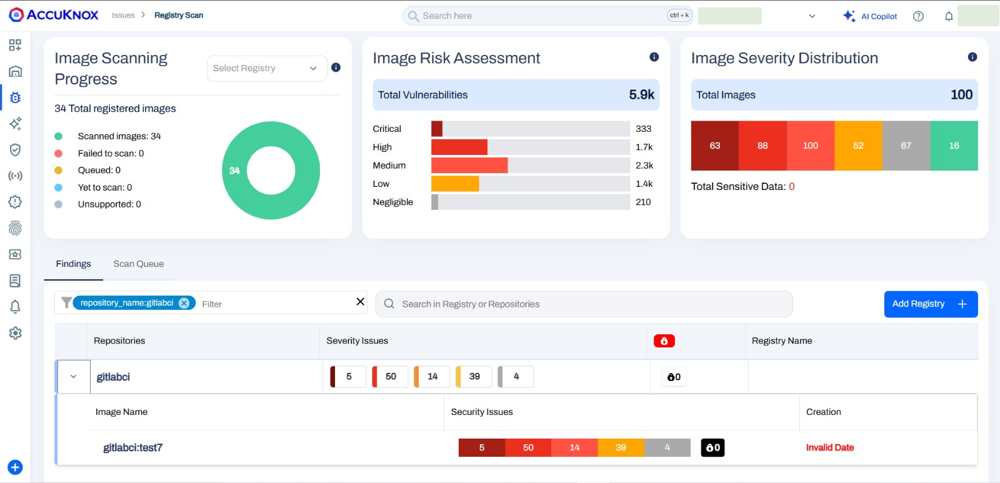
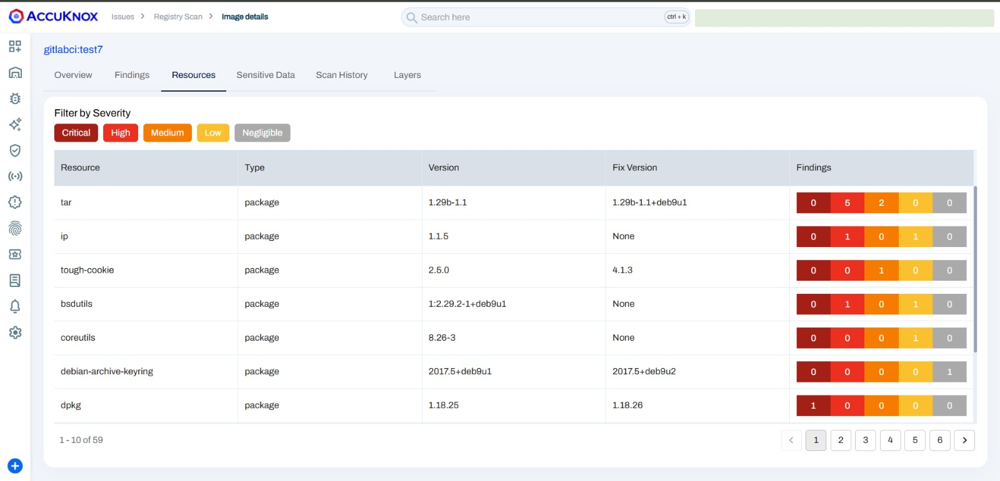

# Container Scan Usecase

To show how incorporating AccuKnox into a CI/CD pipeline with Gitlab can improve security, let's look at a detailed example involving a Docker image that initially had known vulnerabilities. By running AccuKnox scanning in the pipeline, we can find and fix these vulnerabilities before deploying the image. The following narrative illustrates this process by comparing the situations before and after adding AccuKnox, as seen in the Gitlab jobs log.

## Scenario Before Integrating AccuKnox

**Context:** We started with a Docker image built from a Dockerfile using an outdated base image (`python:3.6-alpine`) that contained many known security vulnerabilities. Using this old base image unintentionally introduced many security weaknesses to the Docker image.

**Dockerfile Example**

`FROM python:3.6-alpine`

**Hypothetical GitLab jobs Log - Pre AccuKnox Scan:**

```sh
Building Docker image...
Image built successfully: your-image:latest
Pushing your-image:latest to Docker Hub...
Image pushed successfully.
```

## Scenario After Integrating AccuKnox

**Enhancing the GitLab Workflow:** We then added a step to our GitLab workflow to run the AccuKnox vulnerability scan on the newly built Docker image.

**Updated GitLab Workflow Snippet (Incorporating AccuKnox Scan):**

```yaml
build:
  stage: build
  script:
    - echo "Logging into Docker..."
    - echo "$DOCKER_LOGIN_PASSWORD" | docker login -u "$DOCKER_LOGIN_USER" --password-stdin
    - echo "Building Docker image..."
    - docker build . -t $IMAGE_NAME
    - docker images
    - echo "Running AccuKnox Container Scanner..."
    - docker run --rm -v /var/run/docker.sock:/var/run/docker.sock $SCAN_IMAGE_NAME image $IMAGE_NAME --format json  >> report.json
  artifacts:
     paths:
       - report.json
     expire_in: 1 hour
```

**GitLab Jobs Log - Post AccuKnox Integration:**

```sh
Preparing environment
00:00
Running on runner-ykxhnyexq-project-60688859-concurrent-0 via runner-ykxhnyexq-s-l-s-amd64-1724306521-c3f8020c...
Getting source from Git repository
00:01
Fetching changes with git depth set to 20...
Initialized empty Git repository in /builds/test6350632/accuknox-test/.git/
Created fresh repository.
Checking out 15071f0a as detached HEAD (ref is master)...
Skipping Git submodules setup
$ git remote set-url origin "${CI_REPOSITORY_URL}"
Downloading artifacts
00:01
Downloading artifacts for build (7638821227)...
Downloading artifacts from coordinator... ok        host=storage.googleapis.com id=7638821227 responseStatus=200 OK token=glcbt-66
Executing "step_script" stage of the job script
00:01
Using docker image sha256:0b6e4f227c00470097995ec32b0cf10b3f8ef01abf3a485dbe1907ece22acd94 for docker:latest with digest docker@sha256:2e5515536bf789843b48030fdca3e3719463ba85c43b1da7d5687f5997b79d26 ...
$ echo "Checking for critical vulnerabilities..."
Checking for critical vulnerabilities...
$ if grep -q "CRITICAL" report.json; then # collapsed multi-line command
AccuKnox Scan has halted the deployment because it detected critical vulnerabilities
Cleaning up project directory and file based variables
ERROR: Job failed: exit code 1
```


AccuKnox carefully analyzed the image and found critical and high-severity vulnerabilities. Based on these findings, the workflow stopped and prevented the vulnerable image from being pushed to the Docker registry.

## Remediation and Rescan

**Fortifying the Dockerfile:** After seeing the vulnerabilities, we updated the Dockerfile to use a newer, more secure base image (`python:3.12-alpine3.20`) instead, to fix the security issues.

**Dockerfile Post-Update:**

`FROM python:3.12-alpine3.20 # Additional image enhancements and setup`

**GitLab Jobs Log - After Remediation:**

```sh
Building Docker image...
Image built successfully: your-image:latest
Scanning your-image:latest with AccuKnox...
INF Scanning /path/to/your-image:latest
INF Number of language-specific files: 1
INF No critical vulnerabilities found.
Image scan passed successfully.
Pushing your-image:latest to Docker Hub...
Image pushed successfully.
```

Once the vulnerabilities were resolved, the AccuKnox scan approved the updated image, allowing it to be safely pushed to the registry. This example clearly shows how important it is to have vulnerability scanning in the pipeline - it prevents insecure images from being deployed to production, ensuring only secure images make it through.



## Steps needed to be taken for integration

**Step 1:** The user needs to create a GitLab workflow file inside their GitLab repository using the following workflow Template:

```yaml
image: docker:latest  # Docker image with Docker installed

services:
  - docker:dind  # Docker-in-Docker service for building Docker images

variables:
  IMAGE_NAME: "[tag]/gitlab-pipeline:v1"
  SCAN_IMAGE_NAME: "accuknox/accuknox-container-scan"
  CSPM_URL: $ACCUKNOX_CSPM_URL
  TENANT_ID: $TENANT_ID
  DOCKER_LOGIN_USER: $DOCKER_LOGIN_USER
  DOCKER_LOGIN_PASSWORD: $DOCKER_LOGIN_PASSWORD
  ACCUKNOX_API_TOKEN: $ACCUKNOX_API_TOKEN

stages:
  - build
  - upload
  - validate

build:
  stage: build
  script:
    - echo "Logging into Docker..."
    - echo "$DOCKER_LOGIN_PASSWORD" | docker login -u "$DOCKER_LOGIN_USER" --password-stdin
    - echo "Building Docker image..."
    - docker build . -t $IMAGE_NAME
    - docker images
    - echo "Running AccuKnox Container Scanner..."
    - docker run --rm -v /var/run/docker.sock:/var/run/docker.sock $SCAN_IMAGE_NAME image $IMAGE_NAME --format json  >> report.json
  artifacts:
     paths:
       - report.json
     expire_in: 1 hour

upload:
  stage: upload
  image: curlimages/curl:latest
  script:
    - echo "Uploading report.json to CSPM endpoint..."
    - |
      curl --location --request POST "https://${CSPM_URL}/api/v1/artifact/?tenant_id=${TENANT_ID}&data_type=TR&save_to_s3=false" \
        --header "Tenant-Id: ${TENANT_ID}" \
        --header "Authorization: Bearer ${ACCUKNOX_API_TOKEN}" \
        --form "file=@\"report.json\""
validate:
  stage: validate
  script:
    - echo "Checking for critical vulnerabilities..."
    - |
      if grep -q "CRITICAL" report.json; then
        echo "AccuKnox Scan has halted the deployment because it detected critical vulnerabilities"
        exit 1
      else
        exit 0
      fi
```

**Note:** In the above template, the user needs to change some variables, including `ACCUKNOX_API_TOKEN`, `CSPM_URL(cspm.demo|stage|dev.accuknox.com)`, and `TENANT_ID`. Values for these variables can be obtained from AccuKnox SaaS.

**Step 2:** Now, when a user attempts to make any changes to their repository, the workflow will be triggered, performing the necessary steps for scanning and posting the results to AccuKnox SaaS.

**Step 3:** Once the scan is complete, the user can go into the AccuKnox SaaS and navigate to Issues → RegistryScan where they can find their repository name and select it to see the associated findings


**Step 4:** After clicking on the image name, the user will be able to see the metadata for the image that was built during the workflow execution.


**Step 5:** In the `Vulnerabilities` section, the user can see the image-specific vulnerabilities in a list manner that contains relevant information. These findings will also be available in the `Issues → Vulnerabilities` section where the user can manage these findings with others.



**Step 6:** The `Resources` section contains information about packages and modules that were used to build the code base into a container image.


**Step 7:** The user can see the scan history of every scan that happened while triggering the workflow.


