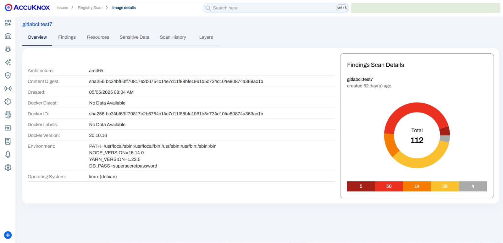
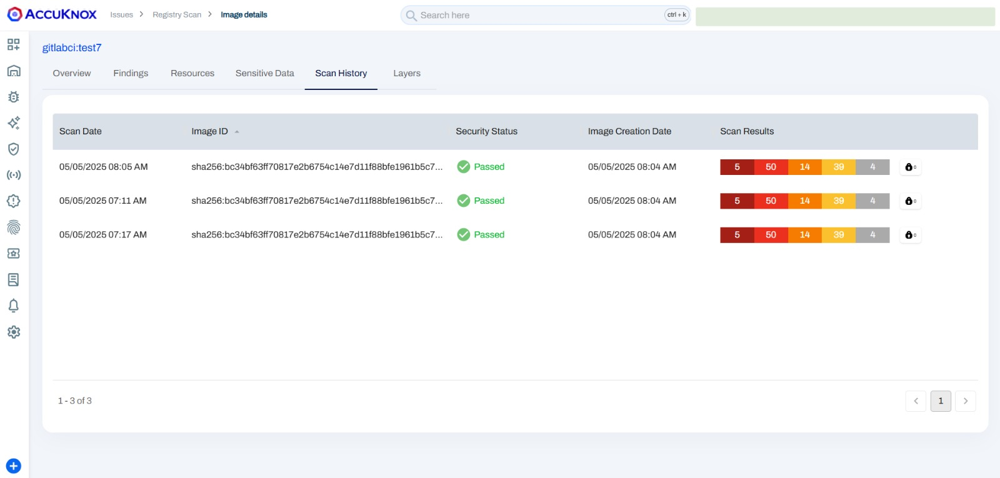

# Securing Docker Images in GitLab CI/CD with AccuKnox Integration

This guide demonstrates integrating AccuKnox into GitLab CI/CD pipelines to improve Docker image security by identifying and remediating vulnerabilities during the build process. We will compare the pipeline's state before and after the integration to highlight the security improvements.

### Prerequisites

Before beginning, ensure the following:

- A **GitLab** repository with **CI/CD** enabled

- Access to **AccuKnox**

### Integration Steps

#### Step 1: Generate AccuKnox API Token

Log in to AccuKnox. Navigate to Settings and select Tokens to create an AccuKnox token to forward scan results to AccuKnox. For details on generating tokens, refer to [How to Create Tokens](https://help.accuknox.com/how-to/how-to-create-tokens/?h=token "https://help.accuknox.com/how-to/how-to-create-tokens/?h=token").

**Step 2:** Configure GitLab CI/CD Variables. For details on configuring variables, refer to [How to Create CI/CD Variables in GitLab](https://docs.gitlab.com/ee/ci/variables/ "https://docs.gitlab.com/ee/ci/variables/").

| **Name**             | **Description**                                                                        |
| -------------------- | -------------------------------------------------------------------------------------- |
| `ACCUKNOX_ENDPOINT`  | The URL of the CSPM panel to push the scan results to (e.g., `cspm.demo.accuknox.com`) |
| `ACCUKNOX_TENANT_ID` | The ID of the tenant associated with the CSPM panel                                    |
| `ACCUKNOX_TOKEN`     | Token for authenticating with the AccuKnox CSPM panel                                  |
| `ACCUKNOX_LABEL`     | Label to categorize or tag the scan results                                            |

The label used to categorize and identify scan results in AccuKnox. [Create a new label](https://help.accuknox.com/how-to/how-to-create-labels/ "https://help.accuknox.com/how-to/how-to-create-labels/") if it is not available

#### Step 3: Define the GitLab CI/CD Pipeline Configuration

Create or modify your `.gitlab-ci.yml` file to integrate AccuKnox scanning into your build pipeline:

```yaml
variables:
  IMAGE: "gitlabci"
  IMAGE_TAG: "test7"
  IMAGE_TAR: "image.tar"

build_image:
  stage: build
  image: docker:20.10.16
  services:
    - docker:20.10.16-dind
  script:
    - docker build -t $IMAGE:$IMAGE_TAG -f Dockerfile .
    - docker save -o $IMAGE_TAR $IMAGE:$IMAGE_TAG
  artifacts:
    paths:
      - $IMAGE_TAR
    expire_in: 30 minutes

accuknox-container-scan:
  before_script:
    - echo $IMAGE:$IMAGE_TAG
    - docker load -i $IMAGE_TAR

include:
  - component: $CI_SERVER_FQDN/accu-knox/scan/container-scan@2.0.0
    inputs:
      STAGE: test
      IMAGE_NAME: $IMAGE
      TAG: $IMAGE_TAG
      SOFT_FAIL: true
      ACCUKNOX_TOKEN: ${ACCUKNOX_TOKEN}
      ACCUKNOX_TENANT: ${ACCUKNOX_TENANT}
      ACCUKNOX_ENDPOINT: ${ACCUKNOX_ENDPOINT}
      ACCUKNOX_LABEL: ${ACCUKNOX_LABEL}
```

### Inputs for AccuKnox Container Scanning

| **Name**             | **Description**                                                                                               | **Required** | **Default**                        |
| -------------------- | ------------------------------------------------------------------------------------------------------------- | ------------ | ---------------------------------- |
| `ACCUKNOX_ENDPOINT`  | AccuKnox CSPM panel URL                                                                                       | Yes          | `cspm.demo.accuknox.com`           |
| `ACCUKNOX_TENANT_ID` | AccuKnox Tenant ID                                                                                            | Yes          |                                    |
| `ACCUKNOX_TOKEN`     | AccuKnox API Token                                                                                            | Yes          |                                    |
| `ACCUKNOX_LABEL`     | Label for scan results                                                                                        | Yes          |                                    |
| `INPUT_SOFT_FAIL`    | Continue even if the scan fails                                                                               | No           | `true`                             |
| `IMAGE_NAME`         | The name of the Docker image                                                                                  | Yes          |                                    |
| `TAG`                | The tag for the Docker image                                                                                  | No           | `$BITBUCKET_BUILD_NUMBER`          |
| `SEVERITY`           | Comma-separated list of vulnerability severities that will trigger failure when `INPUT_SOFT_FAIL` is disabled | No           | `UNKNOWN,LOW,MEDIUM,HIGH,CRITICAL` |

### Workflow Enhancements After AccuKnox Integration:

1. **Build and Scan**: Docker images are built and automatically scanned for vulnerabilities during the pipeline execution.

2. **Critical Vulnerabilities Halt Deployment**: If critical vulnerabilities are detected, the pipeline fails, preventing the deployment of insecure images.

3. **Improved Security Posture**: Only images free from known vulnerabilities are deployed, reducing the risk in production environments.

#### Outcome

- Vulnerabilities are detected and addressed early in the CI/CD pipeline, ensuring that only secure Docker images are pushed to production.

- Developers receive immediate feedback on image security, allowing for quicker remediation of issues.
  

### View Scan Results in AccuKnox SaaS

After the scan completes, the results can be accessed in AccuKnox SaaS:

1.  Go to **Issues → RegistryScan** in AccuKnox to view your scanned Docker images.
    

2.  Click on the image name to access detailed metadata and scan results.
    

3.  Under the **Vulnerabilities** section, you'll see a list of vulnerabilities discovered in the Docker image.
    

4.  In the **Resources** section, you'll find details about the packages and modules used to build the container.
    

5.  You can also view the scan history to track improvements over time.
    

### Conclusion

Integrating AccuKnox into GitLab CI/CD pipelines enhances the security of Docker images by scanning for vulnerabilities early in the development process. This proactive approach ensures that only secure images are deployed, reducing the risk of security breaches in production environments.
