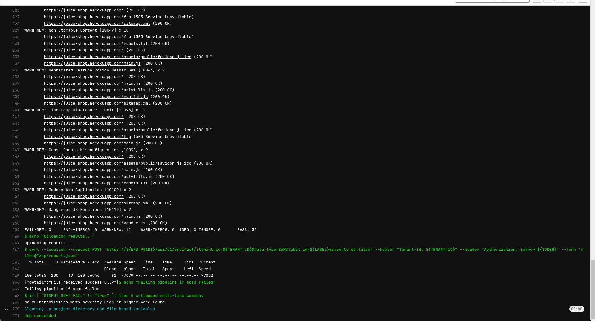

# Gitlab DAST Scan

To demonstrate the benefits of incorporating AccuKnox into a CI/CD pipeline using GitLab to enhance security, consider a specific scenario involving a domain with known vulnerabilities. By integrating AccuKnox scanning into the pipeline, we can identify and resolve these security issues.

## Pre-requisites

- GitLab Access
- AccuKnox UI access

## Steps for Integration

**Step 1**: Log in to AccuKnox Navigate to Settings and select Tokens to create an AccuKnox token for forwarding scan results to SaaS.



**Step 2**: Copy the token and create a GitLab CI/CD masked variable for the token to be used in the pipeline. Also, create variables for the tenant id, AccuKnox URL (cspm.accuknox.com or cspm.demo.accuknox.com), and the target URL that you want to use for DAST.


**Step 3**: To create a label, navigate to AccuKnox > Settings > Labels, assign a name to your label, click the save button, and then configure it as a GitLab CI/CD variable


**Step 4**: Set Up GitLab CI/CD Pipeline

Create a new pipeline in your GitLab project with the following YAML configuration:

```yaml
stages:
  - DAST
  - upload-report

DAST:
  stage: DAST
  image: docker:latest
  services:
  - docker:dind
  script:
    - docker run --rm -v $(pwd):/zap/wrk -t zaproxy/zap-stable zap-full-scan.py -t $SCAN_URL -J report.json -I
  artifacts:
    paths:
      - report.json

upload-report-to-accuknox:
  stage: upload-report
  image: curlimages/curl:latest
  dependencies:
    - DAST
  script:
    - |
      curl --location --request POST "https://$ACCUKNOX_URL/api/v1/artifact/?tenant_id=$TENANT_ID&label_id=$LABEL&data_type=ZAP&save_to_s3=true" \
            --header "Tenant-Id: $TENANT_ID" \
            --header "Authorization: Bearer $ACCUKNOX_TOKEN" \
            --form "file=@report.json"
    - echo "Checking for critical vulnerabilities..."
    - |
      if grep -q -i -E "HIGH|CRITICAL" report.json; then
          echo "AccuKnox Scan has halted the deployment because it detected high/critical vulnerabilities"
          exit 1
        else
          exit 0
        fi
```

## Initial CI/CD Pipeline Without AccuKnox Scan

Initially, the CI/CD pipeline does not include the AccuKnox scan. When you push changes to the repository, no security checks are performed, potentially allowing security issues in the application.

## CI/CD Pipeline After AccuKnox Scan Integration

After integrating AccuKnox into your CI/CD pipeline, the next push triggers the CI/CD pipeline. The AccuKnox scan identifies potential vulnerabilities in the application.


## View Results in AccuKnox SaaS

**Step 1**: After the workflow completes, navigate to the AccuKnox SaaS dashboard.

**Step 2**: Go to **Issues** > **Findings** and select **DAST Findings** to see identified vulnerabilities.


**Step 3**: Click on a vulnerability to view more details.


**Step 4**: Fix the Vulnerability

Follow the instructions in the Solutions tab to fix the vulnerability (e.g., Cross-Domain Misconfiguration).


**Step 5**: Create a Ticket for Fixing the Vulnerability

Create a ticket in your issue tracking system to address the identified vulnerability.


**Step 6**: Review Updated Results

- After fixing the vulnerability, rerun the GitLab CI/CD pipeline.

- Navigate to the AccuKnox SaaS dashboard and verify that the vulnerability has been resolved.

## Conclusion

GitLab CI/CD, combined with AccuKnox scanning, provides enhanced security by identifying and mitigating vulnerabilities during the CI/CD process. This integration offers visibility into potential security issues and helps ensure a secure deployment environment. AccuKnox DAST integrates seamlessly with various CI/CD tools, including Jenkins, GitHub, GitLab, Azure Pipelines, and AWS CodePipelines.
