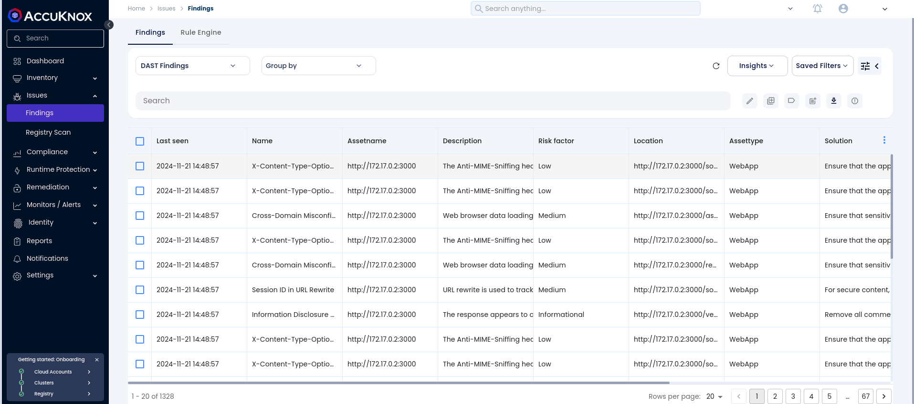
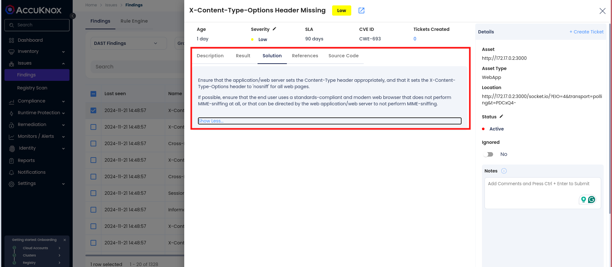

To demonstrate the benefits of incorporating AccuKnox into a CI/CD pipeline using GitLab to enhance security, consider a specific scenario involving a domain with known vulnerabilities. By integrating AccuKnox scanning into the pipeline, we can identify and resolve these security issues.

## Pre-requisites

- GitLab Access

- AccuKnox Platform Access

## Steps for Integration

**Step 1**: Log in to AccuKnox Navigate to Settings and select Tokens to create an AccuKnox token for forwarding scan results to SaaS. For details on generating tokens, refer to [How to Create Tokens](https://help.accuknox.com/how-to/how-to-create-tokens/?h=token "https://help.accuknox.com/how-to/how-to-create-tokens/?h=token").

**Step 2:** Configure GitLab CI/CD Variables. For details on configuring variables, refer to [How to Create CI/CD Variables in GitLab](https://docs.gitlab.com/ee/ci/variables/ "https://docs.gitlab.com/ee/ci/variables/").

1. **ACCUKNOX_TOKEN**: AccuKnox API token for authorization.

2. **ACCUKNOX_TENANT**: Your AccuKnox tenant ID.

3. **ACCUKNOX_ENDPOINT**: The AccuKnox API URL (e.g., [cspm.demo.accuknox.com](http://cspm.demo.accuknox.com/ "http://cspm.demo.accuknox.com")).

4. **ACCUKNOX_LABEL**: The label for your scan.

**Step 3**: Set Up GitLab CI/CD Pipeline

Create a new pipeline in your GitLab project with the following YAML configuration:

```yaml
include:
  - component: $CI_SERVER_FQDN/accu-knox/scan/dast-scan@1.0
    inputs:
      STAGE: test
      TARGET_URL: "https://juice-shop.herokuapp.com/"
      SEVERITY_THRESHOLD: "High"
      DAST_SCAN_TYPE: "baseline"
      INPUT_SOFT_FAIL: false
      ACCUKNOX_TOKEN: ${ACCUKNOX_TOKEN}
      ACCUKNOX_TENANT: ${ACCUKNOX_TENANT}
      ACCUKNOX_ENDPOINT: ${ACCUKNOX_ENDPOINT}
      ACCUKNOX_LABEL: ${ACCUKNOX_LABEL}
```

## Initial CI/CD Pipeline Without AccuKnox Scan

Initially, the CI/CD pipeline does not include the AccuKnox scan. When you push changes to the repository, no security checks are performed, potentially allowing security issues in the application.

## CI/CD Pipeline After AccuKnox Scan Integration

After integrating AccuKnox into your CI/CD pipeline, the next push triggers the CI/CD pipeline. The AccuKnox scan identifies potential vulnerabilities in the application.


## View Results in AccuKnox SaaS

**Step 1**: After the workflow completes, navigate to the AccuKnox SaaS dashboard.

**Step 2**: Go to **Issues** > **Findings** and select **DAST Findings** to see identified vulnerabilities.



**Step 3**: Click on a vulnerability to view more details.


**Step 4**: Fix the Vulnerability

Follow the instructions in the Solutions tab to fix the vulnerability



**Step 5**: Create a Ticket for Fixing the Vulnerability

Create a ticket in your issue-tracking system to address the identified vulnerability.


**Step 6**: Review Updated Results

- After fixing the vulnerability, rerun the GitLab CI/CD pipeline.

- Navigate to the AccuKnox SaaS dashboard and verify that the vulnerability has been resolved.

## Conclusion

GitLab CI/CD, combined with AccuKnox scanning, provides enhanced security by identifying and mitigating vulnerabilities during the CI/CD process. This integration offers visibility into potential security issues and helps ensure a secure deployment environment. AccuKnox DAST integrates seamlessly with various CI/CD tools, including Jenkins, GitHub, GitLab, Azure Pipelines, and AWS CodePipelines.
